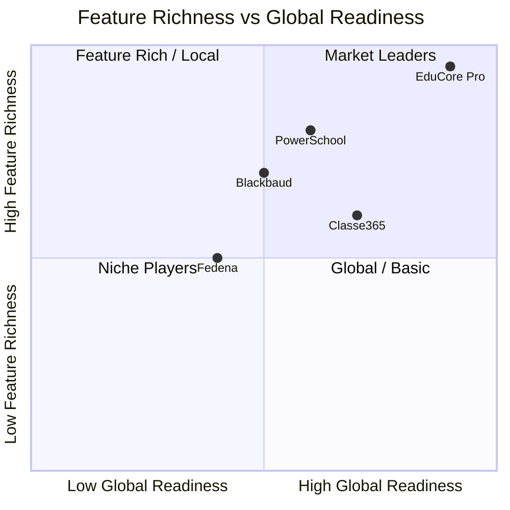

# ERP-School-Management -- Product Requirements Document

**Product:** EduCore Pro
**Version:** 1.0.0
**Date:** 2026-02-23
**Status:** Approved

---

## 1. Product Vision

EduCore Pro is a global school management platform that unifies student information, academic management, financial operations, learning management, and administrative functions into a single cloud-native platform. It serves K-12 institutions and multi-campus school groups with support for 10+ international curricula, 150+ currencies, and 29+ languages.

---

## 2. Competitive Analysis

### 2.1 Detailed Comparison

| Requirement | EduCore Pro | PowerSchool | Blackbaud | Classe365 | Fedena |
|---|---|---|---|---|---|
| **Student Information System** | Full SIS with medical, dietary, incident tracking | Full SIS | Full SIS | Basic SIS | Basic SIS |
| **Multi-Curriculum** | 10+ (WAEC, NECO, KCPE, Cambridge, IB, AP, GCSE, custom) | US-centric (Common Core, AP) | US/UK focus | 5 curricula | 3 curricula |
| **Grading Flexibility** | 5 types (%, letter, GPA, points, descriptive) | Letter/GPA | Letter/GPA | Percentage | Percentage |
| **Fee Management** | 13 fee types, installments, 11 payment methods | Basic invoicing | Tuition management | Basic fees | Basic fees |
| **Payment Gateways** | Stripe, Paystack, Flutterwave, mobile money | Stripe | Blackbaud Payments | Stripe, PayPal | PayPal |
| **LMS** | Full LMS with courses, modules, lessons, certificates | Add-on | Add-on | Built-in basic | Plugin |
| **Blockchain Credentials** | Native (IPFS + on-chain verification) | Not available | Not available | Not available | Not available |
| **AI Analytics** | Predictive (dropout risk, performance forecast) | Basic reporting | Reporting | Basic analytics | Basic reports |
| **Gamification** | Badges, leaderboards, achievements | Not available | Not available | Basic points | Not available |
| **IoT / Smart Campus** | Sensor integration, environmental monitoring | Not available | Not available | Not available | Not available |
| **Mobile Apps** | 4 dedicated Flutter apps | 2 apps | 1 app | 1 app | 1 responsive app |
| **Bus Tracking** | Real-time GPS, dedicated app | Third-party add-on | Not available | Not available | Not available |
| **Multi-Language** | 29+ languages | 10+ | 5+ | 20+ | 10+ |
| **Multi-Currency** | 150+ currencies | 10+ | 5+ | 30+ | 10+ |
| **Multi-Tenancy** | Row-level with tenant isolation | School-level | School-level | Organization | School-level |
| **API Architecture** | REST + CloudEvents + Proto | REST | REST | REST | REST |
| **Open Source** | Dual license (MIT core) | Proprietary | Proprietary | Proprietary | Open source |
| **Deployment** | Cloud-native K8s, self-hosted, SaaS | SaaS only | SaaS only | SaaS only | Self-hosted |

---

## 3. Functional Requirements

### FR-001: Student Information System

| ID | Requirement | Priority | Status |
|---|---|---|---|
| FR-001.1 | Register new students with full profile (personal, medical, dietary) | P0 | Implemented |
| FR-001.2 | Track enrollment status lifecycle (active through expelled) | P0 | Implemented |
| FR-001.3 | Manage guardian relationships with emergency contacts | P0 | Implemented |
| FR-001.4 | Support custom fields via JSONB extension | P1 | Implemented |
| FR-001.5 | Generate and manage unique student numbers | P0 | Implemented |
| FR-001.6 | Track medical conditions, allergies, medications | P1 | Implemented |
| FR-001.7 | Support multi-language student profiles | P1 | Implemented |
| FR-001.8 | Incident management with severity tracking | P1 | Implemented |
| FR-001.9 | Academic progress tracking with GPA calculation | P0 | Implemented |
| FR-001.10 | Transcript generation (official/unofficial) | P1 | Implemented |

### FR-002: Academic Management

| ID | Requirement | Priority | Status |
|---|---|---|---|
| FR-002.1 | Configure multiple curricula per school | P0 | Implemented |
| FR-002.2 | Define grading scales with grade level mappings | P0 | Implemented |
| FR-002.3 | Manage academic years with term/semester/quarter structures | P0 | Implemented |
| FR-002.4 | Create and manage subjects with credit hours | P0 | Implemented |
| FR-002.5 | Class management with capacity tracking | P0 | Implemented |
| FR-002.6 | Timetable generation with day/period/room assignment | P0 | Implemented |
| FR-002.7 | Assessment creation (15+ types) with weighted scoring | P0 | Implemented |
| FR-002.8 | Grade entry with draft/submit/publish/lock workflow | P0 | Implemented |
| FR-002.9 | Term summary with class rank and teacher comments | P1 | Implemented |
| FR-002.10 | Report card generation with multi-format export | P1 | Planned |

### FR-003: Financial Management

| ID | Requirement | Priority | Status |
|---|---|---|---|
| FR-003.1 | Define fee structures by school, academic year, class, grade | P0 | Implemented |
| FR-003.2 | Support 13 fee types (tuition through development) | P0 | Implemented |
| FR-003.3 | Generate invoices with itemized breakdown | P0 | Implemented |
| FR-003.4 | Process payments via 11 methods | P0 | Implemented |
| FR-003.5 | Installment payment plans with configurable schedules | P1 | Implemented |
| FR-003.6 | Automated payment reminders (upcoming, due, overdue) | P1 | Implemented |
| FR-003.7 | Discount management (sibling, scholarship, early payment) | P1 | Implemented |
| FR-003.8 | Vendor management with receivables tracking | P2 | Implemented |
| FR-003.9 | Asset management with maintenance scheduling | P2 | Implemented |
| FR-003.10 | School feeding wallet system | P2 | Implemented |
| FR-003.11 | Financial aid (scholarships, bursaries) with criteria | P1 | Implemented |

### FR-004: Learning Management System

| ID | Requirement | Priority | Status |
|---|---|---|---|
| FR-004.1 | Create courses with modules and lessons | P0 | Implemented |
| FR-004.2 | Support 6 lesson types (video, text, quiz, interactive, assignment, live) | P0 | Implemented |
| FR-004.3 | Track enrollment progress with completion percentage | P0 | Implemented |
| FR-004.4 | Issue certificates upon course completion | P1 | Implemented |
| FR-004.5 | Geo-partition content by region for data residency | P1 | Implemented |
| FR-004.6 | Support B2B organization enrollment | P2 | Implemented |
| FR-004.7 | Course pricing with multi-currency support | P1 | Implemented |

### FR-005: Communication

| ID | Requirement | Priority | Status |
|---|---|---|---|
| FR-005.1 | Messaging between users with threading | P0 | Implemented |
| FR-005.2 | Announcements with target audience filtering | P0 | Implemented |
| FR-005.3 | Multi-channel notifications (SMS, email, push, in-app) | P0 | Implemented |
| FR-005.4 | Communication preference management | P1 | Implemented |
| FR-005.5 | Priority-based message routing | P2 | Implemented |

### FR-006: Authentication & Security

| ID | Requirement | Priority | Status |
|---|---|---|---|
| FR-006.1 | Email/password authentication | P0 | Implemented |
| FR-006.2 | Multi-factor authentication (TOTP) | P0 | Implemented |
| FR-006.3 | OAuth2 social login (Google, Microsoft, Facebook) | P1 | Implemented |
| FR-006.4 | Session management with device tracking | P0 | Implemented |
| FR-006.5 | Account lockout after failed attempts | P0 | Implemented |
| FR-006.6 | Role-based access control (12 roles) | P0 | Implemented |
| FR-006.7 | Biometric attendance (fingerprint, facial recognition) | P2 | Implemented |

---

## 4. Non-Functional Requirements

| ID | Requirement | Target | Status |
|---|---|---|---|
| NFR-001 | API response time (p95) | < 200ms | Monitoring |
| NFR-002 | System availability | 99.9% uptime | Target |
| NFR-003 | Concurrent users per school | 5,000+ | Target |
| NFR-004 | Data encryption at rest | AES-256 | Implemented |
| NFR-005 | Data encryption in transit | TLS 1.3 | Implemented |
| NFR-006 | FERPA compliance | Full | Planned |
| NFR-007 | GDPR compliance | Full (geo-partitioning) | Implemented |
| NFR-008 | COPPA compliance | Parental consent flow | Planned |
| NFR-009 | Backup RPO | < 1 hour | Target |
| NFR-010 | Backup RTO | < 4 hours | Target |
| NFR-011 | Multi-language support | 29+ languages | In progress |
| NFR-012 | Multi-currency support | 150+ currencies | In progress |
| NFR-013 | Mobile offline capability | Core features | Planned |
| NFR-014 | Accessibility | WCAG 2.1 AA | Target |
| NFR-015 | Build time (full monorepo) | < 5 minutes | Optimizing |

---

## 5. User Stories

### Epic 1: Student Enrollment
- **US-001**: As a school admin, I want to register a new student with all personal, medical, and guardian information so that the school has a complete record.
- **US-002**: As a parent, I want to submit an online application for my child so that I do not need to visit the school physically.
- **US-003**: As a principal, I want to review and approve/reject enrollment applications so that we maintain admission standards.

### Epic 2: Academic Operations
- **US-010**: As a teacher, I want to enter grades for my class assessments so that students and parents can track progress.
- **US-011**: As a school admin, I want to generate timetables automatically so that we optimize room and teacher utilization.
- **US-012**: As a student, I want to view my grades and GPA so that I can track my academic performance.

### Epic 3: Fee Management
- **US-020**: As a parent, I want to view my child's fee balance and pay online so that I can manage payments conveniently.
- **US-021**: As an accountant, I want to generate fee invoices in bulk so that billing is efficient.
- **US-022**: As a school admin, I want to set up installment payment plans so that parents can spread costs.

### Epic 4: Learning Management
- **US-030**: As a teacher, I want to create course content with videos, quizzes, and assignments so that students can learn remotely.
- **US-031**: As a student, I want to track my course progress and earn certificates so that I stay motivated.

---

## 6. Acceptance Criteria Matrix

| Feature | Acceptance Criteria |
|---|---|
| Student Registration | Student created with unique number, guardian linked, medical info saved |
| Grade Entry | Score validated against max, letter grade auto-calculated, audit trail created |
| Fee Payment | Payment recorded, invoice balance updated, receipt generated, notification sent |
| Attendance | Record created with timestamp, late minutes calculated, parent notified |
| Timetable | Slots created without room/teacher conflicts, break periods marked |
