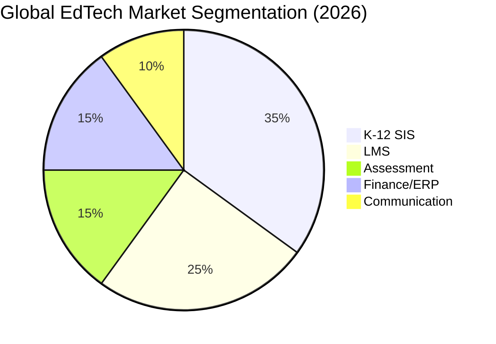
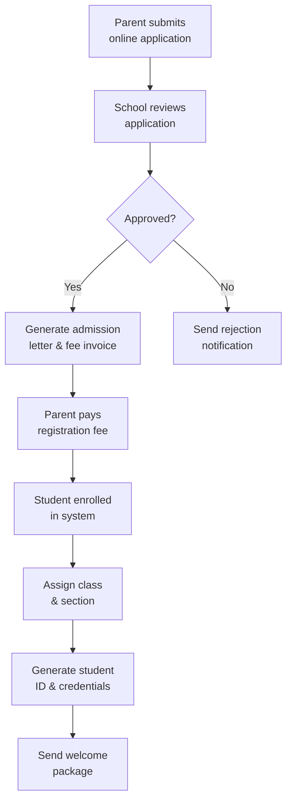
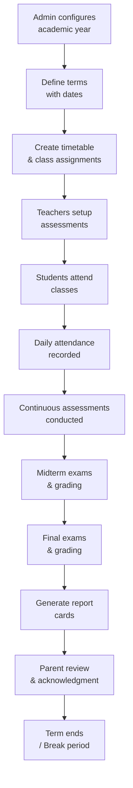
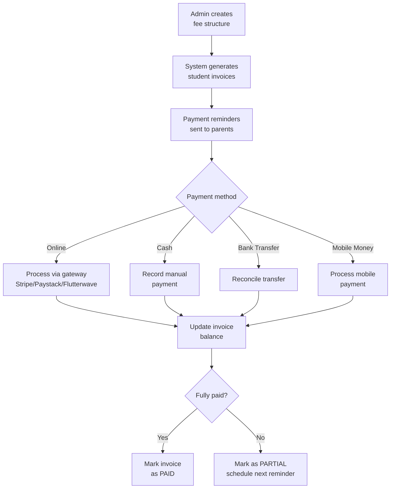

# ERP-School-Management -- Business Requirements Document

**Product:** EduCore Pro
**Version:** 1.0.0
**Date:** 2026-02-23
**Sponsor:** EduCore Pro Product Team
**Status:** Approved

---

## 1. Business Context

### 1.1 Problem Statement

Educational institutions globally face fragmented technology ecosystems. Schools typically use 5-10 separate systems for student records, grades, fees, communication, and learning management. This fragmentation results in:

- Data inconsistency across systems
- Manual reconciliation consuming 15-20 hours/week per school
- Parent/student dissatisfaction with multiple login portals
- Inability to derive cross-functional analytics
- Compliance risks from uncontrolled data proliferation

### 1.2 Market Opportunity

The global K-12 school management software market is projected to reach $25 billion by 2028. Key growth drivers include:
- Post-pandemic digital transformation acceleration
- African continent school digitization (200M+ students)
- Government mandates for digital school records
- Parent demand for real-time visibility

### 1.3 Target Market Segments

| Segment | Characteristics | Size | Revenue Model |
|---|---|---|---|
| Premium Private Schools | High fees, tech-savvy, multiple curricula | 50,000+ schools | Enterprise license ($5K-50K/year) |
| Mid-Market Schools | 500-2000 students, growing digitally | 200,000+ schools | Professional tier ($1K-5K/year) |
| Budget Schools | Cost-sensitive, mobile-first | 500,000+ schools | Starter tier ($200-1K/year) |
| School Groups | Multi-campus, centralized management | 10,000+ groups | Enterprise + per-campus |
| Government/Public | Compliance-driven, bulk deployment | 1M+ schools | Government contracts |

---

## 2. Business Objectives

| Objective | Metric | Target |
|---|---|---|
| BO-1: Market penetration | Schools onboarded in Year 1 | 1,000 schools |
| BO-2: Revenue growth | ARR by end of Year 1 | $5M |
| BO-3: User satisfaction | NPS score | > 50 |
| BO-4: Operational efficiency | Admin time saved per school | > 40% |
| BO-5: Geographic coverage | Countries with active schools | 15+ |
| BO-6: Platform reliability | System uptime | 99.9% |
| BO-7: Data compliance | Regulatory audit pass rate | 100% |

---

## 3. Business Process Requirements

### 3.1 Admission-to-Enrollment Process

### 3.2 Academic Term Lifecycle

### 3.3 Fee Collection Lifecycle

---

## 4. Business Rules

### BR-001: Student Enrollment
- A student must have at least one guardian associated
- Student numbers must be unique across the school
- Enrollment status changes must be audited
- A student can be enrolled in only one class per academic year

### BR-002: Grading
- Grades cannot be modified after being locked
- Grade calculations must follow the curriculum's grading scale
- Teachers can only grade students in their assigned sections
- Term summaries require all assessments to be graded

### BR-003: Financial
- Invoices cannot be deleted once a payment has been applied
- Late payment fees are calculated based on days overdue
- Sibling discounts apply automatically when configured
- Payment reversals require admin approval

### BR-004: Attendance
- A student cannot have duplicate attendance records for the same section/date/period
- Absence notifications are sent to parents within 30 minutes
- Tardy records must include minutes late

### BR-005: Communication
- Urgent announcements bypass notification preferences
- Parents can only access their own children's data
- Message attachments are scanned for malware before delivery

---

## 5. Stakeholder Requirements

### 5.1 Students
- View grades and academic progress in real-time
- Access LMS content and submit assignments
- Receive notifications about upcoming assessments
- Track attendance and behavior records
- Earn gamification badges and achievements

### 5.2 Parents/Guardians
- View child's academic performance and attendance
- Pay fees online through multiple payment methods
- Communicate with teachers and school administration
- Receive real-time bus tracking updates
- Access official transcripts and certificates

### 5.3 Teachers
- Manage gradebook with flexible assessment types
- Track daily attendance with single-click input
- Create and distribute LMS content
- Communicate with parents about student progress
- Generate class-level analytics reports

### 5.4 School Administrators
- Configure academic years, curricula, and fee structures
- Manage student enrollment and staff records
- Monitor financial dashboards and collection rates
- Generate regulatory compliance reports
- Oversee multi-campus operations

### 5.5 Super Administrators
- Manage multiple schools across the platform
- Configure subscription tiers and entitlements
- Monitor system health and performance metrics
- Access cross-school analytics and benchmarking
- Manage platform-wide settings and integrations

---

## 6. Success Criteria

| Criteria | Measurement | Target |
|---|---|---|
| Onboarding Time | Time from signup to first student enrolled | < 2 hours |
| Fee Collection Rate | Percentage of fees collected on time | > 85% |
| Teacher Adoption | Teachers actively using gradebook weekly | > 90% |
| Parent Engagement | Parents logging in monthly | > 70% |
| Data Accuracy | Grade entry error rate | < 0.1% |
| Support Tickets | Tickets per 100 users per month | < 5 |

---

## 7. Constraints and Assumptions

### Constraints
- Must operate on 2G/3G networks in rural African regions
- Must comply with FERPA, GDPR, COPPA, and NDPR simultaneously
- Must support schools with as few as 50 students and as many as 10,000
- Must maintain backward compatibility with data imported from legacy systems

### Assumptions
- Schools have at least one administrator with basic computer literacy
- Internet connectivity is available (intermittent is acceptable with offline mode)
- Parents have access to smartphones for mobile app usage
- Schools operate on academic year (not calendar year) cycles
