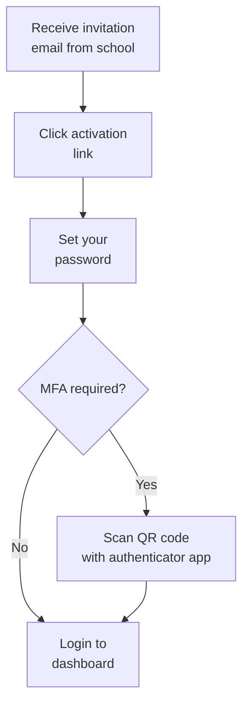
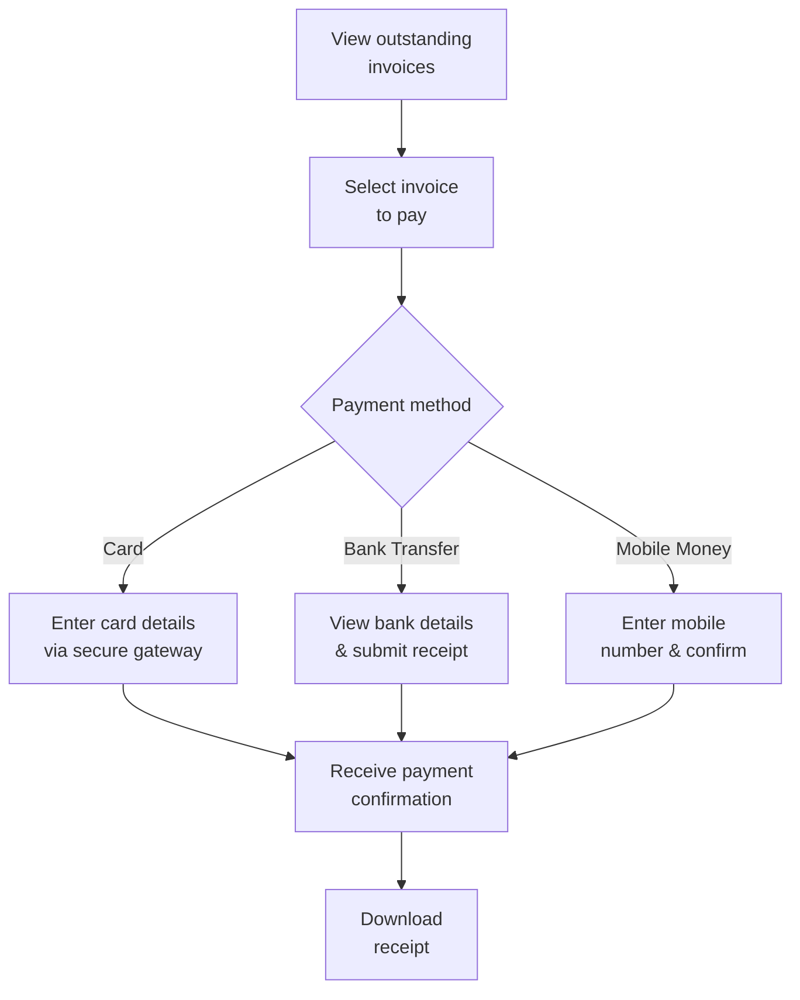

# ERP-School-Management -- User Manual

**Product:** EduCore Pro
**Version:** 1.0.0
**Date:** 2026-02-23
**Audience:** Students, Parents, Teachers, School Admins, Super Admins

---

## Table of Contents

1. [Getting Started](#1-getting-started)
2. [Student Guide](#2-student-guide)
3. [Parent/Guardian Guide](#3-parentguardian-guide)
4. [Teacher Guide](#4-teacher-guide)
5. [School Administrator Guide](#5-school-administrator-guide)
6. [Super Administrator Guide](#6-super-administrator-guide)

---

## 1. Getting Started

### 1.1 Accessing EduCore Pro

EduCore Pro is accessible through:
- **Web Application**: Navigate to your school's EduCore Pro URL (e.g., `https://yourschool.educorepro.com`)
- **Mobile App**: Download "EduCore Pro" from the App Store or Google Play
- **Parent App**: Download "EduCore Parent" from your device's app store
- **Teacher App**: Download "EduCore Teacher" from your device's app store

### 1.2 First-Time Login

1. You will receive an invitation email from your school's administrator
2. Click the activation link in the email
3. Set a strong password (minimum 8 characters, including uppercase, lowercase, number, and special character)
4. If your school requires Multi-Factor Authentication (MFA), scan the QR code with an authenticator app (Google Authenticator, Authy, etc.)
5. Save your backup codes in a secure location
6. You will be redirected to your role-specific dashboard

### 1.3 Navigation Overview

The interface is organized into the following sections:
- **Dashboard**: Overview of key metrics and recent activity
- **Menu Bar**: Role-specific navigation menu on the left sidebar
- **Notifications**: Bell icon in the top-right corner for alerts
- **Profile**: Your profile settings and preferences
- **Help**: In-app help and documentation

---

## 2. Student Guide

### 2.1 Student Dashboard

Your dashboard shows:
- Current GPA and term grades
- Upcoming assignments and due dates
- Attendance summary
- Announcements from school
- Gamification badges and leaderboard position

### 2.2 Viewing Your Grades

1. Navigate to **Academics** > **My Grades**
2. Select the academic year and term
3. View grades by subject with assessment breakdowns
4. Click on any subject to see individual assessment scores
5. Term summaries show your class rank and teacher comments

### 2.3 Attendance Records

1. Navigate to **Academics** > **Attendance**
2. View daily attendance status (present, absent, tardy, excused)
3. Monthly and term-level attendance percentages are displayed
4. If you are marked absent incorrectly, contact your teacher

### 2.4 LMS - Learning Management

1. Navigate to **Learning** > **My Courses**
2. Browse enrolled courses and click to enter
3. Progress through modules and lessons in order
4. Complete quizzes and submit assignments
5. Track your progress percentage on the course overview page
6. Upon completion, download your certificate

### 2.5 Submitting Assignments

1. Navigate to **Learning** > **Assignments**
2. Click on the assignment title
3. Read the instructions carefully
4. Upload your work (files, text, or links)
5. Click **Submit** before the due date
6. Late submissions may incur a penalty if configured by your teacher

### 2.6 Gamification

1. Navigate to **Achievements**
2. View earned badges, points, and current level
3. Check the leaderboard to see your ranking
4. Complete challenges to earn new badges

---

## 3. Parent/Guardian Guide

### 3.1 Parent Dashboard

Your dashboard shows:
- Your children's academic summaries
- Outstanding fee balances
- Recent announcements
- Upcoming events and parent-teacher meetings
- Bus tracking (if applicable)

### 3.2 Viewing Your Child's Grades

1. Navigate to **My Children** > Select child
2. Click **Academics** > **Grades**
3. View grades by term and subject
4. Download report cards as PDF
5. View teacher comments and recommendations

### 3.3 Fee Management and Payments

1. Navigate to **Finance** > **Fee Summary**
2. View all outstanding invoices and payment history
3. Click **Pay Now** on any invoice
4. Choose your preferred payment method:
   - **Credit/Debit Card**: Processed via Stripe/Paystack/Flutterwave
   - **Bank Transfer**: Bank details are displayed for manual transfer
   - **Mobile Money**: Enter your mobile money number
5. Receive confirmation via email and in-app notification
6. Download payment receipts from **Finance** > **Payment History**

### 3.4 Installment Payments

If your school offers installment plans:
1. Navigate to **Finance** > **Fee Summary**
2. Click **Setup Installment Plan** on eligible invoices
3. Choose the number of installments
4. Review the payment schedule
5. Confirm and pay the first installment

### 3.5 Communication with Teachers

1. Navigate to **Messages**
2. Click **New Message**
3. Select the teacher from the recipient list
4. Type your message and attach files if needed
5. Click **Send**
6. View conversation history under the message thread

### 3.6 Bus Tracking

1. Open the EduCore Parent app
2. Navigate to **Transport** > **Live Tracking**
3. View the real-time location of your child's bus
4. Estimated arrival time is displayed at the top
5. Receive push notifications when the bus is approaching your stop

---

## 4. Teacher Guide

### 4.1 Teacher Dashboard

Your dashboard shows:
- Classes assigned to you
- Upcoming assessments and deadlines
- Attendance completion status
- Recent submissions requiring grading
- Announcements and messages

### 4.2 Taking Attendance

1. Navigate to **My Classes** > Select class
2. Click **Attendance** > **Mark Attendance**
3. For each student, select status: Present, Absent, Tardy, Excused Absent, Early Dismissal
4. For tardy students, enter minutes late
5. Add optional notes for absences
6. Click **Save Attendance**
7. Parents of absent students are notified automatically

### 4.3 Managing the Gradebook

1. Navigate to **My Classes** > Select class > **Gradebook**
2. Create assessments: Click **New Assessment**
   - Set title, type (quiz, test, exam, project, etc.)
   - Set maximum score and weight percentage
   - Set due date
3. Enter grades for submitted work
4. Grade statuses: **Draft** (editable) > **Submitted** (review) > **Published** (visible to students/parents) > **Locked** (immutable)
5. Click **Publish** to make grades visible

### 4.4 Creating Assessments

1. Navigate to **My Classes** > Select class > **Assessments**
2. Click **Create Assessment**
3. Fill in:
   - **Title**: Name of the assessment
   - **Type**: Quiz, Test, Exam, Midterm, Final, Assignment, Project, Presentation, Practical, Lab Work, Classwork, Homework, Participation, Attendance, Continuous Assessment
   - **Max Score**: Total points available
   - **Weight**: How much this counts toward the final grade (as a decimal, e.g., 1.00 = 100%)
   - **Scheduled Date**: When the assessment will be conducted
   - **Due Date**: Deadline for submission
   - **Duration**: Time allowed in minutes
4. Click **Save**

### 4.5 LMS Content Creation

1. Navigate to **Learning** > **My Courses**
2. Click **Create Course** or select an existing course
3. Add modules (units/chapters)
4. Within each module, add lessons:
   - **Video**: Upload or link video content
   - **Text**: Rich text editor for written content
   - **Quiz**: Create multiple-choice or free-response questions
   - **Interactive**: Embed interactive widgets
   - **Assignment**: Describe task and set submission requirements
   - **Live Session**: Schedule a live video session
5. Reorder modules and lessons using drag-and-drop
6. Click **Publish** to make content available to students

### 4.6 Communication

1. Navigate to **Messages**
2. Send individual messages to parents or groups
3. Create announcements for your class:
   - Navigate to **My Classes** > Select class > **Announcements**
   - Set target audience and priority
   - Add attachments if needed
   - Click **Publish**

---

## 5. School Administrator Guide

### 5.1 Admin Dashboard

Your dashboard shows:
- School-wide enrollment statistics
- Fee collection summary and outstanding balances
- Attendance overview across all classes
- Staff summary and active/inactive users
- System alerts and action items

### 5.2 School Configuration

1. Navigate to **Settings** > **School Profile**
2. Configure:
   - School name, type, address
   - Timezone and currency
   - Academic year start month
   - Logo and branding
3. Configure subscription tier and features

### 5.3 Academic Year Setup

1. Navigate to **Academics** > **Academic Years**
2. Click **Create Academic Year**
3. Set name, start date, and end date
4. Mark as current if applicable
5. Add terms within the academic year:
   - Set term name, number, type (term/semester/quarter/trimester)
   - Set start and end dates
   - Configure mid-break dates if applicable
   - Add important dates (exams, holidays)

### 5.4 Curriculum Configuration

1. Navigate to **Academics** > **Curricula**
2. Click **Add Curriculum**
3. Select type (WAEC, Cambridge IGCSE, IB, Common Core, etc.)
4. Configure grading scales:
   - Add grade levels (e.g., A1 = 75-100, B2 = 70-74)
   - Set GPA equivalents
   - Set passing score
5. Add subject-curriculum mappings with syllabi

### 5.5 User Management

1. Navigate to **Users** > **Manage Users**
2. Create users individually or via bulk CSV import
3. Assign roles: Super Admin, School Admin, Principal, Teacher, Student, Parent, etc.
4. Manage account status (activate, suspend, deactivate)
5. Reset passwords and manage MFA settings

### 5.6 Fee Structure Configuration

1. Navigate to **Finance** > **Fee Structures**
2. Click **Create Fee Structure**
3. Configure:
   - Fee type (Tuition, Registration, Examination, etc.)
   - Amount and currency
   - Academic year and term
   - Grade level or class applicability
   - Due date
   - Late payment fee (fixed or percentage)
   - Installment options
4. Click **Save and Generate Invoices**

### 5.7 Report Generation

1. Navigate to **Reports**
2. Available reports:
   - Enrollment statistics by grade/class/gender
   - Attendance reports by class/student/period
   - Fee collection reports by status/method/period
   - Grade distribution and performance analytics
   - Teacher workload summary
3. Export reports as PDF, Excel, or CSV
4. Schedule automated report delivery via email

---

## 6. Super Administrator Guide

### 6.1 Multi-School Management

1. Navigate to **Platform** > **Schools**
2. View all registered schools with key metrics
3. Click on any school to access its administration
4. Create new schools with initial configuration
5. Manage subscription tiers and feature entitlements

### 6.2 Platform Monitoring

1. Navigate to **Platform** > **System Health**
2. View Grafana dashboards for:
   - Service uptime and response times
   - Database performance metrics
   - Event processing throughput
   - Error rates and alerts
3. Access Apache Superset for business intelligence

### 6.3 Subscription Management

1. Navigate to **Platform** > **Subscriptions**
2. View subscription status for all schools
3. Configure tier features:
   - **Starter**: Core SIS, basic grading, fee management
   - **Professional**: Full SIS, LMS, analytics, communication
   - **Enterprise**: All features + blockchain, AI, IoT, custom integrations
4. Manage license expiration and renewals
