# ERP-School-Management -- Training Manual

**Product:** EduCore Pro
**Version:** 1.0.0
**Date:** 2026-02-23
**Audience:** All roles -- onboarding and continuous training

---

## 1. Training Program Overview

### 1.1 Training Tracks

```mermaid
graph TD
    subgraph "Training Tracks"
        T1["Track 1: Student<br/>2 hours"]
        T2["Track 2: Parent<br/>2 hours"]
        T3["Track 3: Teacher<br/>6 hours"]
        T4["Track 4: School Admin<br/>8 hours"]
        T5["Track 5: Super Admin<br/>4 hours"]
        T6["Track 6: IT Admin<br/>6 hours"]
    end

    T1 --> C1["Module A: Dashboard Navigation"]
    T1 --> C2["Module B: Viewing Grades & Attendance"]
    T1 --> C3["Module C: LMS & Assignments"]

    T3 --> C4["Module D: Gradebook Management"]
    T3 --> C5["Module E: Attendance Taking"]
    T3 --> C6["Module F: LMS Content Creation"]
    T3 --> C7["Module G: Communication"]

    T4 --> C8["Module H: School Setup"]
    T4 --> C9["Module I: Academic Configuration"]
    T4 --> C10["Module J: Fee Management"]
    T4 --> C11["Module K: Reporting"]
```

---

## 2. Track 1: Student Training (2 hours)

### Module A: Dashboard Navigation (30 minutes)

**Learning Objectives:**
- Log in to EduCore Pro web and mobile apps
- Navigate the student dashboard
- Customize notification preferences
- Access help and support resources

**Exercises:**
1. Log in with provided credentials and change your password
2. Enable MFA on your account
3. Explore each section of the dashboard
4. Set your notification preferences (email, SMS, push)

### Module B: Viewing Grades and Attendance (45 minutes)

**Learning Objectives:**
- View grades for current and past terms
- Understand grading scales and GPA calculation
- Check daily attendance records
- Download report cards

**Exercises:**
1. Navigate to your grades for the current term
2. Click on a subject to view individual assessment scores
3. Identify your highest and lowest performing subjects
4. Check your attendance percentage for the current month
5. Download your report card as a PDF

### Module C: LMS and Assignments (45 minutes)

**Learning Objectives:**
- Access enrolled courses and browse content
- Complete lessons and track progress
- Submit assignments before deadlines
- Take quizzes and view results
- Earn gamification badges

**Exercises:**
1. Open an enrolled course and complete the first lesson
2. Submit a practice assignment with a file attachment
3. Take a practice quiz and review your answers
4. Check your progress percentage on the course overview
5. View your earned badges in the Achievements section

---

## 3. Track 2: Parent Training (2 hours)

### Module A: Dashboard and Child Overview (30 minutes)

**Learning Objectives:**
- Log in to the EduCore Parent app and web portal
- View your children's academic summaries
- Navigate between multiple children (if applicable)

**Exercises:**
1. Log in and familiarize yourself with the parent dashboard
2. Select each child and review their profile information
3. Verify guardian contact information is correct

### Module B: Academic Monitoring (30 minutes)

**Learning Objectives:**
- View grades and report cards
- Monitor attendance records
- Read teacher comments and feedback

**Exercises:**
1. View your child's grades for the current term
2. Compare performance across subjects
3. Check the attendance summary and identify any absences
4. Read teacher comments on the latest assessment

### Module C: Fee Payment (30 minutes)

**Learning Objectives:**
- View outstanding invoices and fee breakdowns
- Make payments using different methods
- Set up installment payment plans
- Download payment receipts

**Exercises:**
1. Navigate to the Fee Summary page
2. Review the itemized invoice
3. Make a test payment using the sandbox gateway
4. Download the payment receipt
5. View payment history

### Module D: Communication and Bus Tracking (30 minutes)

**Learning Objectives:**
- Send messages to teachers and administrators
- Read school announcements
- Use the bus tracking feature
- Manage notification preferences

**Exercises:**
1. Send a message to a teacher
2. Read the latest school announcement
3. Open the bus tracking feature and locate the bus
4. Configure notification preferences for fee reminders

---

## 4. Track 3: Teacher Training (6 hours)

### Module D: Gradebook Management (90 minutes)

**Learning Objectives:**
- Create assessments with different types and weights
- Enter and manage student grades
- Understand the grade lifecycle (draft > submitted > published > locked)
- Generate term summaries

**Exercises:**
1. Create a new quiz assessment with 50 maximum points
2. Enter grades for 10 students
3. Add feedback comments for 3 students
4. Publish the grades
5. View the updated term summary

### Module E: Attendance Taking (60 minutes)

**Learning Objectives:**
- Mark daily attendance for a class
- Handle tardy and excused absences
- View attendance reports
- Understand automatic parent notifications

**Exercises:**
1. Open the attendance page for your first class
2. Mark attendance for all students
3. Record a tardy student with 15 minutes late
4. Mark an excused absence with a reason
5. Save and verify the records

### Module F: LMS Content Creation (120 minutes)

**Learning Objectives:**
- Create courses, modules, and lessons
- Upload video content and create text lessons
- Build quiz questions with automatic grading
- Organize content with drag-and-drop
- Publish courses to students

**Exercises:**
1. Create a new course titled "Introduction to [Your Subject]"
2. Add 3 modules with descriptive titles
3. Add a text lesson with formatted content
4. Add a video lesson (upload or link)
5. Create a quiz with 5 multiple-choice questions
6. Publish the course

### Module G: Communication Tools (90 minutes)

**Learning Objectives:**
- Send individual and group messages
- Create class announcements
- Attach files to messages
- Manage communication preferences

**Exercises:**
1. Send an individual message to a parent
2. Create a class announcement about an upcoming exam
3. Set announcement priority to "high"
4. Attach the exam syllabus document
5. Verify the announcement appears on the student dashboard

---

## 5. Track 4: School Admin Training (8 hours)

### Module H: School Setup (90 minutes)

**Learning Objectives:**
- Configure school profile and branding
- Set up academic years and terms
- Manage user accounts and roles
- Configure system settings

### Module I: Academic Configuration (120 minutes)

**Learning Objectives:**
- Add and configure curricula
- Define grading scales and grade levels
- Create subjects and class structures
- Generate timetables

### Module J: Fee Management (120 minutes)

**Learning Objectives:**
- Create fee structures by type and grade level
- Configure installment plans and late fees
- Generate bulk invoices
- Process and reconcile payments
- Set up payment reminders
- Manage scholarships and discounts

### Module K: Reporting and Analytics (90 minutes)

**Learning Objectives:**
- Generate enrollment reports
- View fee collection dashboards
- Analyze attendance trends
- Export data for external reporting
- Use Apache Superset for custom dashboards

---

## 6. Track 5: Super Admin Training (4 hours)

### Topics Covered:
- Multi-school management and onboarding
- Subscription tier configuration
- Platform monitoring with Grafana
- System health and performance metrics
- Data privacy and compliance settings
- Audit log review

---

## 7. Assessment and Certification

Each training track concludes with a practical assessment:

| Track | Assessment Type | Passing Score | Certification |
|---|---|---|---|
| Student | Guided walkthrough | N/A (completion-based) | Participation badge |
| Parent | Guided walkthrough | N/A (completion-based) | Participation badge |
| Teacher | Practical exam (create course + grade) | 80% | EduCore Certified Teacher |
| School Admin | Configuration challenge | 80% | EduCore Certified Admin |
| Super Admin | Platform management scenario | 90% | EduCore Platform Expert |
| IT Admin | Deployment and troubleshooting | 85% | EduCore Technical Expert |

---

## 8. Quick Reference Card

### Keyboard Shortcuts (Web App)

| Shortcut | Action |
|---|---|
| `Ctrl + K` | Open search |
| `Ctrl + N` | New message |
| `Ctrl + S` | Save current form |
| `Ctrl + P` | Print current view |
| `Esc` | Close modal/dialog |

### Common Tasks Quick Steps

| Task | Steps |
|---|---|
| Mark attendance | Classes > Select > Attendance > Mark > Save |
| Enter grades | Classes > Select > Gradebook > Assessment > Enter > Publish |
| Pay fees | Finance > Fee Summary > Select Invoice > Pay Now |
| Create announcement | Classes > Select > Announcements > Create > Publish |
| Generate report | Reports > Select Type > Set Filters > Generate > Export |
