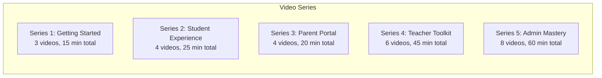

# ERP-School-Management -- Video Training Script

**Product:** EduCore Pro
**Version:** 1.0.0
**Date:** 2026-02-23

---

## Video Series Overview

---

## Series 1: Getting Started

### Video 1.1: Welcome to EduCore Pro (3 minutes)

**TITLE CARD:** Welcome to EduCore Pro -- Your Complete School Management Platform

**[SCENE 1 -- 0:00-0:30]**
NARRATOR: "Welcome to EduCore Pro, the most comprehensive school management platform designed for educational institutions worldwide. Whether you are a student, parent, teacher, or administrator, EduCore Pro brings everything you need into one powerful platform."

VISUAL: Animated montage showing different users (student on phone, parent checking grades, teacher at laptop, admin on dashboard). Show the 5 frontend apps briefly.

**[SCENE 2 -- 0:30-1:30]**
NARRATOR: "EduCore Pro supports over ten international curricula, from the British GCSE and Cambridge IGCSE to the Nigerian WAEC, Kenyan KCPE, International Baccalaureate, American Common Core, and many more. With support for over 150 currencies and 29 languages, EduCore Pro works for schools anywhere in the world."

VISUAL: World map animation highlighting supported regions. Show curriculum logos.

**[SCENE 3 -- 1:30-2:30]**
NARRATOR: "The platform includes five dedicated applications. The web portal for administrators and teachers. The mobile app for students. The parent app for guardians. The teacher app for classroom management on the go. And the bus tracking app for transport management."

VISUAL: Screenshots of each app with smooth transitions.

**[SCENE 4 -- 2:30-3:00]**
NARRATOR: "In the following videos, we will walk you through each feature step by step. Let us get started."

VISUAL: Logo animation with tagline: "EduCore Pro -- Educate. Innovate. Transform."

---

### Video 1.2: Creating Your Account and First Login (5 minutes)

**TITLE CARD:** First Login and Account Setup

**[SCENE 1 -- 0:00-1:00]**
NARRATOR: "When your school registers on EduCore Pro, administrators create user accounts for all stakeholders. You will receive an invitation email with a link to activate your account."

VISUAL: Screen recording showing an invitation email being opened. Highlight the activation link.

**[SCENE 2 -- 1:00-2:30]**
NARRATOR: "Click the activation link to set your password. Your password must be at least eight characters and include uppercase letters, lowercase letters, numbers, and special characters. If your school requires multi-factor authentication, you will be prompted to scan a QR code with an authenticator app like Google Authenticator or Authy."

VISUAL: Screen recording of password setup flow. Show MFA QR code scanning on a phone.

**[SCENE 3 -- 2:30-4:00]**
NARRATOR: "After setting up your account, you will be taken to your personalized dashboard. The dashboard layout depends on your role. Students see their grades and assignments. Parents see their children's summaries and fee balances. Teachers see their classes and gradebooks. Administrators see school-wide metrics."

VISUAL: Quick tour of each role's dashboard.

**[SCENE 4 -- 4:00-5:00]**
NARRATOR: "Take a moment to update your profile, set your preferred language, and configure your notification preferences. You can choose to receive alerts via email, SMS, push notification, or all three."

VISUAL: Screen recording of profile settings page.

---

### Video 1.3: Navigating the Interface (7 minutes)

**TITLE CARD:** Navigation and Key Features Tour

**[SCENE 1 -- 0:00-2:00]**
NARRATOR: "The EduCore Pro interface is designed for simplicity. On the left side, you will find the navigation menu with sections organized by function. The top bar shows your school name, notification bell, and profile menu."

VISUAL: Annotated screenshot of the main interface with callouts for each section.

**[SCENE 2 -- 2:00-4:00]**
NARRATOR: "Use the search bar at the top, or press Control plus K, to quickly find students, classes, or features. The search is powered by full-text search, so partial matches work perfectly."

VISUAL: Demo of search functionality finding a student by partial name.

**[SCENE 3 -- 4:00-5:30]**
NARRATOR: "Notifications appear as a badge on the bell icon. Click to see recent alerts, mark them as read, or navigate directly to the related item. Critical notifications like fee deadlines and attendance alerts are highlighted in red."

VISUAL: Demo of notification center.

**[SCENE 4 -- 5:30-7:00]**
NARRATOR: "On mobile, the navigation menu becomes a bottom tab bar. All features available on the web are accessible on mobile with an optimized touch-friendly interface. You can switch between the web and mobile apps seamlessly -- your data is always in sync."

VISUAL: Side-by-side comparison of web and mobile interfaces.

---

## Series 2: Student Experience

### Video 2.1: Viewing Your Grades and GPA (6 minutes)

**[SCENE 1 -- 0:00-1:30]**
NARRATOR: "As a student, your grades are your most important metric. Navigate to Academics, then My Grades, to see a complete view of your academic performance."

VISUAL: Screen recording navigating to grades page.

**[SCENE 2 -- 1:30-3:30]**
NARRATOR: "Each subject shows your assessments with their scores, weights, and calculated percentages. The grading scale used by your school determines how your raw score translates to a letter grade or GPA. For example, if your school uses the WAEC grading system, a score of 75 percent or above earns an A1."

VISUAL: Show grade table with WAEC grading scale example.

**[SCENE 3 -- 3:30-5:00]**
NARRATOR: "At the bottom of the page, you will find your term summary. This includes your cumulative GPA, class rank, and teacher comments. Click Download Report Card to get a PDF version that you can print or share."

VISUAL: Demo of downloading report card.

**[SCENE 4 -- 5:00-6:00]**
NARRATOR: "Keep track of your grades throughout the term. Published grades are final, but draft grades may still change. Focus on assessments with higher weights to maximize your GPA."

---

### Video 2.2: Using the LMS (7 minutes)

**Script covers:** Course navigation, lesson completion, quiz taking, assignment submission, certificate download.

### Video 2.3: Attendance and Schedule (6 minutes)

**Script covers:** Viewing daily/weekly attendance, checking timetable, understanding tardy vs absent, reporting discrepancies.

### Video 2.4: Achievements and Gamification (6 minutes)

**Script covers:** Badge collection, point system, leaderboard, challenges, sharing achievements.

---

## Series 3: Parent Portal

### Video 3.1: Monitoring Your Child's Progress (5 minutes)

**Script covers:** Dashboard overview, grade viewing, attendance monitoring, teacher feedback, multi-child navigation.

### Video 3.2: Fee Payments Step by Step (5 minutes)

**Script covers:** Invoice viewing, payment method selection, card/bank/mobile money payment, receipt download, installment setup.

### Video 3.3: Communication with Teachers (5 minutes)

**Script covers:** Sending messages, reading announcements, notification management, scheduling meetings.

### Video 3.4: Bus Tracking and Safety (5 minutes)

**Script covers:** Live GPS tracking, estimated arrival, stop notifications, emergency contact.

---

## Series 4: Teacher Toolkit

### Video 4.1: Gradebook Mastery (10 minutes)

**Script covers:** Creating assessments (all 15 types), entering grades, feedback, publishing workflow, bulk operations.

### Video 4.2: Daily Attendance (5 minutes)

**Script covers:** Quick attendance marking, tardy handling, excused absences, parent notifications.

### Video 4.3: Creating LMS Content (10 minutes)

**Script covers:** Course creation, module organization, lesson types (video, text, quiz, interactive), publishing.

### Video 4.4: Assessments and Exams (8 minutes)

**Script covers:** Exam scheduling, question banks, rubric creation, grading rubrics, grade distribution.

### Video 4.5: Class Communication (6 minutes)

**Script covers:** Announcements, parent messages, progress reports, emergency notifications.

### Video 4.6: Analytics and Reports (6 minutes)

**Script covers:** Class performance, attendance trends, grade distribution, at-risk students.

---

## Series 5: Admin Mastery

### Video 5.1: School Setup Wizard (10 minutes)

**Script covers:** School profile, branding, timezone/currency, academic year creation, term configuration.

### Video 5.2: Curriculum Configuration (8 minutes)

**Script covers:** Adding curricula, grading scales, subject mappings, multi-curriculum support.

### Video 5.3: User Management (8 minutes)

**Script covers:** Creating users, bulk import via CSV, role assignment, password management, MFA policies.

### Video 5.4: Fee Structure Setup (8 minutes)

**Script covers:** Fee types, amount configuration, installment plans, late fees, discount rules.

### Video 5.5: Timetable Generation (6 minutes)

**Script covers:** Period configuration, class-teacher mapping, room assignment, conflict detection.

### Video 5.6: Reporting Dashboard (8 minutes)

**Script covers:** Enrollment reports, financial dashboards, attendance analytics, export options.

### Video 5.7: Integration Configuration (6 minutes)

**Script covers:** Payment gateway setup, SMS provider configuration, OAuth setup, webhook management.

### Video 5.8: Data Privacy and Compliance (6 minutes)

**Script covers:** FERPA settings, GDPR data export, COPPA parental consent, audit log review.

---

## Production Notes

### Visual Style Guide
- **Primary Color:** #2563EB (Blue)
- **Secondary Color:** #10B981 (Green)
- **Font:** Inter (headings), Source Sans Pro (body)
- **Screen recordings:** 1920x1080, 30fps, with mouse highlight and click effects
- **Transitions:** Fade, 0.5 second duration
- **Lower thirds:** White text on semi-transparent dark background

### Audio Guidelines
- Background music: Subtle, corporate, non-distracting
- Narrator tone: Professional, warm, encouraging
- Sound effects: Subtle click sounds for UI interactions
- Volume levels: Narration at -3dB, music at -18dB
