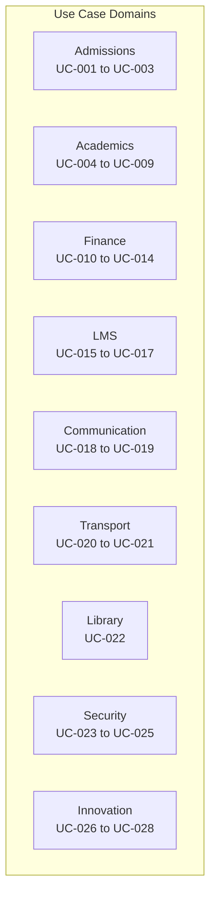
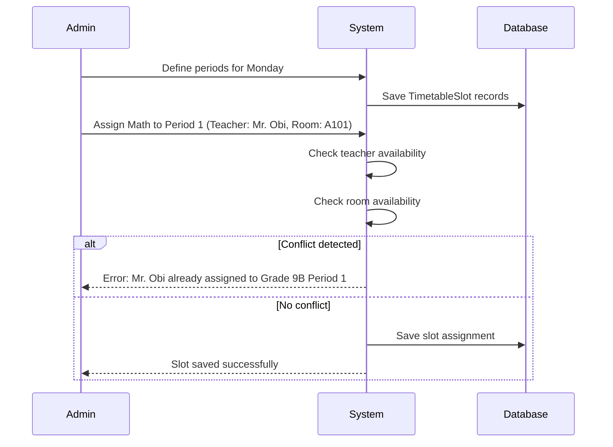

# ERP-School-Management -- Use Cases

**Product:** EduCore Pro
**Version:** 1.0.0
**Date:** 2026-02-23

---

## Use Case Catalog

---

## UC-001: Online Student Admission

**Actor:** Parent/Guardian
**Precondition:** School has published admission forms online
**Postcondition:** Student application is recorded and pending review

**Main Flow:**
1. Parent navigates to school's admission portal
2. Parent fills in student personal details (name, DOB, gender, nationality)
3. Parent uploads required documents (birth certificate, previous report card, passport photo)
4. Parent enters guardian/parent information
5. Parent enters medical information (blood type, allergies, conditions)
6. Parent selects preferred grade level and curriculum
7. Parent submits the application
8. System generates application reference number
9. System sends confirmation email to parent
10. Application appears in admin's review queue

**Alternative Flows:**
- **A1:** Incomplete form -- system highlights missing required fields
- **A2:** Duplicate student number -- system suggests existing record

---

## UC-002: Admission Review and Approval

**Actor:** School Administrator / Principal
**Precondition:** Student application has been submitted

**Main Flow:**
1. Admin navigates to Admissions > Pending Applications
2. Admin reviews student profile, documents, and guardian info
3. Admin may schedule an admission test or interview
4. Admin approves or rejects the application
5. If approved, system generates admission letter
6. System generates registration fee invoice
7. System sends notification to parent with admission letter and fee details
8. If rejected, system sends rejection notification with reason

---

## UC-003: Student Enrollment Completion

**Actor:** Parent, School Administrator
**Precondition:** Admission approved and registration fee paid

**Main Flow:**
1. Parent pays registration fee via online payment
2. System confirms payment and updates invoice status
3. Admin assigns student to a class and section
4. System generates unique student ID number
5. System creates user account with student credentials
6. System sends welcome email with login instructions
7. Student appears in class roster
8. System publishes `student.enrolled` event

---

## UC-004: Academic Year and Term Setup

**Actor:** School Administrator
**Precondition:** User has SCHOOL_ADMIN role

**Main Flow:**
1. Admin navigates to Academics > Academic Years
2. Admin creates new academic year with name and date range
3. Admin adds terms (1-4) with start/end dates and type
4. Admin configures mid-break dates for each term
5. Admin adds important dates (exam periods, holidays)
6. Admin marks the academic year as current
7. System activates the academic year for all dependent features

---

## UC-005: Timetable Generation

**Actor:** School Administrator
**Precondition:** Academic year, classes, subjects, and teachers configured

**Main Flow:**
1. Admin navigates to Academics > Timetable
2. Admin selects class and term
3. Admin defines periods per day (start time, end time, duration)
4. Admin defines break periods (morning break, lunch)
5. Admin assigns subjects to periods with teacher and room
6. System validates for conflicts (teacher double-booking, room overlap)
7. Admin saves the timetable
8. Timetable is visible to students, teachers, and parents

---

## UC-006: Daily Attendance Recording

**Actor:** Teacher
**Precondition:** Teacher assigned to a class section, school day is active

**Main Flow:**
1. Teacher opens class section from dashboard
2. Teacher navigates to Attendance > Mark Attendance
3. System displays student roster with default "Present" status
4. Teacher marks students as Present, Absent, Tardy, Excused, Early Dismissal, or Half Day
5. For tardy students, teacher enters minutes late
6. For absent students, teacher optionally enters reason
7. Teacher saves attendance
8. System creates attendance_record entries with unique constraint
9. System sends notifications to parents of absent students
10. Attendance dashboard updates in real-time

---

## UC-007: Assessment Creation and Grading

**Actor:** Teacher
**Precondition:** Teacher assigned to class, academic term active

**Main Flow:**
1. Teacher navigates to Gradebook > Create Assessment
2. Teacher sets assessment title, type (quiz/test/exam/project/etc.)
3. Teacher sets maximum score, weight, and due date
4. System creates Assessment record
5. After students complete the assessment, teacher enters scores
6. System calculates percentage and maps to letter grade using grading scale
7. Teacher adds feedback comments for individual students
8. Teacher sets grade status to "Submitted"
9. Department head or admin reviews (optional)
10. Teacher publishes grades (status = "Published")
11. Students and parents can now view grades
12. System publishes `grade.published` event
13. Gamification service awards points for high scores

---

## UC-008: Report Card Generation

**Actor:** School Administrator, Teacher
**Precondition:** All term assessments graded and published

**Main Flow:**
1. Admin navigates to Academics > Report Cards
2. Admin selects academic year, term, and class
3. System aggregates all published grades for each student
4. System calculates term averages, GPA, and class rank
5. Teachers add subject-level comments
6. Class teacher adds overall comments
7. Admin reviews and approves report cards
8. Report cards are published to parent portal
9. Parents receive notification to view report cards
10. PDF versions are generated for download

---

## UC-009: Curriculum Configuration

**Actor:** School Administrator
**Precondition:** School profile configured

**Main Flow:**
1. Admin navigates to Academics > Curricula
2. Admin selects curriculum type (WAEC, Cambridge, IB, etc.)
3. Admin configures grading scale (grade labels, score ranges, GPA values)
4. Admin adds subjects with curriculum-specific codes and syllabi
5. Admin maps subjects to grade levels
6. Admin activates the curriculum
7. Classes and assessments can now reference this curriculum

---

## UC-010: Fee Invoice Generation

**Actor:** Accountant / School Administrator
**Precondition:** Fee structures defined for the academic year

**Main Flow:**
1. Admin navigates to Finance > Generate Invoices
2. Admin selects fee structure, academic year, and term
3. Admin selects target (all students, specific class, or individual)
4. System calculates fees per student, applying applicable discounts
5. System generates Invoice records with itemized InvoiceItems
6. System creates StudentFee records linked to FeeStructures
7. Admin reviews and confirms invoice batch
8. System sends payment notifications to parents
9. Invoices are visible on the parent portal

---

## UC-011: Online Fee Payment

**Actor:** Parent/Guardian
**Precondition:** Invoice has been generated

**Main Flow:**
1. Parent navigates to Finance > Fee Summary
2. Parent selects outstanding invoice
3. Parent clicks "Pay Now"
4. Parent chooses payment method (Card, Bank Transfer, Mobile Money)
5. System redirects to secure payment gateway
6. Parent completes payment
7. Payment gateway sends webhook confirmation
8. System creates FeePayment record
9. System updates StudentFee balance and status
10. System generates receipt with unique receipt number
11. Parent receives confirmation notification
12. If fully paid, Invoice status changes to PAID
13. If partial, status changes to PARTIAL, next reminder scheduled

---

## UC-012: Installment Payment Setup

**Actor:** Parent/Guardian
**Precondition:** Fee structure allows installments

**Main Flow:**
1. Parent views invoice with installment option
2. Parent selects number of installments (within allowed maximum)
3. System calculates installment amounts and due dates
4. System creates FeeInstallment records
5. Parent pays first installment
6. Subsequent installments trigger reminders before due dates
7. Late installments incur penalties if configured

---

## UC-013: Scholarship and Financial Aid

**Actor:** School Administrator
**Precondition:** Financial aid programs defined

**Main Flow:**
1. Admin creates FinancialAid record (scholarship/bursary/discount)
2. Admin sets criteria (merit GPA, sibling count, need-based, staff child)
3. Admin sets discount value (fixed amount or percentage)
4. Admin awards aid to eligible students
5. System creates StudentFinancialAid records
6. Future fee calculations automatically apply discounts
7. Aid can be revoked if student no longer meets criteria

---

## UC-014: Payment Reconciliation

**Actor:** Accountant
**Precondition:** Payments have been received

**Main Flow:**
1. Accountant navigates to Finance > Reconciliation
2. System displays payments from all channels
3. Accountant matches bank transfer payments to invoices
4. Accountant reviews and confirms mobile money payments
5. System updates all matched invoice balances
6. Unmatched payments are flagged for follow-up
7. Daily reconciliation report is generated

---

## UC-015: Course Content Creation

**Actor:** Teacher / Instructional Designer
**Precondition:** LMS module enabled

**Main Flow:**
1. Teacher creates a new Course with title, description, and category
2. Teacher adds Modules (chapters/units) in sequential order
3. Within each module, teacher creates Lessons:
   - Video lessons with uploaded or linked content
   - Text lessons with rich formatting
   - Quiz lessons with auto-graded questions
   - Interactive lessons with embedded widgets
   - Assignment lessons with submission requirements
   - Live session lessons with scheduled meeting
4. Teacher sets lesson requirements (free preview, required/optional)
5. Teacher publishes the course
6. Enrolled students gain access

---

## UC-016: Student Course Enrollment

**Actor:** Student / Administrator
**Precondition:** Course is published

**Main Flow:**
1. Student browses course catalog
2. Student clicks "Enroll" on desired course
3. If course has a fee, student is redirected to payment
4. System creates Enrollment record with ACTIVE status
5. Student begins progressing through modules and lessons
6. System tracks progress percentage and time spent
7. Upon completion, system issues a Certificate

---

## UC-017: LMS Progress Tracking

**Actor:** Student, Teacher, Administrator
**Precondition:** Student enrolled in course

**Main Flow:**
1. As student completes lessons, progress percentage updates
2. Teacher can view class-level progress dashboard
3. Administrator can view school-level LMS analytics
4. System tracks time spent per lesson via session events
5. Completion triggers certificate generation
6. Gamification badges awarded for milestones

---

## UC-018: School Announcement

**Actor:** School Administrator / Teacher
**Precondition:** User has announcement permission

**Main Flow:**
1. User creates announcement with title and content
2. User selects target audience (students, parents, teachers, staff)
3. User optionally filters by grade level
4. User sets priority (low, normal, high, urgent)
5. User sets publish and expiry dates
6. User attaches files if needed
7. User publishes announcement
8. Recipients receive notifications based on preferences
9. Announcement appears on all targeted dashboards

---

## UC-019: Parent-Teacher Messaging

**Actor:** Parent, Teacher
**Precondition:** Both users have active accounts

**Main Flow:**
1. Parent initiates new message from Messages section
2. Parent selects teacher from contact list
3. Parent composes message with subject and body
4. Parent attaches files if needed
5. Teacher receives notification
6. Teacher reads and replies to message
7. Conversation thread is maintained
8. Both parties can view message history

---

## UC-020: Bus Route Management

**Actor:** Transport Manager
**Precondition:** Transport module enabled

**Main Flow:**
1. Manager creates bus routes with stops and timing
2. Manager assigns drivers and vehicles to routes
3. Manager assigns students to routes based on addresses
4. Driver uses Bus Tracker app to start route
5. GPS location is broadcast in real-time
6. Parents receive arrival notifications
7. Student pickup/dropoff is recorded

---

## UC-021: Real-Time Bus Tracking

**Actor:** Parent
**Precondition:** Child assigned to bus route

**Main Flow:**
1. Parent opens EduCore Parent app
2. Parent navigates to Transport > Live Tracking
3. Map shows bus position with ETA to child's stop
4. Parent receives push notification when bus is 5 minutes away
5. If bus is delayed, parent is notified with reason

---

## UC-022: Library Catalog Management

**Actor:** Librarian
**Precondition:** Library module enabled

**Main Flow:**
1. Librarian adds books to catalog with ISBN, title, author
2. Librarian manages check-out and return records
3. Students search and reserve books
4. System tracks overdue books and sends reminders
5. Librarian generates circulation reports

---

## UC-023: User Authentication with MFA

**Actor:** Any User
**Precondition:** Account created by administrator

**Main Flow:**
1. User enters email and password
2. System validates credentials
3. If MFA enabled, system prompts for TOTP code
4. User enters code from authenticator app
5. System validates code and creates session
6. Session includes device type, IP, user agent
7. JWT access token and refresh token issued
8. On token expiry, refresh token used for renewal

---

## UC-024: Blockchain Certificate Verification

**Actor:** External Verifier (University, Employer)
**Precondition:** Certificate issued to student

**Main Flow:**
1. Student shares verification URL or QR code
2. Verifier opens the verification link
3. System retrieves blockchain_credential record
4. System queries blockchain for transaction validation
5. System displays certificate details, issue date, and verification status
6. If certificate is revoked, system shows revocation notice

---

## UC-025: Audit Trail Review

**Actor:** Super Administrator, Compliance Officer
**Precondition:** Audit logging enabled

**Main Flow:**
1. Admin navigates to Security > Audit Logs
2. Admin filters by date range, user, entity type, or action
3. System displays audit entries with old/new values
4. Admin can export audit data for compliance reporting
5. Suspicious activity triggers automated alerts

---

## UC-026: AI Student Performance Prediction

**Actor:** Teacher, Administrator
**Precondition:** AI service configured, sufficient historical data

**Main Flow:**
1. AI service analyzes student grades, attendance, and engagement data
2. System identifies students at risk of academic underperformance
3. Dashboard displays risk scores for each student
4. Teachers receive alerts for high-risk students
5. System recommends interventions based on similar cases
6. Outcomes are tracked and fed back into the model

---

## UC-027: Gamification Badge Award

**Actor:** System (automated), Student
**Precondition:** Gamification service configured

**Main Flow:**
1. Student completes a qualifying action (e.g., 100% attendance for a week)
2. Event published to Redpanda
3. Gamification service evaluates badge criteria
4. Badge awarded to student profile
5. Student receives notification
6. Badge appears on student dashboard
7. Leaderboard updates with new points

---

## UC-028: IoT Smart Campus Environmental Alert

**Actor:** System (automated), Facilities Manager
**Precondition:** IoT sensors deployed

**Main Flow:**
1. Sensor detects abnormal reading (temperature, air quality, noise)
2. IoT service processes sensor data
3. If threshold exceeded, alert generated
4. Notification sent to facilities manager
5. Manager investigates and takes corrective action
6. Sensor data logged for trend analysis
