# ERP-School-Management -- Workflow Diagrams

**Product:** EduCore Pro
**Version:** 1.0.0
**Date:** 2026-02-23

---

## 1. Admission Flow

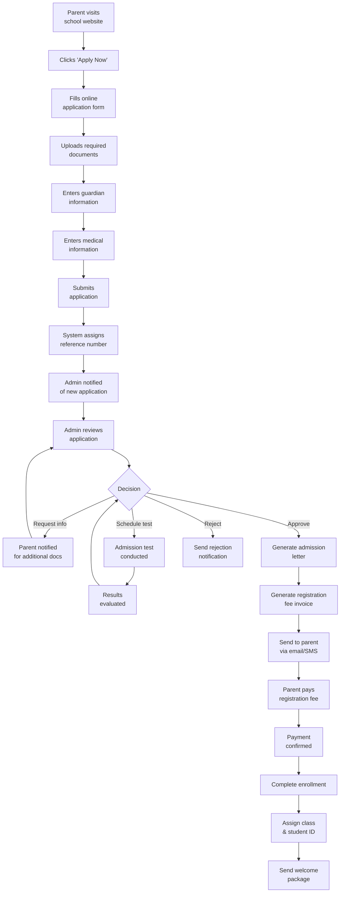

---

## 2. Enrollment Flow

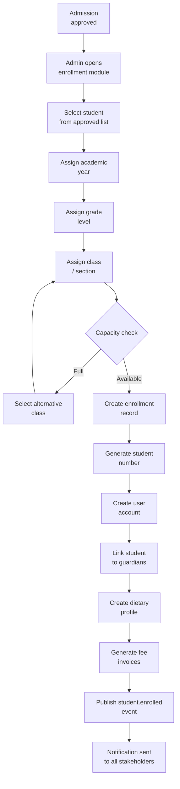

---

## 3. Grading Workflow

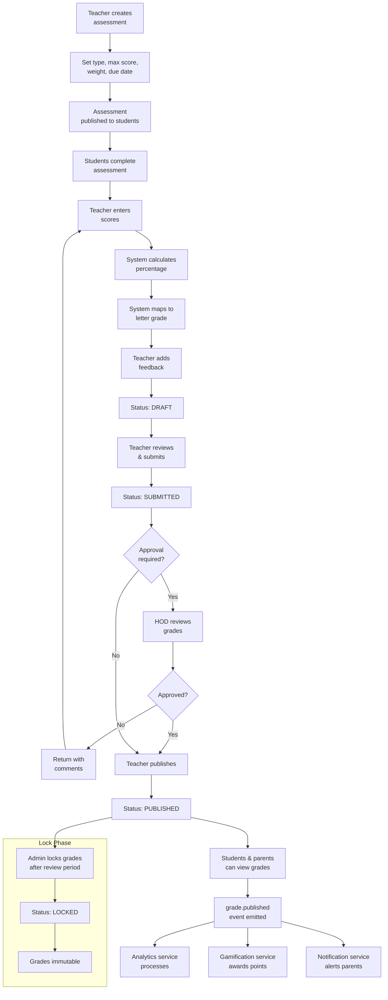

---

## 4. Fee Payment Workflow

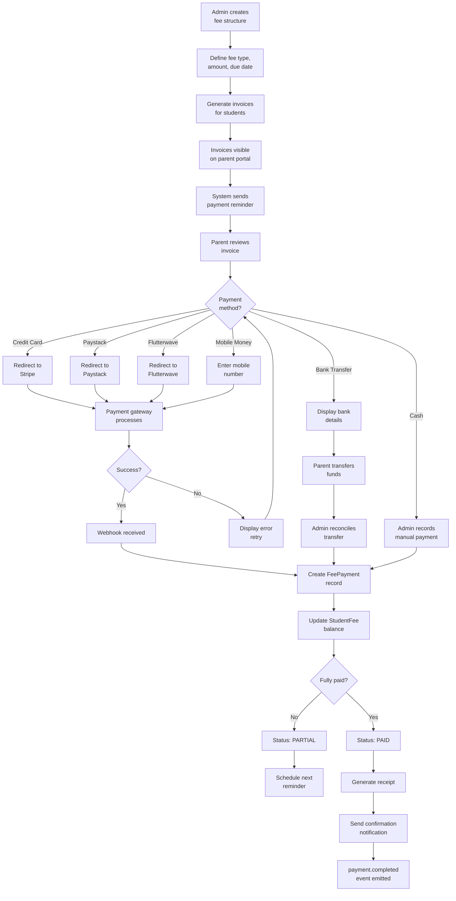

---

## 5. Exam Lifecycle

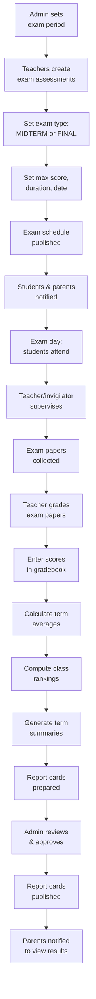

---

## 6. Timetable Generation

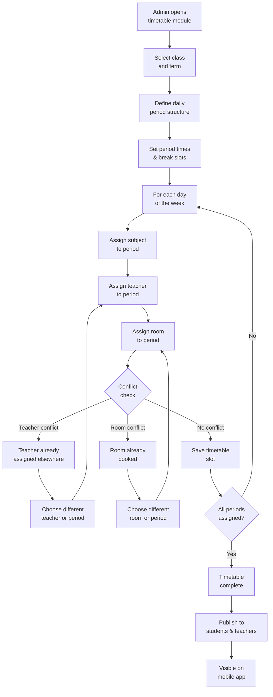

---

## 7. Attendance Workflow

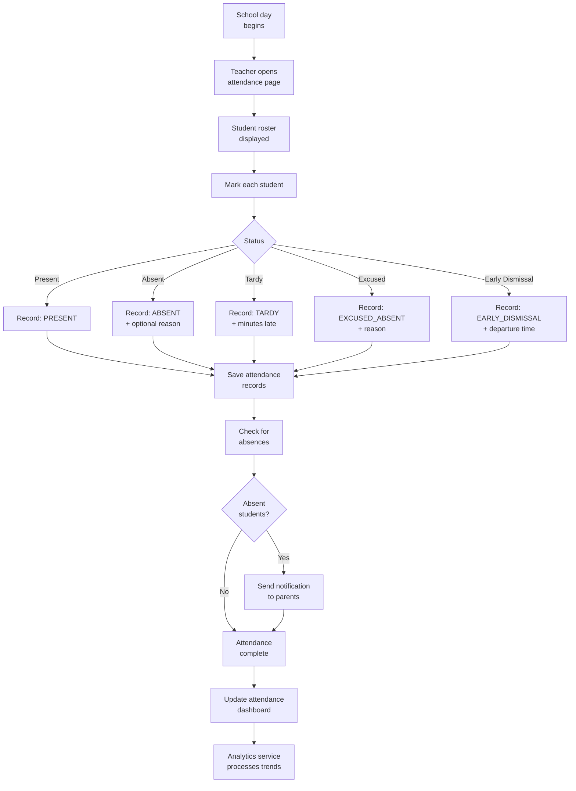

---

## 8. Blockchain Certificate Issuance

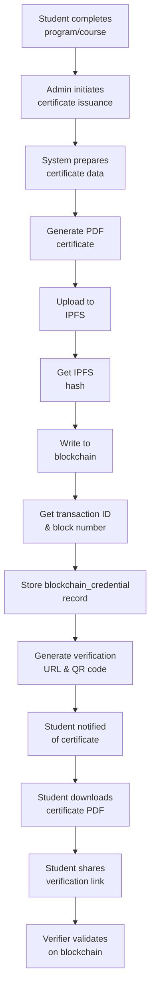

---

## 9. Communication Workflow

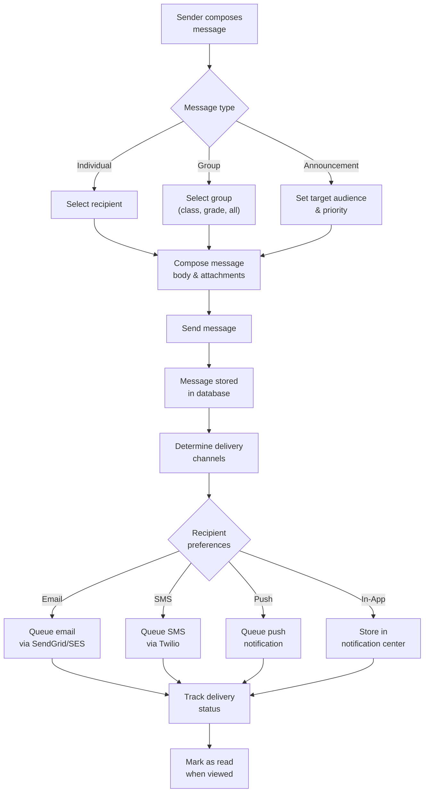

---

## 10. Financial Aid Workflow

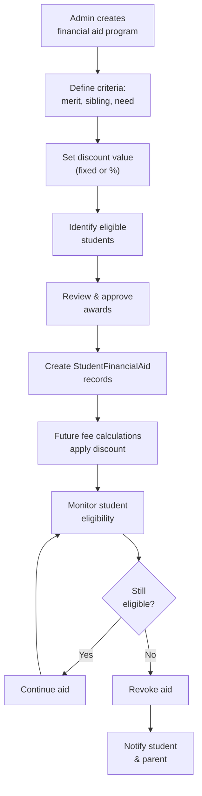

---

## 11. Data Migration Workflow

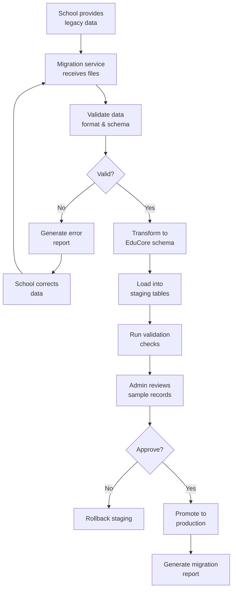
