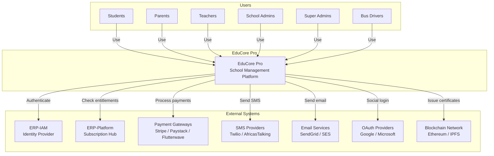
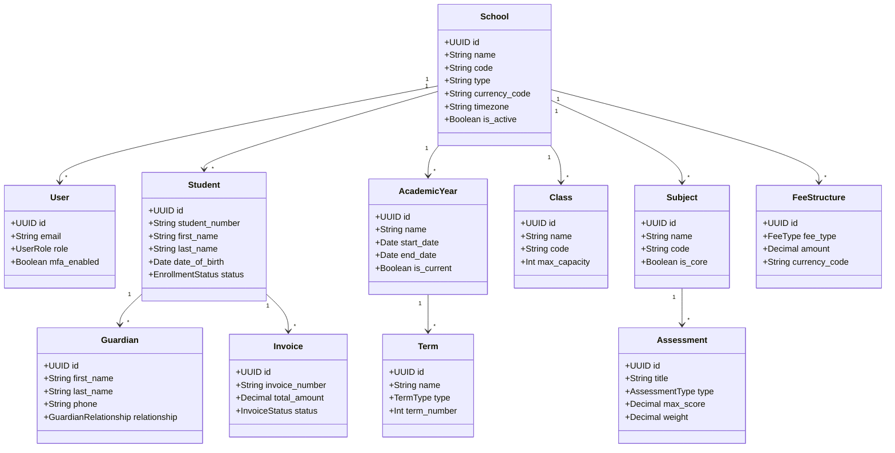
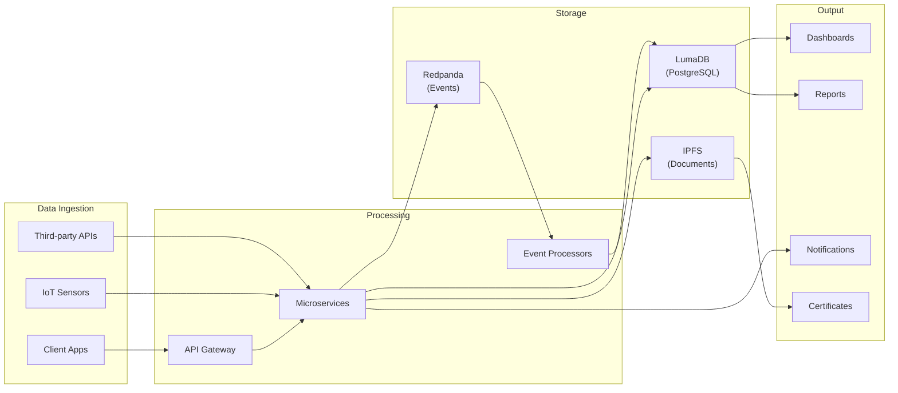
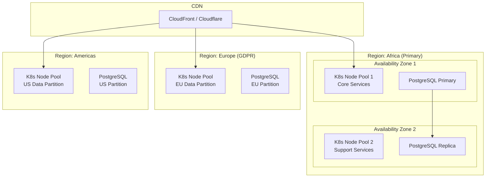

# ERP-School-Management -- High-Level Design

**Product:** EduCore Pro
**Version:** 1.0.0
**Date:** 2026-02-23

---

## 1. System Context (C4 Level 1)

---

## 2. Container Diagram (C4 Level 2)

```mermaid
graph TB
    subgraph "Frontend Containers"
        WEB["Web App<br/>Next.js 14<br/>Port: 3000"]
        MOB["Mobile App<br/>Flutter"]
        PAPP["Parent App<br/>Flutter"]
        TAPP["Teacher App<br/>Flutter"]
        BAPP["Bus Tracker<br/>Flutter"]
    end

    subgraph "API Layer"
        GW["ERP Gateway<br/>NestJS<br/>Port: 8090"]
    end

    subgraph "Core Domain Services"
        AUTH["auth-service<br/>NestJS<br/>Port: 8080"]
        STU["student-service<br/>NestJS<br/>Port: 8080"]
        ACA["academic-service<br/>NestJS<br/>Port: 8080"]
        FIN["finance-service<br/>NestJS<br/>Port: 8080"]
        LMS["lms-service<br/>NestJS<br/>Port: 8080"]
        ADM["admin-service<br/>NestJS<br/>Port: 8080"]
    end

    subgraph "Support Services"
        COMM["communication-service<br/>NestJS"]
        NOTIF["notification-service<br/>NestJS"]
        FILE["file-service<br/>NestJS"]
        SEARCH["search-service<br/>NestJS"]
        INTEG["integration-service<br/>NestJS"]
        EVT["event-service<br/>NestJS"]
        MIG["migration-service<br/>NestJS"]
        SUB["subscription-service<br/>NestJS"]
    end

    subgraph "Innovation Services"
        AI["ai-service<br/>Python"]
        BC["blockchain-service<br/>NestJS"]
        GAME["gamification-service<br/>NestJS"]
        IOT["iot-service<br/>NestJS"]
        AIOPS["aiops-service<br/>NestJS"]
        ANA["analytics-service<br/>NestJS"]
        PLACE["placement-service<br/>Rust"]
        SCHOL["scholarship-service<br/>Go"]
        RES["research-service<br/>Rust"]
    end

    subgraph "Data Stores"
        PG["LumaDB<br/>PostgreSQL 16<br/>Port: 5432"]
        RP["Redpanda<br/>Kafka-compatible<br/>Port: 9092"]
    end

    subgraph "Observability Stack"
        OTEL["OTel Collector<br/>Port: 4317/4318"]
        GF["Grafana<br/>Port: 3000"]
        SS["Apache Superset<br/>Port: 8088"]
    end

    WEB & MOB & PAPP & TAPP & BAPP --> GW
    GW --> AUTH & STU & ACA & FIN & LMS & ADM
    GW --> COMM & NOTIF & FILE & SEARCH & INTEG & EVT & MIG & SUB
    GW --> AI & BC & GAME & IOT & AIOPS & ANA & PLACE & SCHOL & RES

    AUTH & STU & ACA & FIN & LMS & ADM --> PG
    COMM & NOTIF & FILE & SEARCH & ANA --> PG
    BC & GAME & IOT --> PG

    AUTH & STU & ACA & FIN --> RP
    RP --> OTEL --> GF
    PG --> SS
```

---

## 3. Domain Model

---

## 4. High-Level Data Flow

---

## 5. Service Interaction Matrix

| Source Service | Target Service | Protocol | Purpose |
|---|---|---|---|
| auth-service | student-service | REST | User-student linking |
| student-service | finance-service | Event | Fee generation on enrollment |
| academic-service | notification-service | Event | Grade publication alerts |
| finance-service | communication-service | Event | Payment confirmations |
| lms-service | gamification-service | Event | Progress milestones |
| academic-service | blockchain-service | Event | Certificate issuance |
| ai-service | analytics-service | REST | Prediction data |
| iot-service | notification-service | Event | Environmental alerts |
| admin-service | all services | REST | Configuration propagation |
| search-service | student/academic/lms | REST | Index synchronization |

---

## 6. Deployment Topology

---

## 7. Technology Choices Rationale

| Decision | Choice | Rationale |
|---|---|---|
| Primary Language | TypeScript (NestJS) | Team expertise, type safety, ecosystem |
| High-Performance Services | Rust | Memory safety, zero-cost abstractions for career/research |
| Infrastructure Services | Go | Concurrency, small binaries for scholarship processing |
| AI/ML | Python | ML library ecosystem, model deployment ease |
| Database | PostgreSQL 16 | JSONB, extensions, reliability, cost |
| Event Streaming | Redpanda | Kafka-compatible, simpler operations, lower resource usage |
| Frontend Web | Next.js 14 | SSR, RSC, performance, SEO |
| Frontend Mobile | Flutter | Cross-platform, single codebase, performance |
| ORM | Prisma | Type-safe, migration management, introspection |
| Monorepo | Turborepo | Fast builds, dependency graph, remote caching |
| Observability | OpenTelemetry + Grafana | Vendor-neutral, unified traces/metrics/logs |
| BI | Apache Superset | Open source, SQL-native, self-hosted |
