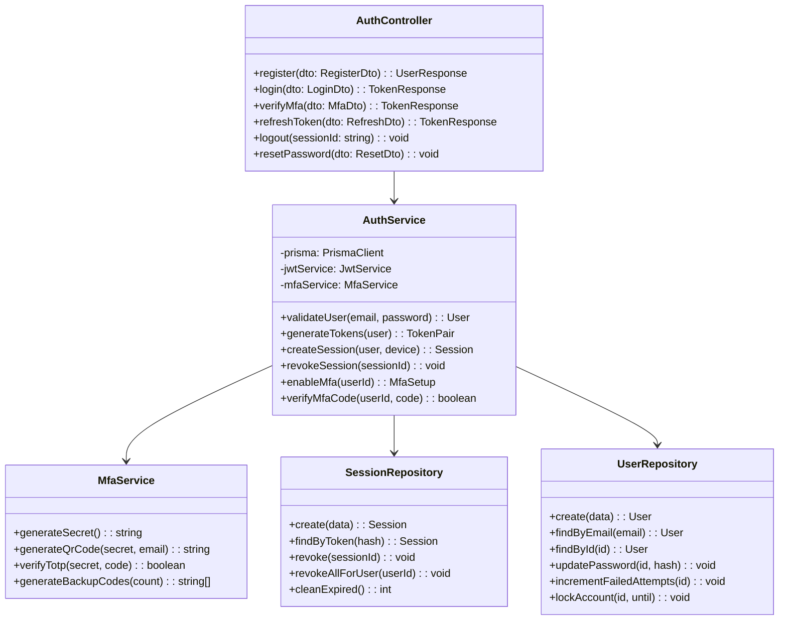
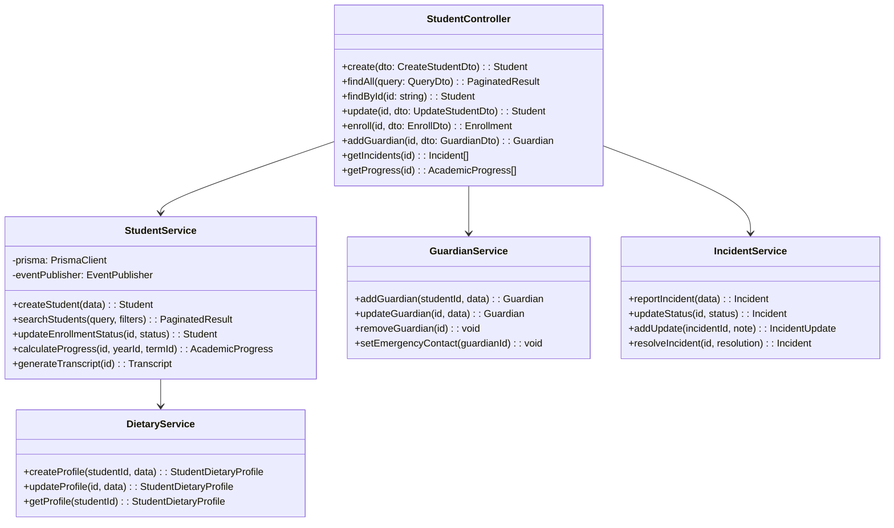
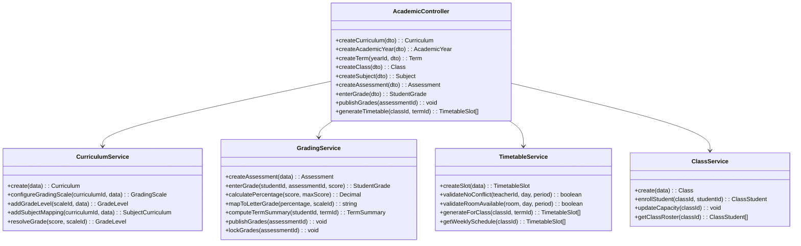
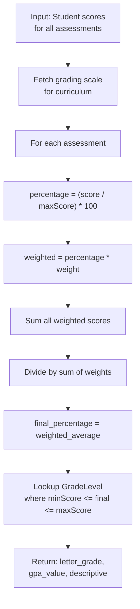
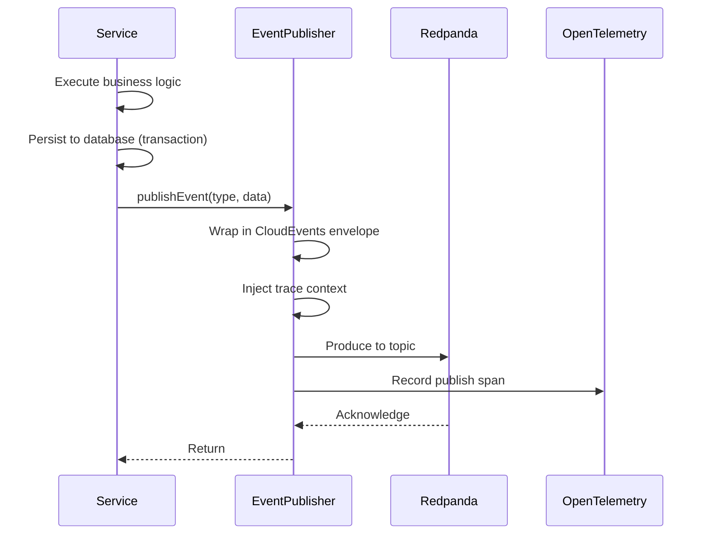

# ERP-School-Management -- Low-Level Design

**Product:** EduCore Pro
**Version:** 1.0.0
**Date:** 2026-02-23

---

## 1. Service Internal Architecture

### 1.1 Auth Service -- Detailed Design



### 1.2 Student Service -- Detailed Design



### 1.3 Academic Service -- Detailed Design



---

## 2. Database Index Strategy

### 2.1 Core Table Indexes

```sql
-- Performance-critical indexes
CREATE INDEX idx_students_school_name_trgm
  ON students USING gin ((first_name || ' ' || last_name) gin_trgm_ops);

CREATE INDEX idx_attendance_lookup
  ON attendance_records (school_id, student_id, date);

CREATE INDEX idx_grades_student_term
  ON student_grades (student_id, term_id, subject_id);

CREATE INDEX idx_payments_school_date
  ON payments (school_id, payment_date DESC);

CREATE INDEX idx_invoices_school_status
  ON invoices (school_id, status, due_date);

CREATE INDEX idx_enrollment_active
  ON enrollments (student_id, status) WHERE status = 'ACTIVE';
```

### 2.2 Composite Index Patterns

| Table | Index | Columns | Purpose |
|---|---|---|---|
| student_grades | Unique lookup | (student_id, assessment_id) | Prevent duplicate grading |
| term_summaries | Unique lookup | (student_id, subject_id, term_id) | One summary per student per subject per term |
| timetable_slots | Schedule lookup | (class_id, day_of_week) | Day schedule retrieval |
| fee_installments | Due date lookup | (school_id, due_date, status) | Payment reminder queries |
| attendance_records | Daily check | (student_id, section_id, date, period) | Unique attendance per period |

---

## 3. API Endpoint Design

### 3.1 Student Service API

| Method | Endpoint | Description | Auth |
|---|---|---|---|
| POST | `/v1/students` | Create student | ADMIN |
| GET | `/v1/students` | List students (paginated, filtered) | ADMIN, TEACHER |
| GET | `/v1/students/:id` | Get student by ID | ADMIN, TEACHER, PARENT |
| PUT | `/v1/students/:id` | Update student | ADMIN |
| DELETE | `/v1/students/:id` | Soft delete student | ADMIN |
| POST | `/v1/students/:id/guardians` | Add guardian | ADMIN |
| GET | `/v1/students/:id/guardians` | List guardians | ADMIN, PARENT |
| POST | `/v1/students/:id/enroll` | Enroll in class | ADMIN |
| GET | `/v1/students/:id/progress` | Get academic progress | ADMIN, TEACHER, PARENT, STUDENT |
| GET | `/v1/students/:id/incidents` | List incidents | ADMIN, TEACHER |
| GET | `/v1/students/:id/transcripts` | Generate transcript | ADMIN, STUDENT |

### 3.2 Finance Service API

| Method | Endpoint | Description | Auth |
|---|---|---|---|
| POST | `/v1/finance/fee-structures` | Create fee structure | ADMIN, ACCOUNTANT |
| GET | `/v1/finance/fee-structures` | List fee structures | ADMIN, ACCOUNTANT |
| POST | `/v1/finance/invoices/generate` | Bulk generate invoices | ADMIN, ACCOUNTANT |
| GET | `/v1/finance/invoices` | List invoices | ADMIN, ACCOUNTANT, PARENT |
| GET | `/v1/finance/invoices/:id` | Get invoice detail | ADMIN, ACCOUNTANT, PARENT |
| POST | `/v1/finance/payments` | Record payment | ADMIN, ACCOUNTANT |
| POST | `/v1/finance/payments/webhook` | Payment gateway webhook | SYSTEM |
| GET | `/v1/finance/students/:id/balance` | Student fee balance | ADMIN, ACCOUNTANT, PARENT |
| POST | `/v1/finance/installments` | Create installment plan | ADMIN, ACCOUNTANT, PARENT |
| POST | `/v1/finance/scholarships` | Create scholarship | ADMIN |
| POST | `/v1/finance/scholarships/:id/award` | Award to student | ADMIN |

---

## 4. DTO Validation Rules

### 4.1 CreateStudentDto

```typescript
class CreateStudentDto {
  @IsNotEmpty()
  @IsString()
  @MaxLength(100)
  firstName: string;

  @IsNotEmpty()
  @IsString()
  @MaxLength(100)
  lastName: string;

  @IsOptional()
  @IsString()
  @MaxLength(100)
  middleName?: string;

  @IsNotEmpty()
  @IsDateString()
  dateOfBirth: string;

  @IsOptional()
  @IsEnum(Gender)
  gender?: Gender;

  @IsNotEmpty()
  @IsString()
  gradeLevel: string;

  @IsOptional()
  @IsEmail()
  email?: string;

  @IsOptional()
  @IsString()
  nationality?: string;

  @IsOptional()
  @IsString()
  primaryLanguage?: string;

  @IsOptional()
  @IsString()
  bloodType?: string;

  @IsOptional()
  @IsString()
  medicalConditions?: string;

  @IsOptional()
  @IsString()
  allergies?: string;
}
```

### 4.2 CreateAssessmentDto

```typescript
class CreateAssessmentDto {
  @IsNotEmpty()
  @IsString()
  @MaxLength(255)
  title: string;

  @IsNotEmpty()
  @IsEnum(AssessmentType)
  type: AssessmentType;

  @IsNotEmpty()
  @IsNumber({ maxDecimalPlaces: 2 })
  @Min(0)
  @Max(999)
  maxScore: number;

  @IsOptional()
  @IsNumber({ maxDecimalPlaces: 2 })
  @Min(0)
  @Max(100)
  weight?: number;

  @IsNotEmpty()
  @IsUUID()
  subjectId: string;

  @IsOptional()
  @IsUUID()
  classId?: string;

  @IsOptional()
  @IsUUID()
  termId?: string;

  @IsOptional()
  @IsDateString()
  scheduledDate?: string;

  @IsOptional()
  @IsDateString()
  dueDate?: string;

  @IsOptional()
  @IsInt()
  @Min(1)
  durationMinutes?: number;
}
```

---

## 5. Grade Calculation Algorithm



### Algorithm Implementation

```
function calculateTermGrade(studentId, subjectId, termId):
    assessments = getAssessments(subjectId, termId)
    totalWeightedScore = 0
    totalWeight = 0

    for each assessment in assessments:
        grade = getStudentGrade(studentId, assessment.id)
        if grade exists and not excused:
            percentage = (grade.score / assessment.maxScore) * 100
            totalWeightedScore += percentage * assessment.weight
            totalWeight += assessment.weight

    if totalWeight == 0:
        return null

    averageScore = totalWeightedScore / totalWeight
    gradingScale = getGradingScale(curriculumId)
    gradeLevel = findGradeLevel(gradingScale, averageScore)

    return TermSummary {
        averageScore: round(averageScore, 2),
        finalGrade: gradeLevel.grade,
        gpaValue: gradeLevel.gpaValue
    }
```

---

## 6. Event Publishing Pattern



### Event Publisher Interface

```typescript
interface EventPublisher {
  publish(event: {
    type: string;          // e.g., "student.enrolled"
    source: string;        // e.g., "/services/student-service"
    data: Record<string, any>;
    tenantId: string;
  }): Promise<void>;
}
```

---

## 7. Caching Strategy

| Data | Cache Layer | TTL | Invalidation |
|---|---|---|---|
| JWT token validation | In-memory | Token expiry | Token revocation |
| School configuration | Redis (planned) | 5 minutes | Admin update |
| Grading scales | In-memory | 1 hour | Curriculum update |
| Timetable data | Redis (planned) | 15 minutes | Timetable edit |
| User sessions | Database | Session expiry | Logout/revoke |
| Search indexes | Elasticsearch | Real-time | DB triggers |

---

## 8. Error Handling Patterns

### 8.1 Domain Exception Hierarchy

```
AppException (base)
  |-- ValidationException (400)
  |-- AuthenticationException (401)
  |-- AuthorizationException (403)
  |-- NotFoundException (404)
  |-- ConflictException (409)
  |   |-- DuplicateStudentException
  |   |-- TimetableConflictException
  |   |-- GradeLockedException
  |-- BusinessRuleException (422)
  |   |-- InsufficientBalanceException
  |   |-- EnrollmentCapacityException
  |   |-- InvalidGradeTransitionException
  |-- ExternalServiceException (502)
  |   |-- PaymentGatewayException
  |   |-- SMSDeliveryException
```

---

## 9. Pagination Pattern

All list endpoints follow cursor-based pagination:

```json
{
  "data": [...],
  "meta": {
    "total": 1500,
    "page": 1,
    "perPage": 25,
    "totalPages": 60,
    "hasNext": true,
    "hasPrev": false
  }
}
```

Query parameters: `?page=1&perPage=25&sortBy=createdAt&sortOrder=desc&search=john&status=ACTIVE`
