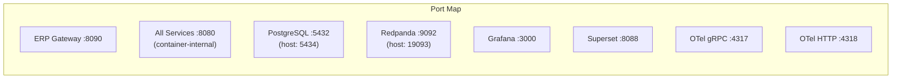

# ERP-School-Management -- Technical Specifications

**Product:** EduCore Pro
**Version:** 1.0.0
**Date:** 2026-02-23

---

## 1. Runtime Environment Specifications

### 1.1 Server Requirements

| Component | Minimum | Recommended | Production |
|---|---|---|---|
| CPU | 4 cores | 8 cores | 16+ cores |
| RAM | 8 GB | 16 GB | 32+ GB |
| Storage | 50 GB SSD | 200 GB NVMe | 1+ TB NVMe |
| Network | 100 Mbps | 1 Gbps | 10 Gbps |
| OS | Ubuntu 22.04 | Ubuntu 24.04 | Ubuntu 24.04 |

### 1.2 Software Dependencies

| Dependency | Version | Purpose |
|---|---|---|
| Node.js | >= 20.0.0 | NestJS service runtime |
| npm | >= 9.0.0 | Package management |
| Go | >= 1.22 | Scholarship service |
| Rust | >= 1.75 | Placement & research services |
| Python | >= 3.11 | AI service |
| PostgreSQL | 16.x | LumaDB data platform |
| Docker | >= 24.0 | Container runtime |
| Docker Compose | >= 2.20 | Local orchestration |
| Kubernetes | >= 1.28 | Production orchestration |
| TypeScript | >= 5.3.3 | Type-safe development |
| Turborepo | >= 1.11.2 | Monorepo build tool |

---

## 2. Service Port Allocation



| Service | Container Port | Host Port | Protocol |
|---|---|---|---|
| ERP Gateway | 8090 | 8092 | HTTP |
| All Microservices | 8080 | (internal) | HTTP |
| PostgreSQL (LumaDB) | 5432 | 5434 | PostgreSQL |
| Redpanda | 9092 | 19093 | Kafka |
| Apache Superset | 8088 | 8088 | HTTP |
| Grafana | 3000 | 3000 | HTTP |
| OTel Collector (gRPC) | 4317 | 4317 | gRPC |
| OTel Collector (HTTP) | 4318 | 4318 | HTTP |

---

## 3. Database Specifications

### 3.1 PostgreSQL Configuration

| Parameter | Value | Rationale |
|---|---|---|
| max_connections | 200 | 25 services x 5 connections + overhead |
| shared_buffers | 4 GB | 25% of available RAM |
| effective_cache_size | 12 GB | 75% of available RAM |
| work_mem | 64 MB | Complex query support |
| maintenance_work_mem | 512 MB | Index/vacuum operations |
| wal_level | replica | Enable streaming replication |
| max_wal_senders | 5 | Replication slots |
| max_parallel_workers_per_gather | 4 | Parallel query execution |

### 3.2 Extensions

| Extension | Purpose |
|---|---|
| uuid-ossp | UUID generation (v4) |
| pg_trgm | Trigram-based fuzzy text search |
| btree_gin | GIN index support for B-tree types |
| btree_gist | GiST index support for B-tree types |

### 3.3 Table Statistics (Estimated)

| Table | Rows per School | Growth Rate |
|---|---|---|
| students | 500-5,000 | 10-20% per year |
| attendance_records | 500K-2M per year | Linear with school days |
| grades | 50K-500K per term | Per assessment per student |
| payments | 5K-50K per year | Per fee per student |
| messages | 10K-100K per year | User activity dependent |
| audit_logs | 100K-1M per year | All CRUD operations |

---

## 4. API Specifications

### 4.1 Request/Response Format

- **Content-Type**: `application/json`
- **Character Encoding**: UTF-8
- **Date Format**: ISO 8601 (`2026-02-23T10:30:00Z`)
- **UUID Format**: v4 (`550e8400-e29b-41d4-a716-446655440000`)
- **Currency Format**: ISO 4217 (3-letter code)
- **Language Format**: BCP 47 (`en-US`, `fr-FR`, `yo-NG`)

### 4.2 Standard Headers

| Header | Direction | Required | Description |
|---|---|---|---|
| Authorization | Request | Yes (business routes) | `Bearer <jwt-token>` |
| X-Tenant-ID | Request | Yes (business routes) | School UUID |
| X-Request-ID | Request | No | Client-generated trace ID |
| X-Correlation-ID | Response | Always | Server-generated or echoed |
| Content-Type | Both | Yes | `application/json` |
| Accept-Language | Request | No | Preferred response language |

### 4.3 Rate Limiting

| Tier | Requests/minute | Burst |
|---|---|---|
| Starter | 60 | 10 |
| Professional | 300 | 50 |
| Enterprise | 1,000 | 100 |
| Internal | Unlimited | N/A |

### 4.4 Standard Response Envelope

```json
{
  "success": true,
  "data": { },
  "meta": {
    "requestId": "uuid",
    "timestamp": "2026-02-23T10:30:00Z",
    "version": "1.0.0"
  }
}
```

### 4.5 Error Response Envelope

```json
{
  "success": false,
  "error": {
    "code": "VALIDATION_ERROR",
    "message": "Invalid input data",
    "details": [
      {
        "field": "dateOfBirth",
        "message": "Must be a valid date in the past",
        "value": "2030-01-01"
      }
    ]
  },
  "meta": {
    "requestId": "uuid",
    "timestamp": "2026-02-23T10:30:00Z",
    "traceId": "otel-trace-id"
  }
}
```

---

## 5. Authentication Token Specifications

### 5.1 JWT Access Token

| Claim | Type | Description |
|---|---|---|
| sub | string | User UUID |
| email | string | User email |
| role | string | User role (SUPER_ADMIN, etc.) |
| schoolId | string | School UUID (null for super admin) |
| iat | number | Issued at (Unix timestamp) |
| exp | number | Expiration (15 minutes from iat) |
| iss | string | `educore-pro` |
| aud | string | `educore-api` |

### 5.2 Refresh Token
- **Format**: Opaque UUID
- **Storage**: Hashed in database (Session table)
- **Expiry**: 7 days (configurable)
- **Rotation**: New refresh token issued on each use
- **Revocation**: Session marked as revoked

---

## 6. Event Specifications

### 6.1 Redpanda Topic Configuration

| Topic | Partitions | Retention | Replication |
|---|---|---|---|
| erp.school_management | 6 | 7 days | 3 |
| erp.full_suite | 12 | 30 days | 3 |

### 6.2 CloudEvents Specification

| Field | Type | Required | Description |
|---|---|---|---|
| specversion | string | Yes | "1.0" |
| type | string | Yes | Event type (e.g., "student.enrolled") |
| source | string | Yes | Service path |
| id | string | Yes | UUID v4 |
| time | string | Yes | ISO 8601 timestamp |
| datacontenttype | string | Yes | "application/json" |
| data | object | Yes | Event payload |

### 6.3 Proto Event Types

| Proto Message | Size (est.) | Usage |
|---|---|---|
| EventEnvelope | 200-500 bytes | Wrapper for all events |
| ProgressEvent | 100-200 bytes | Learning progress |
| SessionEvent | 80-150 bytes | Session lifecycle |
| AssessmentEvent | 150-300 bytes | Assessment results |
| EngagementEvent | 80-150 bytes | User interactions |

---

## 7. File Storage Specifications

| File Type | Max Size | Allowed Formats | Storage |
|---|---|---|---|
| Profile Photo | 5 MB | JPEG, PNG, WebP | Object storage |
| Document Upload | 25 MB | PDF, DOCX, XLSX, PPTX | Object storage |
| Assignment Submission | 50 MB | PDF, DOCX, ZIP, images | Object storage |
| Video Content | 2 GB | MP4, WebM | CDN-backed storage |
| Blockchain Certificate | 10 MB | PDF | IPFS |

---

## 8. Observability Specifications

### 8.1 OpenTelemetry Configuration

```yaml
receivers:
  otlp:
    protocols:
      grpc:
        endpoint: 0.0.0.0:4317
      http:
        endpoint: 0.0.0.0:4318

processors:
  batch:
    timeout: 10s
    send_batch_size: 1024

exporters:
  logging:
    loglevel: info
  otlp:
    endpoint: grafana-agent:4317

service:
  pipelines:
    traces:
      receivers: [otlp]
      processors: [batch]
      exporters: [logging, otlp]
    metrics:
      receivers: [otlp]
      processors: [batch]
      exporters: [logging, otlp]
```

### 8.2 Monitoring Metrics

| Metric | Type | Labels | Alert Threshold |
|---|---|---|---|
| http_request_duration_seconds | Histogram | service, method, path, status | p95 > 1s |
| http_requests_total | Counter | service, method, path, status | Error rate > 5% |
| db_query_duration_seconds | Histogram | service, operation, table | p95 > 500ms |
| event_publish_duration_seconds | Histogram | service, topic | p95 > 200ms |
| active_sessions | Gauge | service | > 10,000 |
| db_connection_pool_size | Gauge | service | > 80% capacity |

---

## 9. Security Specifications

### 9.1 Password Policy

| Rule | Specification |
|---|---|
| Minimum length | 8 characters |
| Complexity | Uppercase + lowercase + digit + special character |
| History | Cannot reuse last 5 passwords |
| Expiry | 90 days (configurable per school) |
| Lockout | 5 failed attempts = 30 minute lockout |

### 9.2 Encryption

| Data State | Algorithm | Key Size |
|---|---|---|
| At Rest (database) | AES-256-GCM | 256 bits |
| In Transit | TLS 1.3 | 256 bits |
| Password Hashing | bcrypt | Cost factor 12 |
| Token Signing | RS256 / HS256 | 2048/256 bits |
| TOTP Secret | HMAC-SHA1 | 160 bits |

### 9.3 CORS Configuration

```json
{
  "origin": ["https://*.educorepro.com", "http://localhost:3000"],
  "methods": ["GET", "POST", "PUT", "DELETE", "PATCH"],
  "allowedHeaders": ["Authorization", "Content-Type", "X-Tenant-ID", "X-Request-ID"],
  "exposedHeaders": ["X-Correlation-ID"],
  "credentials": true,
  "maxAge": 86400
}
```
