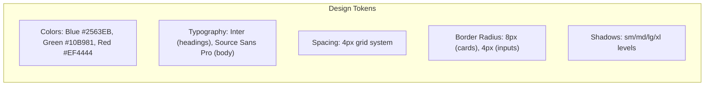

# ERP-School-Management -- Figma Design Prompts

**Product:** EduCore Pro
**Version:** 1.0.0
**Date:** 2026-02-23
**Design System:** EduCore Design System (based on Tailwind + Radix)

---

## Design System Foundation

---

## Prompt 1: Student Dashboard

**Design a student dashboard for EduCore Pro, an enterprise school management platform.** Layout: Top navigation bar with school logo, search (Ctrl+K), notification bell with badge count, and user avatar dropdown. Left sidebar with collapsible menu: Dashboard, My Grades, Attendance, LMS Courses, Assignments, Achievements, Messages, Profile. Main content area with a 2-column grid: Left column (wider) shows a "Today's Schedule" card with period-by-period timetable (color-coded by subject), an "Upcoming Deadlines" card listing 3-5 assignments with due dates and countdown badges. Right column shows "My GPA" donut chart (current term), "Attendance Rate" progress circle (e.g., 96%), "Badges Earned" horizontal carousel with 5 recent badges, and "Announcements" list with 3 recent items. Mobile responsive: collapses to single column with bottom tab navigation. Color palette: primary blue #2563EB, success green #10B981, warning amber, error red. Dark mode variant included.

---

## Prompt 2: Parent Portal Dashboard

**Design a parent portal dashboard for viewing children's academic performance.** Top bar with "EduCore Parent" branding, child selector dropdown (for parents with multiple children), notification bell, profile menu. Main layout: Hero section with child's photo, name, class, and current term. Below that, a 3-card summary row: "Academic Summary" (GPA gauge), "Attendance" (percentage with trend arrow), "Fee Balance" (amount with currency, pay now button). Below summary: tabbed content area with tabs for Grades, Attendance, Fees, Messages, Bus Tracker. Grades tab shows subject-by-subject table with score, grade, teacher, and trend indicator. Fee tab shows outstanding invoices with "Pay Now" CTA buttons in primary blue. Include a floating action button for "Contact Teacher." Mobile-first design with bottom navigation: Home, Grades, Fees, Messages, More.

---

## Prompt 3: Teacher Portal Dashboard

**Design a teacher portal optimized for daily classroom operations.** Left sidebar: Dashboard, My Classes (expandable with class list), Gradebook, Attendance, LMS, Assessments, Messages, Reports. Dashboard main area: "Today's Classes" horizontal timeline showing periods with class name, room, and student count. "Action Required" section: ungraded submissions count, incomplete attendance days, unanswered parent messages. "Quick Actions" row: Mark Attendance, Enter Grades, Create Assignment, Send Message. Lower section: "Class Performance" mini bar charts per class showing average grades, and "Recent Activity" feed showing latest submissions and messages. Include a "Start Class" button that opens the attendance view for the current period.

---

## Prompt 4: Admin Console Dashboard

**Design a school administrator console for EduCore Pro with comprehensive school metrics.** Full-width layout with a collapsible sidebar. Dashboard: Top row of 6 KPI cards (Total Students, Active Staff, Fee Collection Rate, Attendance Today, Pending Admissions, Outstanding Invoices). Second row: Two charts side by side -- "Enrollment Trend" line chart (monthly for current year) and "Fee Collection" stacked bar chart (collected vs outstanding by month). Third row: "Quick Links" grid (Academic Year Setup, User Management, Fee Structures, Reports, Timetable, Announcements). Bottom row: "Recent Activity" log and "System Alerts" panel. Include a top bar with school name, academic year/term selector, and settings gear icon.

---

## Prompt 5: Gradebook Interface

**Design a gradebook interface for teachers to enter and manage student grades.** Header with class name, subject, term selector. Main area: Spreadsheet-style grid with students as rows and assessments as columns. Each cell shows the score (editable inline), colored background based on grade level (green=A, yellow=B, orange=C, red=F). Column headers show assessment title, type icon (quiz/test/project), max score, and weight. Row footer shows student average, letter grade, and class rank. Right sidebar: Assessment details panel when column is selected (title, type, max, weight, due date). Top toolbar: Add Assessment, Publish All, Lock Grades, Export CSV, Print. Filter bar: search students, filter by grade range. Status indicators: Draft (gray dot), Submitted (blue dot), Published (green dot), Locked (lock icon).

---

## Prompt 6: Timetable View

**Design a weekly timetable view for EduCore Pro.** Calendar-grid layout: columns for Monday-Friday (or Saturday if configured), rows for periods (P1-P8 with break slots). Each cell shows subject name, teacher initials, room number, with subject-specific color coding (Math=blue, English=green, Science=purple, etc.). Break periods shown as lighter gray rows spanning all columns. Header shows class name, term, and effective dates. Toggle between "Student View" (read-only) and "Admin View" (editable with drag-and-drop). Admin view allows clicking a cell to assign subject/teacher/room with conflict warning. Print-friendly version with clean borders. Mobile version: scrollable day view with swipe between days.

---

## Prompt 7: Fee Payment Interface

**Design a fee payment flow for parents in EduCore Pro.** Step 1 (Invoice Selection): List of outstanding invoices as cards with invoice number, amount, due date, status badge (pending/overdue), and checkbox selection. Total amount displayed at bottom with "Proceed to Pay" button. Step 2 (Payment Method): Large, tappable payment method options as cards: Credit/Debit Card (Visa/MC icons), Bank Transfer (bank icon), Mobile Money (phone icon), Paystack, Flutterwave. Step 3 (Payment Details): Form specific to selected method -- card form with number, expiry, CVV, or mobile money with phone number. Step 4 (Confirmation): Receipt with school logo, invoice details, amount paid, payment reference, date. Download and share buttons. Include installment option: "Split into X payments" toggle with schedule preview.

---

## Prompt 8: LMS Course Page

**Design a course page for the LMS module of EduCore Pro.** Hero section with course thumbnail, title, description, instructor avatar and name, progress bar (e.g., 45% complete). Left sidebar: Module accordion list with lesson titles, type icons (video=play, text=document, quiz=question mark), completion checkmarks, and duration. Main content area: Active lesson display -- video player for video lessons, rich text for text lessons, question cards for quizzes. Bottom section: "Resources" downloadable files, "Discussion" threaded comments. Right panel (desktop only): "Your Progress" summary, "Certificate" preview (locked until complete), "Next Lesson" shortcut. Navigation: Previous/Next lesson buttons at bottom.

---

## Prompt 9: Attendance Interface

**Design an attendance marking interface optimized for speed.** Top bar: Class name, period, date (with date picker). Student list as a vertical scrollable list. Each row: student photo thumbnail, name, roll number, and 6 tappable status buttons (Present=green check, Absent=red X, Tardy=yellow clock, Excused=blue shield, Early Dismissal=purple arrow, Half Day=orange half-circle). Default: all students set to Present. Tap to change status. Tardy: expanding section for minutes late input. Absent: expanding section for optional reason. Bottom sticky bar: total present/absent/tardy counts, "Save" button. Bulk actions: "Mark All Present," "Import from Biometric." Summary panel: today's overall attendance percentage with comparison to term average.

---

## Prompt 10: Report Card Template

**Design a digital report card for EduCore Pro that can be viewed online and exported as PDF.** A4 layout with school logo and name at top, student information section (name, class, roll number, term, academic year, photo). Grades table: columns for Subject, CA Score, Exam Score, Total, Grade, Teacher Remark. Below grades: Summary section with Overall Average, Class Position, GPA, Attendance Percentage. Comment sections: Class Teacher Comment, Principal Comment. Behavioral assessment with ratings (Excellent/Good/Fair/Needs Improvement) for categories like Punctuality, Neatness, Cooperation, Leadership. Footer: Next term start date, school stamp area, signatures. Include school crest watermark. Print button and download PDF button.

---

## Prompt 11: Exam Scheduler

**Design an exam scheduling interface for school administrators.** Calendar view showing exam period with color-coded exam blocks. Left panel: List of subjects with assigned exam dates, times, and venues. Drag and drop subjects onto calendar slots. Conflict detection: highlight if two exams for the same class overlap. Right panel: Exam details form -- subject, date, start time, duration, venue, invigilator. Bulk generation: "Auto-Schedule" button that distributes exams across the period with configurable rules (no two exams per day, minimum gap). View modes: Calendar, List, and Gantt chart. Export: PDF exam timetable for printing and distribution.

---

## Prompt 12: Bus Tracker Map

**Design a real-time bus tracking interface for parents.** Full-screen map with bus icon showing current location, route line showing planned path, and student's stop marker. Top overlay card: Bus number, driver name, driver photo, contact button. ETA display: "Arriving in 8 minutes" with countdown. Route progress: horizontal progress bar showing stops completed vs remaining. Bottom sheet (draggable): List of stops with times, current stop highlighted. Historical view: Show morning and afternoon routes with actual vs planned times. Push notification preferences: toggle for "Bus approaching" (5min, 10min), "Bus delayed," "Route change." Safety indicator: green/yellow/red for on-time/delayed/emergency.

---

## Prompt 13: Library Catalog

**Design a library catalog search and browse interface.** Search bar at top with filters: Category dropdown (Fiction, Non-Fiction, Textbook, Reference), Grade Level, Language, Availability. Results grid: Book cover thumbnails with title, author, availability badge (Available=green, Checked Out=red with return date). Book detail modal: Large cover, title, author, ISBN, description, location in library (shelf number), current status, "Reserve" or "Check Out" button. Student's borrowed books section: list with due dates and overdue warnings. Librarian view: Barcode scanner integration, check-in/check-out flow, overdue report generation.

---

## Prompt 14: Student Registration Form

**Design a multi-step student registration form for online admissions.** Stepper/wizard at top showing 5 steps: Personal Info, Guardian Details, Medical Info, Documents, Review & Submit. Step 1: Name fields (first, middle, last), DOB (date picker), gender selector, nationality, primary language, photo upload with crop. Step 2: Guardian information with "Add Guardian" repeater -- name, relationship (dropdown), phone, email, occupation, emergency contact toggle. Step 3: Blood type, medical conditions (multi-select), allergies (tag input), medications, doctor name/phone. Step 4: Document upload zones for birth certificate, previous report card, passport photo, with progress indicators. Step 5: Summary review of all entered data with edit buttons per section, terms acceptance checkbox, and Submit button. Progress saves automatically. Mobile-friendly with full-screen steps.

---

## Prompt 15: Analytics Dashboard

**Design an analytics dashboard for school administrators showing key performance indicators.** Top filter bar: Academic Year, Term, Grade Level, Date Range. First row: 4 metric cards with sparkline charts -- Enrollment Count (trend), Average GPA (vs previous term), Attendance Rate (daily trend), Fee Collection Rate (monthly trend). Second row: "Grade Distribution" pie chart and "Subject Performance" horizontal bar chart. Third row: "Attendance Heatmap" (days of week vs weeks, color intensity = attendance %). Fourth row: "At-Risk Students" table (AI-flagged students with risk score, factors, recommended actions). Drill-down capability: click any chart segment to see underlying data. Export all charts as PNG or data as CSV.

---

## Prompt 16 - 25: Additional Prompts

**Prompt 16: Announcement Composer** -- Rich text editor with target audience multi-select (students/parents/teachers/staff), grade level filter, priority selector (urgent=red banner), scheduled publishing, attachment upload, preview mode.

**Prompt 17: Staff Management** -- Staff directory grid/list toggle, search/filter by department/role/status, staff profile card with photo/name/position/department, quick actions (edit/deactivate/view schedule).

**Prompt 18: Incident Report Form** -- Structured form with student selector, incident category, severity level (color-coded), date/time/location, description textarea, witness section, action taken, follow-up required toggle.

**Prompt 19: Scholarship Management** -- Scholarship programs list with criteria summary, eligible student count, awarded students table, application review workflow.

**Prompt 20: IoT Smart Campus Dashboard** -- Floor plan view with sensor overlays (temperature, air quality, noise), real-time readings, historical charts, alert configuration.

**Prompt 21: Blockchain Certificate Viewer** -- Certificate display with QR code, verification status badge, blockchain transaction details, download and share buttons.

**Prompt 22: Gamification Leaderboard** -- School-wide leaderboard with student avatars, points, badges, level indicators, filtering by class/grade.

**Prompt 23: Communication Center** -- Unified inbox with filters (unread, starred, from teachers, from parents), message thread view, compose with rich text, attachment support.

**Prompt 24: Feeding/Cafeteria Management** -- Menu calendar view, dietary restriction filters, wallet balance display, meal ordering interface, subscription plans.

**Prompt 25: Multi-School Super Admin** -- School directory with KPI sparklines, subscription status indicators, platform health dashboard, user management across schools.
