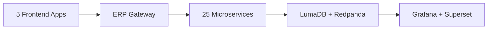

# EduCore Pro -- ERP-School-Management

> A global, enterprise-grade school management platform supporting 10+ international curricula, 150+ currencies, and 29+ languages.



---

## Overview

EduCore Pro is the Education Vertical module within the ERP suite. It provides comprehensive school management capabilities including Student Information System (SIS), academic management, financial operations, Learning Management System (LMS), communication, AI-powered analytics, blockchain-verified credentials, gamification, and IoT smart campus features.

**Benchmarked against:** PowerSchool, Blackbaud, Classe365, Fedena

---

## Architecture

| Component | Technology | Count |
|---|---|---|
| Backend Services | NestJS, Go, Rust, Python | 25 |
| Frontend Apps | Next.js 14, Flutter | 5 |
| Database | PostgreSQL 16 (LumaDB) | 1 cluster |
| Event Streaming | Redpanda | 1 cluster |
| Observability | Grafana + OpenTelemetry | Full stack |
| BI | Apache Superset | 1 instance |
| Build System | Turborepo | Monorepo |

### Services

| Service | Language | Domain |
|---|---|---|
| academic-service | NestJS | Curriculum, grading, timetables |
| student-service | NestJS | SIS, enrollment, guardians |
| auth-service | NestJS | Authentication, MFA, sessions |
| finance-service | NestJS | Fees, payments, vendors, assets |
| lms-service | NestJS | Courses, modules, lessons |
| admin-service | NestJS | School administration |
| analytics-service | NestJS | Reporting, dashboards |
| communication-service | NestJS | SMS, email, messaging |
| notification-service | NestJS | Multi-channel alerts |
| ai-service | Python | Predictive analytics |
| blockchain-service | NestJS | Credential verification |
| gamification-service | NestJS | Badges, leaderboards |
| iot-service | NestJS | Smart campus sensors |
| aiops-service | NestJS | System monitoring |
| placement-service | Rust | Career services |
| scholarship-service | Go | Financial aid |
| research-service | Rust | Research management |
| event-service | NestJS | Event sourcing |
| file-service | NestJS | Document management |
| gateway-service | NestJS | Service mesh routing |
| search-service | NestJS | Full-text search |
| migration-service | NestJS | Data migration |
| subscription-service | NestJS | License management |
| integration-service | NestJS | Third-party connectors |

### Frontend Apps

| App | Technology | Users |
|---|---|---|
| web | Next.js 14 | Admins, teachers |
| mobile | Flutter | Students, parents |
| parent-app | Flutter | Parents/guardians |
| teacher-app | Flutter | Teachers |
| bus-app | Flutter | Transport staff |

---

## Quick Start

### Prerequisites

- Node.js >= 20.0.0
- npm >= 9.0.0
- Docker >= 24.0
- Docker Compose >= 2.20

### Installation

```bash
# Clone the repository
git clone <repo-url>
cd ERP-School-Management

# Install dependencies
npm install

# Start all services
docker compose up --build

# Gateway available at http://localhost:8092
# Grafana at http://localhost:3000
# Superset at http://localhost:8088
```

### Development

```bash
# Start development mode (all services with hot reload)
npm run dev

# Build all services
npm run build

# Run tests
npm run test

# Lint code
npm run lint

# Format code
npm run format
```

### Database

```bash
# Run migrations
npm run db:migrate

# Seed demo data
npm run db:seed
```

---

## Project Structure

```
ERP-School-Management/
  apps/
    web/              Next.js 14 admin/teacher portal
    mobile/           Flutter student/parent app
    parent-app/       Flutter parent app
    teacher-app/      Flutter teacher app
    bus-app/          Flutter bus tracking app
  services/           25 microservices
  packages/
    config/           Shared configuration
    database/         Database utilities
    logger/           Logging library
    superset-adapter/ BI integration
    types/            Shared TypeScript types
    ui/               Shared UI components
    utils/            Common utilities
  gateway/            ERP unified gateway (NestJS)
  infra/
    grafana/          Dashboard configs
    infrastructure/   IaC templates
    k8s/              Kubernetes manifests
    otel/             OpenTelemetry config
    superset/         Superset configuration
  database/           Global migrations
  proto/              Protobuf event contracts
  docs/               Architecture documentation
  docker-compose.yml  Full stack orchestration
  turbo.json          Build pipeline config
  package.json        Monorepo root
```

---

## API

### Endpoints

| Endpoint | Description |
|---|---|
| `GET /healthz` | Health check |
| `GET /v1/capabilities` | Feature discovery |
| `ALL /v1/:service/*` | Service proxy |

### Authentication

All business endpoints require:
- `Authorization: Bearer <jwt-token>` (from ERP-IAM)
- `X-Tenant-ID: <school-uuid>` (tenant context)

---

## Supported Curricula

WAEC, NECO, KCPE, KCSE, ZIMSEC, Cambridge IGCSE, Cambridge AS/A-Level, IB PYP/MYP/DP, Common Core, AP, GCSE, A-Level, Custom

---

## Environment Variables

| Variable | Required | Description |
|---|---|---|
| `PORT` | Yes | Service port (default: 8080) |
| `DATABASE_URL` | Yes | PostgreSQL connection string |
| `REDPANDA_BROKERS` | Yes | Kafka broker addresses |
| `OTEL_EXPORTER_OTLP_ENDPOINT` | Yes | OpenTelemetry collector endpoint |
| `ERP_PLATFORM_BASE_URL` | Yes | ERP Platform service URL |
| `ALLOW_ON_ENTITLEMENT_FAILURE` | No | Bypass entitlement checks |

---

## Testing

```bash
# Unit tests
npm run test

# Integration tests (via Makefile)
make test-integration

# E2E tests
make test-e2e
```

---

## Contributing

See [CONTRIBUTING.md](../19-CONTRIBUTING.md) for guidelines.

---

## License

MIT License. See [LICENSE](LICENSE) for details.

---

## Contact

- **Team:** EduCore Pro Team
- **Email:** team@educorepro.com
