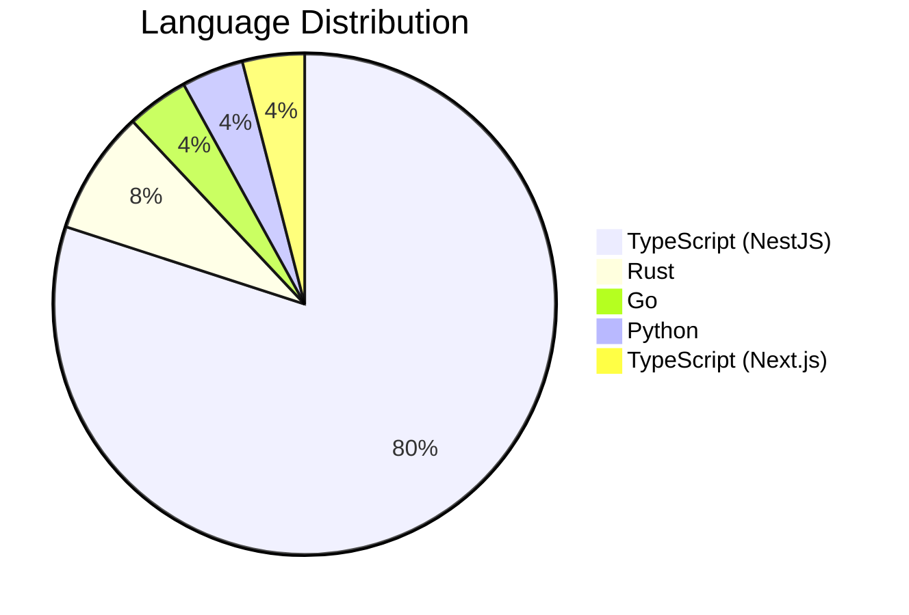

# ERP-School-Management -- Architecture Decision Records

**Product:** EduCore Pro
**Version:** 1.0.0
**Date:** 2026-02-23

---

## ADR Index

| ADR | Title | Status | Date |
|---|---|---|---|
| ADR-001 | Adopt Polyglot Microservices Architecture | Accepted | 2026-02-23 |
| ADR-002 | Select PostgreSQL as Unified Data Platform | Accepted | 2026-02-23 |
| ADR-003 | Implement Geo-Partitioning for Data Residency | Accepted | 2026-02-23 |
| ADR-004 | Use Redpanda over Apache Kafka | Accepted | 2026-02-23 |
| ADR-005 | Adopt Prisma as ORM | Accepted | 2026-02-23 |
| ADR-006 | Use Turborepo for Monorepo Management | Accepted | 2026-02-23 |
| ADR-007 | Multi-Curriculum Architecture Design | Accepted | 2026-02-23 |
| ADR-008 | Event-Driven Inter-Service Communication | Accepted | 2026-02-23 |
| ADR-009 | Blockchain for Credential Verification | Accepted | 2026-02-23 |
| ADR-010 | Flutter for Cross-Platform Mobile | Accepted | 2026-02-23 |

---

## ADR-001: Adopt Polyglot Microservices Architecture

### Status
Accepted

### Context
EduCore Pro requires high scalability, independent deployability, and domain isolation for 25+ bounded contexts. The platform spans multiple domains (academic, financial, communication, AI) with varying performance and technology requirements.

### Decision
Adopt a polyglot microservices architecture:
- **NestJS (TypeScript)**: Primary language for most services (20+ services). Provides type safety, decorator-based architecture, strong ecosystem.
- **Rust**: High-performance services (placement-service, research-service) where memory safety and zero-cost abstractions are critical.
- **Go**: Infrastructure services (scholarship-service) where simple concurrency model and small binary size are advantageous.
- **Python**: AI/ML services (ai-service) leveraging the rich ML library ecosystem.

### Consequences
- **Positive**: Independent scaling, technology-appropriate services, team autonomy
- **Negative**: Increased operational complexity, cross-language debugging challenges, potential for inconsistent patterns
- **Mitigation**: Shared packages for common patterns, standardized API contracts, unified observability



---

## ADR-002: Select PostgreSQL as Unified Data Platform (LumaDB)

### Status
Accepted

### Context
The platform needs a reliable, feature-rich database that supports JSONB for flexible schemas, full-text search, and extension ecosystem. Considered options: PostgreSQL, MongoDB, MySQL, CockroachDB.

### Decision
Use PostgreSQL 16 as the unified data platform (branded as LumaDB). All services connect to a shared PostgreSQL instance with logical schema separation.

### Rationale
- JSONB support for flexible `settings`, `metadata`, and `custom_fields`
- `pg_trgm` extension for fuzzy text search on student names
- Strong ACID compliance critical for financial transactions
- Mature ecosystem with excellent Prisma ORM support
- Cost-effective compared to managed NoSQL alternatives
- Proven at scale in education and enterprise contexts

### Consequences
- **Positive**: Unified data access, strong consistency, rich query capabilities
- **Negative**: Single database bottleneck risk, schema migration coordination across services
- **Mitigation**: Read replicas for query scaling, PgBouncer for connection pooling, per-service Prisma schemas for logical separation

---

## ADR-003: Implement Geo-Partitioning for Data Residency

### Status
Accepted

### Context
GDPR requires European student data to remain within EU boundaries. NDPR mandates Nigerian data residency. The LMS service handles content across 5 regions.

### Decision
Implement geo-partitioning at the database level using composite primary keys with region as the partition key. The LMS service schema demonstrates this pattern:

```
@@id([region, id])
@@unique([region, email])
```

Regions: US, EU, APAC, LATAM, MEA (Middle East & Africa)

### Consequences
- **Positive**: Regulatory compliance, data locality for performance
- **Negative**: Complex cross-region queries, partition-aware application logic
- **Mitigation**: Denormalized views for cross-region reporting, async event replication

---

## ADR-004: Use Redpanda over Apache Kafka

### Status
Accepted

### Context
Event-driven communication between 25 services requires a reliable, high-throughput message broker. Options considered: Apache Kafka, Redpanda, RabbitMQ, NATS.

### Decision
Adopt Redpanda as the event streaming platform.

### Rationale
- Kafka API compatible (no application code changes if migration needed)
- Significantly simpler operations (no ZooKeeper dependency)
- Lower resource consumption (C++ implementation)
- Faster startup and recovery times
- Built-in schema registry and Redpanda Console

### Consequences
- **Positive**: Reduced operational overhead, faster deployments, lower infrastructure costs
- **Negative**: Smaller community than Kafka, fewer managed cloud options
- **Mitigation**: Kafka API compatibility ensures easy migration path if needed

---

## ADR-005: Adopt Prisma as ORM

### Status
Accepted

### Context
The platform needs a type-safe database access layer that supports migrations, introspection, and works well with TypeScript.

### Decision
Use Prisma ORM with schema-first approach for all NestJS services.

### Rationale
- Declarative schema definition with `schema.prisma` files
- Auto-generated, type-safe client
- Built-in migration management
- Preview features: multiSchema, postgresqlExtensions
- Excellent developer experience with auto-completion

### Consequences
- **Positive**: Type-safe queries, reduced SQL injection risk, schema versioning
- **Negative**: Generated client size, learning curve for complex queries, raw SQL needed for advanced PostgreSQL features
- **Mitigation**: `prisma.$queryRaw` for complex queries, per-service generated clients

---

## ADR-006: Use Turborepo for Monorepo Management

### Status
Accepted

### Context
25 services, 5 apps, and 7 shared packages require coordinated builds, tests, and deployments.

### Decision
Adopt Turborepo as the monorepo build orchestration tool.

### Rationale
- Hash-based build caching (local and remote)
- Pipeline dependency graph for correct build order
- Incremental builds (only rebuild changed packages)
- Watch mode for development
- Simple configuration via `turbo.json`

### Consequences
- **Positive**: 10x faster CI builds with caching, clear dependency management
- **Negative**: All code in single repository (large clone size), version coupling
- **Mitigation**: Sparse checkout for CI, workspace-level versioning

---

## ADR-007: Multi-Curriculum Architecture Design

### Status
Accepted

### Context
Schools worldwide use different curricula (WAEC, Cambridge, IB, Common Core, etc.) with vastly different grading systems, assessment types, and reporting formats.

### Decision
Implement a flexible curriculum engine with:
1. `Curriculum` model with `CurriculumType` enum (15+ types)
2. `GradingScale` associated with each curriculum (1:N)
3. `GradeLevel` within each scale defining score ranges and grade mappings
4. `SubjectCurriculum` mapping subjects to curricula with specific syllabi

Schools can adopt multiple curricula simultaneously. Grading calculations resolve through the curriculum's grading scale.

### Consequences
- **Positive**: Universal applicability, school flexibility, easy to add new curricula
- **Negative**: Complex grade computation logic, curriculum-specific reporting
- **Mitigation**: Well-defined GradingService with pluggable resolvers

---

## ADR-008: Event-Driven Inter-Service Communication

### Status
Accepted

### Context
Services need to communicate for cross-cutting operations (e.g., enrollment triggers fee generation, grade publication triggers notifications).

### Decision
Adopt CloudEvents specification over Redpanda for async inter-service communication. Proto-defined event schemas in `proto/events.proto`. Topic naming: `erp.<module>.<entity>.<action>`.

### Consequences
- **Positive**: Loose coupling, eventual consistency, scalable processing
- **Negative**: Debugging distributed flows, event ordering challenges
- **Mitigation**: Correlation IDs, OpenTelemetry distributed tracing, dead-letter queues

---

## ADR-009: Blockchain for Credential Verification

### Status
Accepted

### Context
Academic credentials (diplomas, certificates) need tamper-proof verification by external parties (universities, employers).

### Decision
Implement blockchain-based credential verification:
- Certificate PDF stored on IPFS (content-addressed)
- Hash written to blockchain (Ethereum-compatible)
- Verification URL generated for each credential
- Revocation support with timestamp and reason

### Consequences
- **Positive**: Immutable verification, decentralized trust, fraud prevention
- **Negative**: Blockchain transaction costs, IPFS availability, technical complexity
- **Mitigation**: Batch transactions, IPFS pinning services, hybrid approach (on-chain hash, off-chain data)

---

## ADR-010: Flutter for Cross-Platform Mobile

### Status
Accepted

### Context
The platform needs 4 mobile applications (student, parent, teacher, bus tracker) across iOS and Android.

### Decision
Use Flutter for all mobile applications.

### Rationale
- Single codebase for iOS and Android
- Near-native performance with Dart compilation
- Rich widget library for complex UIs
- Hot reload for fast development cycles
- Strong community and Google backing

### Consequences
- **Positive**: 4 apps from 4 codebases (not 8), consistent UI, faster development
- **Negative**: Dart language learning curve, larger app binary size
- **Mitigation**: Code sharing between Flutter apps via shared packages
