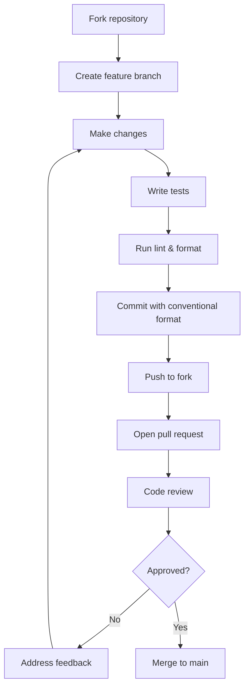
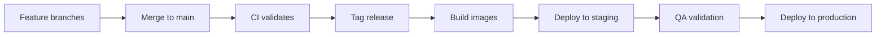

# ERP-School-Management -- Contributing Guide

**Product:** EduCore Pro
**Version:** 1.0.0
**Date:** 2026-02-23

---

## Welcome

Thank you for your interest in contributing to EduCore Pro. This guide covers everything you need to get started as a contributor to the ERP-School-Management module.

---

## Code of Conduct

All contributors must adhere to our Code of Conduct. We are committed to providing a welcoming and inclusive environment for everyone regardless of background, identity, or experience level.

---

## Getting Started

### Prerequisites

| Tool | Version | Installation |
|---|---|---|
| Node.js | >= 20.0.0 | [nodejs.org](https://nodejs.org) |
| npm | >= 9.0.0 | Bundled with Node.js |
| Docker | >= 24.0 | [docker.com](https://docker.com) |
| Docker Compose | >= 2.20 | Bundled with Docker Desktop |
| Go | >= 1.22 | [go.dev](https://go.dev) (for scholarship-service) |
| Rust | >= 1.75 | [rustup.rs](https://rustup.rs) (for placement/research services) |
| Python | >= 3.11 | [python.org](https://python.org) (for ai-service) |
| Git | >= 2.40 | [git-scm.com](https://git-scm.com) |

### Setup

```bash
# 1. Fork the repository on GitHub
# 2. Clone your fork
git clone https://github.com/<your-username>/ERP-School-Management.git
cd ERP-School-Management

# 3. Add upstream remote
git remote add upstream https://github.com/educore-pro/ERP-School-Management.git

# 4. Install dependencies
npm install

# 5. Start infrastructure services
docker compose up -d lumadb redpanda otel-collector

# 6. Run database migrations
npm run db:migrate
npm run db:seed

# 7. Start development mode
npm run dev
```

---

## Development Workflow



### Branch Naming Convention

| Type | Format | Example |
|---|---|---|
| Feature | `feat/<service>/<description>` | `feat/academic-service/add-report-cards` |
| Bug Fix | `fix/<service>/<description>` | `fix/finance-service/installment-calculation` |
| Documentation | `docs/<description>` | `docs/api-documentation-update` |
| Refactor | `refactor/<service>/<description>` | `refactor/auth-service/session-cleanup` |
| Test | `test/<service>/<description>` | `test/student-service/guardian-api` |
| Chore | `chore/<description>` | `chore/update-dependencies` |

### Commit Message Convention

We follow [Conventional Commits](https://www.conventionalcommits.org/):

```
<type>(<scope>): <description>

[optional body]

[optional footer]
```

**Types:** `feat`, `fix`, `docs`, `style`, `refactor`, `test`, `chore`, `perf`, `ci`

**Scopes:** Service names (`academic-service`, `finance-service`, etc.), `gateway`, `web`, `mobile`, `infra`, `docs`

**Examples:**
```
feat(academic-service): add report card generation endpoint
fix(finance-service): correct installment due date calculation
docs(api): update student endpoints documentation
test(student-service): add guardian management integration tests
chore(deps): upgrade Prisma to v5.8.0
```

---

## Coding Standards

### TypeScript (NestJS Services)

- Follow the [NestJS style guide](https://docs.nestjs.com/)
- Use strict TypeScript configuration
- All public methods must have JSDoc comments
- DTOs must use `class-validator` decorators
- Use dependency injection (constructor injection)
- Avoid `any` type -- use `unknown` with type guards instead

```typescript
// Good
@Injectable()
export class StudentService {
  constructor(
    private readonly prisma: PrismaClient,
    private readonly eventPublisher: EventPublisher,
  ) {}

  /**
   * Creates a new student record with guardian associations.
   * @param schoolId - The tenant school identifier
   * @param data - Student creation data
   * @returns The created student with generated student number
   * @throws ConflictException if email already exists
   */
  async createStudent(schoolId: string, data: CreateStudentDto): Promise<Student> {
    // Implementation
  }
}
```

### Go (Scholarship Service)

- Follow [Effective Go](https://go.dev/doc/effective_go)
- Use `golangci-lint` for linting
- Error handling: always check errors, wrap with context
- Naming: PascalCase for exports, camelCase for internal

### Rust (Placement & Research Services)

- Follow the [Rust API Guidelines](https://rust-lang.github.io/api-guidelines/)
- Use `clippy` for linting
- Prefer `Result<T, E>` over panics
- Document public interfaces with `///` comments

### Python (AI Service)

- Follow [PEP 8](https://peps.python.org/pep-0008/)
- Use type hints for all function signatures
- Use `black` for formatting, `ruff` for linting
- Virtual environment via `venv` or `poetry`

---

## Testing Requirements

### Minimum Coverage

| Component | Unit Tests | Integration Tests | E2E Tests |
|---|---|---|---|
| Services | 80% | Required | Recommended |
| Shared Packages | 90% | N/A | N/A |
| Frontend Apps | 70% | Required | Required |

### Test Structure

```
services/<service>/
  tests/
    unit/
      services/
        student.service.spec.ts
      controllers/
        student.controller.spec.ts
    integration/
      student.api.spec.ts
    fixtures/
      student.fixtures.ts
```

### Running Tests

```bash
# All tests
npm run test

# Specific service
cd services/student-service && npm run test

# With coverage
npm run test -- --coverage

# Integration tests
make test-integration

# E2E tests
make test-e2e
```

---

## Pull Request Guidelines

### PR Template

```markdown
## Description
Brief description of changes.

## Type
- [ ] Feature
- [ ] Bug Fix
- [ ] Documentation
- [ ] Refactoring
- [ ] Test

## Service(s) Affected
- [ ] academic-service
- [ ] student-service
- [ ] finance-service
- [ ] Other: ___

## Checklist
- [ ] Tests added/updated
- [ ] Documentation updated
- [ ] Prisma migration created (if schema change)
- [ ] No breaking API changes (or documented)
- [ ] Lint passes
- [ ] Build succeeds
```

### Review Process

1. At least 1 approval required from a maintainer
2. CI pipeline must pass (lint, build, test)
3. No merge conflicts
4. Commit history is clean (squash if needed)
5. Schema changes reviewed by database team

---

## Database Changes

### Adding a New Table

1. Update the relevant service's `prisma/schema.prisma`
2. Create a migration: `cd services/<service> && npx prisma migrate dev --name <description>`
3. Update `docs/DATABASE.md` with new table documentation
4. Update the data dictionary documentation

### Modifying an Existing Table

1. Create a migration (never modify existing migration files)
2. Ensure backward compatibility
3. Add migration notes to the PR description
4. Test with existing data

---

## Adding a New Service

1. Create the service directory under `services/`
2. Follow the established NestJS project structure
3. Add the service to `docker-compose.yml`
4. Add Kubernetes manifests to `infra/k8s/`
5. Register the service in the gateway routing table
6. Add to the architecture documentation
7. Update `turbo.json` if custom build pipeline needed

---

## Release Process



---

## Getting Help

- **Documentation**: Check `docs/` directory
- **Issues**: Open a GitHub issue with the appropriate label
- **Discussions**: Use GitHub Discussions for questions
- **Slack**: Join #educore-dev channel
