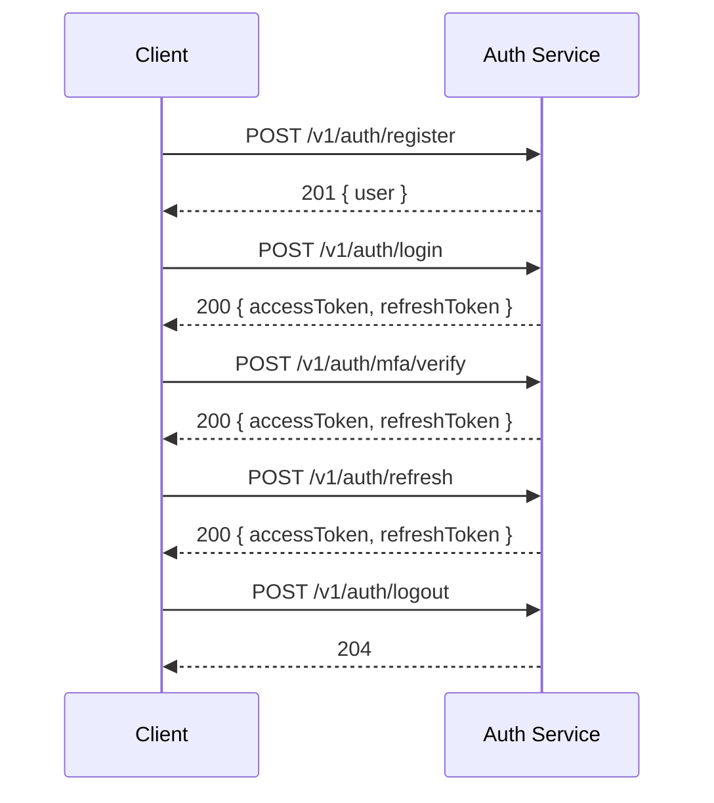

# ERP-School-Management -- API Documentation

**Product:** EduCore Pro
**Version:** 1.0.0
**Base URL:** `http://localhost:8092/v1`
**Date:** 2026-02-23

---

## 1. Authentication

All business endpoints require:
- `Authorization: Bearer <jwt-token>`
- `X-Tenant-ID: <school-uuid>`

### Health & Discovery (No Auth Required)

```
GET /healthz
Response: { "status": "ok", "timestamp": "..." }

GET /v1/capabilities
Response: { "services": [...], "features": [...] }
```

---

## 2. Auth Service (`/v1/auth`)



### POST /v1/auth/register

Register a new user account.

**Request Body:**
```json
{
  "email": "john.doe@school.com",
  "password": "SecureP@ss1",
  "firstName": "John",
  "lastName": "Doe",
  "role": "TEACHER",
  "schoolId": "uuid",
  "phone": "+2348012345678"
}
```

**Response (201):**
```json
{
  "success": true,
  "data": {
    "id": "uuid",
    "email": "john.doe@school.com",
    "firstName": "John",
    "lastName": "Doe",
    "role": "TEACHER",
    "status": "PENDING_VERIFICATION"
  }
}
```

### POST /v1/auth/login

Authenticate and receive tokens.

**Request Body:**
```json
{
  "email": "john.doe@school.com",
  "password": "SecureP@ss1"
}
```

**Response (200):**
```json
{
  "success": true,
  "data": {
    "accessToken": "eyJhbGciOi...",
    "refreshToken": "uuid",
    "expiresIn": 900,
    "mfaRequired": false,
    "user": {
      "id": "uuid",
      "email": "john.doe@school.com",
      "role": "TEACHER"
    }
  }
}
```

### POST /v1/auth/mfa/setup

Enable MFA for current user.

**Response (200):**
```json
{
  "success": true,
  "data": {
    "secret": "JBSWY3DPEHPK3PXP",
    "qrCodeUrl": "otpauth://totp/EduCorePro:john.doe@school.com?secret=...",
    "backupCodes": ["12345678", "87654321", "..."]
  }
}
```

### POST /v1/auth/mfa/verify

**Request Body:**
```json
{
  "code": "123456"
}
```

### POST /v1/auth/refresh

**Request Body:**
```json
{
  "refreshToken": "uuid"
}
```

### POST /v1/auth/logout

Revoke current session.

### POST /v1/auth/password/reset-request

**Request Body:**
```json
{
  "email": "john.doe@school.com"
}
```

### POST /v1/auth/password/reset

**Request Body:**
```json
{
  "token": "reset-token",
  "newPassword": "NewSecureP@ss2"
}
```

---

## 3. Student Service (`/v1/students`)

### POST /v1/students

Create a new student.

**Request Body:**
```json
{
  "firstName": "Amina",
  "lastName": "Okafor",
  "middleName": "Blessing",
  "dateOfBirth": "2010-03-15",
  "gender": "FEMALE",
  "gradeLevel": "Grade 6",
  "email": "amina.okafor@students.school.com",
  "nationality": "Nigerian",
  "primaryLanguage": "English",
  "bloodType": "O+",
  "medicalConditions": "Asthma",
  "allergies": "Peanuts",
  "emergencyContactName": "Mrs. Okafor",
  "emergencyContactPhone": "+2348012345678"
}
```

**Response (201):**
```json
{
  "success": true,
  "data": {
    "id": "uuid",
    "enrollmentNumber": "STU-2026-0001",
    "firstName": "Amina",
    "lastName": "Okafor",
    "status": "ACTIVE",
    "createdAt": "2026-02-23T10:00:00Z"
  }
}
```

### GET /v1/students

List students with pagination and filtering.

**Query Parameters:**
- `page` (int, default: 1)
- `perPage` (int, default: 25, max: 100)
- `search` (string) -- fuzzy search on name
- `gradeLevel` (string)
- `status` (enum: ACTIVE, INACTIVE, GRADUATED, etc.)
- `sortBy` (string: firstName, lastName, enrollmentNumber, createdAt)
- `sortOrder` (string: asc, desc)

### GET /v1/students/:id

Get student by ID with related data.

### PUT /v1/students/:id

Update student profile.

### POST /v1/students/:id/guardians

Add guardian to student.

**Request Body:**
```json
{
  "firstName": "Grace",
  "lastName": "Okafor",
  "phone": "+2348012345678",
  "email": "grace.okafor@email.com",
  "relationship": "MOTHER",
  "isEmergencyContact": true,
  "canPickUp": true
}
```

### GET /v1/students/:id/progress

Get academic progress for a student.

**Query Parameters:**
- `academicYearId` (uuid)
- `termId` (uuid)

### POST /v1/students/:id/incidents

Report an incident involving a student.

**Request Body:**
```json
{
  "title": "Classroom Disruption",
  "description": "Student was disruptive during Mathematics class",
  "severity": "LOW",
  "location": "Room A101",
  "categoryId": "uuid"
}
```

---

## 4. Academic Service (`/v1/academic`)

### Curriculum Management

| Method | Endpoint | Description |
|---|---|---|
| POST | `/v1/academic/curricula` | Create curriculum |
| GET | `/v1/academic/curricula` | List curricula |
| GET | `/v1/academic/curricula/:id` | Get curriculum |
| POST | `/v1/academic/curricula/:id/grading-scales` | Add grading scale |
| POST | `/v1/academic/curricula/:id/subjects` | Map subject |

### Academic Year Management

| Method | Endpoint | Description |
|---|---|---|
| POST | `/v1/academic/years` | Create academic year |
| GET | `/v1/academic/years` | List academic years |
| POST | `/v1/academic/years/:id/terms` | Add term |
| PUT | `/v1/academic/years/:id/set-current` | Set as current year |

### Class & Timetable

| Method | Endpoint | Description |
|---|---|---|
| POST | `/v1/academic/classes` | Create class |
| GET | `/v1/academic/classes` | List classes |
| POST | `/v1/academic/classes/:id/students` | Enroll student |
| GET | `/v1/academic/classes/:id/timetable` | Get timetable |
| POST | `/v1/academic/timetable` | Create timetable slot |

### Assessment & Grading

| Method | Endpoint | Description |
|---|---|---|
| POST | `/v1/academic/assessments` | Create assessment |
| GET | `/v1/academic/assessments` | List assessments |
| POST | `/v1/academic/grades` | Enter grade |
| PUT | `/v1/academic/grades/:id` | Update grade |
| POST | `/v1/academic/assessments/:id/publish` | Publish grades |
| POST | `/v1/academic/assessments/:id/lock` | Lock grades |
| GET | `/v1/academic/term-summaries` | Get term summaries |

---

## 5. Finance Service (`/v1/finance`)

### Fee Structures

| Method | Endpoint | Description |
|---|---|---|
| POST | `/v1/finance/fee-structures` | Create fee structure |
| GET | `/v1/finance/fee-structures` | List fee structures |
| PUT | `/v1/finance/fee-structures/:id` | Update fee structure |

### Invoices

| Method | Endpoint | Description |
|---|---|---|
| POST | `/v1/finance/invoices/generate` | Bulk generate invoices |
| GET | `/v1/finance/invoices` | List invoices |
| GET | `/v1/finance/invoices/:id` | Get invoice detail |

### Payments

| Method | Endpoint | Description |
|---|---|---|
| POST | `/v1/finance/payments` | Record manual payment |
| POST | `/v1/finance/payments/webhook/stripe` | Stripe webhook |
| POST | `/v1/finance/payments/webhook/paystack` | Paystack webhook |
| POST | `/v1/finance/payments/webhook/flutterwave` | Flutterwave webhook |
| GET | `/v1/finance/payments` | List payments |

### Financial Aid

| Method | Endpoint | Description |
|---|---|---|
| POST | `/v1/finance/financial-aid` | Create financial aid program |
| POST | `/v1/finance/financial-aid/:id/award` | Award to student |
| GET | `/v1/finance/students/:id/balance` | Get student balance |

---

## 6. LMS Service (`/v1/lms`)

| Method | Endpoint | Description |
|---|---|---|
| POST | `/v1/lms/courses` | Create course |
| GET | `/v1/lms/courses` | List courses |
| GET | `/v1/lms/courses/:id` | Get course with modules |
| POST | `/v1/lms/courses/:id/modules` | Add module |
| POST | `/v1/lms/modules/:id/lessons` | Add lesson |
| POST | `/v1/lms/courses/:id/enroll` | Enroll student |
| GET | `/v1/lms/enrollments/:id/progress` | Get progress |
| POST | `/v1/lms/enrollments/:id/complete` | Mark complete |

---

## 7. Admin Service (`/v1/admin`)

| Method | Endpoint | Description |
|---|---|---|
| GET | `/v1/admin/schools` | List schools |
| PUT | `/v1/admin/schools/:id` | Update school settings |
| GET | `/v1/admin/users` | List users |
| POST | `/v1/admin/users` | Create user |
| PUT | `/v1/admin/users/:id` | Update user |
| GET | `/v1/admin/audit-logs` | Query audit logs |
| GET | `/v1/admin/dashboard` | Dashboard metrics |

---

## 8. Communication Service (`/v1/communication`)

| Method | Endpoint | Description |
|---|---|---|
| POST | `/v1/communication/messages` | Send message |
| GET | `/v1/communication/messages` | List messages |
| GET | `/v1/communication/messages/:id` | Get message thread |
| POST | `/v1/communication/announcements` | Create announcement |
| GET | `/v1/communication/announcements` | List announcements |

---

## 9. Error Codes

| Code | HTTP Status | Description |
|---|---|---|
| `AUTH_INVALID_CREDENTIALS` | 401 | Email or password incorrect |
| `AUTH_MFA_REQUIRED` | 200 | MFA verification needed |
| `AUTH_ACCOUNT_LOCKED` | 403 | Too many failed attempts |
| `AUTH_TOKEN_EXPIRED` | 401 | JWT has expired |
| `STUDENT_NOT_FOUND` | 404 | Student ID does not exist |
| `STUDENT_DUPLICATE_EMAIL` | 409 | Email already registered |
| `GRADE_LOCKED` | 422 | Cannot modify locked grades |
| `ENROLLMENT_CAPACITY` | 422 | Class is at full capacity |
| `PAYMENT_FAILED` | 422 | Payment processing failed |
| `INVOICE_ALREADY_PAID` | 409 | Invoice has been fully paid |
| `TIMETABLE_CONFLICT` | 409 | Teacher or room conflict |
| `VALIDATION_ERROR` | 400 | Input validation failed |
| `RATE_LIMIT_EXCEEDED` | 429 | Too many requests |
| `INTERNAL_ERROR` | 500 | Unexpected server error |
