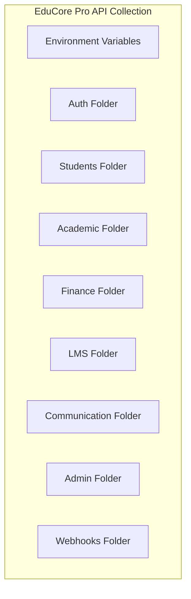

# ERP-School-Management -- Postman Collection

**Product:** EduCore Pro
**Version:** 1.0.0
**Date:** 2026-02-23

---

## 1. Collection Overview



---

## 2. Environment Configuration

### Development Environment

```json
{
  "name": "EduCore Pro - Development",
  "values": [
    { "key": "baseUrl", "value": "http://localhost:8092", "enabled": true },
    { "key": "accessToken", "value": "", "enabled": true },
    { "key": "refreshToken", "value": "", "enabled": true },
    { "key": "tenantId", "value": "demo-school-uuid", "enabled": true },
    { "key": "studentId", "value": "", "enabled": true },
    { "key": "classId", "value": "", "enabled": true },
    { "key": "assessmentId", "value": "", "enabled": true },
    { "key": "invoiceId", "value": "", "enabled": true }
  ]
}
```

### Staging Environment

```json
{
  "name": "EduCore Pro - Staging",
  "values": [
    { "key": "baseUrl", "value": "https://staging-api.educorepro.com", "enabled": true },
    { "key": "tenantId", "value": "staging-school-uuid", "enabled": true }
  ]
}
```

---

## 3. Collection Pre-Request Script

```javascript
// Auto-refresh token if expired
const accessToken = pm.environment.get("accessToken");
if (accessToken) {
    const payload = JSON.parse(atob(accessToken.split('.')[1]));
    const now = Math.floor(Date.now() / 1000);
    if (payload.exp < now + 60) {
        // Token expires in less than 60 seconds, refresh
        const refreshToken = pm.environment.get("refreshToken");
        pm.sendRequest({
            url: pm.environment.get("baseUrl") + "/v1/auth/refresh",
            method: "POST",
            header: { "Content-Type": "application/json" },
            body: { mode: "raw", raw: JSON.stringify({ refreshToken }) }
        }, function(err, res) {
            if (!err && res.code === 200) {
                const data = res.json().data;
                pm.environment.set("accessToken", data.accessToken);
                pm.environment.set("refreshToken", data.refreshToken);
            }
        });
    }
}
```

---

## 4. Request Catalog

### 4.1 Auth Folder

#### Register User
```
POST {{baseUrl}}/v1/auth/register
Headers:
  Content-Type: application/json
  X-Tenant-ID: {{tenantId}}
Body:
{
  "email": "test.teacher@school.com",
  "password": "SecureP@ss123",
  "firstName": "Test",
  "lastName": "Teacher",
  "role": "TEACHER",
  "schoolId": "{{tenantId}}"
}
Tests:
  pm.test("Status 201", () => pm.response.to.have.status(201));
  pm.test("Has user ID", () => {
    const data = pm.response.json().data;
    pm.expect(data.id).to.not.be.undefined;
  });
```

#### Login
```
POST {{baseUrl}}/v1/auth/login
Headers:
  Content-Type: application/json
Body:
{
  "email": "test.teacher@school.com",
  "password": "SecureP@ss123"
}
Tests:
  pm.test("Status 200", () => pm.response.to.have.status(200));
  pm.test("Has tokens", () => {
    const data = pm.response.json().data;
    pm.environment.set("accessToken", data.accessToken);
    pm.environment.set("refreshToken", data.refreshToken);
  });
```

#### Refresh Token
```
POST {{baseUrl}}/v1/auth/refresh
Headers:
  Content-Type: application/json
Body:
{
  "refreshToken": "{{refreshToken}}"
}
```

#### Logout
```
POST {{baseUrl}}/v1/auth/logout
Headers:
  Authorization: Bearer {{accessToken}}
```

### 4.2 Students Folder

#### Create Student
```
POST {{baseUrl}}/v1/students
Headers:
  Authorization: Bearer {{accessToken}}
  Content-Type: application/json
  X-Tenant-ID: {{tenantId}}
Body:
{
  "firstName": "Amina",
  "lastName": "Okafor",
  "dateOfBirth": "2010-03-15",
  "gender": "FEMALE",
  "gradeLevel": "Grade 6",
  "nationality": "Nigerian",
  "primaryLanguage": "English"
}
Tests:
  pm.test("Status 201", () => pm.response.to.have.status(201));
  pm.test("Save student ID", () => {
    pm.environment.set("studentId", pm.response.json().data.id);
  });
```

#### List Students
```
GET {{baseUrl}}/v1/students?page=1&perPage=25&search=amina&status=ACTIVE
Headers:
  Authorization: Bearer {{accessToken}}
  X-Tenant-ID: {{tenantId}}
Tests:
  pm.test("Status 200", () => pm.response.to.have.status(200));
  pm.test("Has pagination", () => {
    pm.expect(pm.response.json().meta.total).to.be.a("number");
  });
```

#### Get Student
```
GET {{baseUrl}}/v1/students/{{studentId}}
Headers:
  Authorization: Bearer {{accessToken}}
  X-Tenant-ID: {{tenantId}}
```

#### Add Guardian
```
POST {{baseUrl}}/v1/students/{{studentId}}/guardians
Headers:
  Authorization: Bearer {{accessToken}}
  Content-Type: application/json
  X-Tenant-ID: {{tenantId}}
Body:
{
  "firstName": "Grace",
  "lastName": "Okafor",
  "phone": "+2348012345678",
  "email": "grace@email.com",
  "relationship": "MOTHER",
  "isEmergencyContact": true
}
```

### 4.3 Academic Folder

#### Create Academic Year
```
POST {{baseUrl}}/v1/academic/years
Headers:
  Authorization: Bearer {{accessToken}}
  Content-Type: application/json
  X-Tenant-ID: {{tenantId}}
Body:
{
  "name": "2025/2026",
  "startDate": "2025-09-01",
  "endDate": "2026-07-31",
  "isCurrent": true
}
```

#### Create Assessment
```
POST {{baseUrl}}/v1/academic/assessments
Headers:
  Authorization: Bearer {{accessToken}}
  Content-Type: application/json
  X-Tenant-ID: {{tenantId}}
Body:
{
  "title": "Mathematics Midterm Exam",
  "type": "MIDTERM",
  "maxScore": 100,
  "weight": 0.30,
  "subjectId": "{{subjectId}}",
  "classId": "{{classId}}",
  "termId": "{{termId}}",
  "scheduledDate": "2026-03-15T09:00:00Z",
  "durationMinutes": 120
}
Tests:
  pm.test("Status 201", () => pm.response.to.have.status(201));
  pm.test("Save assessment ID", () => {
    pm.environment.set("assessmentId", pm.response.json().data.id);
  });
```

#### Enter Grade
```
POST {{baseUrl}}/v1/academic/grades
Headers:
  Authorization: Bearer {{accessToken}}
  Content-Type: application/json
  X-Tenant-ID: {{tenantId}}
Body:
{
  "studentId": "{{studentId}}",
  "assessmentId": "{{assessmentId}}",
  "score": 85,
  "feedback": "Excellent work on algebra section"
}
```

### 4.4 Finance Folder

#### Create Fee Structure
```
POST {{baseUrl}}/v1/finance/fee-structures
Headers:
  Authorization: Bearer {{accessToken}}
  Content-Type: application/json
  X-Tenant-ID: {{tenantId}}
Body:
{
  "name": "Tuition Fee - Term 1",
  "academicYear": "2025/2026",
  "term": "Term 1",
  "feeType": "TUITION",
  "amount": 250000.00,
  "currencyCode": "NGN",
  "dueDate": "2025-10-15T00:00:00Z",
  "allowsInstallment": true,
  "maxInstallments": 3,
  "latePaymentFee": 5000.00,
  "isMandatory": true
}
```

#### Generate Invoices
```
POST {{baseUrl}}/v1/finance/invoices/generate
Headers:
  Authorization: Bearer {{accessToken}}
  Content-Type: application/json
  X-Tenant-ID: {{tenantId}}
Body:
{
  "feeStructureId": "{{feeStructureId}}",
  "targetType": "CLASS",
  "targetId": "{{classId}}"
}
```

#### Record Payment
```
POST {{baseUrl}}/v1/finance/payments
Headers:
  Authorization: Bearer {{accessToken}}
  Content-Type: application/json
  X-Tenant-ID: {{tenantId}}
Body:
{
  "studentFeeId": "{{studentFeeId}}",
  "amount": 100000.00,
  "paymentMethod": "BANK_TRANSFER",
  "transactionReference": "TRF-2026-001",
  "bankName": "First Bank",
  "payerName": "Grace Okafor",
  "payerPhone": "+2348012345678"
}
```

### 4.5 LMS Folder

#### Create Course
```
POST {{baseUrl}}/v1/lms/courses
Headers:
  Authorization: Bearer {{accessToken}}
  Content-Type: application/json
  X-Tenant-ID: {{tenantId}}
Body:
{
  "title": "Introduction to Computer Science",
  "description": "Foundational course covering algorithms, data structures, and programming basics",
  "difficulty": "beginner",
  "isFree": true
}
```

### 4.6 Communication Folder

#### Send Message
```
POST {{baseUrl}}/v1/communication/messages
Headers:
  Authorization: Bearer {{accessToken}}
  Content-Type: application/json
  X-Tenant-ID: {{tenantId}}
Body:
{
  "recipientId": "{{parentUserId}}",
  "subject": "Academic Progress Update",
  "body": "Dear Mrs. Okafor, I wanted to update you on Amina's excellent progress in Mathematics this term."
}
```

#### Create Announcement
```
POST {{baseUrl}}/v1/communication/announcements
Headers:
  Authorization: Bearer {{accessToken}}
  Content-Type: application/json
  X-Tenant-ID: {{tenantId}}
Body:
{
  "title": "Term 1 Exam Schedule",
  "content": "The Term 1 examinations will commence on March 15, 2026...",
  "targetAudience": ["students", "parents", "teachers"],
  "priority": "high",
  "expiryDate": "2026-04-01T00:00:00Z"
}
```

---

## 5. Test Runner Configuration

### Newman Command

```bash
# Run the full collection
newman run educore-pro-collection.json \
  -e development-environment.json \
  --reporters cli,htmlextra \
  --reporter-htmlextra-export results.html
```

---

## 6. Import Instructions

1. Open Postman
2. Click Import
3. Paste the collection JSON or upload the file
4. Select the appropriate environment
5. Run the Auth folder first to obtain tokens
6. Subsequent requests will auto-refresh tokens via the pre-request script
