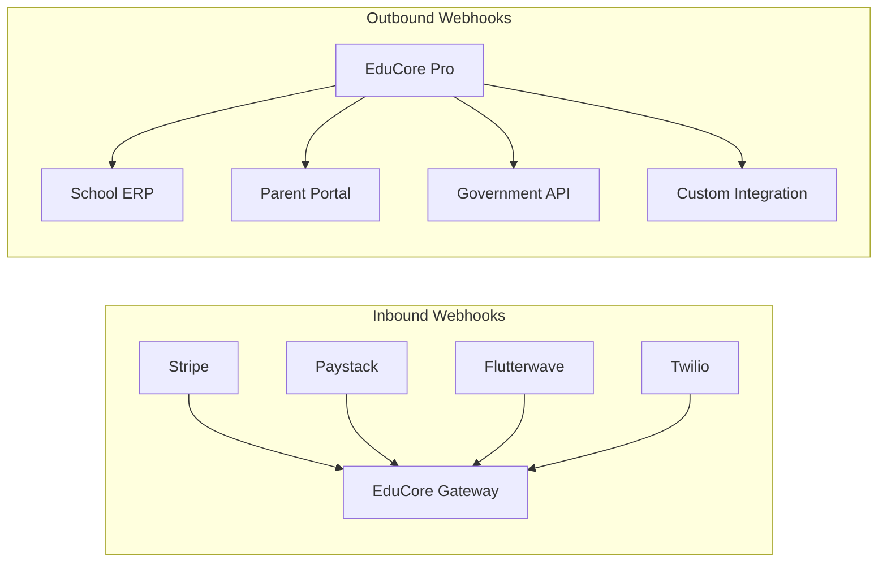
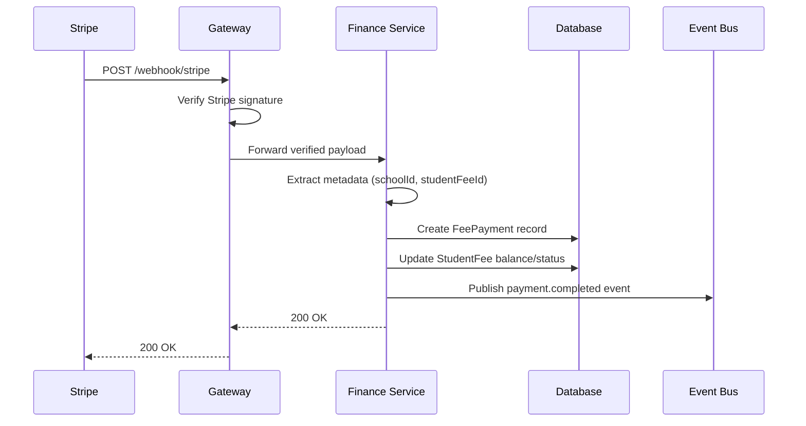
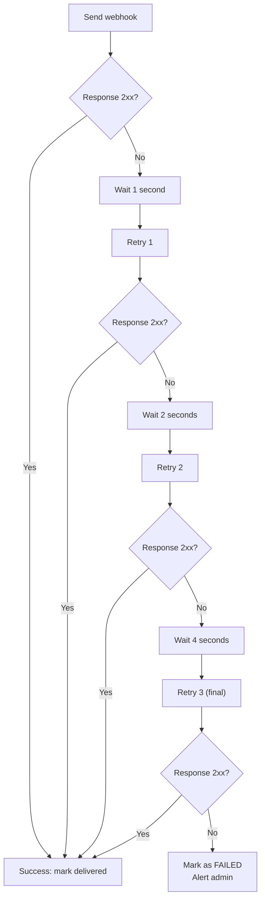

# ERP-School-Management -- Webhook Specifications

**Product:** EduCore Pro
**Version:** 1.0.0
**Date:** 2026-02-23

---

## 1. Overview

EduCore Pro uses webhooks for two purposes:
1. **Inbound Webhooks**: Receiving notifications from external services (payment gateways, SMS providers)
2. **Outbound Webhooks**: Sending notifications to external systems configured by schools



---

## 2. Inbound Webhooks

### 2.1 Stripe Payment Webhook

**Endpoint:** `POST /v1/finance/payments/webhook/stripe`
**Authentication:** Stripe signature verification (`Stripe-Signature` header)

**Headers:**
```
Content-Type: application/json
Stripe-Signature: t=1614556800,v1=abc123...,v0=def456...
```

**Payload Example (checkout.session.completed):**
```json
{
  "id": "evt_1234567890",
  "object": "event",
  "type": "checkout.session.completed",
  "data": {
    "object": {
      "id": "cs_test_1234",
      "payment_intent": "pi_1234",
      "amount_total": 25000000,
      "currency": "ngn",
      "status": "complete",
      "metadata": {
        "schoolId": "uuid",
        "studentFeeId": "uuid",
        "studentId": "uuid",
        "invoiceId": "uuid"
      }
    }
  }
}
```

**Processing Flow:**


**Handled Events:**
| Event Type | Action |
|---|---|
| `checkout.session.completed` | Record payment, update invoice |
| `payment_intent.succeeded` | Confirm payment |
| `payment_intent.payment_failed` | Log failure, notify admin |
| `charge.refunded` | Process refund, update balance |
| `charge.dispute.created` | Flag payment, notify admin |

---

### 2.2 Paystack Payment Webhook

**Endpoint:** `POST /v1/finance/payments/webhook/paystack`
**Authentication:** HMAC SHA512 signature in `X-Paystack-Signature` header

**Headers:**
```
Content-Type: application/json
X-Paystack-Signature: sha512-hmac-hash
```

**Payload Example (charge.success):**
```json
{
  "event": "charge.success",
  "data": {
    "id": 123456,
    "reference": "PAY-2026-001",
    "amount": 25000000,
    "currency": "NGN",
    "status": "success",
    "channel": "card",
    "metadata": {
      "schoolId": "uuid",
      "studentFeeId": "uuid",
      "studentId": "uuid"
    },
    "paid_at": "2026-02-23T10:30:00.000Z"
  }
}
```

**Handled Events:**
| Event Type | Action |
|---|---|
| `charge.success` | Record payment |
| `transfer.success` | Confirm outbound transfer |
| `transfer.failed` | Log failure |
| `refund.processed` | Process refund |

---

### 2.3 Flutterwave Payment Webhook

**Endpoint:** `POST /v1/finance/payments/webhook/flutterwave`
**Authentication:** `verif-hash` header matching configured secret

**Headers:**
```
Content-Type: application/json
verif-hash: your-webhook-hash
```

**Payload Example:**
```json
{
  "event": "charge.completed",
  "data": {
    "id": 789012,
    "tx_ref": "FLW-2026-001",
    "flw_ref": "FLW-MOCK-12345",
    "amount": 250000,
    "currency": "NGN",
    "status": "successful",
    "payment_type": "card",
    "meta": {
      "schoolId": "uuid",
      "studentFeeId": "uuid"
    }
  }
}
```

---

### 2.4 SMS Delivery Webhook (Twilio)

**Endpoint:** `POST /v1/communication/webhook/twilio`
**Authentication:** Twilio request validation signature

**Payload (form-urlencoded):**
```
MessageSid=SM1234567890
MessageStatus=delivered
To=+2348012345678
From=+12345678901
ErrorCode=
ErrorMessage=
```

**Handled Statuses:**
| Status | Action |
|---|---|
| `delivered` | Update message status to delivered |
| `failed` | Log failure, retry if applicable |
| `undelivered` | Log with error code |

---

## 3. Outbound Webhooks

### 3.1 Webhook Configuration

Schools can configure outbound webhooks via the Admin panel:

```json
{
  "id": "uuid",
  "schoolId": "uuid",
  "url": "https://school-erp.example.com/api/webhook",
  "events": [
    "student.enrolled",
    "student.graduated",
    "payment.completed",
    "grade.published",
    "attendance.marked"
  ],
  "secret": "whsec_xxxxxxxxxxxx",
  "isActive": true,
  "retryPolicy": {
    "maxRetries": 3,
    "backoffMultiplier": 2,
    "initialDelayMs": 1000
  }
}
```

### 3.2 Outbound Webhook Payload Format

```json
{
  "id": "evt_uuid",
  "type": "student.enrolled",
  "timestamp": "2026-02-23T10:30:00Z",
  "schoolId": "uuid",
  "data": {
    "studentId": "uuid",
    "studentNumber": "STU-2026-0001",
    "firstName": "Amina",
    "lastName": "Okafor",
    "gradeLevel": "Grade 6",
    "classId": "uuid"
  }
}
```

### 3.3 Signature Verification

Outbound webhooks include an HMAC-SHA256 signature header:

```
X-EduCore-Signature: sha256=abc123def456...
X-EduCore-Timestamp: 1614556800
```

**Verification (recipient side):**
```javascript
const crypto = require('crypto');
const payload = JSON.stringify(req.body);
const timestamp = req.headers['x-educore-timestamp'];
const expectedSig = crypto
  .createHmac('sha256', webhookSecret)
  .update(`${timestamp}.${payload}`)
  .digest('hex');
const isValid = req.headers['x-educore-signature'] === `sha256=${expectedSig}`;
```

### 3.4 Supported Outbound Events

| Event | Trigger | Payload Includes |
|---|---|---|
| `student.enrolled` | Student enrolled in class | Student ID, class, grade |
| `student.graduated` | Student status changed to graduated | Student ID, final GPA |
| `student.withdrawn` | Student withdrawn | Student ID, reason |
| `payment.completed` | Fee payment processed | Amount, method, invoice |
| `payment.refunded` | Payment refunded | Original payment, refund amount |
| `grade.published` | Assessment grades published | Assessment, class, subject |
| `attendance.marked` | Daily attendance saved | Class, date, summary |
| `announcement.published` | Announcement created | Title, audience, content |
| `certificate.issued` | Blockchain certificate issued | Student, credential type |
| `invoice.generated` | Fee invoice created | Student, amount, due date |

### 3.5 Retry Policy



- **Max Retries:** 3
- **Backoff:** Exponential (1s, 2s, 4s)
- **Timeout:** 30 seconds per attempt
- **Failure Action:** Mark as failed, send admin notification, visible in webhook logs

---

## 4. Webhook Security Best Practices

1. **Always verify signatures** before processing webhook payloads
2. **Use HTTPS** for all webhook endpoints
3. **Respond quickly** (within 5 seconds) and process asynchronously
4. **Implement idempotency** using the event ID to prevent duplicate processing
5. **Store and audit** all webhook deliveries for troubleshooting
6. **Rotate secrets** periodically and support multiple active secrets during rotation
