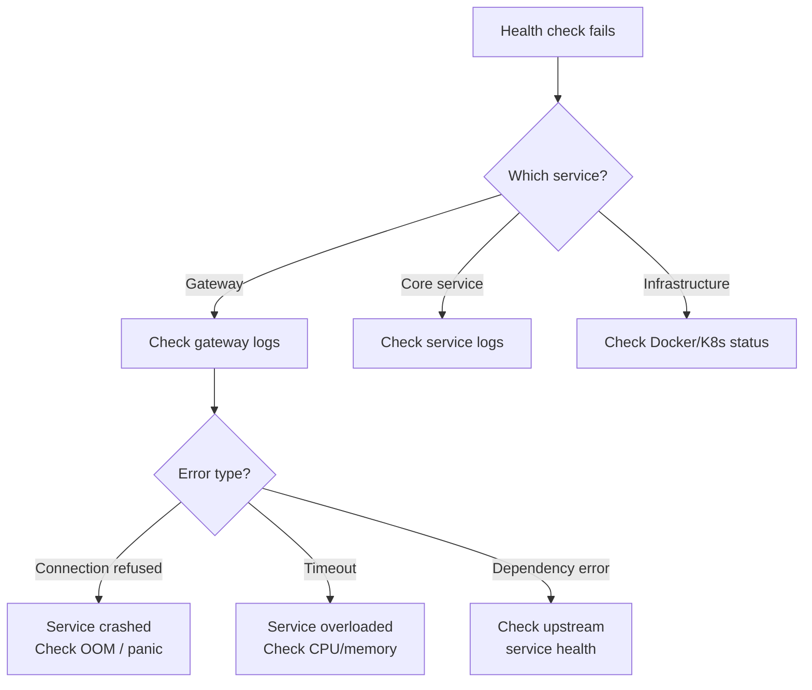

# ERP-School-Management -- Runbooks

**Product:** EduCore Pro
**Version:** 1.0.0
**Date:** 2026-02-23

---

## 1. Runbook Index

| ID | Title | Severity | On-Call Priority |
|---|---|---|---|
| RB-001 | Service Health Check Failure | P1 | Immediate |
| RB-002 | Database Connection Pool Exhaustion | P1 | Immediate |
| RB-003 | Payment Gateway Webhook Failure | P2 | 15 minutes |
| RB-004 | Event Streaming (Redpanda) Down | P2 | 15 minutes |
| RB-005 | High API Latency | P2 | 30 minutes |
| RB-006 | Authentication Service Unavailable | P1 | Immediate |
| RB-007 | Grade Publication Failure | P3 | 1 hour |
| RB-008 | Disk Space Alert | P3 | 1 hour |
| RB-009 | Certificate Store Rotation | P4 | Scheduled |
| RB-010 | Database Backup Verification | P4 | Daily |

---

## 2. RB-001: Service Health Check Failure

### Symptoms
- Kubernetes liveness probe failing
- `GET /healthz` returns non-200 or times out
- Grafana alerts firing for service down

### Diagnosis



### Resolution Steps

1. **Identify the failing service:**
   ```bash
   kubectl get pods -n educore | grep -v Running
   # or
   docker compose ps | grep -v Up
   ```

2. **Check service logs:**
   ```bash
   kubectl logs -n educore <pod-name> --tail=100
   # or
   docker compose logs <service-name> --tail=100
   ```

3. **Check resource usage:**
   ```bash
   kubectl top pods -n educore
   ```

4. **Restart the service:**
   ```bash
   kubectl rollout restart deployment/<service-name> -n educore
   # or
   docker compose restart <service-name>
   ```

5. **If OOM killed:** Increase memory limits in K8s manifests or docker-compose.yml

6. **Escalation:** If service does not recover after restart, escalate to engineering team.

---

## 3. RB-002: Database Connection Pool Exhaustion

### Symptoms
- Services reporting "too many connections" errors
- Slow query responses
- `db_connection_pool_size` metric near capacity

### Resolution Steps

1. **Check current connections:**
   ```sql
   SELECT count(*) FROM pg_stat_activity;
   SELECT state, count(*) FROM pg_stat_activity GROUP BY state;
   ```

2. **Identify connection-hogging services:**
   ```sql
   SELECT application_name, count(*)
   FROM pg_stat_activity
   GROUP BY application_name
   ORDER BY count DESC;
   ```

3. **Kill idle connections:**
   ```sql
   SELECT pg_terminate_backend(pid)
   FROM pg_stat_activity
   WHERE state = 'idle'
   AND state_change < now() - interval '10 minutes';
   ```

4. **Check PgBouncer status** (if deployed)

5. **Increase max_connections** if consistently at limit:
   ```sql
   ALTER SYSTEM SET max_connections = 300;
   -- Requires restart
   ```

6. **Long-term:** Review service connection pool sizes in Prisma configuration

---

## 4. RB-003: Payment Gateway Webhook Failure

### Symptoms
- Payments processed on gateway side but not reflected in EduCore Pro
- Webhook delivery logs showing failures
- Parent complaints about "payment not showing"

### Resolution Steps

1. **Check webhook logs:**
   ```bash
   kubectl logs -n educore deployment/finance-service --tail=200 | grep webhook
   ```

2. **Verify webhook endpoint is accessible:**
   ```bash
   curl -X POST https://api.educorepro.com/v1/finance/payments/webhook/stripe \
     -H "Content-Type: application/json" \
     -d '{"test": true}'
   # Should return 400 (invalid signature) not 5xx
   ```

3. **Check payment gateway dashboard** for failed deliveries:
   - Stripe: Dashboard > Developers > Webhooks
   - Paystack: Dashboard > API Keys & Webhooks
   - Flutterwave: Dashboard > Settings > Webhooks

4. **Manually reconcile:**
   - Get transaction details from gateway
   - Create FeePayment record manually via API or database
   - Update StudentFee balance

5. **Re-enable webhook** if it was disabled by the gateway due to repeated failures

---

## 5. RB-004: Event Streaming (Redpanda) Down

### Symptoms
- Events not being published/consumed
- Cross-service features not working (e.g., enrollment does not trigger fee generation)
- Redpanda broker unreachable

### Resolution Steps

1. **Check Redpanda status:**
   ```bash
   docker compose exec redpanda rpk cluster health
   docker compose exec redpanda rpk topic list
   ```

2. **Check Redpanda logs:**
   ```bash
   docker compose logs redpanda --tail=100
   ```

3. **Restart Redpanda:**
   ```bash
   docker compose restart redpanda
   ```

4. **Verify topic existence:**
   ```bash
   docker compose exec redpanda rpk topic create erp.school_management --partitions 6
   ```

5. **Check consumer lag:**
   ```bash
   docker compose exec redpanda rpk group list
   docker compose exec redpanda rpk group describe <consumer-group>
   ```

6. **Impact assessment:** Events published during downtime may be lost. Review audit logs for any missed state changes.

---

## 6. RB-005: High API Latency

### Symptoms
- API response times > 1 second (p95)
- Grafana latency alerts firing
- User complaints about slow loading

### Resolution Steps

1. **Identify slow endpoints** via Grafana:
   - Check `http_request_duration_seconds` histogram
   - Sort by p95 latency

2. **Check database query performance:**
   ```sql
   SELECT query, calls, mean_exec_time, max_exec_time
   FROM pg_stat_statements
   ORDER BY mean_exec_time DESC
   LIMIT 20;
   ```

3. **Check for missing indexes:**
   ```sql
   SELECT schemaname, relname, seq_scan, idx_scan
   FROM pg_stat_user_tables
   WHERE seq_scan > 1000
   ORDER BY seq_scan DESC;
   ```

4. **Check service resource usage:**
   ```bash
   kubectl top pods -n educore --sort-by=cpu
   ```

5. **Scale horizontally** if needed:
   ```bash
   kubectl scale deployment/<service-name> --replicas=3 -n educore
   ```

---

## 7. RB-006: Authentication Service Unavailable

### Symptoms
- All users unable to log in
- 401/503 errors from gateway
- Auth service pods not running

### Resolution Steps

1. **This is a P1 incident. Immediately:**
   ```bash
   kubectl rollout restart deployment/auth-service -n educore
   ```

2. **Check if database is accessible** from auth service

3. **Verify JWT signing key** is available (check secrets/configmap)

4. **If users have valid tokens**, they can still access services via cached validation. Priority is restoring the auth service for new logins and token refreshes.

5. **Communication:** Notify stakeholders via status page

---

## 8. RB-007: Grade Publication Failure

### Symptoms
- Teacher clicks "Publish" but grades remain in "Submitted" state
- Error messages in academic-service logs

### Resolution Steps

1. **Check assessment status** in database:
   ```sql
   SELECT id, status FROM student_grades WHERE assessment_id = '<id>';
   ```

2. **Check for validation errors** (e.g., grades exceeding max score)

3. **Manual publication** via database if service logic fails:
   ```sql
   UPDATE student_grades SET status = 'PUBLISHED', published_at = NOW()
   WHERE assessment_id = '<id>' AND status = 'SUBMITTED';
   ```

4. **Publish event manually** if needed for downstream consumers

---

## 9. RB-008: Disk Space Alert

### Symptoms
- Disk usage > 80% on database or service nodes
- Grafana disk space alerts

### Resolution Steps

1. **Check disk usage:**
   ```bash
   df -h
   ```

2. **PostgreSQL bloat cleanup:**
   ```sql
   VACUUM FULL;
   REINDEX DATABASE erp_school_management;
   ```

3. **Clean old audit logs:**
   ```sql
   DELETE FROM audit_logs WHERE created_at < NOW() - INTERVAL '90 days';
   ```

4. **Truncate Docker logs:**
   ```bash
   docker system prune -f
   ```

5. **Expand disk** if consistently growing

---

## 10. RB-009: Certificate Store Rotation

### Scheduled Maintenance

1. Generate new TLS certificates
2. Update Kubernetes secrets
3. Perform rolling restart of all services
4. Verify health checks pass
5. Update monitoring dashboards

---

## 11. RB-010: Database Backup Verification

### Daily Verification Steps

1. **Verify latest backup exists:**
   ```bash
   ls -la /backups/postgresql/
   ```

2. **Test backup restore** to a staging database:
   ```bash
   pg_restore -d test_restore /backups/postgresql/latest.dump
   ```

3. **Verify data integrity:**
   ```sql
   SELECT count(*) FROM schools;
   SELECT count(*) FROM students;
   SELECT count(*) FROM payments;
   ```

4. **Log verification result** in ops dashboard

---

## 12. Escalation Matrix

| Level | Response Time | Contact | Handles |
|---|---|---|---|
| L1 | 5 minutes | On-call engineer | Health checks, restarts, basic troubleshooting |
| L2 | 15 minutes | Senior engineer | Database issues, performance tuning, data fixes |
| L3 | 30 minutes | Architecture team | Design issues, scaling decisions, security incidents |
| L4 | 1 hour | Engineering leadership | Cross-team coordination, vendor escalation |
