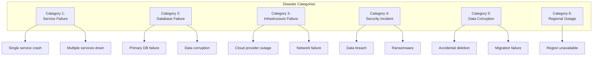
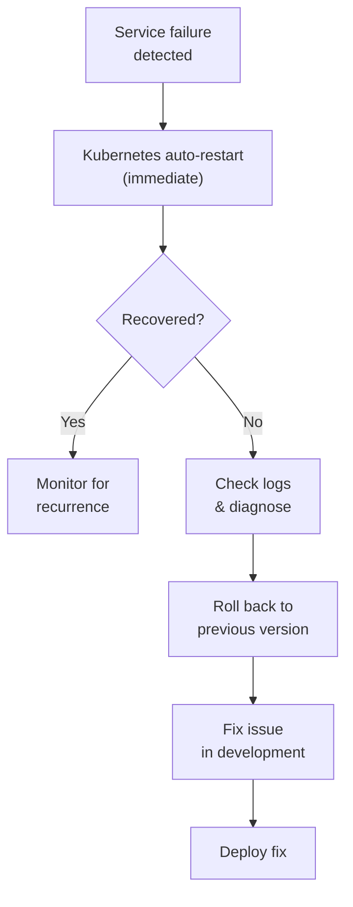

# ERP-School-Management -- Disaster Recovery Plan

**Product:** EduCore Pro
**Version:** 1.0.0
**Date:** 2026-02-23
**Classification:** Confidential

---

## 1. Recovery Objectives

| Metric | Target | Justification |
|---|---|---|
| **RTO** (Recovery Time Objective) | 4 hours | Maximum acceptable downtime |
| **RPO** (Recovery Point Objective) | 1 hour | Maximum acceptable data loss |
| **MTTR** (Mean Time to Recovery) | 2 hours | Average expected recovery |

---

## 2. Disaster Scenarios



---

## 3. Backup Strategy

### 3.1 Database Backups

| Backup Type | Frequency | Retention | Storage |
|---|---|---|---|
| Full backup (pg_dump) | Daily at 02:00 UTC | 30 days | Cross-region object storage |
| WAL archiving | Continuous | 7 days | Regional object storage |
| Point-in-time snapshot | Every 6 hours | 7 days | Cloud provider snapshots |
| Schema backup | Every deploy | 90 days | Git repository |

### 3.2 Application Backups

| Component | Backup Method | Frequency |
|---|---|---|
| Container images | Registry retention | Indefinite (tagged releases) |
| Configuration | Git repository | On every change |
| Kubernetes manifests | Git repository | On every change |
| Secrets/certificates | Encrypted vault backup | Daily |
| File uploads | Object storage replication | Real-time |
| IPFS certificates | Pinned + replicated | On creation |

### 3.3 Backup Verification

```bash
# Daily automated verification
pg_restore --list /backups/latest.dump > /dev/null 2>&1
echo "Backup integrity: $?"

# Weekly restore test to staging
pg_restore -d test_restore /backups/latest.dump
psql -d test_restore -c "SELECT count(*) FROM schools"
psql -d test_restore -c "SELECT count(*) FROM students"
psql -d test_restore -c "SELECT count(*) FROM payments"
```

---

## 4. Recovery Procedures

### 4.1 Scenario: Single Service Failure

**RTO: 15 minutes | RPO: 0**



1. Kubernetes automatically restarts failed pods
2. If persistent, check logs for root cause
3. Rollback deployment: `kubectl rollout undo deployment/<service>`
4. Verify health checks pass
5. Investigate root cause

### 4.2 Scenario: Database Primary Failure

**RTO: 30 minutes | RPO: < 1 minute (WAL)**

1. **Automated failover** to replica (if HA configured)
2. If no automatic failover:
   ```bash
   # Promote replica to primary
   pg_ctl promote -D /var/lib/postgresql/data

   # Update connection strings in K8s secrets
   kubectl edit secret db-credentials -n educore-production

   # Restart all services
   kubectl rollout restart deployment -n educore-production
   ```
3. Verify data integrity
4. Set up new replica from promoted primary

### 4.3 Scenario: Complete Database Loss

**RTO: 4 hours | RPO: < 1 hour**

1. **Stop all services** to prevent further writes:
   ```bash
   kubectl scale deployment --all --replicas=0 -n educore-production
   ```

2. **Restore from latest backup:**
   ```bash
   # Create new database instance
   createdb erp_school_management_restored

   # Restore full backup
   pg_restore -d erp_school_management_restored /backups/latest.dump

   # Apply WAL logs for point-in-time recovery
   # Configure recovery.conf with target_time
   ```

3. **Verify restored data:**
   ```sql
   SELECT count(*) FROM schools;
   SELECT count(*) FROM students;
   SELECT count(*) FROM payments WHERE created_at > NOW() - INTERVAL '24 hours';
   ```

4. **Update connection strings** and restart services

5. **Communicate** status to stakeholders

### 4.4 Scenario: Security Incident (Data Breach)

**RTO: Varies | RPO: 0**

1. **Contain the breach:**
   - Isolate affected services
   - Revoke compromised credentials
   - Block suspicious IPs

2. **Assess scope:**
   - Review audit logs for unauthorized access
   - Identify affected data and users
   - Determine entry point

3. **Notify stakeholders:**
   - Internal security team
   - Affected schools and users
   - Regulatory authorities (GDPR: 72 hours, NDPR: 72 hours, FERPA: varies)

4. **Remediate:**
   - Patch vulnerability
   - Force password reset for affected users
   - Rotate all secrets and certificates

5. **Post-incident review:**
   - Document timeline and actions
   - Update security controls
   - Conduct additional penetration testing

### 4.5 Scenario: Regional Outage

**RTO: 2 hours | RPO: < 5 minutes**

1. **DNS failover** to secondary region
2. **Activate standby infrastructure** in secondary region
3. **Promote regional database replica** to primary
4. **Redirect event streaming** to regional Redpanda cluster
5. **Verify cross-region data consistency**
6. **Communicate** to affected schools

---

## 5. Communication Plan

### 5.1 Internal Communication

| Audience | Channel | Timing | Information |
|---|---|---|---|
| On-call engineer | PagerDuty/Opsgenie | Immediate | Alert details |
| Engineering team | Slack #incidents | < 5 minutes | Status + impact |
| Engineering leadership | Slack + email | < 15 minutes | Business impact |
| Executive team | Email | < 30 minutes | Summary + ETA |

### 5.2 External Communication

| Audience | Channel | Timing | Information |
|---|---|---|---|
| Affected schools | Status page + email | < 30 minutes | Impact + ETA |
| All users | Status page | < 1 hour | General notice |
| Regulatory bodies | Official notice | Per regulation | Compliance report |

---

## 6. Disaster Recovery Testing

### 6.1 Test Schedule

| Test Type | Frequency | Scope |
|---|---|---|
| Backup restore verification | Daily (automated) | Database |
| Service failover drill | Monthly | Individual service |
| Database failover drill | Quarterly | Full database failover |
| Regional failover drill | Semi-annually | Full regional failover |
| Full DR simulation | Annually | Complete disaster scenario |

### 6.2 Test Checklist

- [ ] Backup files are accessible and valid
- [ ] Restore completes within RPO window
- [ ] Services start and pass health checks
- [ ] Data integrity verified (row counts, checksums)
- [ ] External integrations reconnect (payment gateways, SMS)
- [ ] Users can authenticate and access data
- [ ] Event streaming resumes processing

---

## 7. Post-Recovery Validation

1. Verify all 25 services are running and healthy
2. Verify database connections from all services
3. Verify Redpanda topics and consumer groups
4. Test critical user journeys:
   - Login and authentication
   - View grades
   - Make payment
   - Mark attendance
5. Verify observability stack (Grafana, OTel, Superset)
6. Check for data gaps and reconcile if needed
7. Generate post-incident report
