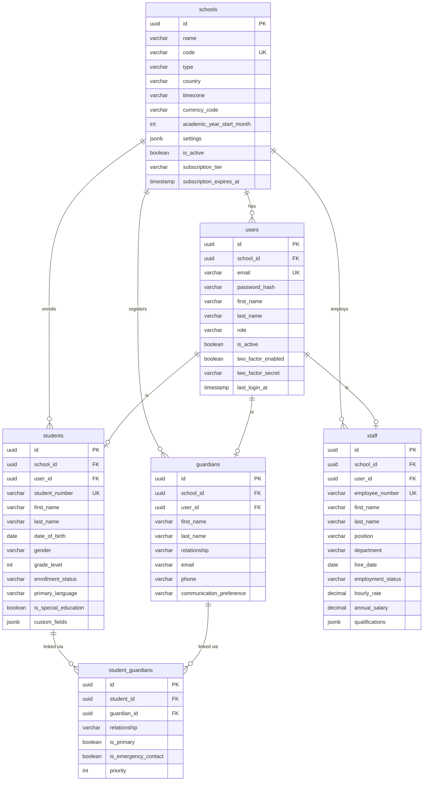
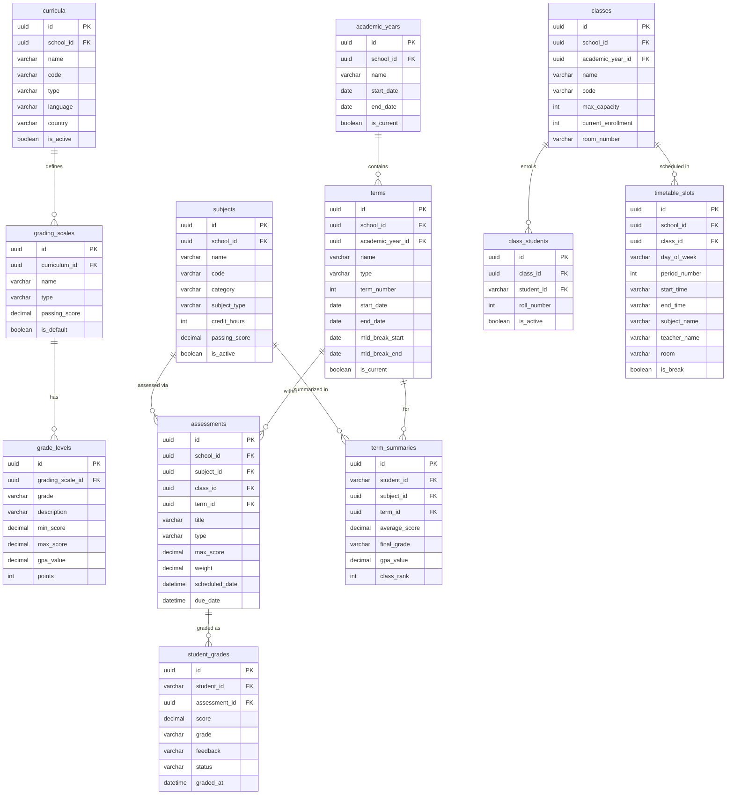
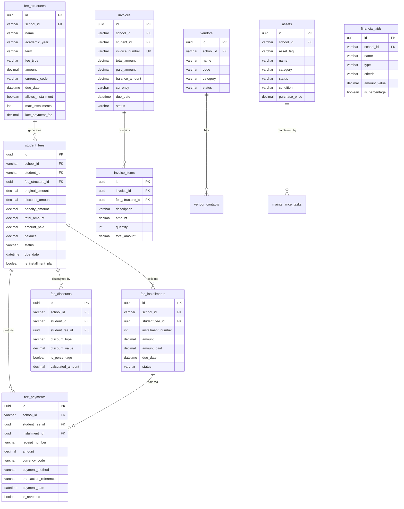
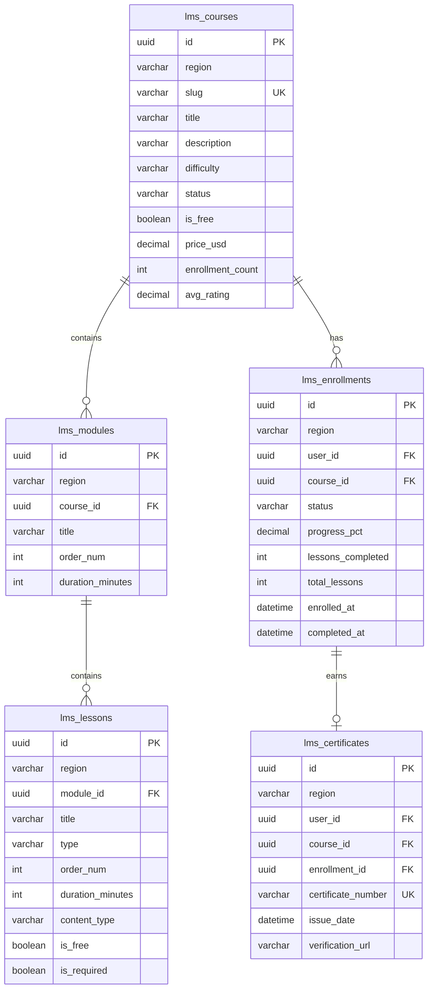
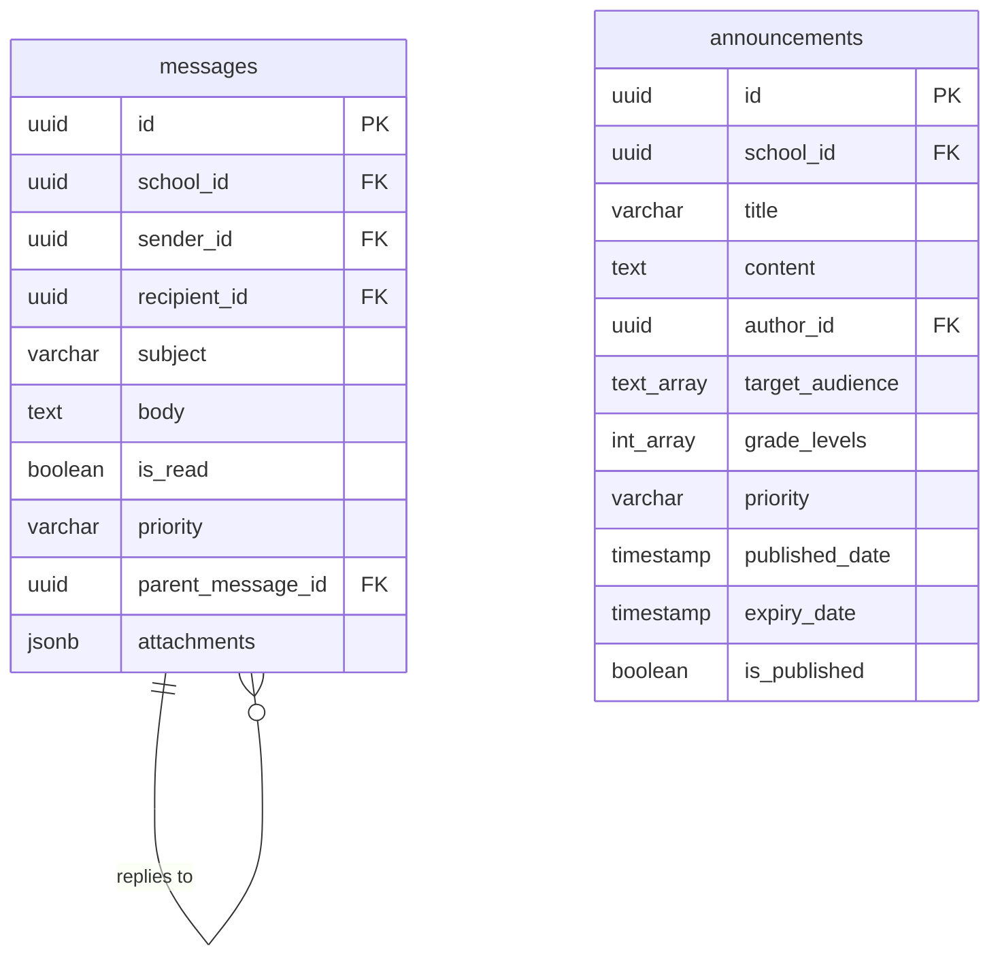
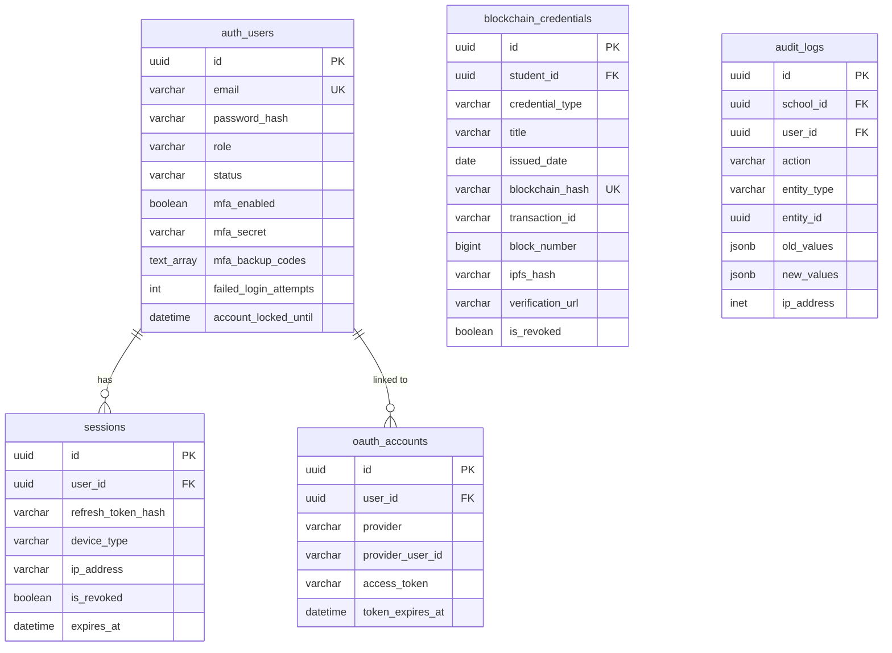
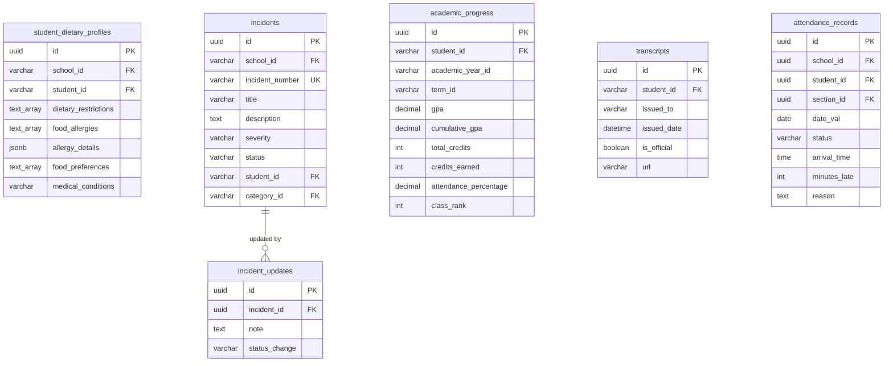

# ERP-School-Management -- Entity Relationship Diagram

**Product:** EduCore Pro
**Version:** 1.0.0
**Date:** 2026-02-23

---

## 1. Core Domain ERD

---

## 2. Academic Domain ERD

---

## 3. Finance Domain ERD

---

## 4. LMS Domain ERD

---

## 5. Communication Domain ERD

---

## 6. Auth & Security Domain ERD

---

## 7. Student Extended Domain ERD

---

## 8. Table Count Summary

| Domain | Tables | Key Entities |
|---|---|---|
| Core (Schools/Users) | 5 | schools, users, students, guardians, staff |
| Academic | 10 | curricula, academic_years, terms, classes, subjects, assessments, grades |
| Finance | 15 | fee_structures, invoices, payments, vendors, assets, financial_aid |
| LMS | 8 | courses, modules, lessons, enrollments, certificates |
| Communication | 3 | messages, announcements, payment_reminders |
| Auth/Security | 5 | sessions, oauth_accounts, blockchain_credentials, audit_logs |
| Student Extended | 6 | dietary_profiles, incidents, academic_progress, transcripts, attendance |
| **Total** | **52+** | |
