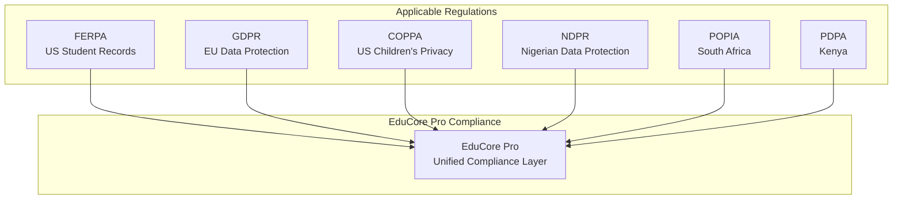
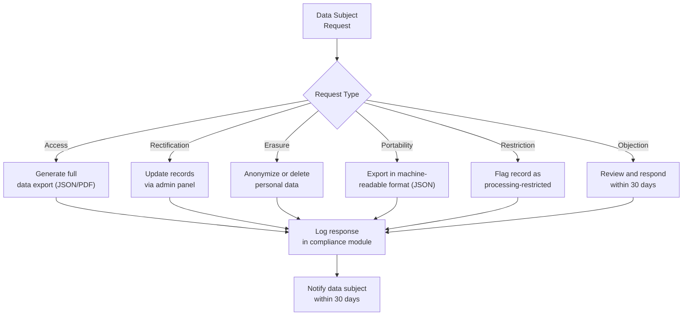
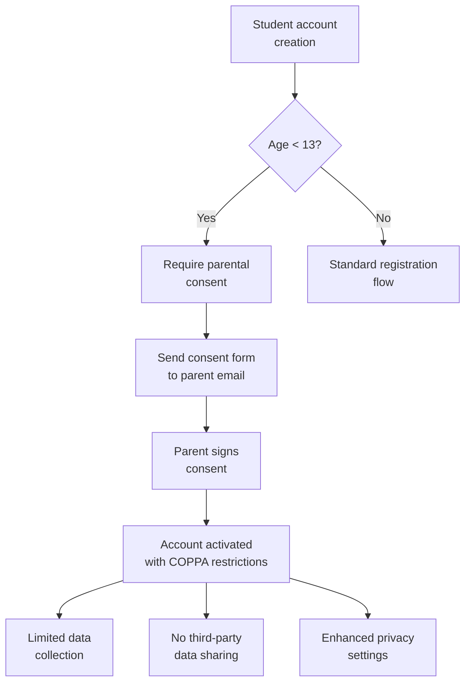
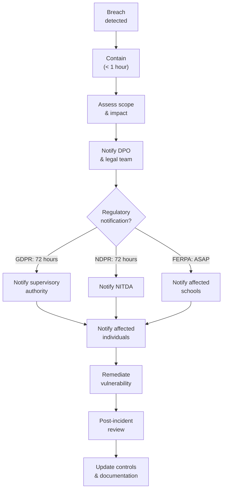

# ERP-School-Management -- Data Privacy & Compliance

**Product:** EduCore Pro
**Version:** 1.0.0
**Date:** 2026-02-23
**Classification:** Confidential

---

## 1. Regulatory Landscape



---

## 2. FERPA Compliance (Family Educational Rights and Privacy Act)

### 2.1 Applicability
FERPA applies to US educational institutions receiving federal funding. EduCore Pro supports FERPA compliance for all US-based schools.

### 2.2 Requirements and Implementation

| FERPA Requirement | EduCore Pro Implementation |
|---|---|---|
| **Directory Information Opt-Out** | Schools can configure which fields are directory information. Parents can opt out via the parent portal. |
| **Access to Records** | Students 18+ and parents can view all education records through the portal. Audit logs track who accessed records. |
| **Amendment Requests** | Built-in request workflow for parents/students to challenge record accuracy. |
| **Consent for Disclosure** | Written consent required before sharing PII. Consent form management in admin panel. |
| **Legitimate Educational Interest** | Role-based access ensures only authorized personnel access student records. Access logged in audit_logs. |
| **Annual Notification** | Template for annual FERPA rights notification available in communication module. |

### 2.3 Data Classification

| Category | Fields | Access Level |
|---|---|---|
| Directory Information | Name, grade, enrollment status, school | Configurable per school |
| Education Records | Grades, GPA, transcripts, attendance | Authorized personnel only |
| Personally Identifiable | DOB, SSN, address, medical | Restricted access |
| Behavioral Records | Incidents, disciplinary actions | Strict need-to-know |

### 2.4 Technical Controls

- **RBAC**: Teachers see only their class data. Parents see only their children.
- **Audit Trail**: Every access to student records logged with user, timestamp, IP.
- **Data Minimization**: API responses exclude fields not needed for the user's role.
- **Encryption**: All PII encrypted at rest (AES-256) and in transit (TLS 1.3).

---

## 3. GDPR Compliance (General Data Protection Regulation)

### 3.1 Applicability
GDPR applies to processing personal data of EU residents. EduCore Pro implements GDPR compliance for schools operating within the EU or processing data of EU nationals.

### 3.2 Lawful Basis

| Processing Activity | Lawful Basis | Details |
|---|---|---|
| Student enrollment | Contractual necessity | Required to deliver educational services |
| Grade recording | Contractual necessity | Core educational function |
| Fee processing | Contractual necessity | Required for fee collection |
| Emergency contacts | Legitimate interest | Student safety |
| Marketing communications | Consent | Explicit opt-in required |
| Analytics & profiling | Legitimate interest | With impact assessment |

### 3.3 Data Subject Rights Implementation



### 3.4 Geo-Partitioning for Data Residency

EU student data is stored in EU-region partitions:

```sql
-- LMS data partitioned by region
@@id([region, id])  -- Composite PK with region first

-- Enum Region { US, EU, APAC, LATAM, MEA }
-- EU data physically stored in EU datacenter
```

### 3.5 Data Processing Records (Article 30)

| Processing Activity | Data Categories | Data Subjects | Retention | Transfer |
|---|---|---|---|---|
| Student enrollment | Name, DOB, contact | Students | Duration of enrollment + 7 years | Within region |
| Academic records | Grades, attendance | Students | Duration + 7 years | Within region |
| Financial records | Payment details | Parents/Guardians | Duration + 7 years | Within region + payment processor |
| Communication logs | Messages, emails | All users | 3 years | Within region |

---

## 4. COPPA Compliance (Children's Online Privacy Protection Act)

### 4.1 Applicability
COPPA applies to collecting personal information from children under 13 in the US. EduCore Pro implements protections for all student accounts where the student is under 13.

### 4.2 Implementation

| COPPA Requirement | Implementation |
|---|---|
| **Verifiable Parental Consent** | Students under 13 cannot self-register. Account creation requires parent/guardian verification. |
| **Parental Access** | Parents can review all data collected about their child through the parent portal. |
| **Parental Deletion** | Parents can request deletion of their child's personal information. |
| **Minimum Collection** | Only educationally necessary data collected. Optional fields clearly marked. |
| **Data Security** | All measures described in Security section apply. |
| **Privacy Policy** | COPPA-specific privacy notice available on registration pages. |

### 4.3 Age-Based Controls



---

## 5. NDPR Compliance (Nigeria Data Protection Regulation)

### 5.1 Applicability
NDPR applies to processing personal data of Nigerian data subjects. As EduCore Pro is primarily designed for Nigerian schools, full NDPR compliance is implemented.

### 5.2 Requirements and Implementation

| NDPR Requirement | Implementation |
|---|---|
| **Lawful Processing** | Processing based on consent, contract, or legitimate interest |
| **Purpose Limitation** | Data collected only for specified educational purposes |
| **Data Minimization** | Only necessary fields are required |
| **Accuracy** | Self-service profile updates for parents/guardians |
| **Storage Limitation** | Configurable retention policies per data category |
| **Confidentiality** | Encryption at rest and in transit |
| **Data Protection Officer** | DPO contact configurable per school |
| **Data Protection Impact Assessment** | DPIA template available for schools |
| **Cross-Border Transfer** | Data stored in Nigerian/African region by default |
| **72-hour Breach Notification** | Automated breach detection and notification workflow |

### 5.3 Consent Management

```json
{
  "consent_record": {
    "data_subject_id": "uuid",
    "purpose": "educational_services",
    "consent_date": "2026-02-23T10:00:00Z",
    "consent_method": "electronic_signature",
    "ip_address": "hash",
    "is_active": true,
    "withdrawal_date": null
  }
}
```

---

## 6. Cross-Regulation Data Handling Matrix

| Data Element | FERPA | GDPR | COPPA | NDPR |
|---|---|---|---|---|
| Student Name | Directory info (opt-out) | Personal data | Parental consent if < 13 | Personal data |
| Date of Birth | PII | Personal data | Parental consent if < 13 | Sensitive data |
| Grades | Education record | Personal data | Parental consent if < 13 | Personal data |
| Medical Info | PII (restricted) | Special category | Parental consent | Sensitive data |
| Payment Data | N/A | Personal data | N/A | Personal data |
| Photos | Directory info | Personal data (biometric if facial) | Parental consent if < 13 | Personal data |
| IP Address | N/A | Personal data | N/A | Personal data |
| Location (GPS) | N/A | Personal data | Not collected for < 13 | Personal data |

---

## 7. Data Retention Policy

| Data Category | Active Retention | Post-Enrollment | Deletion Method |
|---|---|---|---|
| Student profiles | Duration of enrollment | 7 years | Anonymization |
| Academic records | Duration of enrollment | 7 years | Archive then anonymize |
| Financial records | Duration of enrollment | 7 years (tax compliance) | Anonymization |
| Communication logs | 3 years | Deleted | Hard delete |
| Audit logs | 3 years | Deleted | Hard delete |
| Session data | 30 days | Deleted | Hard delete |
| Biometric data | Duration of enrollment | Immediately deleted | Secure erase |
| IPFS certificates | Permanent | Permanent | Revocation (not deletion) |

---

## 8. Privacy by Design Principles

1. **Proactive not Reactive**: Privacy controls built into architecture, not bolted on
2. **Privacy as Default**: Maximum privacy settings enabled by default
3. **Privacy Embedded**: Data protection integrated into every service
4. **Positive-Sum**: Full functionality maintained with full privacy
5. **End-to-End Security**: Data protected throughout its lifecycle
6. **Visibility and Transparency**: Clear privacy policies and audit trails
7. **User-Centric**: Users control their own data through self-service portals

---

## 9. Incident Response for Data Breaches



---

## 10. Compliance Audit Support

### 10.1 Available Reports
- User access audit report (who accessed what, when)
- Data processing activities register
- Consent management report
- Data retention compliance report
- Cross-border transfer log
- Incident response log

### 10.2 Automated Compliance Checks
- Daily: Expired consent review
- Weekly: Data retention policy enforcement
- Monthly: Access pattern anomaly detection
- Quarterly: DPIA review trigger
- Annually: Full compliance audit preparation
