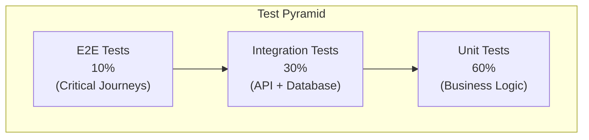
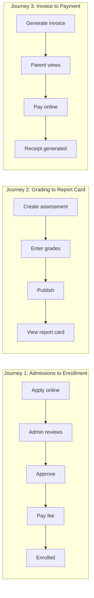
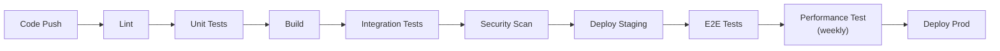

# ERP-School-Management -- Test Strategy

**Product:** EduCore Pro
**Version:** 1.0.0
**Date:** 2026-02-23

---

## 1. Test Strategy Overview



---

## 2. Test Levels

### 2.1 Unit Tests

**Scope:** Individual functions, methods, and classes in isolation
**Framework:** Jest (TypeScript), Go testing (Go), Rust test (Rust), pytest (Python)
**Coverage Target:** 80% minimum for services, 90% for shared packages

**What to unit test:**
- Business logic in service classes
- DTO validation rules
- Grade calculation algorithms
- Fee computation logic
- Data transformation functions
- Guard and interceptor logic
- Utility functions

**Example:**

```typescript
describe('GradingService', () => {
  describe('calculateTermGrade', () => {
    it('should calculate weighted average correctly', () => {
      const grades = [
        { score: 85, maxScore: 100, weight: 0.3 },
        { score: 72, maxScore: 100, weight: 0.3 },
        { score: 90, maxScore: 100, weight: 0.4 },
      ];
      const result = gradingService.calculateWeightedAverage(grades);
      expect(result).toBeCloseTo(83.1, 1);
    });

    it('should map percentage to correct grade level', () => {
      const grade = gradingService.resolveGrade(75, waecGradingScale);
      expect(grade.grade).toBe('B2');
      expect(grade.gpaValue).toBeCloseTo(3.5, 1);
    });

    it('should handle excused assessments', () => {
      const grades = [
        { score: 85, maxScore: 100, weight: 0.5, isExcused: false },
        { score: null, maxScore: 100, weight: 0.5, isExcused: true },
      ];
      const result = gradingService.calculateWeightedAverage(grades);
      expect(result).toBeCloseTo(85, 0);
    });
  });
});
```

### 2.2 Integration Tests

**Scope:** Service endpoints with real database and external dependencies
**Framework:** Jest + Supertest (NestJS), Go httptest, Rust actix-web test
**Coverage:** All API endpoints, database operations, event publishing

**What to integration test:**
- REST API request/response contracts
- Database CRUD operations via Prisma
- Authentication and authorization flows
- Webhook processing
- Event publishing to Redpanda
- Multi-tenant data isolation

**Example:**

```typescript
describe('Student API', () => {
  let app: INestApplication;
  let prisma: PrismaClient;

  beforeAll(async () => {
    const module = await Test.createTestingModule({
      imports: [AppModule],
    }).compile();
    app = module.createNestApplication();
    await app.init();
    prisma = module.get(PrismaClient);
  });

  it('POST /v1/students should create a student', async () => {
    const response = await request(app.getHttpServer())
      .post('/v1/students')
      .set('Authorization', `Bearer ${adminToken}`)
      .set('X-Tenant-ID', testSchoolId)
      .send({
        firstName: 'Test',
        lastName: 'Student',
        dateOfBirth: '2010-01-15',
        gradeLevel: 'Grade 6',
      })
      .expect(201);

    expect(response.body.data.enrollmentNumber).toBeDefined();
    expect(response.body.data.status).toBe('ACTIVE');
  });

  it('should enforce tenant isolation', async () => {
    await request(app.getHttpServer())
      .get(`/v1/students/${otherTenantStudentId}`)
      .set('Authorization', `Bearer ${adminToken}`)
      .set('X-Tenant-ID', testSchoolId)
      .expect(404);
  });
});
```

### 2.3 E2E Tests

**Scope:** Complete user journeys across multiple services
**Framework:** Playwright (web), Cypress, or custom test runner
**Coverage:** Critical business flows

**Critical E2E Journeys:**



---

## 3. Test Data Strategy

### 3.1 Test Data Generation

| Entity | Strategy | Tool |
|---|---|---|
| Schools | Fixed seed data | Migration SQL |
| Users | Factory pattern | Test fixtures |
| Students | Faker-generated | @faker-js/faker |
| Grades | Parametric | Custom generator |
| Payments | Gateway sandbox | Stripe/Paystack test mode |

### 3.2 Test Database

- Each test run uses an isolated database schema
- Prisma migrations applied before test suite
- Database cleaned between test groups (truncate)
- Seeded with minimal reference data (schools, academic years)

---

## 4. Test Environments

| Environment | Purpose | Data | Infrastructure |
|---|---|---|---|
| Unit test | Isolated logic testing | Mocked | None |
| Integration test | API + DB testing | Test database | Docker Compose |
| Staging | Full system testing | Synthetic data | Kubernetes |
| Production | Smoke tests only | Real data (read-only) | Production cluster |

---

## 5. Performance Testing

### 5.1 Load Test Scenarios

| Scenario | Virtual Users | Duration | Target |
|---|---|---|---|
| Normal load | 500 concurrent | 30 minutes | p95 < 200ms |
| Peak load (term start) | 2,000 concurrent | 15 minutes | p95 < 500ms |
| Spike (report card release) | 5,000 concurrent | 5 minutes | p95 < 1s |
| Endurance | 500 concurrent | 4 hours | No memory leak |

### 5.2 Performance Test Focus Areas

- Student search with trigram fuzzy matching
- Grade entry with concurrent teachers
- Fee payment webhook processing
- Report generation (PDF export)
- Attendance marking during morning rush
- Dashboard loading (aggregated metrics)

---

## 6. Security Testing

### 6.1 OWASP Top 10 Coverage

| Category | Test Method | Frequency |
|---|---|---|
| Injection (SQL, XSS) | Automated scanner + manual | Per release |
| Broken Authentication | JWT manipulation, session tests | Per release |
| Sensitive Data Exposure | Response inspection, TLS verification | Per release |
| XML External Entities | Not applicable (JSON-only) | N/A |
| Broken Access Control | Role-based endpoint testing | Per release |
| Security Misconfiguration | Header inspection, CORS testing | Per release |
| Cross-Site Scripting | Input sanitization testing | Per release |
| Insecure Deserialization | Payload fuzzing | Quarterly |
| Known Vulnerabilities | Dependency scanning (npm audit, Snyk) | Daily |
| Insufficient Logging | Audit log verification | Per release |

### 6.2 Tenant Isolation Testing

Critical test: Verify that User A in School X cannot access data from School Y.

```typescript
describe('Tenant Isolation', () => {
  it('should prevent cross-tenant student access', async () => {
    // User from School A tries to access School B student
    const response = await request(app.getHttpServer())
      .get(`/v1/students/${schoolBStudentId}`)
      .set('Authorization', `Bearer ${schoolAAdminToken}`)
      .set('X-Tenant-ID', schoolAId)
      .expect(404);
  });

  it('should prevent cross-tenant grade modification', async () => {
    await request(app.getHttpServer())
      .post('/v1/academic/grades')
      .set('Authorization', `Bearer ${schoolATeacherToken}`)
      .set('X-Tenant-ID', schoolAId)
      .send({
        studentId: schoolBStudentId,
        assessmentId: schoolBAssessmentId,
        score: 100,
      })
      .expect(404);
  });
});
```

---

## 7. Accessibility Testing

| Standard | Level | Tool | Frequency |
|---|---|---|---|
| WCAG 2.1 | AA | axe-core, Lighthouse | Per release |
| Section 508 | Compliance | Manual + automated | Quarterly |
| Screen reader | Compatibility | NVDA, VoiceOver | Quarterly |
| Keyboard navigation | Full | Manual | Per release |
| Color contrast | 4.5:1 ratio | Lighthouse | Per release |

---

## 8. Test Automation Pipeline



### CI Integration

| Stage | Tool | Timeout | Failure Action |
|---|---|---|---|
| Lint | ESLint, Prettier | 5 minutes | Block merge |
| Unit tests | Jest | 10 minutes | Block merge |
| Integration tests | Jest + Docker | 15 minutes | Block merge |
| Security scan | npm audit, Snyk | 5 minutes | Warn (critical = block) |
| E2E tests | Playwright | 20 minutes | Block deploy |
| Performance tests | k6 | 30 minutes | Warn (weekly) |

---

## 9. Test Reporting

### 9.1 Metrics Tracked

| Metric | Target | Current |
|---|---|---|
| Unit test coverage | 80% | Measuring |
| Integration test coverage | All endpoints | Measuring |
| E2E pass rate | 99% | Measuring |
| Test execution time | < 15 minutes | Measuring |
| Flaky test rate | < 1% | Measuring |
| Bug escape rate | < 5% | Measuring |

### 9.2 Test Reports

- **JUnit XML**: Generated by all test frameworks for CI integration
- **Coverage HTML**: Generated by Istanbul/c8 for coverage visualization
- **Performance HTML**: Generated by k6 for load test results
- **Security PDF**: Generated by Snyk for vulnerability reports
