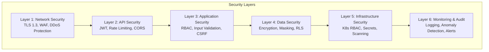
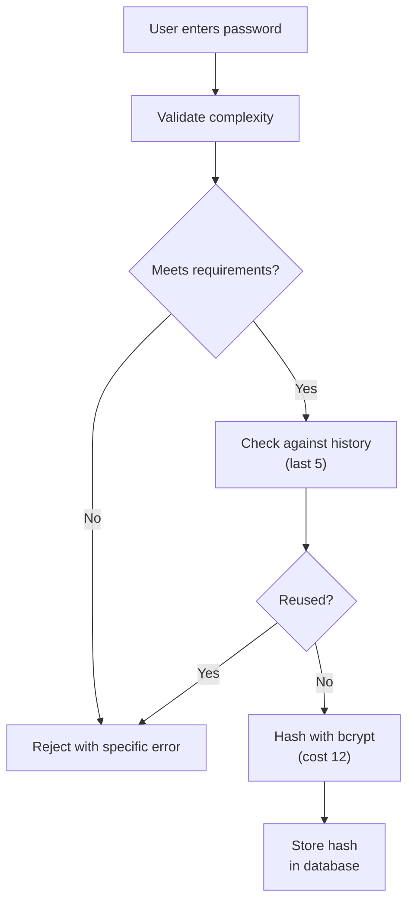
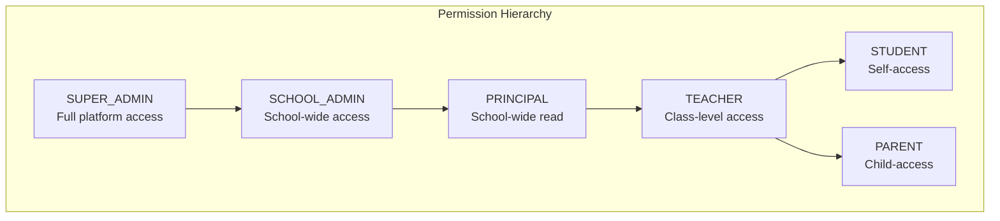

# ERP-School-Management -- Security Documentation

**Product:** EduCore Pro
**Version:** 1.0.0
**Date:** 2026-02-23
**Classification:** Confidential

---

## 1. Security Architecture Overview



---

## 2. Authentication Security

### 2.1 Authentication Methods

| Method | Implementation | Security Level |
|---|---|---|
| Email/Password | bcrypt (cost factor 12) | Standard |
| MFA (TOTP) | HMAC-SHA1, 6-digit, 30-second window | Enhanced |
| OAuth2 (Social) | Google, Microsoft, Facebook | Standard |
| Biometric | Fingerprint, Facial Recognition | Enhanced |
| API Key | HMAC-SHA256 signed requests | Standard |

### 2.2 Password Security



**Password Policy:**
- Minimum 8 characters
- Must include: uppercase, lowercase, digit, special character
- Cannot reuse last 5 passwords
- Expires every 90 days (configurable per school)
- Forced change on first login (configurable)

### 2.3 Session Security

| Control | Implementation |
|---|---|
| Token Type | JWT (RS256 or HS256) |
| Access Token TTL | 15 minutes |
| Refresh Token TTL | 7 days |
| Token Rotation | New refresh token on each use |
| Session Tracking | Device type, IP, user agent, geolocation |
| Concurrent Sessions | Configurable limit per user |
| Session Revocation | Immediate via database flag |
| Idle Timeout | 30 minutes (configurable) |

### 2.4 Account Lockout

| Event | Threshold | Action |
|---|---|---|
| Failed login attempts | 5 within 15 minutes | Lock for 30 minutes |
| Suspicious IP | AI-flagged | Require MFA verification |
| Password reset abuse | 3 requests in 1 hour | Cooldown period |
| Session anomaly | Device/location change | Re-authentication required |

---

## 3. Authorization Security

### 3.1 Role-Based Access Control (RBAC)



### 3.2 Resource-Level Authorization

| Resource | Owner | Read | Write | Delete |
|---|---|---|---|---|
| Student record | School | Admin, Teacher (own class), Parent (own child) | Admin | Admin |
| Grade | Teacher | Admin, Teacher, Student (own), Parent (own child) | Teacher (own class) | Admin |
| Invoice | School | Admin, Accountant, Parent (own) | Admin, Accountant | Admin |
| Message | Sender | Sender, Recipient | Sender | Sender |
| School config | Super Admin | Admin | Admin | Super Admin |

### 3.3 Tenant Isolation

- Every database query includes `school_id` filter
- Gateway injects `X-Tenant-ID` from JWT claims
- Services validate tenant context on every request
- Cross-tenant access is impossible at the application layer
- Database RLS policies provide defense-in-depth

---

## 4. API Security

### 4.1 Rate Limiting

| Endpoint Category | Limit | Window | Response |
|---|---|---|---|
| Authentication | 10 requests | 1 minute | 429 + Retry-After |
| API (Starter) | 60 requests | 1 minute | 429 + Retry-After |
| API (Professional) | 300 requests | 1 minute | 429 + Retry-After |
| API (Enterprise) | 1,000 requests | 1 minute | 429 + Retry-After |
| Webhooks | 100 requests | 1 minute | 429 + Retry-After |

### 4.2 Input Validation

- All inputs validated using `class-validator` decorators
- SQL injection prevented by Prisma parameterized queries
- XSS prevented by output encoding and Content-Security-Policy headers
- File upload validation: MIME type checking, size limits, malware scanning
- JSON schema validation for JSONB fields

### 4.3 Security Headers

```
Strict-Transport-Security: max-age=31536000; includeSubDomains
Content-Security-Policy: default-src 'self'; script-src 'self'
X-Content-Type-Options: nosniff
X-Frame-Options: DENY
X-XSS-Protection: 1; mode=block
Referrer-Policy: strict-origin-when-cross-origin
Permissions-Policy: camera=(), microphone=(), geolocation=(self)
```

---

## 5. Data Security

### 5.1 Encryption

| Data State | Algorithm | Key Management |
|---|---|---|
| At Rest (database) | AES-256-GCM | AWS KMS / HashiCorp Vault |
| In Transit | TLS 1.3 | Automated certificate management |
| Backups | AES-256 | Separate backup key |
| Password Hashes | bcrypt (cost 12) | N/A (one-way) |
| TOTP Secrets | AES-256-CBC | Application-level encryption |
| PII Fields | Application-level AES | Per-tenant key |

### 5.2 Data Masking

| Field | Masking Rule | Example |
|---|---|---|
| Email | Show first 2 chars + domain | `am***@school.com` |
| Phone | Show last 4 digits | `****5678` |
| SSN/ID | Fully masked in logs | `****` |
| Credit Card | Last 4 digits only | `**** **** **** 1234` |
| IP Address | Hashed in analytics | `sha256(ip)` |

---

## 6. Infrastructure Security

### 6.1 Container Security

- Base images: Official Node.js Alpine, Distroless for production
- No root user in containers
- Read-only filesystem where possible
- Resource limits (CPU, memory) enforced
- Image scanning with Trivy/Snyk
- Private container registry

### 6.2 Kubernetes Security

| Control | Implementation |
|---|---|
| RBAC | Service accounts with minimal permissions |
| Network Policies | Inter-service communication restricted |
| Pod Security Standards | Restricted profile |
| Secrets Management | Encrypted etcd, external secrets operator |
| Admission Controllers | OPA Gatekeeper for policy enforcement |

### 6.3 Database Security

- Encrypted connections (SSL required)
- Separate read/write credentials
- Principle of least privilege for service accounts
- Automated credential rotation
- Audit logging of all DDL operations

---

## 7. Audit & Monitoring

### 7.1 Audit Log Schema

```json
{
  "id": "uuid",
  "school_id": "uuid",
  "user_id": "uuid",
  "action": "UPDATE",
  "entity_type": "students",
  "entity_id": "uuid",
  "old_values": { "grade_level": 5 },
  "new_values": { "grade_level": 6 },
  "ip_address": "192.168.1.100",
  "user_agent": "Mozilla/5.0...",
  "created_at": "2026-02-23T10:30:00Z"
}
```

### 7.2 Security Monitoring

| Event | Detection | Alert Level |
|---|---|---|
| Brute force login | > 5 failed attempts | Warning |
| Privilege escalation attempt | Unauthorized role change | Critical |
| Cross-tenant access attempt | Tenant mismatch in request | Critical |
| Unusual data export | Large query results | Warning |
| Admin action outside hours | Time-based anomaly | Info |
| New OAuth application | Third-party integration | Info |

### 7.3 SIEM Integration

All security events forwarded to SIEM via OpenTelemetry:
- Authentication events (login, logout, MFA)
- Authorization failures (403 responses)
- Data access patterns (unusual query volumes)
- System changes (configuration updates)
- Infrastructure events (pod restarts, scaling)

---

## 8. Vulnerability Management

### 8.1 Dependency Scanning

```bash
# Daily automated scans
npm audit --production
npx snyk test

# Go dependencies
go list -m -json all | nancy sleuth

# Rust dependencies
cargo audit

# Python dependencies
pip-audit
```

### 8.2 Vulnerability Response SLA

| Severity | Response Time | Patch Time |
|---|---|---|
| Critical (CVSS 9.0+) | 4 hours | 24 hours |
| High (CVSS 7.0-8.9) | 24 hours | 7 days |
| Medium (CVSS 4.0-6.9) | 7 days | 30 days |
| Low (CVSS 0.1-3.9) | 30 days | Next release |

---

## 9. Incident Response

### 9.1 Security Incident Classification

| Level | Description | Example | Response |
|---|---|---|---|
| SEV-1 | Data breach, system compromise | Unauthorized data access | Immediate containment + notification |
| SEV-2 | Service exploitation, DDoS | API abuse, resource exhaustion | 1 hour response |
| SEV-3 | Vulnerability discovered | Unpatched dependency | 24 hour assessment |
| SEV-4 | Security configuration issue | Misconfigured CORS | Next sprint |

### 9.2 Reporting Security Issues

**Email:** security@educorepro.com
**PGP Key:** Available upon request
**Bug Bounty:** Contact security team for responsible disclosure program details

---

## 10. Compliance Certifications (Target)

| Certification | Status | Target Date |
|---|---|---|
| SOC 2 Type II | In progress | Q3 2026 |
| ISO 27001 | Planned | Q4 2026 |
| PCI DSS (if storing cards) | Not applicable (tokenization) | N/A |
| FERPA compliance attestation | In progress | Q2 2026 |
