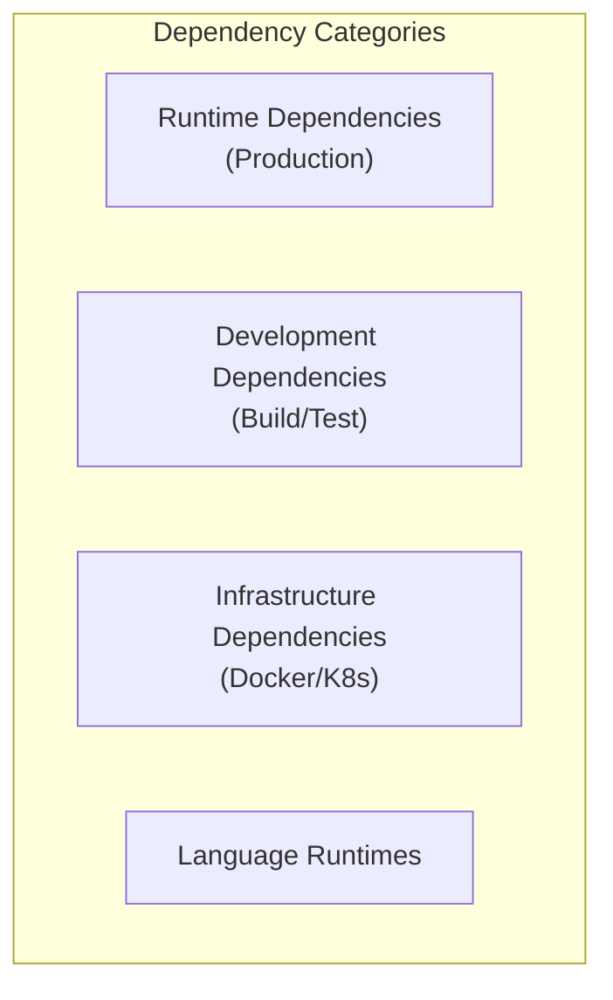
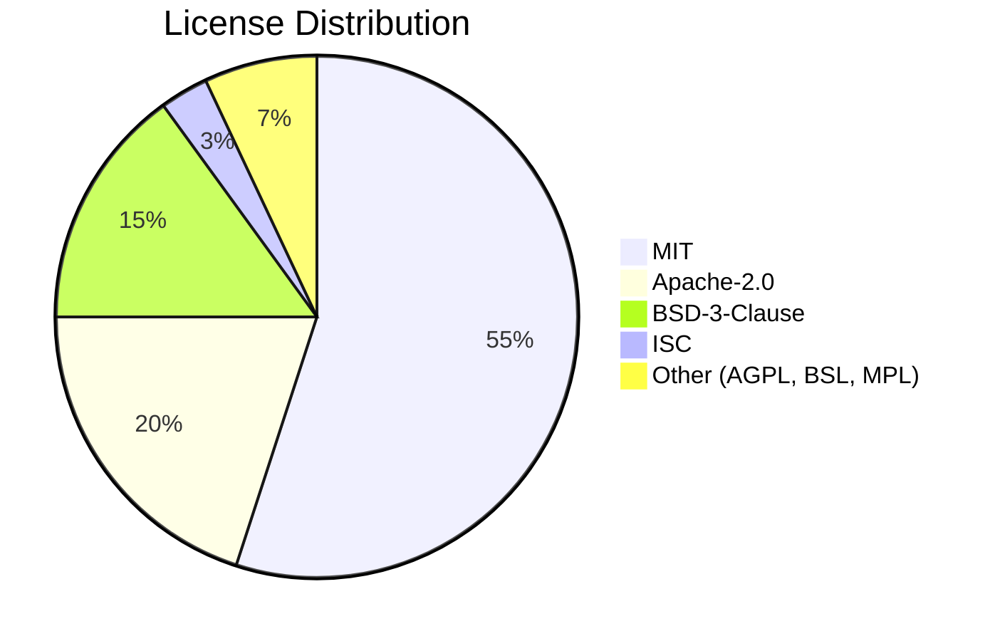

# ERP-School-Management -- Dependency Manifest

**Product:** EduCore Pro
**Version:** 1.0.0
**Date:** 2026-02-23

---

## 1. Overview

This document catalogs all runtime and development dependencies across the EduCore Pro monorepo, including version constraints, license types, and security considerations.

---

## 2. Language Runtimes

| Runtime | Version | Usage | License |
|---|---|---|---|
| Node.js | >= 20.0.0 | NestJS services, Next.js web app | MIT |
| npm | >= 9.0.0 | Package management | Artistic-2.0 |
| Go | >= 1.22 | scholarship-service | BSD-3-Clause |
| Rust | >= 1.75 | placement-service, research-service | MIT/Apache-2.0 |
| Python | >= 3.11 | ai-service | PSF License |
| TypeScript | >= 5.3.3 | Type-safe development | Apache-2.0 |

---

## 3. Root Monorepo Dependencies

### 3.1 Development Dependencies (package.json root)

| Package | Version | Purpose | License |
|---|---|---|---|
| @types/node | ^20.10.0 | Node.js type definitions | MIT |
| @typescript-eslint/eslint-plugin | ^6.14.0 | TypeScript ESLint rules | MIT |
| @typescript-eslint/parser | ^6.14.0 | TypeScript ESLint parser | BSD-2-Clause |
| eslint | ^8.55.0 | JavaScript/TypeScript linter | MIT |
| eslint-config-prettier | ^9.1.0 | Prettier ESLint integration | MIT |
| eslint-plugin-import | ^2.29.0 | Import order linting | MIT |
| prettier | ^3.1.1 | Code formatter | MIT |
| turbo | ^1.11.2 | Monorepo build orchestrator | MPL-2.0 |
| typescript | ^5.3.3 | TypeScript compiler | Apache-2.0 |

---

## 4. Gateway Dependencies

### 4.1 Runtime Dependencies

| Package | Version | Purpose | License |
|---|---|---|---|
| @nestjs/common | ^10.4.6 | NestJS common utilities | MIT |
| @nestjs/core | ^10.4.6 | NestJS core framework | MIT |
| @nestjs/platform-express | ^10.4.6 | Express HTTP adapter | MIT |
| reflect-metadata | ^0.2.2 | Decorator metadata API | Apache-2.0 |
| rxjs | ^7.8.1 | Reactive Extensions | Apache-2.0 |

### 4.2 Development Dependencies

| Package | Version | Purpose | License |
|---|---|---|---|
| @types/node | ^22.10.1 | Node.js type definitions | MIT |
| ts-node | ^10.9.2 | TypeScript execution | MIT |
| typescript | ^5.7.2 | TypeScript compiler | Apache-2.0 |

---

## 5. NestJS Service Dependencies (Common)

These dependencies are shared across all NestJS-based microservices:

### 5.1 Core Framework

| Package | Version | Purpose | License |
|---|---|---|---|
| @nestjs/common | ^10.x | NestJS decorators, pipes, guards | MIT |
| @nestjs/core | ^10.x | NestJS core module system | MIT |
| @nestjs/platform-express | ^10.x | Express HTTP platform | MIT |
| @nestjs/config | ^3.x | Configuration management | MIT |
| @nestjs/swagger | ^7.x | OpenAPI/Swagger documentation | MIT |
| reflect-metadata | ^0.2.x | TypeScript decorator support | Apache-2.0 |
| rxjs | ^7.8.x | Reactive programming | Apache-2.0 |

### 5.2 Database

| Package | Version | Purpose | License |
|---|---|---|---|
| @prisma/client | ^5.x | Prisma ORM runtime client | Apache-2.0 |
| prisma | ^5.x | Prisma CLI and migration tools | Apache-2.0 |

### 5.3 Authentication & Security

| Package | Version | Purpose | License |
|---|---|---|---|
| @nestjs/jwt | ^10.x | JWT generation and verification | MIT |
| @nestjs/passport | ^10.x | Passport.js integration | MIT |
| passport | ^0.7.x | Authentication middleware | MIT |
| passport-jwt | ^4.x | JWT passport strategy | MIT |
| bcrypt | ^5.x | Password hashing | MIT |
| otplib | ^12.x | TOTP/HOTP generation | MIT |

### 5.4 Validation

| Package | Version | Purpose | License |
|---|---|---|---|
| class-validator | ^0.14.x | DTO validation decorators | MIT |
| class-transformer | ^0.5.x | Plain-to-class transformation | MIT |

### 5.5 Event Streaming

| Package | Version | Purpose | License |
|---|---|---|---|
| kafkajs | ^2.x | Kafka/Redpanda client | MIT |
| @nestjs/microservices | ^10.x | Microservice patterns | MIT |

### 5.6 Observability

| Package | Version | Purpose | License |
|---|---|---|---|
| @opentelemetry/api | ^1.x | OTel API | Apache-2.0 |
| @opentelemetry/sdk-node | ^0.x | OTel Node.js SDK | Apache-2.0 |
| @opentelemetry/auto-instrumentations-node | ^0.x | Auto-instrumentation | Apache-2.0 |
| winston | ^3.x | Structured logging | MIT |

---

## 6. Frontend Dependencies

### 6.1 Next.js Web Application

| Package | Version | Purpose | License |
|---|---|---|---|
| next | ^14.x | React framework with SSR | MIT |
| react | ^18.x | UI library | MIT |
| react-dom | ^18.x | React DOM rendering | MIT |
| tailwindcss | ^3.x | Utility-first CSS | MIT |
| @radix-ui/* | ^1.x | Accessible UI primitives | MIT |
| zustand | ^4.x | State management | MIT |
| swr | ^2.x | Data fetching/caching | MIT |
| lucide-react | ^0.x | Icon library | ISC |
| recharts | ^2.x | Chart library | MIT |

### 6.2 Flutter Mobile Applications

| Package | Version | Purpose | License |
|---|---|---|---|
| flutter | 3.x | Cross-platform UI framework | BSD-3-Clause |
| dio | ^5.x | HTTP client | MIT |
| flutter_bloc | ^8.x | State management | MIT |
| go_router | ^13.x | Navigation/routing | BSD-3-Clause |
| flutter_secure_storage | ^9.x | Secure token storage | BSD-3-Clause |
| google_maps_flutter | ^2.x | Bus tracking maps | BSD-3-Clause |
| firebase_messaging | ^14.x | Push notifications | BSD-3-Clause |
| local_auth | ^2.x | Biometric authentication | BSD-3-Clause |

---

## 7. Infrastructure Dependencies

### 7.1 Docker Images

| Image | Version | Purpose | License |
|---|---|---|---|
| node | 20-alpine | NestJS service base image | MIT |
| postgres | 16 | LumaDB database | PostgreSQL License |
| redpandadata/redpanda | v24.2.8 | Event streaming | BSL 1.1 |
| apache/superset | latest | Business intelligence | Apache-2.0 |
| grafana/grafana | 11.1.0 | Monitoring dashboards | AGPL-3.0 |
| otel/opentelemetry-collector-contrib | 0.108.0 | Telemetry collection | Apache-2.0 |

### 7.2 Kubernetes Tools

| Tool | Version | Purpose | License |
|---|---|---|---|
| kubectl | >= 1.28 | Cluster management | Apache-2.0 |
| helm | >= 3.x | Package management | Apache-2.0 |
| cert-manager | >= 1.x | TLS certificate management | Apache-2.0 |
| ingress-nginx | >= 1.x | Ingress controller | Apache-2.0 |

---

## 8. Go Module Dependencies (scholarship-service)

| Module | Purpose | License |
|---|---|---|
| (Module: erp/erp_school_management, Go 1.22) | Root module | MIT |

Additional Go dependencies will be added as the service is fully implemented:
- github.com/gin-gonic/gin (HTTP framework, MIT)
- github.com/jackc/pgx/v5 (PostgreSQL driver, MIT)
- github.com/segmentio/kafka-go (Kafka client, MIT)
- go.opentelemetry.io/otel (OpenTelemetry, Apache-2.0)

---

## 9. Rust Crate Dependencies (placement-service, research-service)

| Crate | Purpose | License |
|---|---|---|
| actix-web | HTTP framework | MIT/Apache-2.0 |
| sqlx | Async SQL driver | MIT/Apache-2.0 |
| tokio | Async runtime | MIT |
| serde | Serialization | MIT/Apache-2.0 |
| rdkafka | Kafka client | MIT |
| opentelemetry | Observability | Apache-2.0 |
| uuid | UUID generation | MIT/Apache-2.0 |

---

## 10. Python Dependencies (ai-service)

| Package | Purpose | License |
|---|---|---|
| fastapi | HTTP framework | MIT |
| uvicorn | ASGI server | BSD-3-Clause |
| scikit-learn | ML algorithms | BSD-3-Clause |
| pandas | Data manipulation | BSD-3-Clause |
| numpy | Numerical computing | BSD-3-Clause |
| sqlalchemy | Database ORM | MIT |
| psycopg2-binary | PostgreSQL driver | LGPL |
| opentelemetry-api | Observability | Apache-2.0 |

---

## 11. License Summary

| License | Count | Commercial Use | Copyleft |
|---|---|---|---|
| MIT | ~55% | Yes | No |
| Apache-2.0 | ~20% | Yes | No |
| BSD-3-Clause | ~15% | Yes | No |
| ISC | ~3% | Yes | No |
| AGPL-3.0 | 1 (Grafana) | Yes (with conditions) | Yes |
| BSL 1.1 | 1 (Redpanda) | Yes (with conditions) | Converts to Apache |
| MPL-2.0 | 1 (Turbo) | Yes | File-level |
| PostgreSQL | 1 | Yes | No |

### License Compliance Notes

1. **Grafana (AGPL-3.0)**: Used as a standalone monitoring tool, not embedded. AGPL obligations are met by keeping it as a separate service.
2. **Redpanda (BSL 1.1)**: Business Source License converts to Apache-2.0 after the change date. Used as infrastructure, not modified.
3. **Turborepo (MPL-2.0)**: Used as a build tool, no modifications to source code.

---

## 12. Security Advisory Tracking

### Automated Scanning Schedule

| Scan Type | Frequency | Tool | Output |
|---|---|---|---|
| npm audit | Daily CI | npm audit | JSON report |
| Snyk | Daily CI | Snyk CLI | Dashboard + PR comments |
| Docker scan | On build | Trivy | Build gate |
| Go vulnerability | Daily CI | govulncheck | Terminal report |
| Rust advisory | Daily CI | cargo audit | Terminal report |
| Python audit | Daily CI | pip-audit | Terminal report |
| SBOM generation | Per release | syft | CycloneDX JSON |

### Dependency Update Policy

- **Patch versions**: Auto-merged if tests pass (Dependabot/Renovate)
- **Minor versions**: Reviewed and merged weekly
- **Major versions**: Reviewed, tested in staging, merged per sprint
- **Security patches**: Applied within SLA (see Security doc)
