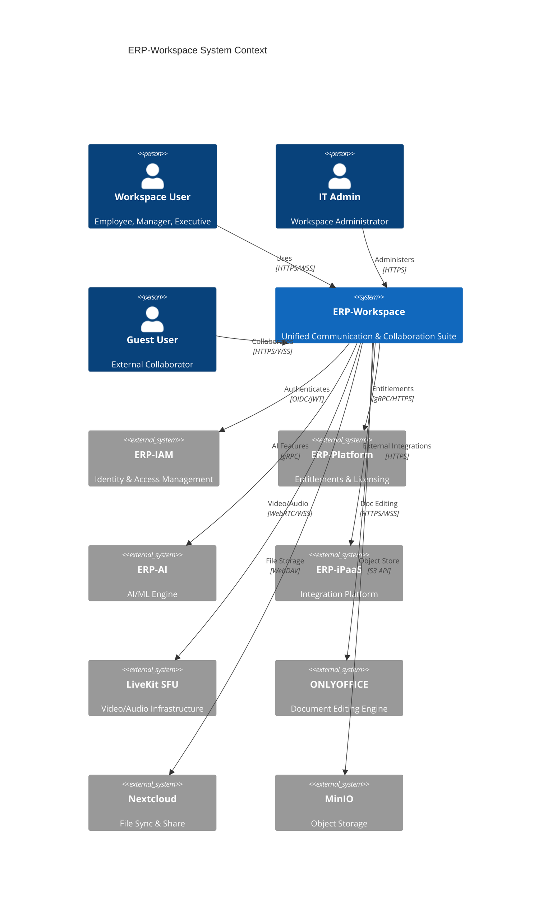

# ERP-Workspace Technical Writeup

> **Document ID:** ERP-WS-TW-001
> **Version:** 1.0.0
> **Last Updated:** 2026-02-23
> **Status:** Approved
> **Related Documents:** [04-Software-Architecture.md](./04-Software-Architecture.md), [12-High-Level-Design.md](./12-High-Level-Design.md), [14-Technical-Specifications.md](./14-Technical-Specifications.md)

---

## 1. Executive Summary

ERP-Workspace is the unified Communication and Collaboration Suite of the ERP product line. It consolidates five previously independent modules -- ERP-Email, ERP-Meet, ERP-Productivity, ERP-Drive, and legacy Email -- into a single, cohesive workspace platform benchmarked against Microsoft 365, Google Workspace, and Zoho Workplace. The module delivers enterprise-grade email (Rust SMTP/JMAP at 100K messages/second), video conferencing (LiveKit SFU supporting 1,000 participants), team chat (channels, DMs, threads), collaborative document editing (ONLYOFFICE real-time co-authoring), and cloud storage (Nextcloud + MinIO).

The system operates in `standalone_plus_suite` mode, meaning it can run independently with its own authentication or integrate with the broader ERP platform for entitlement management, SSO, and cross-module event-driven workflows. All AI-integrated features (smart compose, meeting summaries, email triage) enforce AIDD guardrails to ensure responsible automation.

The workspace is built on a polyglot architecture: Rust for the high-performance SMTP/JMAP mail server and delivery engine, Go for API gateway and service orchestration, Python (FastAPI) for AI-powered features and analytics, React + TypeScript for the web client, Flutter for mobile, and Electron for desktop. The data layer uses PostgreSQL (85+ tables across 11 DDD bounded contexts), Redis for caching, Redpanda/Kafka for event streaming, MinIO for object storage, Quickwit for full-text search, and ClickHouse for analytics.

---

## 2. System Purpose and Vision

### 2.1 Problem Statement

Organizations typically rely on fragmented communication tools: a separate email provider, a standalone video conferencing platform, an independent chat application, unrelated document editing software, and a disconnected cloud storage service. This fragmentation creates context switching overhead, data silos, compliance gaps, and inconsistent security postures. Enterprise suites like Microsoft 365 and Google Workspace address this but come with vendor lock-in, opaque data residency, limited customization, and per-user pricing that scales poorly for large organizations.

### 2.2 Solution

ERP-Workspace provides a fully integrated, self-hostable workspace suite:

- **Unified Inbox**: A single interface combining email, chat notifications, calendar alerts, and document activity into one prioritized stream.
- **Enterprise Email**: Rust-based SMTP/JMAP server delivering 100K messages/second throughput with conversation threading, labels/folders, rules/filters, signatures, delegation, shared mailboxes, distribution lists, DLP, archiving, eDiscovery, and S/MIME encryption.
- **Calendar**: Shared calendars with free/busy lookup, room/resource booking, recurring events with RRULE support, RSVP management, AI-powered scheduling assistant, timezone handling, CalDAV compatibility, and 250+ country holiday packs.
- **Video Meetings**: LiveKit SFU-based conferencing supporting up to 1,000 participants with screen sharing, recording, breakout rooms, AI live captions, virtual backgrounds, waiting room, polls, Q&A, whiteboard, AI meeting notes, webinar mode, and RTMP streaming.
- **Team Chat**: Channels (public/private), direct messages, threaded replies, @mentions, emoji reactions, file sharing, search, message pinning, guest access, retention policies, and compliance archiving.
- **Document Editing**: ONLYOFFICE-powered real-time collaborative editing for documents, spreadsheets, and presentations with Word/Excel/PowerPoint compatibility, version history, comments, co-authoring, templates, and offline editing.
- **Cloud Storage**: Nextcloud + MinIO backend providing upload/download, share with permissions, folder structure, version history, storage quotas, file preview, full-text search, and team drives.

### 2.3 Competitive Positioning

| Capability | ERP-Workspace | Microsoft 365 | Google Workspace | Zoho Workplace |
|-----------|--------------|--------------|-----------------|---------------|
| Self-hostable | Yes | No | No | No |
| Email throughput | 100K msg/sec | Undisclosed | Undisclosed | Undisclosed |
| Video participants | 1,000 | 1,000 (Teams Premium) | 500 | 250 |
| AI meeting notes | Included | Copilot ($30/user) | Gemini ($20/user) | Zia (paid add-on) |
| Open-source components | Rust mail, LiveKit, ONLYOFFICE, Nextcloud | Proprietary | Proprietary | Proprietary |
| DDD bounded contexts | 11 | N/A | N/A | N/A |
| Database tables | 85+ | N/A | N/A | N/A |
| CalDAV/CardDAV | Native | Via connector | Via connector | Via connector |
| eDiscovery | Built-in | E5 license only | Vault add-on | Enterprise only |
| Data residency | Customer-controlled | Region-limited | Region-limited | Region-limited |

### 2.4 AIDD Guardrails

All AI-integrated operations enforce strict guardrails:

| Guardrail | Configuration |
|-----------|--------------|
| Autonomous actions | Read-only queries, low-risk notifications |
| Supervised actions | Data mutations, workflow automation, bulk operations |
| Prohibited actions | Cross-tenant data access, irreversible delete without backup, privilege escalation |
| Human-in-the-loop | Required for high-risk operations |
| Decision logging | All AI decisions written to immutable audit stream |
| Rollback window | 24 hours |

---

## 3. Architecture Summary

### 3.1 Service Inventory

ERP-Workspace consists of seven core microservices, each deployed as an independent Go binary:

| Service | Port | Base Path | Responsibility |
|---------|------|-----------|----------------|
| email-service | 8080 | `/v1/email` | Email CRUD, JMAP proxy, delivery orchestration |
| calendar-service | 8080 | `/v1/calendar` | Calendar CRUD, event scheduling, room booking |
| meet-service | 8080 | `/v1/meet` | Video meeting lifecycle, recording management |
| chat-service | 8080 | `/v1/chat` | Channels, conversations, messages, reactions |
| docs-service | 8080 | `/v1/docs` | Document, spreadsheet, presentation management |
| drive-service | 8080 | `/v1/drive` | File storage, sharing, versioning |
| contacts-service | 8080 | `/v1/contacts` | Contact management, groups, directory |

### 3.2 External Integrations

### 3.3 Consolidation Heritage

ERP-Workspace was assembled from five previously independent repositories:

| Source Repository | Contribution | Import Type |
|------------------|-------------|-------------|
| ERP-Email | SMTP/JMAP server, email management, admin portal | Deep import (Rust/Python/React src) |
| Email/Email | Legacy email service, provider integrations | Deep import (Python/React src) |
| ERP-Meet | Video conferencing, LiveKit integration | Deep import (configs, web, docker) |
| ERP-Productivity | ONLYOFFICE integration, docs/sheets/slides | Deep import (services, docs, docker) |
| ERP-Drive | Nextcloud/MinIO storage, sharing policies | Deep import (docs, policies, docker) |

---

## 4. Technology Stack

### 4.1 Backend

| Technology | Version | Purpose |
|-----------|---------|---------|
| Rust | 1.75+ | SMTP/JMAP mail server, delivery engine |
| Go | 1.22+ | API gateway, service orchestration, CRUD services |
| Python | 3.11+ | FastAPI AI features, analytics, email service providers |
| FastAPI | 0.100+ | REST API framework for Python services |

### 4.2 Frontend

| Technology | Version | Purpose |
|-----------|---------|---------|
| React | 18 | Web application framework |
| TypeScript | 5+ | Type-safe frontend development |
| Flutter | 3.x | Mobile application (iOS/Android) |
| Electron | 28+ | Desktop application (Windows/macOS/Linux) |
| Tailwind CSS | 3.x | Utility-first CSS framework |

### 4.3 Data Layer

| Technology | Version | Purpose |
|-----------|---------|---------|
| PostgreSQL | 16 | Primary relational database (85+ tables) |
| Redis | 7 | Caching, sessions, rate limiting |
| Redpanda/Kafka | 24.x | Event streaming backbone |
| MinIO | Latest | S3-compatible object storage |
| ClickHouse | 24.x | Analytics OLAP engine |
| Quickwit | 0.8+ | Full-text search engine |

### 4.4 Infrastructure

| Technology | Version | Purpose |
|-----------|---------|---------|
| LiveKit | 1.5+ | WebRTC SFU for video/audio |
| ONLYOFFICE | 8.x | Document editing server |
| Nextcloud | 28+ | File sync and share platform |
| Docker | 25+ | Container runtime |
| Kubernetes | 1.29+ | Container orchestration |

---

## 5. Key Design Decisions

### 5.1 Rust for Mail Server

The email server uses Rust for SMTP and JMAP protocol handling to achieve 100K messages/second throughput. Rust provides memory safety without garbage collection pauses, making it ideal for high-throughput network services. The JMAP implementation enables modern email client experiences with efficient synchronization, conversation threading, and server-side search.

### 5.2 LiveKit SFU Architecture

Video meetings use LiveKit's Selective Forwarding Unit (SFU) architecture rather than a Multipoint Control Unit (MCU). SFU forwards media streams selectively, reducing server-side encoding costs while supporting up to 1,000 participants. This architecture enables adaptive bitrate, simulcast, and scalable video layers.

### 5.3 ONLYOFFICE for Document Editing

ONLYOFFICE was chosen over alternatives (Collabora, EtherPad) for its native Word/Excel/PowerPoint format compatibility, real-time co-authoring with operational transformation, and comprehensive API. It supports collaborative editing with up to 20 concurrent editors per document.

### 5.4 Nextcloud + MinIO for Storage

The storage layer uses Nextcloud for file sync, sharing, and WebDAV compatibility, backed by MinIO for S3-compatible object storage. This provides enterprise file management features (versioning, sharing, quotas) with horizontally scalable storage infrastructure.

### 5.5 Eleven DDD Bounded Contexts

The database schema is organized into 11 bounded contexts reflecting distinct business domains: Tenancy, Email Core, Contacts, Calendar, Tasks, Storage, Chat, Knowledge Base, Collaboration, AI/Search, and Privacy/Compliance. Each context has clear aggregate boundaries and is designed for eventual migration to independent databases.

### 5.6 CloudEvents Event Topology

All services publish events following the `erp.workspace.<entity>.<action>` convention with CloudEvents-compliant envelopes. The discovered event topology includes 35+ topics across email, calendar, chat, contacts, docs, drive, and meet domains.

---

## 6. Performance Characteristics

### 6.1 Latency Profile

| Operation | Target P50 | Target P99 |
|-----------|-----------|-----------|
| Health check (`/healthz`) | < 1ms | < 5ms |
| Email send (SMTP) | < 50ms | < 200ms |
| Email list (JMAP) | < 10ms | < 50ms |
| Calendar event create | < 15ms | < 75ms |
| Chat message send | < 5ms | < 20ms |
| Video join (signaling) | < 100ms | < 500ms |
| Document open | < 200ms | < 1s |
| File upload (1MB) | < 500ms | < 2s |
| Full-text search | < 50ms | < 200ms |

### 6.2 Throughput Targets

- **Email Server**: 100,000+ messages/second per cluster
- **Chat Service**: 50,000+ messages/second per instance
- **Calendar Service**: 10,000+ events/second per instance
- **Drive Service**: 5,000+ uploads/second per cluster
- **Meet Service**: 1,000 concurrent participants per SFU node

---

## 7. Scalability Approach

### 7.1 Horizontal Scaling

Every service is stateless and horizontally scalable via Kubernetes HPA:

- **Email Service**: Scale based on SMTP queue depth and JMAP connection count
- **Chat Service**: Scale based on WebSocket connection count
- **Meet Service**: Scale based on active participant count
- **Drive Service**: Scale based on upload/download throughput
- **Docs Service**: Scale based on active co-editing sessions

### 7.2 Database Scaling

- **PostgreSQL**: Read replicas for query-heavy workloads, connection pooling via PgBouncer, partitioning for email_messages and chat_messages by tenant_id + time
- **MinIO**: Erasure-coded distributed storage, add nodes for capacity
- **ClickHouse**: Distributed tables with sharding for analytics

---

## 8. Security Architecture

### 8.1 Email Security

- S/MIME encryption for end-to-end email protection
- SPF, DKIM, DMARC enforcement with health scoring
- DLP (Data Loss Prevention) with PII detection and auto-redaction
- Email archiving and eDiscovery for compliance

### 8.2 Communication Security

- TLS 1.3 for all inter-service and client-server communication
- DTLS/SRTP for WebRTC media streams
- End-to-end encryption option for chat messages
- JWT-based authentication via ERP-IAM OIDC

### 8.3 Data Protection

- Encryption at rest for PostgreSQL (AES-256) and MinIO (SSE-S3)
- Row-Level Security (RLS) for tenant isolation
- Privacy Guardian with PII detection across all content types
- GDPR/CCPA compliance controls with data export and right-to-erasure

---

## 9. Conclusion

ERP-Workspace represents a modern, self-hostable alternative to Microsoft 365 and Google Workspace, combining enterprise-grade communication tools with AI-powered productivity features. The polyglot architecture leverages each language's strengths -- Rust for high-throughput email, Go for service orchestration, Python for AI features -- while maintaining a cohesive developer experience. With 85+ database tables organized across 11 DDD bounded contexts, the system provides comprehensive workspace functionality with clear domain boundaries ready for independent scaling.

---

*For detailed architecture diagrams, see [04-Software-Architecture.md](./04-Software-Architecture.md). For API contracts, see [21-API-Documentation.md](./21-API-Documentation.md). For database schema details, see [10-Entity-Relationship-Diagram.md](./10-Entity-Relationship-Diagram.md).*
