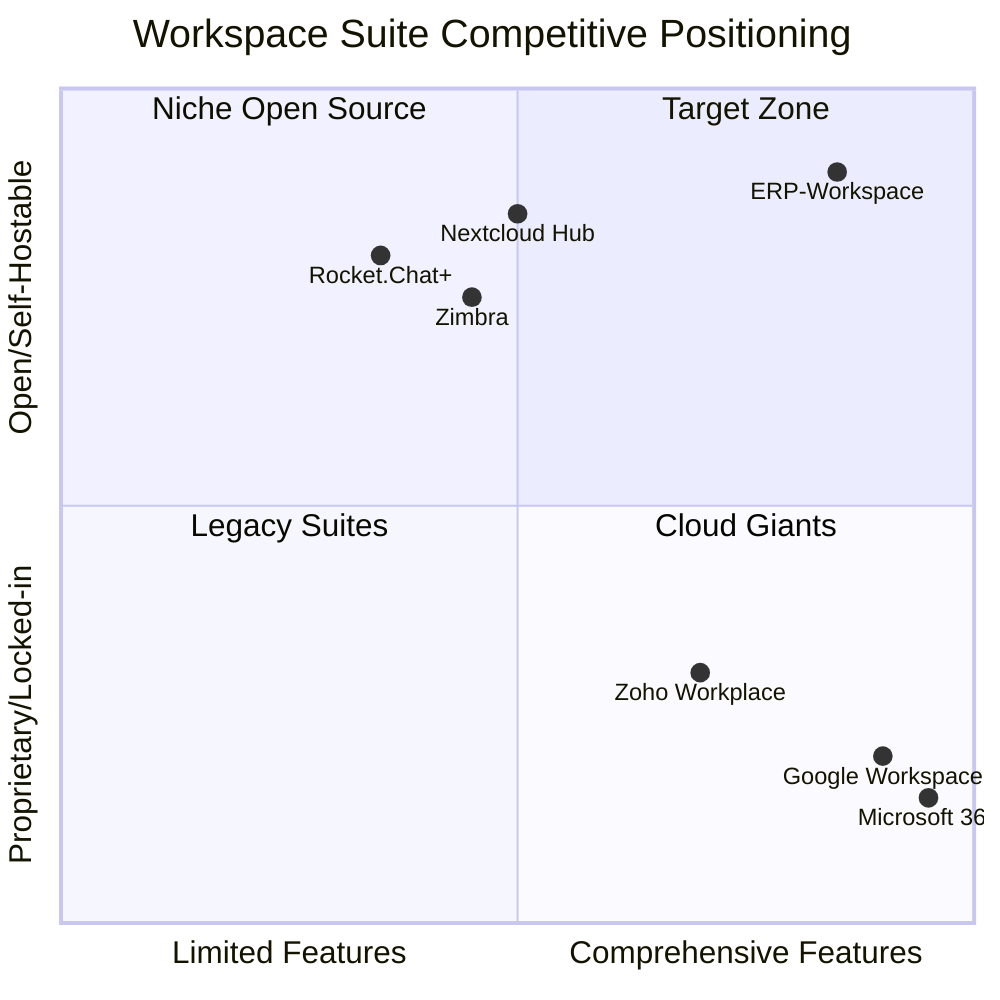

# ERP-Workspace Product Requirements Document (PRD)

> **Document ID:** ERP-WS-PRD-002
> **Version:** 1.0.0
> **Last Updated:** 2026-02-23
> **Status:** Approved
> **Stakeholders:** Product, Engineering, Design, Security, Compliance

---

## 1. Product Overview

### 1.1 Vision Statement

ERP-Workspace is the definitive self-hostable alternative to Microsoft 365 and Google Workspace, providing a fully integrated communication and collaboration suite that gives organizations complete control over their data, deployment, and customization while matching or exceeding the capabilities of proprietary cloud office suites.

### 1.2 Target Users

| Persona | Description | Primary Needs |
|---------|------------|---------------|
| Knowledge Worker | Employee who sends/receives 50+ emails/day, attends 5+ meetings/week | Fast email, calendar scheduling, document collaboration |
| Team Lead | Manages 5-20 direct reports | Chat channels, meeting management, shared calendars |
| Executive | C-suite or VP-level | Delegation, executive assistants, AI summaries |
| IT Administrator | Manages workspace for 100-10,000 users | Provisioning, compliance, security policies |
| External Collaborator | Guest/vendor who needs limited access | Guest chat, shared documents, meeting join |

### 1.3 Competitive Analysis

### 1.4 Feature Comparison Matrix

| Feature Area | ERP-Workspace | Microsoft 365 E5 | Google Workspace Enterprise | Zoho Workplace |
|-------------|--------------|-------------------|---------------------------|----------------|
| **Email** | | | | |
| SMTP/IMAP/JMAP | All three | SMTP/IMAP/EWS/Graph | SMTP/IMAP/Gmail API | SMTP/IMAP |
| Throughput | 100K msg/sec | Throttled per mailbox | Throttled per mailbox | Throttled |
| Conversation threading | Native | Yes | Yes | Yes |
| Shared mailboxes | Unlimited | Yes (with license) | Collaborative inbox | Yes |
| Distribution lists | Yes (moderated) | Yes | Google Groups | Yes |
| DLP/PII detection | AI-powered built-in | E5 only ($57/user/mo) | DLP add-on | Enterprise |
| eDiscovery | Built-in | E5 only | Vault add-on | Enterprise |
| S/MIME | Built-in | Yes | Yes | Yes |
| Archiving | Built-in | E5 only | Vault | Enterprise |
| **Calendar** | | | | |
| Shared calendars | Yes | Yes | Yes | Yes |
| Room/resource booking | Yes | Yes | Yes | Yes |
| AI scheduling assistant | Built-in | Copilot add-on | Gemini add-on | Zia |
| Holiday packs | 250+ countries | Major countries | Major countries | Limited |
| CalDAV | Native | Via connector | Via connector | Limited |
| **Video Meetings** | | | | |
| Max participants | 1,000 | 1,000 (Premium) | 500 | 250 |
| Recording | Cloud + local | Cloud (OneDrive) | Cloud (Drive) | Cloud |
| Breakout rooms | Yes | Yes | Yes | No |
| AI live captions | Built-in | Copilot | Gemini | No |
| AI meeting notes | Built-in | Copilot ($30/user) | Gemini ($20/user) | No |
| Webinar mode | Yes | Teams Premium | No native | Zoho Webinar |
| RTMP streaming | Yes | Teams Premium | YouTube Live | No |
| Whiteboard | Built-in | Microsoft Whiteboard | Jamboard (deprecated) | No |
| **Chat** | | | | |
| Channels | Public + Private | Teams channels | Google Chat spaces | Cliq channels |
| Threads | Yes | Yes | Yes | Yes |
| Guest access | Yes | Yes (with limitations) | Yes | Yes |
| Retention policies | Configurable | E5 compliance | Vault | Enterprise |
| **Docs/Sheets/Slides** | | | | |
| Real-time co-authoring | Yes (ONLYOFFICE) | Yes (Office Online) | Yes (Google Docs) | Yes (Zoho Writer) |
| Desktop formats | Full OOXML compat | Native | Import/Export | Import/Export |
| Offline editing | Yes | Yes (desktop app) | Yes (PWA) | Yes |
| **Storage** | | | | |
| Per-user quota | Configurable | 1TB-unlimited | 1TB-5TB | 5GB-100GB |
| Team drives | Yes | SharePoint | Shared drives | WorkDrive |
| Version history | Unlimited | 500 versions | 100 versions | Limited |
| Self-hosted storage | Yes (MinIO) | No | No | No |
| **Pricing** | | | | |
| Model | Per-instance | Per-user ($12-57/mo) | Per-user ($6-25/mo) | Per-user ($3-6/mo) |
| Data sovereignty | Full control | Region-limited | Region-limited | Region-limited |

---

## 2. Functional Requirements

### 2.1 Email Requirements (FR-EMAIL)

| ID | Requirement | Priority | Status |
|----|------------|----------|--------|
| FR-EMAIL-001 | Send/receive email via SMTP with TLS | P0 | Implemented |
| FR-EMAIL-002 | JMAP protocol support for modern client sync | P0 | Implemented |
| FR-EMAIL-003 | Conversation threading with collapsible messages | P0 | Implemented |
| FR-EMAIL-004 | Labels and folders for email organization | P0 | Implemented |
| FR-EMAIL-005 | Rules/filters for automatic email sorting | P0 | Implemented |
| FR-EMAIL-006 | Email signatures with per-account customization | P0 | Implemented |
| FR-EMAIL-007 | Email delegation (send-as, send-on-behalf) | P1 | Implemented |
| FR-EMAIL-008 | Shared mailboxes with role-based access | P1 | Implemented |
| FR-EMAIL-009 | Distribution lists with moderation | P1 | Implemented |
| FR-EMAIL-010 | DLP with PII detection and auto-redaction | P1 | Implemented |
| FR-EMAIL-011 | Email archiving with retention policies | P1 | Implemented |
| FR-EMAIL-012 | eDiscovery search across all mailboxes | P1 | Implemented |
| FR-EMAIL-013 | S/MIME encryption and digital signatures | P2 | Implemented |
| FR-EMAIL-014 | AI smart compose with tone adjustment | P2 | Implemented |
| FR-EMAIL-015 | AI email triage with focus/other inbox | P2 | Implemented |
| FR-EMAIL-016 | Email-to-action pipeline (extract tasks, meetings) | P2 | Implemented |
| FR-EMAIL-017 | Sentiment analysis timeline | P3 | Implemented |
| FR-EMAIL-018 | Email knowledge graph | P3 | Implemented |
| FR-EMAIL-019 | Collaborative email drafting | P2 | Implemented |
| FR-EMAIL-020 | Email health score dashboard | P2 | Implemented |

### 2.2 Calendar Requirements (FR-CAL)

| ID | Requirement | Priority | Status |
|----|------------|----------|--------|
| FR-CAL-001 | Create/edit/delete calendar events | P0 | Implemented |
| FR-CAL-002 | Shared calendars with permission levels | P0 | Implemented |
| FR-CAL-003 | Free/busy lookup across organization | P0 | Implemented |
| FR-CAL-004 | Room/resource booking with conflict detection | P0 | Implemented |
| FR-CAL-005 | Recurring events with RRULE support | P0 | Implemented |
| FR-CAL-006 | RSVP management (accept/decline/tentative) | P0 | Implemented |
| FR-CAL-007 | AI scheduling assistant for optimal time slots | P1 | Planned |
| FR-CAL-008 | Timezone-aware display and scheduling | P0 | Implemented |
| FR-CAL-009 | CalDAV protocol support | P1 | Implemented |
| FR-CAL-010 | 250+ country holiday pack integration | P2 | Planned |

### 2.3 Video Meeting Requirements (FR-MEET)

| ID | Requirement | Priority | Status |
|----|------------|----------|--------|
| FR-MEET-001 | Join/leave video meetings via WebRTC | P0 | Implemented |
| FR-MEET-002 | Support up to 1,000 concurrent participants | P0 | Designed |
| FR-MEET-003 | Screen sharing (full screen, window, tab) | P0 | Implemented |
| FR-MEET-004 | Meeting recording to cloud storage | P0 | Implemented |
| FR-MEET-005 | Breakout rooms with assignment modes | P1 | Designed |
| FR-MEET-006 | AI live captions with multi-language support | P1 | Designed |
| FR-MEET-007 | Virtual backgrounds (blur, custom images) | P1 | Implemented |
| FR-MEET-008 | Waiting room with host admission controls | P1 | Designed |
| FR-MEET-009 | Polls and Q&A during meetings | P2 | Designed |
| FR-MEET-010 | Collaborative whiteboard | P2 | Designed |
| FR-MEET-011 | AI meeting notes with action items | P1 | Designed |
| FR-MEET-012 | Webinar mode (presenter/attendee roles) | P2 | Designed |
| FR-MEET-013 | RTMP streaming to external platforms | P3 | Designed |

### 2.4 Chat Requirements (FR-CHAT)

| ID | Requirement | Priority | Status |
|----|------------|----------|--------|
| FR-CHAT-001 | Public and private channels | P0 | Implemented |
| FR-CHAT-002 | Direct messages (1:1 and group) | P0 | Implemented |
| FR-CHAT-003 | Threaded replies within channels | P0 | Implemented |
| FR-CHAT-004 | @mentions (user, channel, @here, @all) | P0 | Implemented |
| FR-CHAT-005 | Emoji reactions on messages | P1 | Implemented |
| FR-CHAT-006 | File sharing within conversations | P1 | Implemented |
| FR-CHAT-007 | Full-text search across messages | P1 | Implemented |
| FR-CHAT-008 | Message pinning | P2 | Implemented |
| FR-CHAT-009 | Guest access for external collaborators | P1 | Designed |
| FR-CHAT-010 | Retention policies per channel/org | P1 | Designed |

### 2.5 Docs/Sheets/Slides Requirements (FR-DOCS)

| ID | Requirement | Priority | Status |
|----|------------|----------|--------|
| FR-DOCS-001 | Create/edit Word-compatible documents | P0 | Implemented |
| FR-DOCS-002 | Create/edit Excel-compatible spreadsheets | P0 | Implemented |
| FR-DOCS-003 | Create/edit PowerPoint-compatible presentations | P0 | Implemented |
| FR-DOCS-004 | Real-time collaborative editing (ONLYOFFICE) | P0 | Implemented |
| FR-DOCS-005 | Version history with restore | P0 | Implemented |
| FR-DOCS-006 | Comments and inline discussions | P1 | Implemented |
| FR-DOCS-007 | Document templates library | P2 | Designed |
| FR-DOCS-008 | Offline editing with sync | P2 | Designed |

### 2.6 Drive/Storage Requirements (FR-DRIVE)

| ID | Requirement | Priority | Status |
|----|------------|----------|--------|
| FR-DRIVE-001 | Upload/download files | P0 | Implemented |
| FR-DRIVE-002 | Share files/folders with permission levels | P0 | Implemented |
| FR-DRIVE-003 | Folder hierarchy with drag-and-drop | P0 | Implemented |
| FR-DRIVE-004 | File version history | P0 | Implemented |
| FR-DRIVE-005 | Storage quotas per user and team | P0 | Implemented |
| FR-DRIVE-006 | File preview (images, PDFs, office docs) | P1 | Implemented |
| FR-DRIVE-007 | Full-text search across file contents | P1 | Designed |
| FR-DRIVE-008 | Team drives with shared ownership | P1 | Implemented |
| FR-DRIVE-009 | Share links with expiry and download limits | P1 | Implemented |
| FR-DRIVE-010 | File locking for exclusive editing | P2 | Implemented |

---

## 3. Non-Functional Requirements

### 3.1 Performance

- Email delivery latency < 200ms P99 for inbound SMTP
- JMAP sync latency < 50ms P99 for mailbox listing
- Chat message delivery < 20ms P99 end-to-end
- Video join time < 500ms P99 for signaling
- Document open time < 1s P99

### 3.2 Availability

- 99.95% uptime SLA for email delivery
- 99.9% uptime SLA for all other services
- Zero-downtime deployments via rolling updates

### 3.3 Scalability

- Support 100,000+ active users per deployment
- Support 10,000+ concurrent video participants across meetings
- Support 1,000,000+ stored documents per tenant

### 3.4 Security

- SOC 2 Type II compliance
- GDPR/CCPA data protection
- S/MIME email encryption
- DTLS/SRTP for media streams
- Zero-trust network architecture

---

## 4. Success Metrics

| Metric | Target | Measurement |
|--------|--------|-------------|
| Email delivery success rate | > 99.5% | Monitoring dashboard |
| Average email send latency | < 100ms | P50 server-side |
| Meeting join success rate | > 99% | Client telemetry |
| Chat message delivery rate | > 99.9% | Server-side metric |
| Document save reliability | > 99.99% | ONLYOFFICE metrics |
| User adoption rate | > 80% within 90 days | Login frequency |
| NPS score | > 40 | Quarterly survey |

---

*For technical architecture details, see [04-Software-Architecture.md](./04-Software-Architecture.md). For use case specifications, see [06-Use-Cases-and-User-Stories.md](./06-Use-Cases-and-User-Stories.md).*
