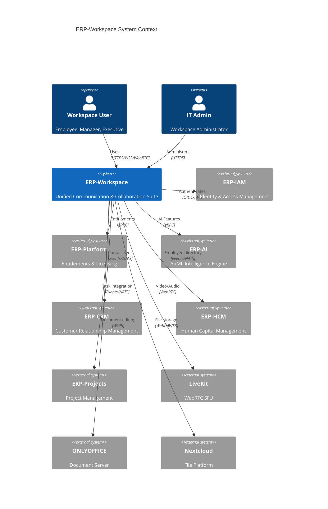
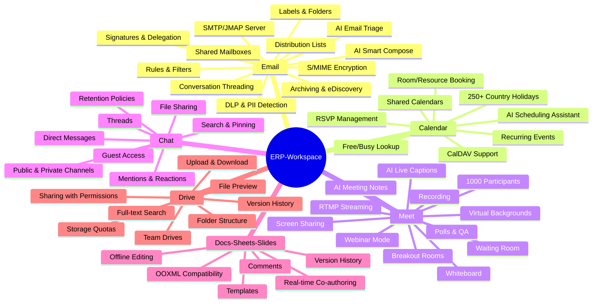

# ERP-Workspace Module Overview

> **Document ID:** ERP-WS-MO-003
> **Version:** 1.0.0
> **Last Updated:** 2026-02-23
> **Status:** Active
> **SKU:** erp.workspace

---

## Document Information

| Field | Value |
|-------|-------|
| Module | ERP-Workspace |
| Version | 1.0.0 |
| Domain | Communication & Collaboration |
| Last Updated | 2026-02-23 |
| Status | Active |
| SKU | erp.workspace |
| Integration Mode | standalone_plus_suite |

---

## Executive Summary

ERP-Workspace is the consolidated Communication and Collaboration module of the ERP product line. It delivers a comprehensive, enterprise-grade workspace platform that consolidates email, calendar, video meetings, team chat, document editing, and cloud storage into a single cohesive suite. The module operates in **standalone_plus_suite** mode, meaning it can run independently or as part of the broader ERP platform with entitlements managed through ERP-Platform.

ERP-Workspace is benchmarked against Microsoft 365, Google Workspace, and Zoho Workplace, combining enterprise-grade capabilities with modern architecture patterns including polyglot services (Rust, Go, Python), event-driven design, and AI-powered intelligence.

---

## Architecture Context

---

## Consolidated Service Inventory

The module comprises 7 core services organized by collaboration domain:

| Service | Domain | Technology | Port | Base Path |
|---------|--------|------------|------|-----------|
| email-service | Email & Messaging | Go (+ Rust SMTP) | 8080 | /v1/email |
| calendar-service | Scheduling | Go | 8080 | /v1/calendar |
| meet-service | Video Conferencing | Go (+ LiveKit) | 8080 | /v1/meet |
| chat-service | Team Messaging | Go | 8080 | /v1/chat |
| docs-service | Document Editing | Go (+ ONLYOFFICE) | 8080 | /v1/docs |
| drive-service | File Storage | Go (+ Nextcloud/MinIO) | 8080 | /v1/drive |
| contacts-service | Directory | Go | 8080 | /v1/contacts |

---

## Capability Matrix

---

## Merge Sources

ERP-Workspace was assembled from the following originally independent modules:

| Source Module | Contribution | Import Type |
|--------------|-------------|-------------|
| ERP-Email | Rust SMTP/JMAP, Python email services, React admin portal | Deep import (Rust/Python/React src) |
| Email/Email (Legacy) | Legacy email providers (SendGrid, Postmark, AWS SES, Mailgun, Brevo, MailerSend) | Deep import (Python/React src) |
| ERP-Meet | LiveKit video conferencing configuration and web client | Deep import (configs, web, docker) |
| ERP-Productivity | ONLYOFFICE integration services, product suite documentation | Deep import (services, docs, docker) |
| ERP-Drive | Nextcloud/MinIO storage policies, sharing configuration | Deep import (docs, policies, docker) |

---

## Database Bounded Contexts

The workspace database spans 85+ tables organized across 11 DDD bounded contexts:

| Context | Table Count | Key Entities |
|---------|------------|-------------|
| Tenancy | 3 | tenants, domains, provisioning_events |
| Email Core | 12 | email_messages, email_events, email_templates, email_campaigns, email_suppressions |
| Contacts | 7 | contacts, contact_emails, contact_phones, contact_groups, contact_labels |
| Calendar | 6 | calendars, calendar_events, calendar_event_attendees, meeting_rooms, meeting_room_bookings |
| Tasks | 5 | task_boards, task_items, task_comments, task_attachments |
| Storage | 5 | document_libraries, file_items, file_versions, file_shares, share_links |
| Chat | 6 | teams, conversations, chat_messages, message_reactions, message_read_receipts |
| Knowledge Base | 9 | wikis, wiki_pages, wiki_page_blocks, notes, custom_lists |
| Collaboration | 7 | distribution_groups, public_folders, collaboration_sessions, collaboration_participants |
| AI/Search/Analytics | 10 | ai_compose_cache, ai_email_classifications, ai_summaries, search_index_metadata |
| Privacy/Innovation | 15+ | privacy_pii_detections, email_action_extractions, knowledge_graph_nodes, email_health_scores |

---

## Integration Mode

- **Standalone**: ERP-Workspace operates independently with its own authentication and database
- **Suite**: Integrates with ERP-Platform for entitlements, ERP-IAM for identity, and NATS for event backbone
- **Control Plane**: ERP-Platform subscription hub
- **Identity Provider**: ERP-Directory / ERP-IAM (OIDC/JWT)
- **Event Backbone**: NATS / Redpanda (Kafka-compatible)

---

## AIDD Guardrails

The module operates under strict AI-Driven Development guardrails:

- **Autonomous Actions**: Read-only queries, low-risk notifications
- **Supervised Actions**: Data mutations, workflow automation, bulk operations
- **Prohibited Actions**: Cross-tenant data access, irreversible deletes without backup, privilege escalation
- **Controls**: Human-in-the-loop for high-risk operations, decision logging, 24-hour rollback window

---

## Technology Stack

| Layer | Technology |
|-------|-----------|
| Mail Server | Rust (SMTP/JMAP, Tokio, async runtime) |
| Delivery Engine | Go (SMTP relay, queue management) |
| API Services | Go (net/http standard library) |
| AI Features | Python (FastAPI, Anthropic SDK) |
| Web Frontend | React 18, TypeScript 5, Tailwind CSS |
| Mobile | Flutter 3.x (iOS/Android) |
| Desktop | Electron 28+ (Windows/macOS/Linux) |
| Primary Database | PostgreSQL 16 (85+ tables) |
| Cache | Redis 7 |
| Event Bus | Redpanda / NATS |
| Object Store | MinIO (S3-compatible) |
| Search Engine | Quickwit |
| OLAP Analytics | ClickHouse |
| Video Infrastructure | LiveKit SFU |
| Document Editing | ONLYOFFICE Document Server |
| File Platform | Nextcloud |
| Observability | OpenTelemetry |
