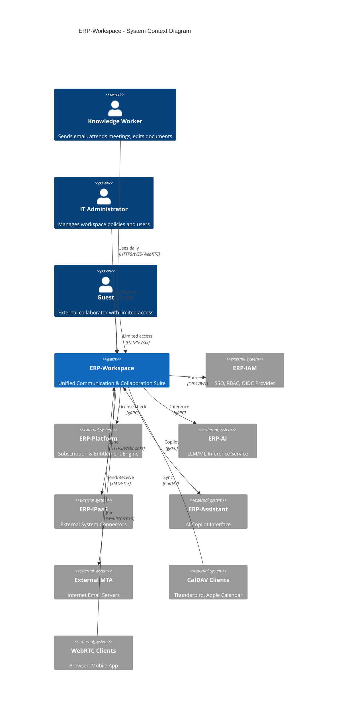
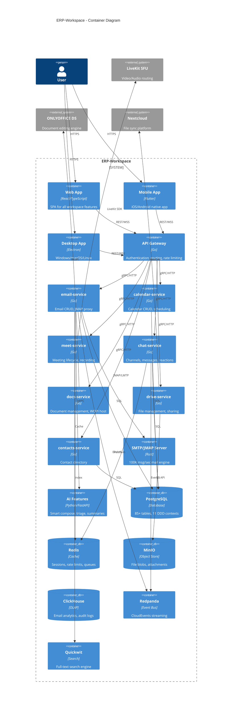
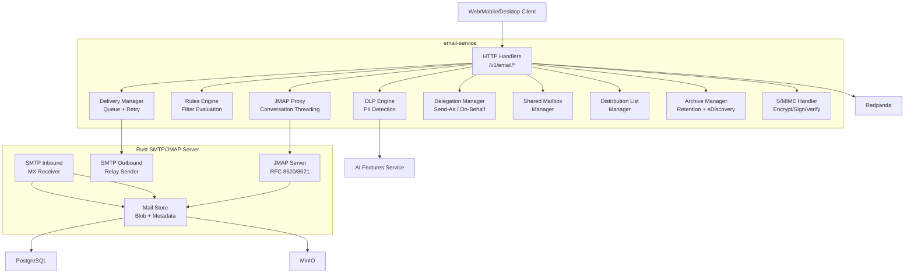
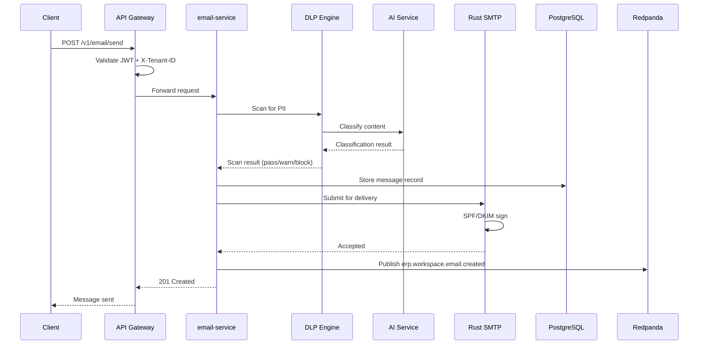
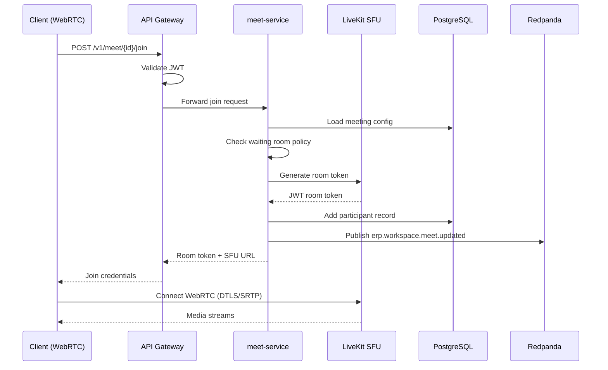
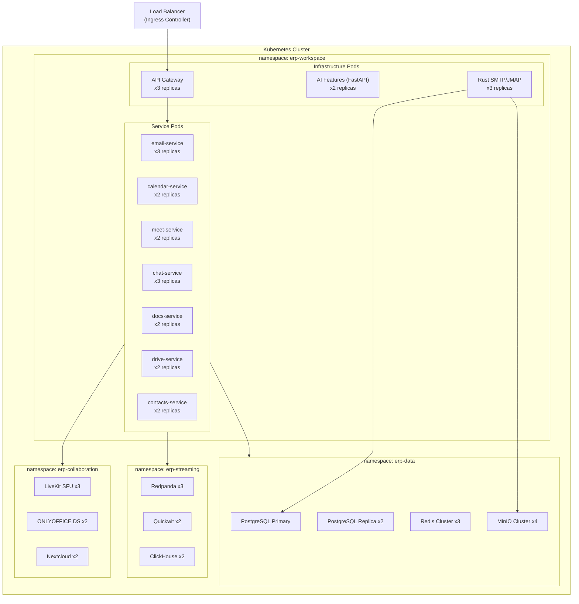
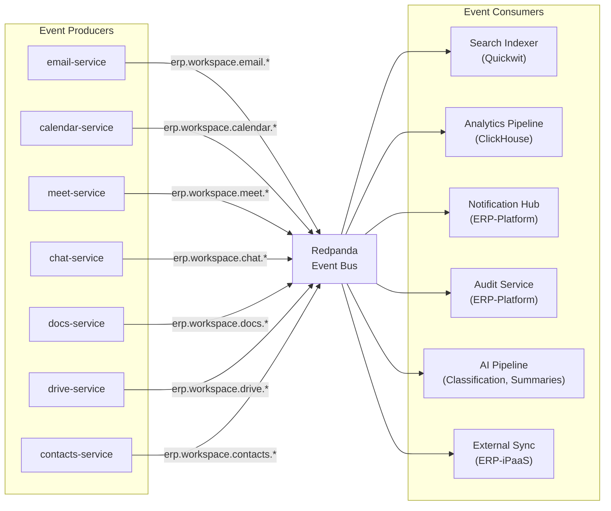
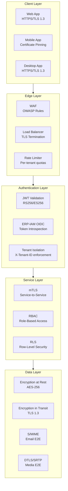

# ERP-Workspace Software Architecture

> **Document ID:** ERP-WS-SA-004
> **Version:** 1.0.0
> **Last Updated:** 2026-02-23
> **Status:** Approved
> **Related Documents:** [01-Technical-Writeup.md](./01-Technical-Writeup.md), [12-High-Level-Design.md](./12-High-Level-Design.md)

---

## 1. Architecture Overview

ERP-Workspace follows a microservices architecture with seven core services, supported by external infrastructure components for video conferencing (LiveKit), document editing (ONLYOFFICE), file storage (Nextcloud/MinIO), and analytics (ClickHouse). The architecture employs a polyglot approach: Rust for the high-throughput mail server, Go for API services, and Python for AI-powered features.

---

## 2. C4 Model

### 2.1 System Context (Level 1)



### 2.2 Container Diagram (Level 2)



### 2.3 Component Diagram - Email Service (Level 3)



---

## 3. Data Flow Architecture

### 3.1 Email Send Flow



### 3.2 Video Meeting Join Flow



---

## 4. Infrastructure Architecture



---

## 5. Event-Driven Architecture

### 5.1 Event Topology



### 5.2 Event Schema (CloudEvents)

All events follow the CloudEvents v1.0 specification:

```json
{
  "specversion": "1.0",
  "type": "erp.workspace.email.created",
  "source": "/erp-workspace/email-service",
  "id": "550e8400-e29b-41d4-a716-446655440000",
  "time": "2026-02-23T10:30:00Z",
  "datacontenttype": "application/json",
  "data": {
    "tenant_id": "...",
    "message_id": "...",
    "subject": "...",
    "from": "...",
    "to": ["..."]
  }
}
```

---

## 6. Security Architecture



---

## 7. Technology Decision Records

| Decision | Choice | Rationale |
|----------|--------|-----------|
| Mail server language | Rust | Memory safety + zero-GC pauses for 100K msg/sec |
| API services language | Go | Fast compilation, low memory, stdlib HTTP |
| AI features language | Python | Rich ML ecosystem, Anthropic SDK |
| Video infrastructure | LiveKit SFU | Open-source, scalable, WebRTC-native |
| Document editing | ONLYOFFICE | Full OOXML compatibility, real-time OT |
| File storage | Nextcloud + MinIO | WebDAV + S3 API, enterprise features |
| Primary database | PostgreSQL 16 | JSONB, RLS, GiST indexes, mature ecosystem |
| Event streaming | Redpanda | Kafka-compatible, no JVM, lower latency |
| Search engine | Quickwit | Rust-based, sub-second search, cost-efficient |
| Analytics | ClickHouse | Column-oriented, 100x faster analytics |

---

*For detailed API specifications, see [21-API-Documentation.md](./21-API-Documentation.md). For deployment topology, see [25-Deployment-Pipeline.md](./25-Deployment-Pipeline.md).*
