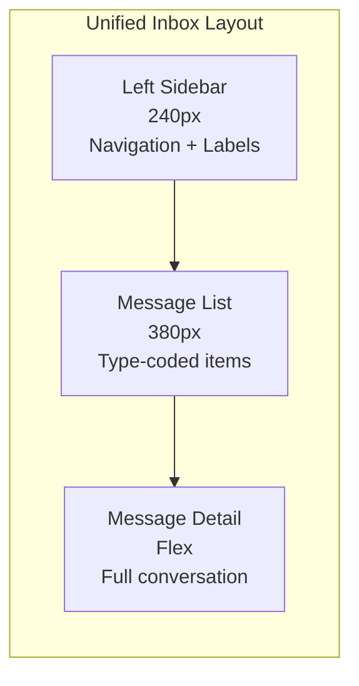

# ERP-Workspace Figma Design Prompts

> **Document ID:** ERP-WS-FDP-005
> **Version:** 1.0.0
> **Last Updated:** 2026-02-23
> **Status:** Approved
> **Target:** UI/UX Design Team

---

## Design System Foundation

All screens use the ERP Design System: 8px grid, Inter font family, Blue-600 (#2563EB) primary color, Gray-50 (#F9FAFB) background, 4px border radius for cards, 8px for modals. Dark mode support required. Responsive breakpoints: 320px (mobile), 768px (tablet), 1024px (desktop), 1440px (wide).

---

## Prompt 1: Unified Inbox (Email + Chat + Notifications)

**Screen Name:** Unified Inbox
**Route:** `/workspace/inbox`

Design a unified inbox view that consolidates email messages, chat notifications, calendar alerts, document activity, and drive notifications into a single prioritized feed. The layout uses a three-column structure: (1) left sidebar (240px) showing navigation with icons for Inbox, Starred, Snoozed, Sent, Drafts, Labels/Folders tree, and a collapsible section for Chat channels; (2) center column (380px) showing a vertically scrolling message list with sender avatar, sender name, subject line, preview text (2 lines), timestamp, and colored indicator dots for message type (blue=email, green=chat, purple=calendar, orange=document); (3) right column (remaining width) showing the selected message's full content with conversation thread. The top bar includes a global search field with Cmd+K shortcut hint, compose button (prominent blue), filter chips for "All", "Email", "Chat", "Calendar", "Files", and a notification bell with unread count badge. The inbox groups messages by "Today", "Yesterday", "This Week", "Earlier". Unread items have a left blue border accent and bolder typography. Include an AI-powered "Focus" toggle in the top-right that filters to high-priority items only. Show a small AI sparkle icon on messages that have AI-generated summaries available.

---

## Prompt 2: Email Compose

**Screen Name:** Email Compose Modal
**Route:** `/workspace/email/compose`

Design a full-featured email compose modal (centered, 720px wide, 85vh max height) with the following elements from top to bottom: (1) header bar with "New Message" title, minimize/maximize/close buttons; (2) "From" dropdown showing the current user's email addresses including shared mailboxes they have send-as permission for; (3) "To" field with typeahead search showing contact avatars, names, and email addresses from the contacts directory -- support chips for multiple recipients with a small "x" to remove; (4) "Cc" and "Bcc" fields that expand when clicked from a "Cc Bcc" link; (5) "Subject" field; (6) rich text toolbar with Bold, Italic, Underline, Strikethrough, Heading levels, Bullet list, Numbered list, Link, Image, Attachment, Code block, Emoji picker, and an AI assist dropdown with "Smart Compose", "Rewrite", "Shorten", "Formalize", "Casualize" options showing a sparkle icon; (7) rich text editor body (expanding to fill available space) with placeholder "Write your message..."; (8) bottom toolbar with "Send" button (primary blue), "Schedule Send" dropdown, "Signature" selector, "Confidential mode" toggle (S/MIME), "Discard" button, and attachment count indicator. Show a DLP warning banner in yellow if PII is detected in the message body. Include a "Collaborative Draft" button that opens a panel showing other editors' cursors.

---

## Prompt 3: Calendar Week View

**Screen Name:** Calendar - Week View
**Route:** `/workspace/calendar/week`

Design a calendar week view filling the full viewport. The top bar shows navigation arrows (previous/next week), a "Today" button, the current date range ("Feb 23 - Mar 1, 2026"), and view switcher tabs for "Day", "Week", "Month", "Schedule". Below the top bar: (1) a row of day headers (Mon-Sun) with date numbers, today highlighted with a blue circle; (2) an all-day events row showing multi-day events as horizontal color-coded bars spanning across days; (3) the main time grid with hours 00:00-23:00 on the left axis (60px wide), 7 day columns, and a red horizontal line indicating the current time with a small red dot at the intersection of the time column. Calendar events appear as rounded-corner cards within the grid, color-coded by calendar (personal=blue, work=green, team=purple), showing the event title and optionally the location or video meeting icon. Overlapping events should be displayed side-by-side within the same time slot. A thin vertical line on the right edge of the grid shows a mini scrollbar. In the left sidebar, show a mini month picker, a "My Calendars" checklist with color swatches, and an "Other Calendars" section. Include a "+" FAB (floating action button) in the bottom-right for quick event creation.

---

## Prompt 4: Calendar Month View

**Screen Name:** Calendar - Month View
**Route:** `/workspace/calendar/month`

Design a calendar month view with a 7-column grid (Sun-Sat or Mon-Sun based on locale). Each day cell is approximately equal sized, showing: the day number (top-left, today circled in blue, other months' days grayed out), up to 3 event indicators as small color-coded horizontal bars with truncated titles, and a "+N more" link if there are additional events. The top bar matches the week view navigation. Clicking a day cell opens that day in the day view. Clicking "+N more" opens a popover showing all events for that day. Include the same left sidebar as the week view with mini month picker and calendar list. Holidays should show in a subtle red text below the day number.

---

## Prompt 5: Video Meeting Room

**Screen Name:** Video Meeting Room
**Route:** `/workspace/meet/{id}`

Design a video meeting room interface. The main area is a responsive video grid showing participant video tiles (each with the participant's name overlaid at the bottom-left, a microphone mute indicator icon, and a pin/unpin button on hover). The active speaker gets a blue border glow. When there are more than 9 participants, show a paginated grid with arrow navigation. Support gallery view (equal tiles), speaker view (1 large + filmstrip), and presentation view (shared screen large + sidebar). The bottom control bar (centered, rounded pill shape, dark semi-transparent background) contains: microphone toggle, camera toggle, screen share button, "More" menu (virtual backgrounds, settings), reactions button (shows a popover with thumbs-up, clap, heart, laugh, surprised), chat toggle (opens side panel), participants toggle (opens side panel with attendee list and invite link), breakout rooms button, record button (with red dot indicator when active), and a red "Leave" button on the far right. The top-left shows the meeting title and elapsed time. The top-right shows the AI captions toggle and meeting notes button (sparkle icon). When AI captions are enabled, show a translucent caption bar at the bottom of the video area above the controls. Include a waiting room overlay that appears before the host admits the participant.

---

## Prompt 6: Chat Workspace

**Screen Name:** Chat Workspace
**Route:** `/workspace/chat`

Design a team chat interface with a three-column layout: (1) left sidebar (260px) with a search bar at top, then sections for "Channels" (with a "+" to create), "Direct Messages", and "Starred". Each channel shows a hash icon, channel name, and unread count badge. DMs show an avatar, name, and online status dot (green=online, gray=offline). (2) Center column (flex, min 400px) showing the active conversation: top bar with channel name/info, member count, pin icon, and search icon; message feed with messages grouped by date dividers; each message shows avatar, display name, timestamp, message content (supporting markdown, code blocks, images, file attachments), and hover actions (react, reply in thread, share, bookmark, more). Threaded messages show a "N replies" link below. The compose area at the bottom has a rich text input with formatting toolbar, emoji picker, attachment button, mentions autocomplete (triggered by @), and send button. (3) Right panel (320px, collapsible) showing thread view or channel details. Include a typing indicator ("Alice is typing...") above the compose area. Show read receipt indicators (small avatars) below the latest message.

---

## Prompt 7: Document Editor

**Screen Name:** Document Editor
**Route:** `/workspace/docs/{id}`

Design a document editor interface powered by ONLYOFFICE. The top section contains: (1) a breadcrumb showing "Drive > Projects > Q1 Report.docx" with an editable document title; (2) a toolbar with standard word processing controls: File menu, Edit menu, View menu, Insert menu, Format menu, then icon buttons for Undo/Redo, font family dropdown, font size, Bold/Italic/Underline, text color, highlight color, alignment (left/center/right/justify), line spacing, bullet/numbered list, indent/outdent, insert table, insert image, insert link, and a comments toggle; (3) a sharing indicator showing collaborator avatars with colored cursors matching their editing position. The document editing area is a white page (A4 proportioned) centered on a light gray background with visible margins. Show a co-author's cursor as a colored vertical line with their name in a small label above it. The right sidebar (collapsible) shows either the comments panel (threaded comments anchored to text selections) or the version history panel (list of versions with author, timestamp, and restore button). The bottom status bar shows word count, page count, language, and save status ("All changes saved" with a green checkmark).

---

## Prompt 8: Spreadsheet Editor

**Screen Name:** Spreadsheet Editor
**Route:** `/workspace/sheets/{id}`

Design a spreadsheet editor interface. The top area has a formula bar showing the current cell reference (e.g., "A1") and a wide formula input field. The toolbar includes standard spreadsheet controls: File, Edit, View, Insert, Format, Data menus, then icons for Undo/Redo, currency format, percent format, decimal increase/decrease, font family, font size, Bold/Italic, borders, fill color, text color, merge cells, text wrapping, alignment, filter, sort, chart insert, and freeze panes. The main area is the spreadsheet grid with lettered column headers (A, B, C...) and numbered row headers (1, 2, 3...). The active cell has a blue border with a fill handle (small blue square) at the bottom-right corner. Selected ranges show a light blue highlight. Column widths are adjustable by dragging headers. Include sheet tabs at the bottom (Sheet1, Sheet2, +) with right-click context menu for rename, delete, duplicate, and color. The co-editing indicators show other users' selected cells with colored borders and name labels.

---

## Prompt 9: Presentation Editor

**Screen Name:** Presentation Editor
**Route:** `/workspace/slides/{id}`

Design a presentation editor with a three-panel layout: (1) left panel (200px) showing a vertical slide thumbnail strip with numbered slides, reorderable by drag-and-drop, with a "+" button to add new slides and right-click menu for duplicate/delete/layout; (2) center panel (flex) showing the current slide at full editable size on a dark gray canvas, with rulers on top and left edges, and click-to-edit text boxes, image placeholders, and shape elements; (3) right panel (280px, collapsible) showing slide properties: layout selector (title slide, title + content, blank, two columns, etc.), transition effects dropdown, animation timeline, and theme/color scheme picker. The toolbar includes: text formatting, shape insert (rectangle, circle, arrow, line), image insert, table insert, chart insert, master slide edit, and slideshow start button. Show a "Present" button (prominent, top-right) that launches fullscreen presentation mode. Include speaker notes editor at the bottom (collapsible, 150px height) with a text area.

---

## Prompt 10: File Browser (Drive)

**Screen Name:** File Browser
**Route:** `/workspace/drive`

Design a file browser interface. The left sidebar (240px) shows: "My Drive", "Shared with me", "Team Drives" (expandable list), "Recent", "Starred", "Trash", and a storage usage bar showing "4.2 GB of 15 GB used" with a colored progress bar. The main content area has a top bar with breadcrumb navigation (My Drive > Projects > 2026), view toggle (grid/list), sort dropdown (Name, Modified, Size), and "New" dropdown button (Upload file, Upload folder, New folder, New document, New spreadsheet, New presentation). In list view: columns for Name (with file type icon), Owner, Last modified, File size, and a share icon. In grid view: cards with large file preview thumbnails (images show actual preview, PDFs show first page, documents show a doc icon with filename). Files show hover actions: Share, Download, Rename, Move, Delete. Folders show a folder icon with item count. Right-click context menu includes: Open, Share, Get link, Move to, Star, Rename, Download, Details, Delete. A details panel (320px, right side, collapsible) shows file metadata: preview, name, type, size, owner, created date, modified date, location, sharing settings, version history, and activity log.

---

## Prompt 11: Contacts Directory

**Screen Name:** Contacts Directory
**Route:** `/workspace/contacts`

Design a contacts directory with a two-column layout. The left column (320px) shows: a search bar at top, alphabet quick-jump strip (A-Z) on the right edge, and a scrollable contact list grouped by first letter. Each contact row shows: avatar (photo or initials), display name, job title, and company. Star icon for favorites. Sections: "Favorites" at top, then alphabetical groups. The right column (flex) shows the selected contact's detail card: large avatar, full name, job title, company, department, then tabbed sections for "Details" (email addresses, phone numbers, postal addresses, custom fields), "Activity" (recent emails, meetings, and chat history with this contact), and "Notes" (editable notes field). Action buttons along the top of the detail card: "Email", "Chat", "Call", "Video Call", "Schedule Meeting". Include a "+" FAB for adding new contacts. The left sidebar (200px, separate from contact list) shows: "All Contacts", "Favorites", contact groups (collapsible list with edit/delete), and "Create Group" button. Import/Export buttons in the top-right corner for vCard and CSV formats.

---

## Prompt 12: Search Results

**Screen Name:** Universal Search Results
**Route:** `/workspace/search?q={query}`

Design a universal search results page triggered by the Cmd+K global search. The search bar is prominent at the top (full width, large text, with a clear button and filter icon). Below the search bar, show filter chips: "All Results", "Emails", "Chats", "Documents", "Files", "Contacts", "Calendar Events", "Meetings". Results are displayed as a vertical list with type-specific result cards: (1) Email results show sender avatar, subject (with matched terms highlighted in yellow), preview snippet, date, and folder; (2) Chat results show channel name, sender, message snippet with highlight, and timestamp; (3) Document results show document icon, title with highlight, preview text, owner, and last modified; (4) File results show file type icon, filename with highlight, path, size, and date; (5) Contact results show avatar, name, email, and company; (6) Calendar results show date icon, event title, date/time, and attendees. Each result type has a small colored type badge (Email=blue, Chat=green, Document=purple, File=orange, Contact=teal, Calendar=red). The right sidebar shows "Search tips" and "Recent searches" when no query is active. Include result count per category in the filter chip badges. Support keyboard navigation (up/down arrows, Enter to open).

---

## Design Notes

- All screens should support both light and dark mode
- Responsive design required for 1024px, 768px, and 320px breakpoints
- Accessibility: WCAG 2.1 AA compliance, keyboard navigable, screen reader compatible
- Animation: Subtle transitions (200ms ease), no gratuitous animation
- Loading states: Skeleton screens for initial load, spinner for actions
- Error states: Inline validation, toast notifications for async errors
- Empty states: Illustrated empty state with CTA button for each major section
