# ERP-Workspace Use Cases and User Stories

> **Document ID:** ERP-WS-UC-006
> **Version:** 1.0.0
> **Last Updated:** 2026-02-23
> **Status:** Approved

---

## Use Case Overview

```mermaid
graph TB
    subgraph actors["Actors"]
        worker["Knowledge Worker"]
        lead["Team Lead"]
        exec["Executive"]
        admin["IT Admin"]
        guest["Guest User"]
    end

    subgraph email_uc["Email Use Cases"]
        UC1["UC-01: Send Email"]
        UC2["UC-02: Manage Inbox"]
        UC3["UC-03: Configure Rules"]
        UC4["UC-04: Use Shared Mailbox"]
        UC5["UC-05: Search Archived Email"]
    end

    subgraph calendar_uc["Calendar Use Cases"]
        UC6["UC-06: Schedule Meeting"]
        UC7["UC-07: Book Meeting Room"]
        UC8["UC-08: Manage Recurring Events"]
        UC9["UC-09: View Free/Busy"]
    end

    subgraph meet_uc["Meeting Use Cases"]
        UC10["UC-10: Host Video Meeting"]
        UC11["UC-11: Record Meeting"]
        UC12["UC-12: Use Breakout Rooms"]
        UC13["UC-13: Host Webinar"]
    end

    subgraph chat_uc["Chat Use Cases"]
        UC14["UC-14: Create Channel"]
        UC15["UC-15: Send Direct Message"]
        UC16["UC-16: Thread Discussion"]
        UC17["UC-17: Share File in Chat"]
    end

    subgraph docs_uc["Document Use Cases"]
        UC18["UC-18: Co-author Document"]
        UC19["UC-19: Review Spreadsheet"]
        UC20["UC-20: Create Presentation"]
    end

    subgraph drive_uc["Drive Use Cases"]
        UC21["UC-21: Upload and Share File"]
        UC22["UC-22: Manage Team Drive"]
        UC23["UC-23: Restore File Version"]
    end

    subgraph admin_uc["Admin Use Cases"]
        UC24["UC-24: Provision Mailboxes"]
        UC25["UC-25: Configure DLP Policy"]
        UC26["UC-26: Run eDiscovery"]
    end

    worker --> UC1 & UC2 & UC6 & UC10 & UC14 & UC15 & UC18 & UC21
    lead --> UC4 & UC7 & UC12 & UC14 & UC22
    exec --> UC3 & UC9 & UC11 & UC13
    admin --> UC24 & UC25 & UC26
    guest --> UC10 & UC15 & UC17 & UC18
```

---

## UC-01: Send and Receive Email

**Actor:** Knowledge Worker
**Precondition:** User has an active mailbox and is authenticated
**Trigger:** User clicks "Compose" or receives inbound email

### Main Flow
1. User clicks the "Compose" button in the unified inbox
2. System opens the compose modal with the user's default sender identity
3. User enters recipient(s) in the "To" field with typeahead suggestions from the contacts directory
4. User enters a subject line and composes the message body using the rich text editor
5. User optionally uses AI Smart Compose to generate or refine the message
6. System runs DLP scan in the background, detecting any PII content
7. If PII detected, system displays a warning banner with options to redact or proceed
8. User clicks "Send"
9. System submits the message to the Rust SMTP server for delivery
10. System publishes `erp.workspace.email.created` event
11. System displays "Message sent" confirmation toast

### Alternative Flows
- **A1 - Schedule Send:** At step 8, user clicks "Schedule Send" and picks a future date/time. System queues the message.
- **A2 - Collaborative Draft:** At step 3, user clicks "Collaborative Draft" to invite co-editors. Multiple users can edit the draft simultaneously.
- **A3 - S/MIME Encryption:** At step 8, user enables "Confidential mode" to encrypt the email with S/MIME.
- **A4 - Delegation:** At step 2, user selects "Send as" another mailbox they have delegation access to.

### Postcondition
Email is delivered to recipient(s), stored in Sent folder, and indexed for search.

---

## UC-02: Manage Unified Inbox with AI Triage

**Actor:** Knowledge Worker
**Precondition:** User has incoming emails and notifications

### Main Flow
1. User opens the unified inbox
2. System displays messages sorted by date, with type indicators (email, chat, calendar, files)
3. User enables "Focus" mode
4. AI triage model filters messages to show only high-priority items based on user's behavior patterns
5. User reads an email in the detail panel
6. System marks the email as read and publishes `erp.workspace.email.read` event
7. User applies a label by dragging the email to a label in the sidebar
8. User snoozes a low-priority email until tomorrow
9. System hides the snoozed email and schedules it to reappear

### Alternative Flows
- **A1 - Email-to-Action:** AI detects an actionable item (meeting request, task deadline) and surfaces an "Extract Action" button. User clicks it to create a calendar event or task.
- **A2 - Sentiment Alert:** AI detects a negative sentiment trend in a conversation thread and shows a warning indicator.

---

## UC-03: Configure Email Rules and Filters

**Actor:** Knowledge Worker, Executive
**Precondition:** User has an active mailbox

### Main Flow
1. User navigates to Settings > Rules & Filters
2. User clicks "Create Rule"
3. User defines conditions: sender matches, subject contains, has attachment, message size > X
4. User defines actions: move to folder, apply label, mark as read, forward to, auto-reply
5. User sets priority order and "stop processing" flag
6. System saves the rule to the `mailbox_rules` table
7. System applies the rule to all future incoming messages matching the conditions

---

## UC-04: Use Shared Mailbox

**Actor:** Team Lead
**Precondition:** Shared mailbox exists and user has access

### Main Flow
1. User selects a shared mailbox (e.g., "support@company.com") from the sidebar
2. System loads the shared mailbox's inbox
3. User reads and responds to emails from the shared mailbox identity
4. Other team members with access can see the same inbox and response history
5. System tracks which user responded to each email for accountability

---

## UC-05: Search Archived Email (eDiscovery)

**Actor:** IT Admin, Compliance Officer
**Precondition:** Email archiving is enabled for the tenant

### Main Flow
1. Admin navigates to Admin Console > eDiscovery
2. Admin defines search criteria: date range, sender/recipient, keywords, mailbox scope
3. System searches across all archived emails using the Quickwit search engine
4. System displays results with message previews
5. Admin selects messages for export
6. System generates an export file (EML, PST, or PDF format)
7. System logs the eDiscovery search in the audit trail

---

## UC-06: Schedule a Meeting with AI Assistant

**Actor:** Knowledge Worker
**Precondition:** User has calendar access and invitees are in the directory

### Main Flow
1. User clicks "+" on the calendar to create a new event
2. User enters the event title, description, and adds attendees
3. User clicks "Find a time" to invoke the AI scheduling assistant
4. AI analyzes all attendees' free/busy schedules, timezone differences, and preferred meeting hours
5. AI suggests the top 3 optimal time slots
6. User selects a time slot
7. User optionally books a meeting room
8. System creates the event, sends RSVP invitations via email
9. System publishes `erp.workspace.calendar.created` event
10. Attendees receive email notifications with Accept/Decline/Tentative buttons

---

## UC-07: Book a Meeting Room

**Actor:** Team Lead
**Precondition:** Meeting rooms are configured in the system

### Main Flow
1. User creates a calendar event and clicks "Add Room"
2. System shows available rooms filtered by capacity, floor, building, and amenities
3. User selects a room
4. System checks for booking conflicts using the `meeting_room_bookings` table
5. If no conflict, system reserves the room and adds it to the event
6. Room reservation appears on the room's calendar

### Alternative Flow
- **A1 - Conflict:** Room is already booked. System suggests alternative rooms or times.

---

## UC-08: Manage Recurring Events

**Actor:** Knowledge Worker
**Precondition:** User has calendar access

### Main Flow
1. User creates an event and enables "Repeat"
2. User configures recurrence: daily, weekly (select days), monthly (by date or by day), yearly
3. User sets end condition: never, after N occurrences, or by specific date
4. System stores the RRULE in `calendar_events.recurrence_rule`
5. System generates individual event instances for display
6. User can edit a single occurrence (exception) or all future occurrences

---

## UC-09: View Organization Free/Busy

**Actor:** Executive
**Precondition:** Shared calendar access is configured

### Main Flow
1. Executive opens the scheduling view
2. Executive adds team members to the free/busy grid
3. System displays each person's availability as colored blocks (green=free, red=busy, gray=tentative)
4. Executive identifies a common free slot
5. Executive creates a meeting in the identified slot

---

## UC-10: Host a Video Meeting

**Actor:** Knowledge Worker, Guest
**Precondition:** Meeting is scheduled or ad-hoc link is generated

### Main Flow
1. Host clicks "Join Meeting" from the calendar event or meeting link
2. System presents a pre-join screen: camera/mic preview, virtual background selector, display name
3. Host clicks "Join Now"
4. System requests a room token from LiveKit via the meet-service
5. Client connects to LiveKit SFU via WebRTC
6. Host sees their own video tile and waits for participants
7. Participants join and appear in the video grid
8. During the meeting: host manages mute/unmute participants, share screen, send reactions
9. Host ends the meeting
10. System publishes `erp.workspace.meet.deleted` event

### Alternative Flow
- **A1 - Waiting Room:** Participant joins but is placed in the waiting room. Host sees admission request and admits/denies.
- **A2 - Guest Join:** External guest clicks the meeting link, enters display name, joins without authentication.

---

## UC-11: Record Meeting with AI Notes

**Actor:** Executive
**Precondition:** Meeting is in progress, recording is permitted

### Main Flow
1. Host clicks the "Record" button during the meeting
2. System starts recording video/audio streams via LiveKit's recording API
3. AI live captions are generated in real-time and displayed at the bottom of the video area
4. Meeting ends and recording stops
5. AI processes the recording transcript to generate meeting notes
6. System stores the summary in `ai_summaries` with key_points and action_items
7. All participants receive an email with the meeting notes and recording link

---

## UC-12: Use Breakout Rooms

**Actor:** Team Lead
**Precondition:** Meeting has 3+ participants

### Main Flow
1. Host clicks "Breakout Rooms" in the meeting controls
2. Host configures: number of rooms, assignment mode (automatic/manual)
3. If manual, host drags participants into rooms
4. Host clicks "Start Breakout Sessions"
5. Participants are moved to their assigned breakout rooms
6. Host can broadcast a message to all rooms
7. Host closes breakout rooms and all participants return to the main meeting

---

## UC-13: Host a Webinar

**Actor:** Executive
**Precondition:** Webinar mode is enabled

### Main Flow
1. Host creates a webinar event (large meeting with presenter/attendee roles)
2. System generates a registration page link
3. Attendees register and receive confirmation email
4. At webinar time, presenters join with full video/audio/screen share capabilities
5. Attendees join in view-only mode with Q&A and poll access
6. Presenters can promote an attendee to presenter
7. RTMP streaming can be enabled to stream to YouTube/LinkedIn/custom endpoints
8. Webinar recording is automatically saved

---

## UC-14: Create and Manage Chat Channel

**Actor:** Team Lead, Knowledge Worker
**Precondition:** User has chat access

### Main Flow
1. User clicks "+" next to Channels in the chat sidebar
2. User enters channel name, description, and selects public/private
3. System creates the channel and adds the creator as owner
4. User invites team members to the channel
5. Members receive notification and can start posting
6. System publishes `erp.workspace.chat.created` event

---

## UC-15: Send Direct Message

**Actor:** Knowledge Worker, Guest
**Precondition:** Both users have chat access

### Main Flow
1. User clicks a contact's name or "New Message" in the DM section
2. System creates or opens the 1:1 conversation
3. User types a message and presses Enter or clicks Send
4. System delivers the message in real-time via WebSocket
5. Recipient sees the message appear with a notification

---

## UC-16: Thread Discussion in Channel

**Actor:** Knowledge Worker
**Precondition:** Channel has existing messages

### Main Flow
1. User hovers over a message and clicks "Reply in thread"
2. System opens a thread panel on the right side
3. User types a reply in the thread
4. Thread reply count increments on the parent message
5. Thread participants receive notifications

---

## UC-17: Share File in Chat

**Actor:** Knowledge Worker, Guest
**Precondition:** User is in a conversation

### Main Flow
1. User clicks the attachment button or drags a file into the compose area
2. System uploads the file to MinIO via the drive-service
3. System posts a message with file preview (image thumbnail, document icon, etc.)
4. Other users can click to download or preview the file

---

## UC-18: Co-author a Document in Real-time

**Actor:** Knowledge Worker, Guest
**Precondition:** Document exists in Drive and user has edit permission

### Main Flow
1. User opens a document from Drive or a shared link
2. System loads ONLYOFFICE document editor
3. Other editors' cursors appear in real-time with colored indicators and names
4. Users simultaneously edit different sections of the document
5. System tracks all changes via operational transformation
6. System auto-saves every few seconds
7. Version history records each save point with author attribution
8. Users can leave comments on specific text selections

---

## UC-19: Review and Collaborate on Spreadsheet

**Actor:** Knowledge Worker
**Precondition:** Spreadsheet exists with shared access

### Main Flow
1. User opens the spreadsheet in the ONLYOFFICE editor
2. Multiple users can edit different cells simultaneously
3. Cell selections are shown with colored borders for each editor
4. Users can add comments to specific cells
5. Data validation rules are enforced in real-time
6. Charts and formulas update automatically

---

## UC-20: Create and Present a Presentation

**Actor:** Knowledge Worker
**Precondition:** User has docs access

### Main Flow
1. User creates a new presentation from the "New" menu in Drive
2. User selects a template or starts with a blank slide
3. User adds slides, text, images, shapes, and charts
4. User can collaborate with others in real-time
5. User clicks "Present" to start the slideshow in fullscreen
6. Presentation can be shared via a direct link or embedded in a meeting

---

## UC-21: Upload and Share Files

**Actor:** Knowledge Worker
**Precondition:** User has Drive access with available quota

### Main Flow
1. User clicks "Upload" or drags files into the Drive interface
2. System uploads files to MinIO with progress indicator
3. User right-clicks a file and selects "Share"
4. System opens the share dialog with options: add people (view/edit), get shareable link, set expiry
5. User shares the file with specific colleagues
6. System sends notification emails to shared users
7. System publishes `erp.workspace.drive.updated` event

---

## UC-22: Manage Team Drive

**Actor:** Team Lead
**Precondition:** Team Drive feature is enabled

### Main Flow
1. Team Lead creates a new Team Drive
2. Team Lead adds team members with appropriate roles (manager, contributor, viewer)
3. Team members upload and organize files in the shared space
4. All team members see the same folder structure
5. Storage quota is shared across the team

---

## UC-23: Restore File Version

**Actor:** Knowledge Worker
**Precondition:** File has multiple versions

### Main Flow
1. User opens file details panel and clicks "Version History"
2. System shows list of versions with author, timestamp, and size
3. User selects a previous version to preview
4. User clicks "Restore" to revert to the selected version
5. System creates a new version (the restore) rather than deleting intermediate versions

---

## UC-24: Provision Tenant Mailboxes

**Actor:** IT Admin
**Precondition:** Tenant is provisioned in ERP-Platform

### Main Flow
1. Admin navigates to Admin Console > Email > Mailboxes
2. Admin clicks "Provision Mailbox" or "Bulk Import" (CSV upload)
3. Admin enters user principal, display name, and quota
4. System creates the mailbox record and provisions it in the Rust SMTP server
5. System publishes `erp.workspace.email.created` event
6. User receives a welcome email with setup instructions

---

## UC-25: Configure DLP Policy

**Actor:** IT Admin
**Precondition:** Admin has security policy management permissions

### Main Flow
1. Admin navigates to Admin Console > Security > DLP Policies
2. Admin enables PII auto-scan for outbound emails
3. Admin selects PII types to detect: SSN, credit card, phone numbers, addresses
4. Admin configures action on detection: warn, auto-redact, or block
5. System saves the policy to `privacy_policies` table
6. System applies the policy to all outbound email processing

---

## UC-26: Run eDiscovery Search

**Actor:** IT Admin, Compliance Officer
**Precondition:** Archiving is enabled, admin has eDiscovery permissions

### Main Flow
1. Admin navigates to Admin Console > Compliance > eDiscovery
2. Admin creates a new case with a name and description
3. Admin defines search criteria: date range, custodians, keywords, message types
4. System searches across all archived email, chat, and document content
5. System displays results with hit highlights
6. Admin places a legal hold on relevant content (prevents deletion)
7. Admin exports results in standard litigation formats

---

*For technical specifications of each use case, see [14-Technical-Specifications.md](./14-Technical-Specifications.md). For API details supporting these flows, see [21-API-Documentation.md](./21-API-Documentation.md).*
