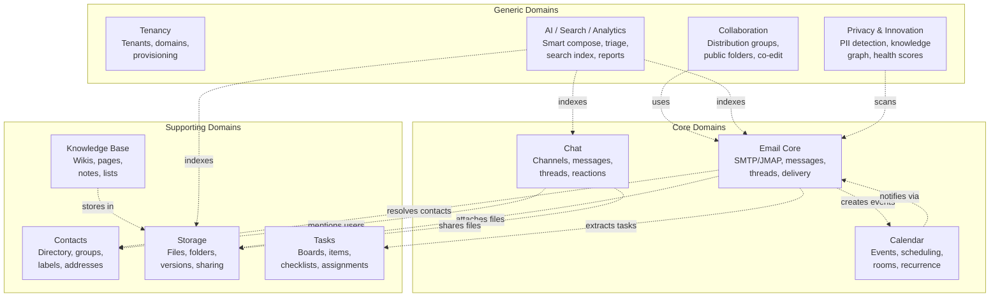
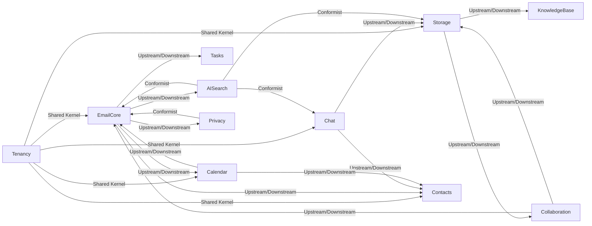

# ERP-Workspace Domain-Driven Design

> **Document ID:** ERP-WS-DDD-007
> **Version:** 1.0.0
> **Last Updated:** 2026-02-23
> **Status:** Approved

---

## 1. Strategic Domain Model

ERP-Workspace is decomposed into 11 bounded contexts reflecting the distinct business domains within a unified workspace suite.

---

## 2. Bounded Context Definitions

### 2.1 Tenancy Context

**Purpose:** Multi-tenant isolation, domain management, and provisioning lifecycle.

| Aggregate | Root Entity | Value Objects | Events |
|-----------|------------|---------------|--------|
| Tenant | tenants | plan_tier, status | TenantProvisioned, TenantActivated |
| Domain | domains | dmarc_policy, spf_record, dkim_selector | DomainVerified, DomainRemoved |
| Provisioning | provisioning_events | workflow_id, payload | ProvisioningStarted, ProvisioningCompleted |

### 2.2 Email Core Context

**Purpose:** Full email lifecycle from composition through delivery, threading, and archiving.

| Aggregate | Root Entity | Value Objects | Events |
|-----------|------------|---------------|--------|
| Message | email_messages | from_email, to_email, subject, status | MessageSent, MessageDelivered, MessageBounced |
| Template | email_templates | subject, html_body, text_body, variables | TemplateCreated, TemplateUpdated |
| Campaign | email_campaigns | schedule, recipients, metrics | CampaignStarted, CampaignCompleted |
| Suppression | email_suppressions | reason, bounce_type | EmailSuppressed, SuppressionRemoved |
| Provider | email_provider_configs | config, priority | ProviderActivated, ProviderFailed |
| ABTest | email_ab_tests | variants, winner_variant | TestStarted, TestConcluded |

### 2.3 Contacts Context

**Purpose:** Directory management, contact organization, and relationship tracking.

| Aggregate | Root Entity | Value Objects | Events |
|-----------|------------|---------------|--------|
| Contact | contacts | name, company, job_title | ContactCreated, ContactUpdated |
| ContactGroup | contact_groups | name, group_type | GroupCreated, MemberAdded |
| SharedMailbox | shared_mailboxes | email_address, auto_reply | MailboxCreated, MemberRoleChanged |

### 2.4 Calendar Context

**Purpose:** Event scheduling, room booking, recurrence management, and availability tracking.

| Aggregate | Root Entity | Value Objects | Events |
|-----------|------------|---------------|--------|
| Calendar | calendars | name, timezone, visibility | CalendarCreated, CalendarShared |
| Event | calendar_events | time_range, location, recurrence_rule | EventCreated, EventRSVPd, EventCancelled |
| MeetingRoom | meeting_rooms | capacity, amenities, booking_policy | RoomBooked, RoomReleased |

### 2.5 Tasks Context

**Purpose:** Task management with kanban boards, checklists, and assignment tracking.

| Aggregate | Root Entity | Value Objects | Events |
|-----------|------------|---------------|--------|
| TaskBoard | task_boards | name, columns, settings | BoardCreated, BoardArchived |
| TaskItem | task_items | title, status, priority, due_date | TaskCreated, TaskCompleted, TaskAssigned |

### 2.6 Storage Context

**Purpose:** File management, versioning, sharing, and document libraries.

| Aggregate | Root Entity | Value Objects | Events |
|-----------|------------|---------------|--------|
| DocumentLibrary | document_libraries | quota, settings | LibraryCreated, QuotaExceeded |
| FileItem | file_items | name, content_type, storage_key | FileUploaded, FileShared, FileDeleted |
| ShareLink | share_links | token, permission, expiry | LinkCreated, LinkExpired |

### 2.7 Chat Context

**Purpose:** Real-time team messaging with channels, threads, and reactions.

| Aggregate | Root Entity | Value Objects | Events |
|-----------|------------|---------------|--------|
| Team | teams | name, is_public, allow_guest | TeamCreated, TeamArchived |
| Conversation | conversations | name, type, is_archived | ConversationCreated, MemberJoined |
| ChatMessage | chat_messages | content, message_type, mentions | MessagePosted, MessageEdited, ReactionAdded |

### 2.8 Knowledge Base Context

**Purpose:** Wikis, notes, and structured data lists for organizational knowledge.

| Aggregate | Root Entity | Value Objects | Events |
|-----------|------------|---------------|--------|
| Wiki | wikis | name, site_type, access_settings | WikiCreated, WikiPublished |
| WikiPage | wiki_pages | title, slug, blocks | PageCreated, PageEdited, PageCommented |
| Note | notes | title, content, folder, tags | NoteCreated, NoteArchived |
| CustomList | custom_lists | name, columns, views | ListCreated, ItemAdded |

### 2.9 Collaboration Context

**Purpose:** Advanced collaboration features: distribution groups, public folders, real-time co-editing.

| Aggregate | Root Entity | Value Objects | Events |
|-----------|------------|---------------|--------|
| DistributionGroup | distribution_groups | email_address, moderation | GroupCreated, MemberAdded |
| PublicFolder | public_folders | folder_type, path, quota | FolderCreated, ACLGranted |
| CollaborationSession | collaboration_sessions | status, revision | SessionStarted, OperationApplied |

### 2.10 AI / Search / Analytics Context

**Purpose:** AI-powered features, search indexing, and analytics processing.

| Aggregate | Root Entity | Value Objects | Events |
|-----------|------------|---------------|--------|
| AICompose | ai_compose_cache | suggestions, tone | ComposeGenerated |
| AIClassification | ai_email_classifications | category, sentiment, priority | EmailClassified |
| AISummary | ai_summaries | summary, key_points, action_items | SummaryGenerated |
| SearchIndex | search_index_metadata | doc_type, title | DocumentIndexed |
| AnalyticsReport | analytics_reports | stats, anomalies | ReportGenerated, AnomalyDetected |

### 2.11 Privacy & Innovation Context

**Purpose:** Privacy compliance, knowledge graph, email health, and innovation features.

| Aggregate | Root Entity | Value Objects | Events |
|-----------|------------|---------------|--------|
| PIIDetection | privacy_pii_detections | pii_type, confidence | PIIDetected, PIIRedacted |
| KnowledgeGraph | knowledge_graph_nodes | node_type, properties | NodeDiscovered, EdgeCreated |
| EmailHealth | email_health_scores | domain, scores | HealthChecked, HealthDegraded |
| EmailAction | email_action_extractions | action_type, confidence | ActionExtracted, ActionMaterialized |

---

## 3. Context Map

### Integration Patterns

| Relationship | Pattern | Description |
|-------------|---------|-------------|
| Tenancy <-> All | Shared Kernel | tenant_id is shared across all contexts |
| Email <-> Contacts | Customer/Supplier | Email resolves contacts; Contacts supplies directory |
| Email <-> Calendar | Published Language | Email publishes meeting invitations; Calendar consumes |
| Email <-> AI/Search | Conformist | AI/Search conforms to Email's data model |
| Chat <-> Storage | Customer/Supplier | Chat uses Storage for file sharing |
| Collaboration <-> Storage | Partnership | Co-editing sessions reference stored files |

---

## 4. Ubiquitous Language

| Term | Definition | Context |
|------|-----------|---------|
| Mailbox | A user's email storage container with quota | Email Core |
| Conversation | A group of related email messages (thread) | Email Core |
| Channel | A persistent chat room for a team or topic | Chat |
| Thread | A sub-discussion within a channel message | Chat |
| Calendar Event | A scheduled time block with attendees | Calendar |
| Recurrence Rule | RRULE specification for repeating events | Calendar |
| Meeting Room | A bookable physical or virtual space | Calendar |
| Document Library | A shared file collection for a team | Storage |
| Share Link | A token-based URL granting file access | Storage |
| Wiki | A collaborative knowledge base site | Knowledge Base |
| Distribution Group | A mailing list with moderation controls | Collaboration |
| Collaboration Session | A real-time co-editing session on a document | Collaboration |
| PII Detection | Automated identification of personal data | Privacy |
| Knowledge Graph | Entity-relationship network extracted from email | Privacy/Innovation |
| Email Health Score | Domain reputation and configuration assessment | Privacy/Innovation |
| Triage Model | Per-user ML model for inbox prioritization | AI/Search |

---

*For entity-relationship diagrams of each context, see [10-Entity-Relationship-Diagram.md](./10-Entity-Relationship-Diagram.md). For API contracts per context, see [21-API-Documentation.md](./21-API-Documentation.md).*
