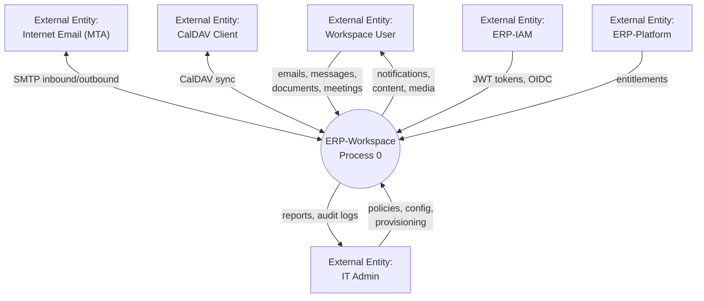
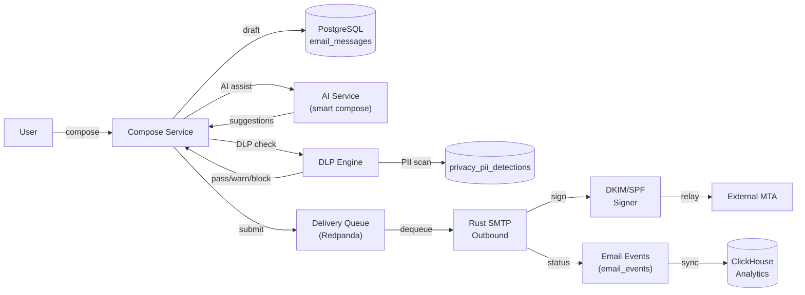
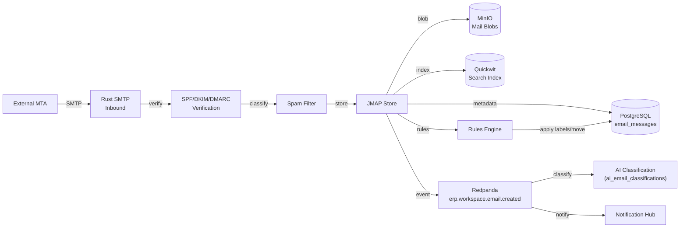
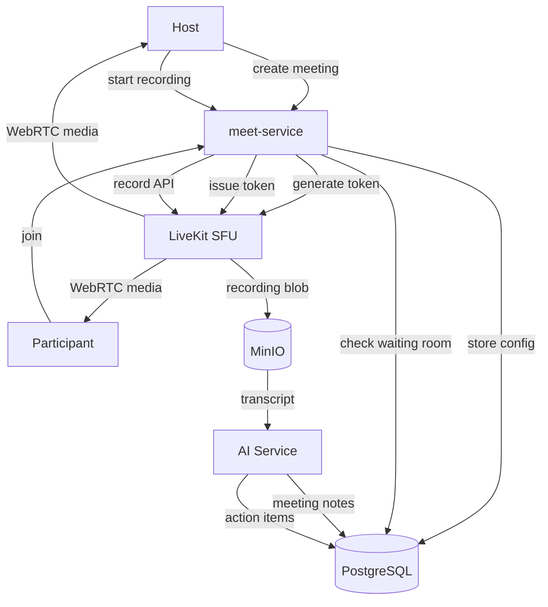
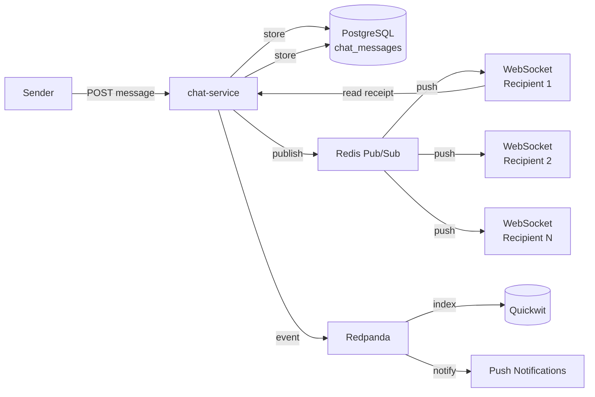
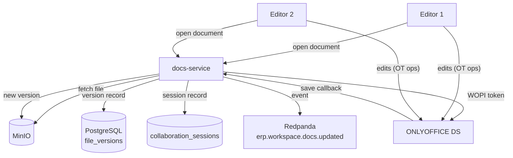
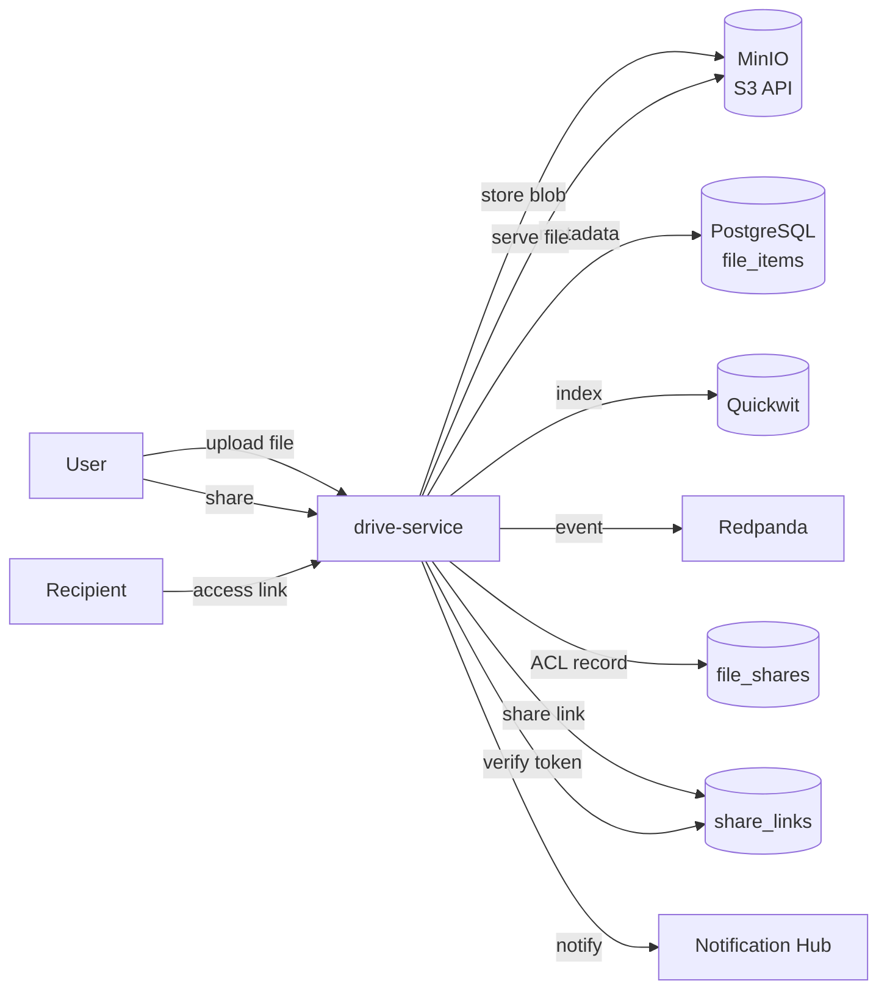
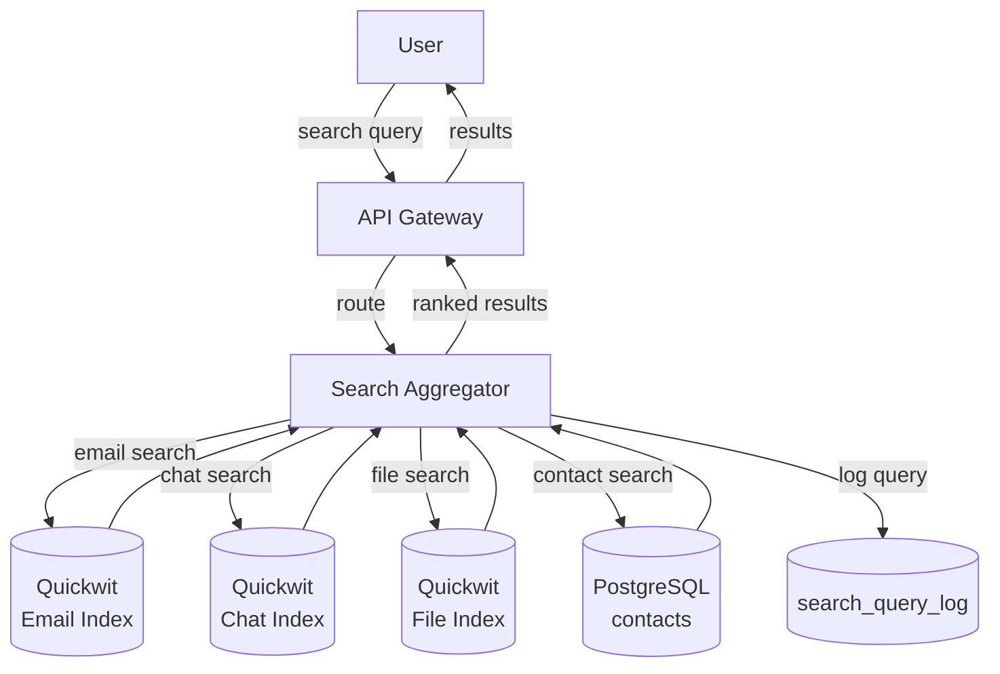
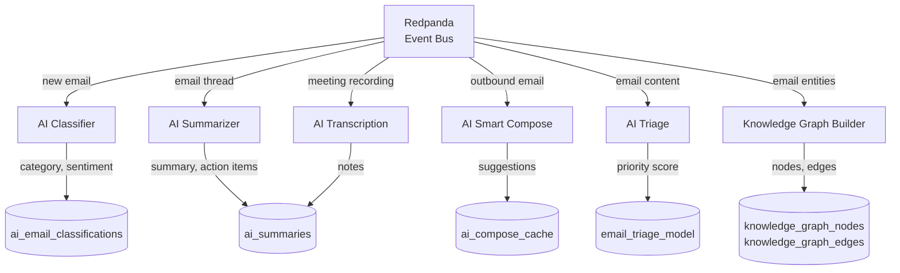

# ERP-Workspace Data Flow Diagrams

> **Document ID:** ERP-WS-DFD-008
> **Version:** 1.0.0
> **Last Updated:** 2026-02-23
> **Status:** Approved

---

## 1. Level 0 - Context Diagram

---

## 2. Level 1 - Major Process Decomposition

```mermaid
flowchart TB
    user["User"]

    subgraph p1["1.0 Email Processing"]
        p1a["1.1 Compose & Send"]
        p1b["1.2 Receive & Store"]
        p1c["1.3 Thread & Index"]
        p1d["1.4 DLP Scan"]
    end

    subgraph p2["2.0 Calendar Management"]
        p2a["2.1 Event CRUD"]
        p2b["2.2 Scheduling"]
        p2c["2.3 Room Booking"]
    end

    subgraph p3["3.0 Video Meeting"]
        p3a["3.1 Room Management"]
        p3b["3.2 Media Routing"]
        p3c["3.3 Recording"]
    end

    subgraph p4["4.0 Chat Messaging"]
        p4a["4.1 Channel Management"]
        p4b["4.2 Message Delivery"]
        p4c["4.3 Thread & Reaction"]
    end

    subgraph p5["5.0 Document Editing"]
        p5a["5.1 Document CRUD"]
        p5b["5.2 Real-time Co-edit"]
        p5c["5.3 Version Control"]
    end

    subgraph p6["6.0 File Storage"]
        p6a["6.1 Upload/Download"]
        p6b["6.2 Sharing"]
        p6c["6.3 Search"]
    end

    subgraph stores["Data Stores"]
        ds1[("D1: PostgreSQL")]
        ds2[("D2: MinIO")]
        ds3[("D3: Redis")]
        ds4[("D4: Redpanda")]
        ds5[("D5: Quickwit")]
        ds6[("D6: ClickHouse")]
    end

    user --> p1a & p2a & p3a & p4a & p5a & p6a
    p1a --> ds1 & ds4
    p1b --> ds1 & ds2
    p1c --> ds5
    p1d --> ds1
    p2a --> ds1 & ds4
    p3a --> ds1
    p3c --> ds2
    p4b --> ds1 & ds3 & ds4
    p5b --> ds1
    p6a --> ds2
    p6b --> ds1
    p6c --> ds5
```

---

## 3. Email Data Flows

### 3.1 Outbound Email Flow

### 3.2 Inbound Email Flow

---

## 4. Meeting Data Flow

---

## 5. Chat Real-time Data Flow

---

## 6. Document Collaboration Data Flow

---

## 7. File Upload and Share Data Flow

---

## 8. Search Data Flow

---

## 9. AI Pipeline Data Flow

---

*For implementation details of each data flow, see [14-Technical-Specifications.md](./14-Technical-Specifications.md).*
