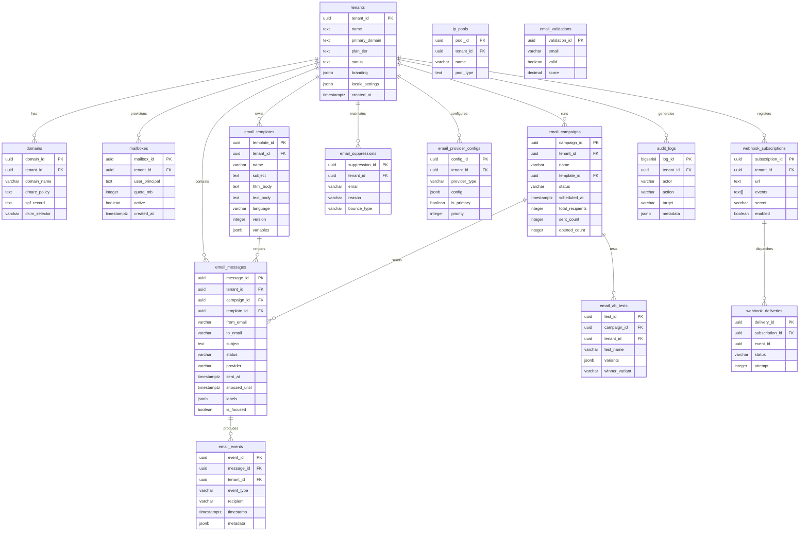
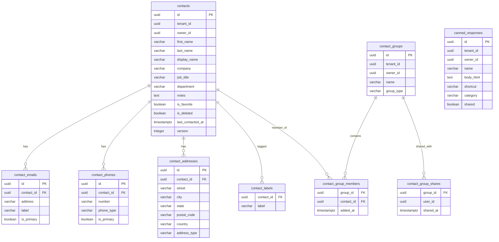
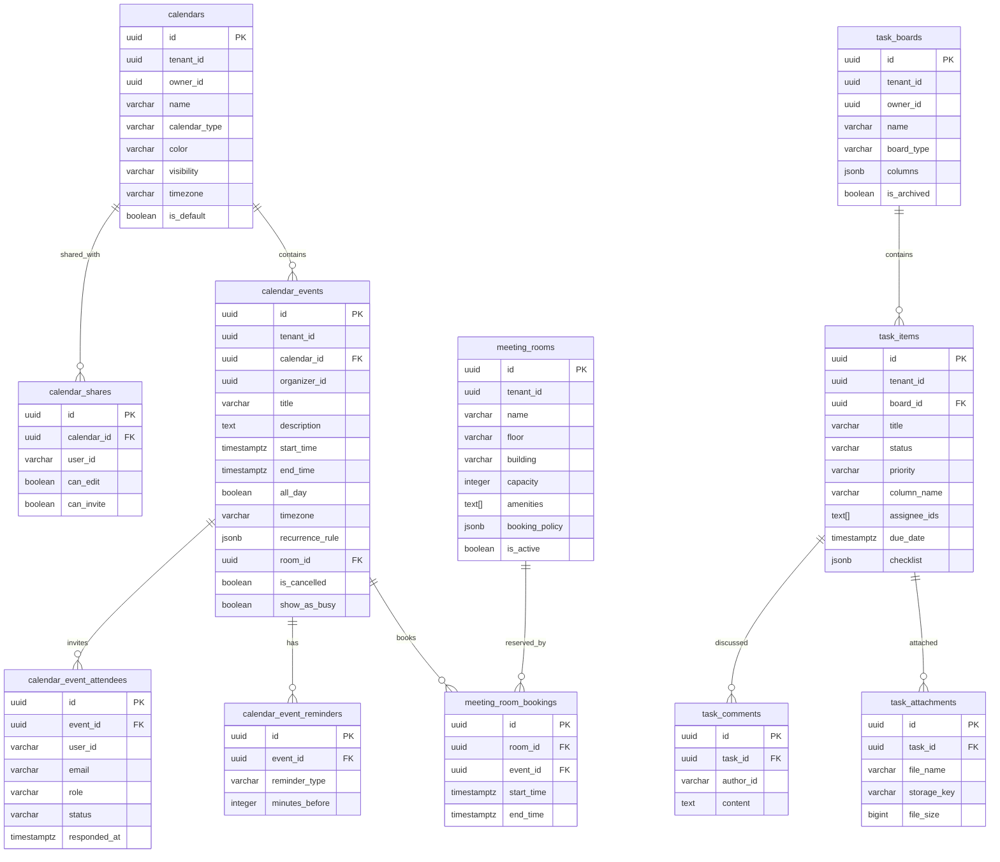
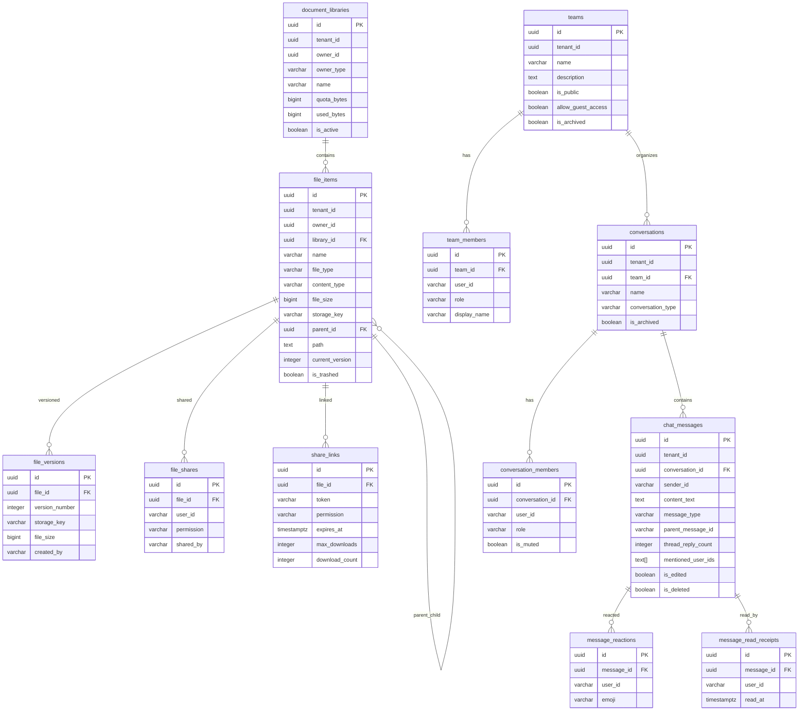
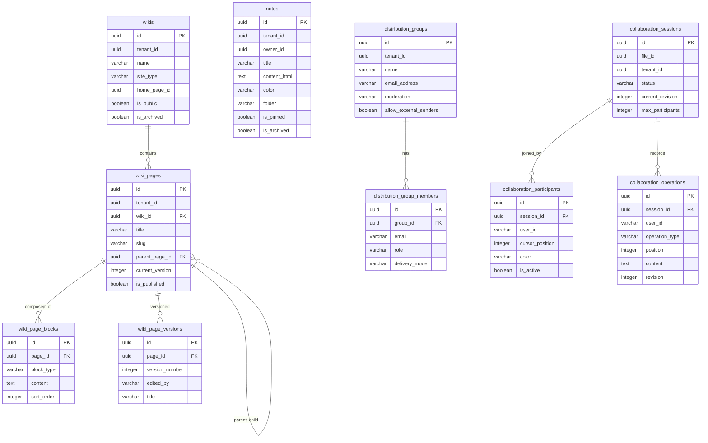
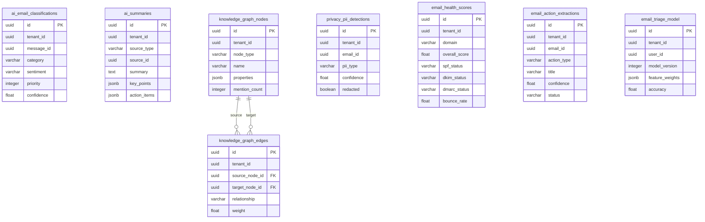

# ERP-Workspace Entity-Relationship Diagram

> **Document ID:** ERP-WS-ERD-010
> **Version:** 1.0.0
> **Last Updated:** 2026-02-23
> **Status:** Approved

---

## 1. Master ERD Overview

The full ERP-Workspace schema spans 85+ tables across 11 bounded contexts. This document presents ER diagrams for each context.

---

## 2. Tenancy & Email Core Context

---

## 3. Contacts Context

---

## 4. Calendar & Tasks Context

---

## 5. Storage & Chat Context

---

## 6. Knowledge Base & Collaboration Context

---

## 7. AI / Privacy / Innovation Context

---

## 8. Index Strategy Summary

| Index Type | Count | Purpose |
|-----------|-------|---------|
| B-tree (standard) | 80+ | Equality and range lookups |
| Covering (INCLUDE) | 15+ | Avoid heap lookups for listing queries |
| BRIN (block range) | 3 | Space-efficient time-series filtering |
| Partial | 10+ | Filter on common predicates (is_deleted, status) |
| GIN | 5+ | JSONB and array containment queries |
| Unique | 30+ | Enforce business uniqueness constraints |

---

*For data flow details, see [08-Data-Flow-Diagrams.md](./08-Data-Flow-Diagrams.md). For data model documentation, see [09-Data-Model-Documentation.md](./09-Data-Model-Documentation.md).*
