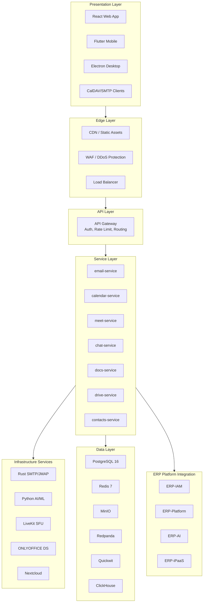
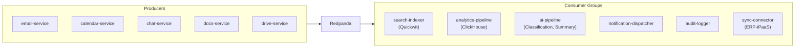
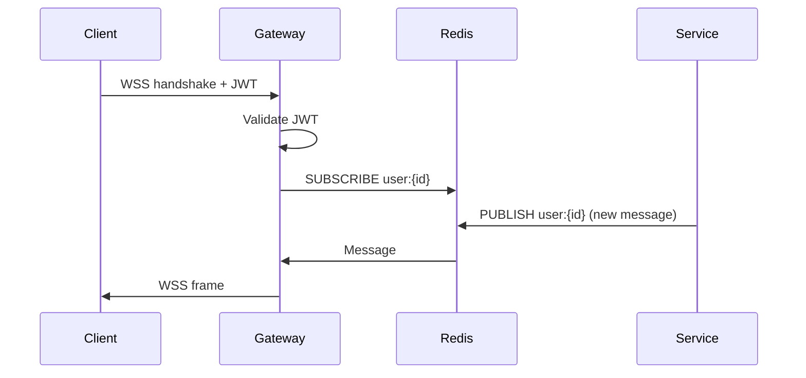
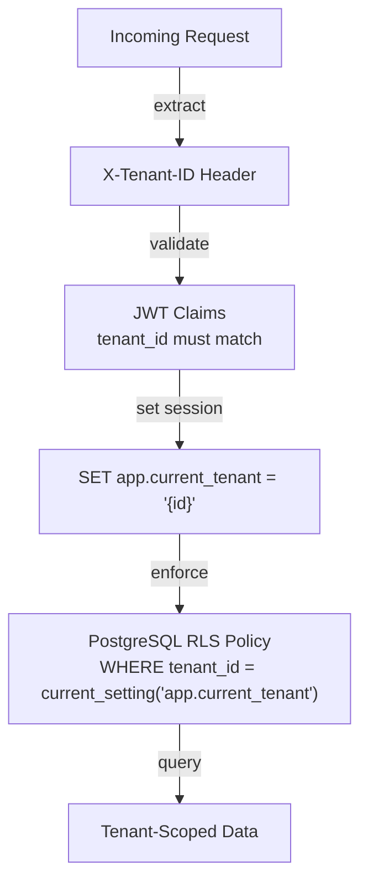
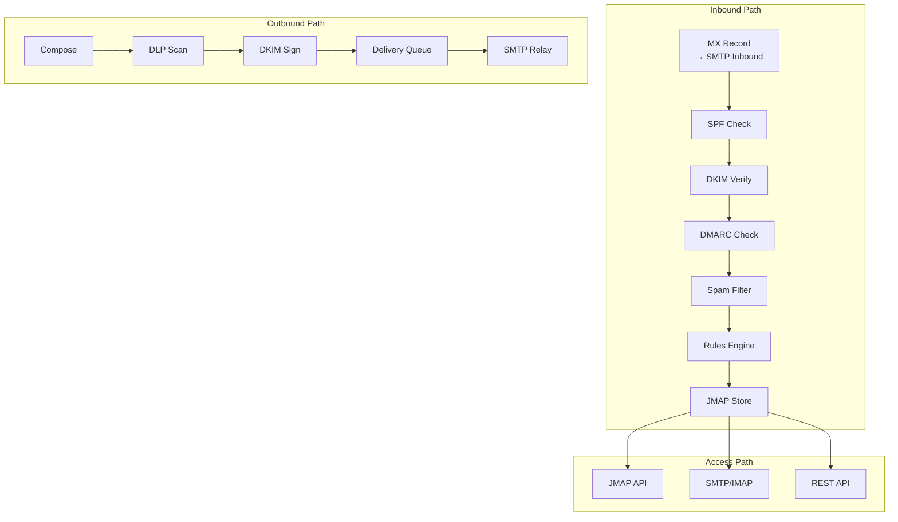
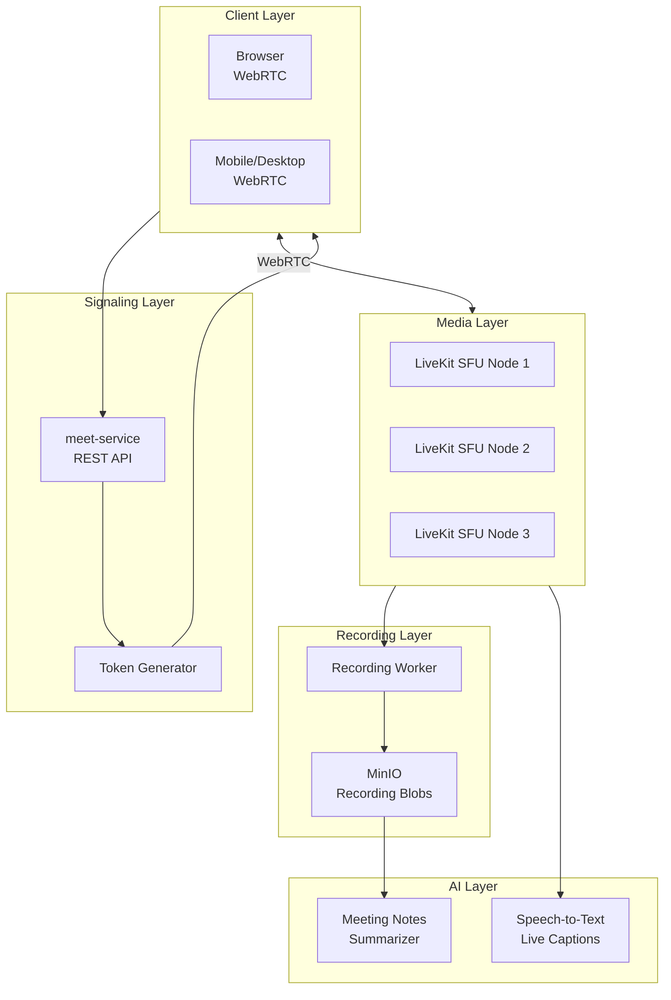
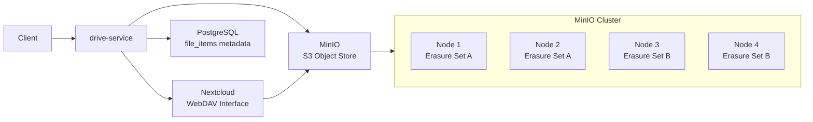
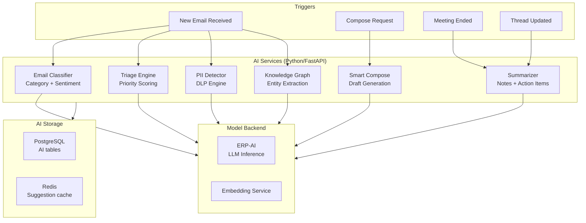

# ERP-Workspace High-Level Design

> **Document ID:** ERP-WS-HLD-012
> **Version:** 1.0.0
> **Last Updated:** 2026-02-23
> **Status:** Approved

---

## 1. Design Philosophy

ERP-Workspace is designed around four core principles: (1) **Unified Experience** -- a single pane of glass for all communication and collaboration; (2) **Polyglot Performance** -- the right language for each job (Rust for email throughput, Go for API services, Python for AI); (3) **Open Standards** -- SMTP, JMAP, CalDAV, WebDAV, WebRTC, CloudEvents; (4) **Self-Sovereign Data** -- full control over data location, encryption, and retention.

---

## 2. System Decomposition

---

## 3. Service Interaction Design

### 3.1 Synchronous Communication

All client-to-service communication uses REST over HTTPS with JSON payloads. Internal service-to-service calls use gRPC for type-safe, high-performance RPC where latency is critical (entitlement checks, AI inference). The API gateway handles:

- JWT token validation (RS256) via ERP-IAM
- X-Tenant-ID header enforcement
- Rate limiting per tenant (Redis-backed token bucket)
- Request routing to appropriate service
- Response caching for read-heavy endpoints

### 3.2 Asynchronous Communication

Event-driven communication uses Redpanda (Kafka-compatible) with CloudEvents envelope format. Every state change publishes an event to the `erp.workspace.<entity>.<action>` topic hierarchy. Consumer groups include:

### 3.3 Real-time Communication

WebSocket connections provide real-time updates for:
- Chat message delivery and typing indicators
- Document co-editing cursor positions
- Meeting participant state changes
- Inbox notification push

Redis Pub/Sub distributes real-time events across service replicas. The WebSocket connection lifecycle:

---

## 4. Multi-Tenant Architecture

### 4.1 Tenant Isolation Model

### 4.2 Data Isolation Layers

| Layer | Mechanism | Granularity |
|-------|-----------|-------------|
| Network | Kubernetes network policies | Namespace |
| Application | X-Tenant-ID header validation | Request |
| Database | Row-Level Security (RLS) | Row |
| Storage | MinIO bucket per tenant | Object |
| Cache | Redis key prefix per tenant | Key |
| Events | Tenant ID in CloudEvents | Event |

---

## 5. Email Architecture (High-Level)

---

## 6. Video Meeting Architecture

---

## 7. Storage Architecture

---

## 8. AI Feature Architecture

---

## 9. Deployment Topology

| Component | Replicas | CPU | Memory | Storage |
|-----------|---------|-----|--------|---------|
| API Gateway | 3 | 1 core | 512MB | - |
| email-service | 3 | 2 cores | 1GB | - |
| calendar-service | 2 | 1 core | 512MB | - |
| meet-service | 2 | 1 core | 512MB | - |
| chat-service | 3 | 2 cores | 1GB | - |
| docs-service | 2 | 1 core | 512MB | - |
| drive-service | 2 | 1 core | 512MB | - |
| contacts-service | 2 | 1 core | 512MB | - |
| Rust SMTP/JMAP | 3 | 4 cores | 4GB | - |
| AI Features (FastAPI) | 2 | 2 cores | 2GB | - |
| PostgreSQL Primary | 1 | 8 cores | 32GB | 500GB SSD |
| PostgreSQL Replica | 2 | 4 cores | 16GB | 500GB SSD |
| Redis Cluster | 3 | 2 cores | 8GB | - |
| MinIO Cluster | 4 | 2 cores | 4GB | 10TB HDD |
| Redpanda | 3 | 4 cores | 8GB | 200GB SSD |
| Quickwit | 2 | 4 cores | 8GB | 500GB SSD |
| ClickHouse | 2 | 4 cores | 16GB | 1TB SSD |
| LiveKit SFU | 3 | 8 cores | 8GB | - |
| ONLYOFFICE DS | 2 | 4 cores | 4GB | - |
| Nextcloud | 2 | 2 cores | 4GB | - |

---

*For detailed component specifications, see [14-Technical-Specifications.md](./14-Technical-Specifications.md). For deployment procedures, see [25-Deployment-Pipeline.md](./25-Deployment-Pipeline.md).*
