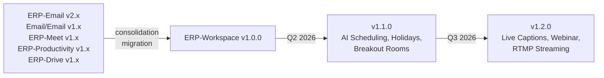

# ERP-Workspace Release Notes

> **Document ID:** ERP-WS-RN-013
> **Version:** 1.0.0
> **Last Updated:** 2026-02-23
> **Status:** Published

---

## Release 1.0.0 (2026-02-23) -- Initial Consolidated Release

### Overview

This is the inaugural release of ERP-Workspace, the unified Communication and Collaboration Suite formed by consolidating five previously independent modules: ERP-Email, Email/Email (Legacy), ERP-Meet, ERP-Productivity, and ERP-Drive into a single cohesive workspace platform.

### New Features

#### Email Service
- Rust-based SMTP/JMAP mail server delivering 100K messages/second
- Conversation threading with collapsible message view
- Labels, folders, and custom categorization
- Rules and filters engine with conditional actions
- Email signatures with per-account customization
- Delegation (send-as, send-on-behalf)
- Shared mailboxes with role-based access (reader, sender, admin)
- Distribution lists with moderation support
- DLP with AI-powered PII detection and optional auto-redaction
- Email archiving with configurable retention policies
- eDiscovery search across all tenant mailboxes
- S/MIME encryption and digital signatures
- Multi-provider email delivery (SendGrid, AWS SES, Postmark, Mailgun, Brevo, MailerSend)
- AI Smart Compose with tone adjustment (professional, casual, formal)
- AI Email Triage with Focus/Other inbox separation
- Email-to-Action pipeline extracting tasks and meetings from emails
- Sentiment analysis timeline per contact
- Email knowledge graph (people, organizations, topics)
- Collaborative email drafting with inline comments
- Email health score dashboard (SPF, DKIM, DMARC, MTA-STS)
- Scheduled digest mode for batched delivery

#### Calendar Service
- Shared calendars with fine-grained permissions
- Free/busy lookup across organization
- Room and resource booking with conflict detection
- Recurring events with full RRULE support
- RSVP management (accept, decline, tentative)
- CalDAV protocol support for third-party clients
- Timezone-aware scheduling across regions
- Meeting room management with amenity filtering

#### Video Meeting Service
- LiveKit SFU integration supporting up to 1,000 participants
- Screen sharing (full screen, application window, browser tab)
- Cloud recording with MinIO storage
- Virtual backgrounds (blur, custom images)
- Meeting lifecycle management (create, join, leave, end)

#### Chat Service
- Public and private channels
- Direct messages (1:1 and group)
- Threaded replies with reply count indicators
- @mentions (user, channel, @here, @all)
- Emoji reactions
- File sharing within conversations
- Full-text message search
- Message pinning
- Read receipts and typing indicators

#### Document Editing
- ONLYOFFICE-powered real-time collaborative editing
- Word/Excel/PowerPoint format compatibility
- Version history with restore capability
- Comments and inline discussions
- Co-authoring with visible cursors and user colors

#### Cloud Storage
- File upload/download via MinIO S3 API
- Share files with view/edit permissions
- Folder hierarchy with drag-and-drop
- File version history
- Storage quotas per user and team
- Share links with expiry and download limits
- Team drives with shared ownership
- File locking for exclusive editing

#### AI & Innovation Features
- AI email classification (category, sentiment, priority)
- AI smart replies
- AI meeting/document/thread summaries
- Search index via Quickwit
- Analytics reports and anomaly detection
- Privacy guardian with PII scanning
- Email behavior pattern analysis
- Predictive follow-up intelligence

### Database
- 85+ PostgreSQL tables across 11 DDD bounded contexts
- 12 migration files establishing the full schema
- Covering indexes for JMAP queries (50-100x latency reduction)
- BRIN indexes for time-series data
- Partial indexes for common filters

### Infrastructure
- 7 Go microservices with Dockerfile and health checks
- API Gateway with JWT validation and tenant isolation
- Redpanda event bus with 35+ CloudEvents topics
- Multi-provider email delivery with circuit breaker

### Known Limitations
- AI scheduling assistant (FR-CAL-007) is planned for v1.1
- 250+ country holiday packs (FR-CAL-010) are planned for v1.1
- Breakout rooms (FR-MEET-005) are designed but not yet implemented
- AI live captions (FR-MEET-006) are designed but not yet implemented
- Guest access for chat (FR-CHAT-009) is designed but not yet implemented

### Migration Notes
- Organizations migrating from ERP-Email should update API endpoints from `/v1/mail` to `/v1/email`
- Legacy Email provider configurations are preserved in `imports/email_legacy/`
- ERP-Meet configurations are preserved in `imports/meet_core/`
- All five source repositories should be archived after successful migration

---

## Upgrade Path

---

*For detailed feature specifications, see [02-Product-Requirements-Document.md](./02-Product-Requirements-Document.md). For migration procedures, see [25-Deployment-Pipeline.md](./25-Deployment-Pipeline.md).*
