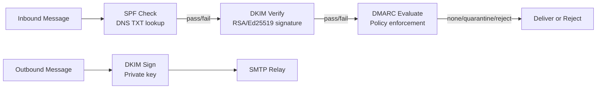
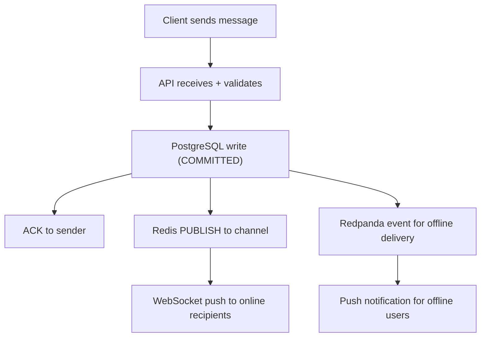
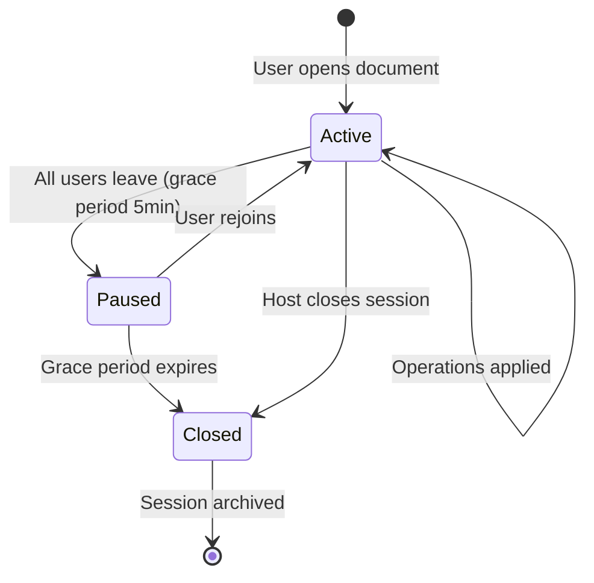

# ERP-Workspace Technical Specifications

> **Document ID:** ERP-WS-TS-014
> **Version:** 1.0.0
> **Last Updated:** 2026-02-23
> **Status:** Approved

---

## 1. Email Server Specification

### 1.1 SMTP Server (Rust)

| Specification | Value |
|--------------|-------|
| Language | Rust 1.75+ |
| Async Runtime | Tokio |
| Protocol | SMTP (RFC 5321), ESMTP |
| TLS | TLS 1.2/1.3 (rustls) |
| Authentication | SMTP AUTH (PLAIN, LOGIN, CRAM-MD5) |
| Throughput | 100,000 messages/second per cluster |
| Max Message Size | 50MB (configurable per tenant) |
| Connection Limits | 1,000 concurrent SMTP sessions per node |
| Queue Backend | Redpanda/Kafka persistent queue |

### 1.2 JMAP Server (Rust)

| Specification | Value |
|--------------|-------|
| Protocol | JMAP Core (RFC 8620), JMAP Mail (RFC 8621) |
| Transport | HTTPS + EventSource for push |
| Concurrency | 10,000 concurrent connections per node |
| Sync Efficiency | Delta sync via state tokens |
| Blob Storage | MinIO (S3 API) for email bodies and attachments |
| Metadata Storage | PostgreSQL for message metadata |

### 1.3 Email Authentication



---

## 2. Video Meeting Specification

### 2.1 LiveKit SFU Configuration

| Specification | Value |
|--------------|-------|
| Protocol | WebRTC (ICE, DTLS, SRTP) |
| Codec (Video) | VP8, VP9, H.264, AV1 |
| Codec (Audio) | Opus |
| Max Participants | 1,000 per room |
| Simulcast | Enabled (3 layers: low/medium/high) |
| Adaptive Bitrate | Enabled |
| Recording Format | MP4 (H.264 + AAC) |
| Recording Storage | MinIO via LiveKit Egress |

### 2.2 Meeting Token Generation

```json
{
  "iss": "erp-workspace-meet",
  "sub": "user-uuid",
  "room": "meeting-uuid",
  "permissions": {
    "canPublish": true,
    "canSubscribe": true,
    "canPublishData": true,
    "canPublishSources": ["camera", "microphone", "screen_share"]
  },
  "exp": 1708700000
}
```

---

## 3. Chat Specification

### 3.1 WebSocket Protocol

| Specification | Value |
|--------------|-------|
| Protocol | WebSocket Secure (WSS) |
| Heartbeat | Ping/Pong every 30 seconds |
| Reconnection | Exponential backoff (1s, 2s, 4s, 8s, 16s, max 30s) |
| Message Format | JSON |
| Compression | Per-message deflate |

### 3.2 Message Delivery Guarantees



- **At-least-once delivery** for real-time WebSocket push
- **Exactly-once storage** via PostgreSQL unique constraints
- **Idempotency** via client-generated message UUIDs

---

## 4. Document Editing Specification

### 4.1 ONLYOFFICE Integration

| Specification | Value |
|--------------|-------|
| Protocol | WOPI (Web Application Open Platform Interface) |
| Supported Formats | DOCX, XLSX, PPTX, ODT, ODS, ODP, CSV, TXT |
| Max Co-editors | 20 per document |
| Auto-save Interval | 5 seconds |
| Conflict Resolution | Operational Transformation (OT) |
| Version Storage | MinIO (full document snapshots) |

### 4.2 Collaboration Session Lifecycle



---

## 5. Storage Specification

### 5.1 MinIO Configuration

| Specification | Value |
|--------------|-------|
| API | S3-compatible (ListBuckets, PutObject, GetObject) |
| Erasure Coding | EC:4 (4 data + 4 parity drives) |
| Bucket Strategy | One bucket per tenant |
| Object Naming | `{tenant_id}/{file_type}/{uuid}/{version}` |
| Max Object Size | 5TB |
| Multipart Upload | Required for objects > 100MB |
| Server-Side Encryption | SSE-S3 (AES-256) |

### 5.2 File Upload Flow

| Step | Action | Latency Target |
|------|--------|---------------|
| 1 | Client initiates upload | - |
| 2 | API validates quota | < 5ms |
| 3 | Presigned URL generated | < 10ms |
| 4 | Client uploads direct to MinIO | Network-dependent |
| 5 | Callback to drive-service | < 20ms |
| 6 | Metadata stored in PostgreSQL | < 15ms |
| 7 | Search index updated | < 100ms (async) |
| 8 | Event published | < 5ms |

---

## 6. Database Specifications

### 6.1 PostgreSQL Configuration

| Parameter | Value |
|-----------|-------|
| Version | 16 |
| max_connections | 500 |
| shared_buffers | 8GB |
| effective_cache_size | 24GB |
| work_mem | 64MB |
| maintenance_work_mem | 2GB |
| wal_level | logical |
| max_wal_size | 4GB |
| default_statistics_target | 100 |
| random_page_cost | 1.1 (SSD) |

### 6.2 Connection Pooling (PgBouncer)

| Parameter | Value |
|-----------|-------|
| Pool Mode | Transaction |
| Max Client Connections | 5,000 |
| Default Pool Size | 20 per database |
| Reserve Pool Size | 5 |
| Server Lifetime | 3600 seconds |

### 6.3 Partitioning Strategy

| Table | Partition Key | Strategy |
|-------|-------------|----------|
| email_messages | (tenant_id, sent_at) | Range by month |
| email_events | (tenant_id, timestamp) | Range by month |
| chat_messages | (tenant_id, created_at) | Range by month |
| collaboration_operations | (session_id, revision) | Range by revision block |
| search_query_log | (searched_at) | Range by month |
| email_event_staging | (event_timestamp) | Range by day |

---

## 7. Search Specification (Quickwit)

| Specification | Value |
|--------------|-------|
| Engine | Quickwit 0.8+ (Rust-based) |
| Index Types | email, chat, file, contact, calendar |
| Tokenizer | Default (whitespace + lowercase + stemming) |
| Max Doc Size | 10MB |
| Query Latency Target | < 50ms P99 |
| Index Refresh | Near real-time (< 5 seconds) |

---

## 8. Analytics Specification (ClickHouse)

| Specification | Value |
|--------------|-------|
| Engine | MergeTree family |
| Data Sources | Email events, chat metrics, meeting stats, file activity |
| Retention | 13 months rolling |
| Query Targets | Dashboard aggregations < 1s, ad-hoc reports < 10s |

---

## 9. Caching Specification (Redis)

| Cache Key Pattern | TTL | Purpose |
|------------------|-----|---------|
| `tenant:{id}:config` | 5 min | Tenant configuration |
| `user:{id}:preferences` | 10 min | User preferences |
| `entitlement:{tenant_id}` | 60 sec | Module entitlements |
| `ai:compose:{hash}` | 1 hour | Smart compose cache |
| `session:{token}` | 24 hours | User session data |
| `rate:{tenant_id}:{endpoint}` | 1 min | Rate limit counters |
| `ws:presence:{user_id}` | 60 sec | Online presence |

---

*For API endpoint details, see [21-API-Documentation.md](./21-API-Documentation.md). For performance benchmarks, see [23-Performance-Benchmarks.md](./23-Performance-Benchmarks.md).*
