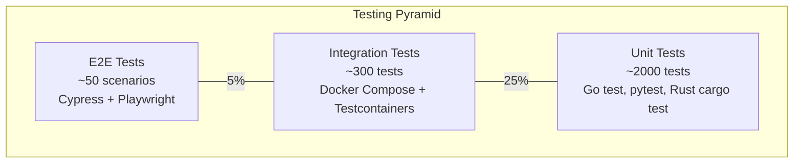
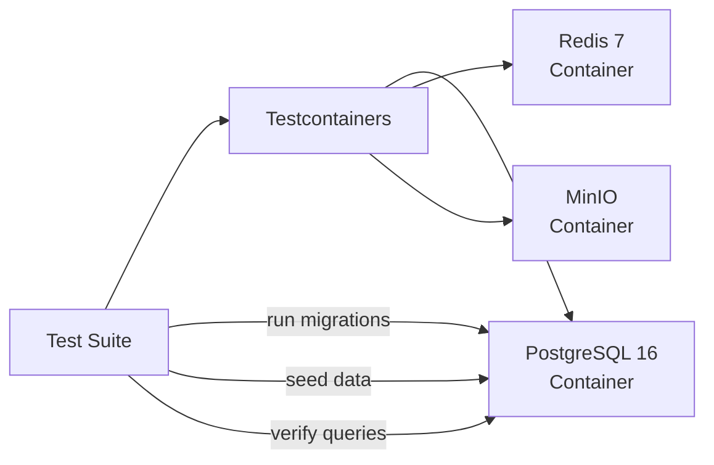
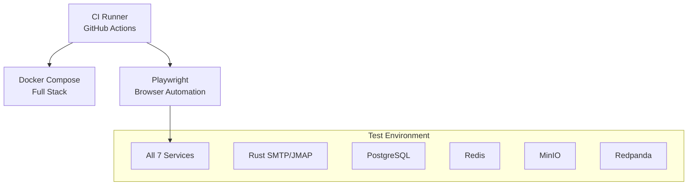

# ERP-Workspace Testing Strategy

> **Document ID:** ERP-WS-TEST-015
> **Version:** 1.0.0
> **Last Updated:** 2026-02-23
> **Status:** Approved

---

## 1. Testing Pyramid

---

## 2. Unit Testing

### 2.1 Go Services

| Aspect | Specification |
|--------|-------------|
| Framework | `testing` stdlib + `testify/assert` |
| Coverage Target | 80% line coverage |
| Mocking | Interface-based mocks, `mockgen` |
| Test Naming | `Test<Function>_<Scenario>_<Expected>` |

Key test areas per service:
- **email-service**: Message validation, rule evaluation, DLP policy matching, delegation authorization
- **calendar-service**: Recurrence expansion, conflict detection, timezone conversion, free/busy aggregation
- **chat-service**: Message formatting, mention parsing, thread management, read receipt logic
- **drive-service**: Quota calculation, permission inheritance, version numbering, share link validation
- **contacts-service**: Contact deduplication, group membership, label management

### 2.2 Rust Mail Server

| Aspect | Specification |
|--------|-------------|
| Framework | `cargo test` + `tokio::test` |
| Coverage Target | 85% line coverage |
| Focus Areas | SMTP parser, JMAP protocol, DKIM signing/verification, queue management |

### 2.3 Python AI Services

| Aspect | Specification |
|--------|-------------|
| Framework | pytest + pytest-asyncio |
| Coverage Target | 75% line coverage |
| Focus Areas | Classification accuracy, PII detection recall, summary quality, compose relevance |

---

## 3. Integration Testing

### 3.1 Database Integration

Integration tests verify:
- All 12 migration files apply successfully
- CRUD operations across all 85+ tables
- Index performance with realistic data volumes
- RLS policies enforce tenant isolation
- Foreign key constraints are correctly defined
- Covering indexes eliminate heap lookups

### 3.2 Service Integration

| Test Scenario | Services Under Test | Verification |
|--------------|-------------------|-------------|
| Email send-receive loop | email-service, Rust SMTP | Message stored and retrievable |
| Calendar RSVP flow | calendar-service, email-service | RSVP email sent, attendee status updated |
| Chat file share | chat-service, drive-service | File uploaded, message with preview created |
| Document co-edit | docs-service, ONLYOFFICE | Concurrent edits merge correctly |
| Search indexing | All services, Quickwit | Events consumed and documents searchable |

### 3.3 Event Integration

| Test Scenario | Producer | Consumer | Verification |
|--------------|---------|----------|-------------|
| Email created event | email-service | search-indexer | Email appears in search results |
| Meeting ended event | meet-service | ai-summarizer | Meeting notes generated |
| Chat message event | chat-service | analytics-pipeline | Message counted in ClickHouse |
| File uploaded event | drive-service | notification-hub | Share notification delivered |

---

## 4. End-to-End Testing

### 4.1 Critical User Journeys

| Journey | Steps | Priority |
|---------|-------|----------|
| Email compose-send-receive | Login, compose, send, verify delivery, check inbox | P0 |
| Meeting schedule-join-record | Create event, join meeting, record, verify recording | P0 |
| Chat channel lifecycle | Create channel, invite, send message, thread reply | P0 |
| Document collaboration | Create doc, share, co-edit, verify version history | P0 |
| File upload-share-download | Upload file, share with user, download as recipient | P0 |
| Search across all types | Search query, verify results from email, chat, files | P1 |
| Admin provisioning | Create tenant, provision mailboxes, configure policies | P1 |

### 4.2 E2E Test Configuration

---

## 5. Performance Testing

### 5.1 Load Test Scenarios

| Scenario | Tool | Target | Duration |
|----------|------|--------|----------|
| SMTP throughput | Custom Rust client | 100K msg/sec sustained | 15 min |
| JMAP listing | k6 | 10K req/sec, < 50ms P99 | 10 min |
| Chat message storm | k6 + WebSocket | 50K msg/sec | 10 min |
| Calendar query | k6 | 5K req/sec, < 75ms P99 | 10 min |
| File upload | k6 | 1K uploads/sec (1MB each) | 10 min |
| Search query | k6 | 5K queries/sec, < 200ms P99 | 10 min |
| Mixed workload | k6 | Realistic user simulation | 30 min |

### 5.2 Stress Test Thresholds

| Metric | Warning | Critical |
|--------|---------|----------|
| P99 Latency | > 2x target | > 5x target |
| Error Rate | > 0.1% | > 1% |
| CPU Usage | > 80% | > 95% |
| Memory Usage | > 80% | > 95% |
| PostgreSQL Connections | > 80% pool | > 95% pool |

---

## 6. Security Testing

| Category | Tool | Frequency |
|----------|------|-----------|
| SAST | Semgrep, gosec, cargo-audit | Every PR |
| DAST | OWASP ZAP | Weekly |
| Dependency scanning | Dependabot, cargo-deny | Daily |
| Container scanning | Trivy | Every build |
| Penetration testing | External firm | Quarterly |
| S/MIME validation | Custom test suite | Every release |
| PII detection accuracy | Labeled dataset | Every model update |

---

## 7. Test Data Management

- **Factories**: Each bounded context has a test data factory generating realistic but synthetic data
- **Seed scripts**: SQL scripts populate a representative dataset (1000 contacts, 10K emails, 500 events)
- **PII masking**: Production data is never used in testing; synthetic PII data is clearly marked
- **Tenant isolation verification**: Every test suite includes a cross-tenant access attempt that must fail

---

*For CI/CD pipeline details, see [25-Deployment-Pipeline.md](./25-Deployment-Pipeline.md). For performance benchmark results, see [23-Performance-Benchmarks.md](./23-Performance-Benchmarks.md).*
