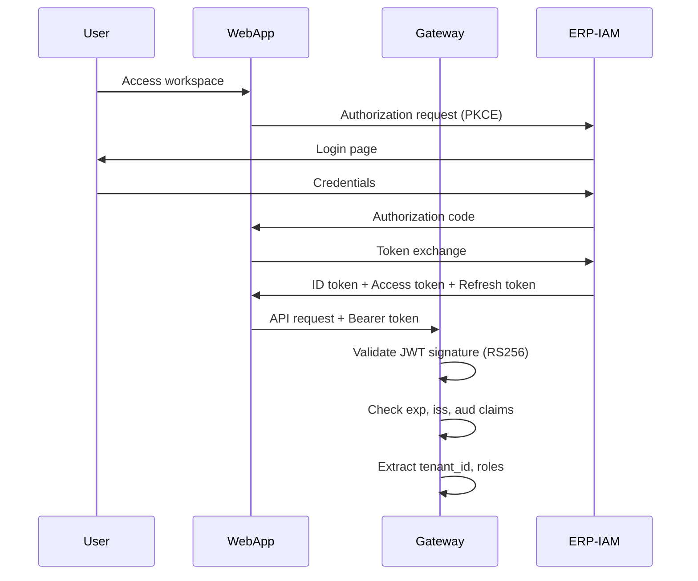
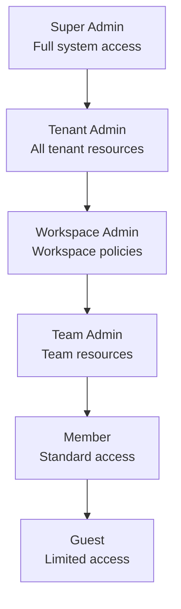
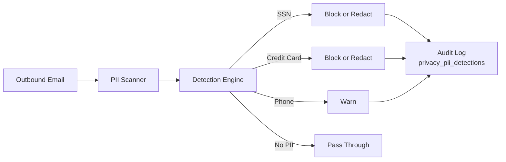

# ERP-Workspace Security Architecture

> **Document ID:** ERP-WS-SEC-016
> **Version:** 1.0.0
> **Last Updated:** 2026-02-23
> **Status:** Approved

---

## 1. Security Model Overview

```mermaid
flowchart TB
    subgraph perimeter["Perimeter Security"]
        waf["WAF<br/>OWASP Core Rules"]
        ddos["DDoS Protection<br/>Rate Limiting"]
        tls["TLS 1.3<br/>Certificate Management"]
    end

    subgraph identity["Identity & Access"]
        oidc["OIDC/OAuth 2.0<br/>ERP-IAM"]
        jwt["JWT Validation<br/>RS256/ES256"]
        rbac["RBAC<br/>Role Hierarchy"]
        tenant["Tenant Isolation<br/>X-Tenant-ID"]
    end

    subgraph data_sec["Data Security"]
        encrypt_transit["In-Transit<br/>TLS 1.3 + mTLS"]
        encrypt_rest["At-Rest<br/>AES-256"]
        smime["Email E2E<br/>S/MIME"]
        dtls_srtp["Media E2E<br/>DTLS/SRTP"]
        rls["Database<br/>Row-Level Security"]
    end

    subgraph app_sec["Application Security"]
        dlp["DLP<br/>PII Detection"]
        input_val["Input Validation<br/>Schema enforcement"]
        csrf["CSRF Protection"]
        csp["CSP Headers"]
    end

    subgraph ops_sec["Operational Security"]
        audit["Audit Logging<br/>Immutable trail"]
        secrets["Secret Management<br/>Vault / K8s Secrets"]
        scan["Vulnerability Scanning<br/>SAST/DAST/SCA"]
    end

    perimeter --> identity --> data_sec --> app_sec --> ops_sec
```

---

## 2. Authentication

### 2.1 OIDC Flow

All user authentication is delegated to ERP-IAM via OpenID Connect:

### 2.2 Service-to-Service Authentication

Internal service communication uses mTLS with certificates issued by an internal CA. Each service has a unique identity certificate. The API gateway validates client certificates for all internal calls.

### 2.3 Guest Access

External guests receive time-limited JWT tokens with restricted permissions:
- Chat: read/write in specifically shared conversations only
- Meetings: join with presenter or attendee role
- Documents: view/edit based on share permission
- No access to email, calendar, contacts, or admin functions

---

## 3. Authorization

### 3.1 Role Hierarchy

### 3.2 Permission Matrix

| Resource | Guest | Member | Team Admin | Workspace Admin | Tenant Admin |
|----------|-------|--------|-----------|-----------------|-------------|
| Read own email | - | Yes | Yes | Yes | Yes |
| Send email | - | Yes | Yes | Yes | Yes |
| Access shared mailbox | - | If assigned | If assigned | Yes | Yes |
| Create channel | - | Yes | Yes | Yes | Yes |
| Delete channel | - | Own only | Team's | All | All |
| Join meeting | Invited | Yes | Yes | Yes | Yes |
| Record meeting | - | If permitted | Yes | Yes | Yes |
| Edit shared document | If shared | Yes | Yes | Yes | Yes |
| Manage DLP policies | - | - | - | Yes | Yes |
| Run eDiscovery | - | - | - | - | Yes |
| Provision mailboxes | - | - | - | - | Yes |

---

## 4. Email Security

### 4.1 Transport Security

| Protocol | Encryption | Minimum Version |
|----------|-----------|----------------|
| SMTP (inbound) | STARTTLS → TLS 1.2+ | Opportunistic |
| SMTP (outbound) | STARTTLS → TLS 1.2+ | Required for sensitive domains |
| JMAP | HTTPS/TLS 1.3 | Required |
| IMAP | IMAPS/TLS 1.2+ | Required |

### 4.2 Email Authentication Chain

| Method | Purpose | Implementation |
|--------|---------|---------------|
| SPF | Verify sender IP authorization | DNS TXT record validation |
| DKIM | Verify message integrity | RSA-2048 or Ed25519 signatures |
| DMARC | Policy enforcement | Alignment check + reporting |
| MTA-STS | Enforce TLS for receiving domain | HTTPS policy publishing |
| DANE | Certificate-based SMTP security | TLSA DNS records |

### 4.3 S/MIME

S/MIME provides end-to-end email encryption:
- Certificate management per user (X.509v3)
- Encrypt: AES-256-CBC with RSA-2048 key encapsulation
- Sign: SHA-256 digest with RSA-2048 signature
- Certificate revocation via CRL and OCSP
- Tenant-level CA certificate trust store

### 4.4 Data Loss Prevention

---

## 5. Meeting Security

| Control | Implementation |
|---------|---------------|
| Meeting passwords | Optional per-meeting PIN |
| Waiting room | Host admission required |
| Media encryption | DTLS for key exchange, SRTP for media |
| Recording consent | Notification to all participants |
| Host controls | Mute/remove participants, lock meeting |

---

## 6. Data Protection

### 6.1 Encryption at Rest

| Data Store | Algorithm | Key Management |
|-----------|-----------|---------------|
| PostgreSQL | AES-256 (transparent data encryption) | Kubernetes Secrets / Vault |
| MinIO | SSE-S3 (AES-256) | Internal key rotation |
| Redis | Not encrypted (ephemeral cache) | Network isolation |
| ClickHouse | AES-256-CTR | Disk-level encryption |

### 6.2 Data Residency

All data storage locations are configurable per tenant. The system supports:
- Single-region deployment with all data in one jurisdiction
- Multi-region with data affinity (tenant pinned to region)
- Encryption key sovereignty (customer-managed keys via Vault)

### 6.3 Data Retention

| Data Type | Default Retention | Configurable |
|----------|------------------|-------------|
| Email messages | Indefinite | Yes (per tenant policy) |
| Chat messages | 365 days | Yes (per channel policy) |
| Meeting recordings | 90 days | Yes (per tenant policy) |
| Audit logs | 7 years | No (compliance minimum) |
| File versions | 100 versions | Yes (per library) |
| Search query logs | 90 days | Yes |
| AI caches | 1 hour - 30 days | No (automatic) |

---

## 7. Compliance

### 7.1 Standards

| Standard | Status | Scope |
|----------|--------|-------|
| SOC 2 Type II | Planned | All services |
| GDPR | Designed for | EU data subjects |
| CCPA | Designed for | California residents |
| HIPAA | Architecture supports | Healthcare deployments |
| ISO 27001 | Planned | Information security |

### 7.2 GDPR Controls

- **Right to access**: Data export API for all user data
- **Right to erasure**: Tenant and user data deletion workflows
- **Data portability**: Export in standard formats (EML, ICS, vCard, CSV)
- **Consent management**: Configurable per feature
- **DPO tools**: Admin console with data processing inventory

---

*For operational security procedures, see [27-Runbooks.md](./27-Runbooks.md). For testing details, see [15-Testing-Strategy.md](./15-Testing-Strategy.md).*
