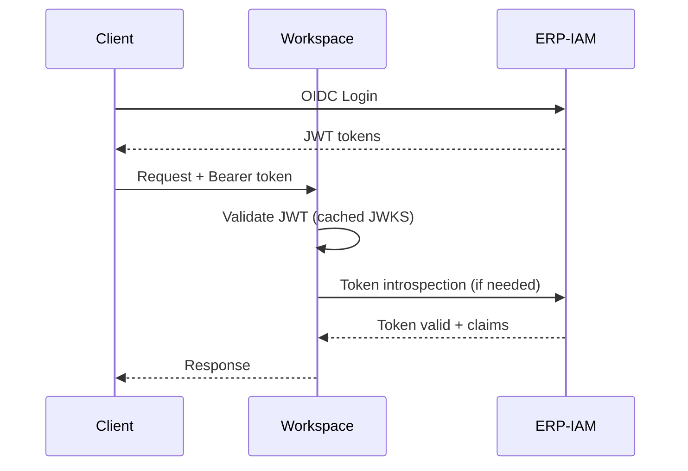
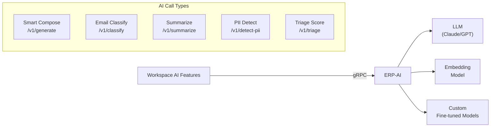
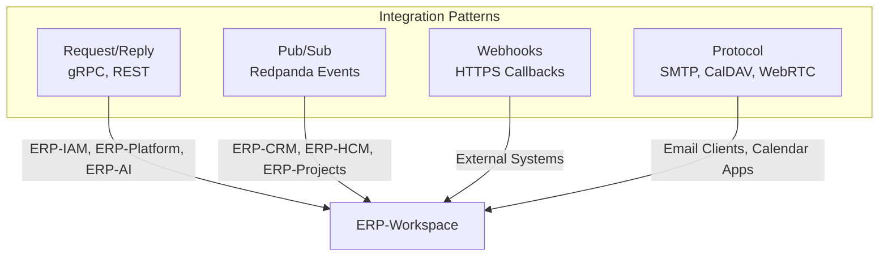

# ERP-Workspace Integration Patterns

> **Document ID:** ERP-WS-IP-017
> **Version:** 1.0.0
> **Last Updated:** 2026-02-23
> **Status:** Approved

---

## 1. Integration Overview

```mermaid
flowchart TB
    workspace["ERP-Workspace"]

    subgraph erp_modules["ERP Suite Integrations"]
        iam["ERP-IAM<br/>Auth/SSO"]
        platform["ERP-Platform<br/>Entitlements"]
        ai["ERP-AI<br/>ML Inference"]
        crm["ERP-CRM<br/>Contact Sync"]
        hcm["ERP-HCM<br/>Employee Directory"]
        projects["ERP-Projects<br/>Task Sync"]
        ipaas["ERP-iPaaS<br/>External Connectors"]
        assistant["ERP-Assistant<br/>AI Copilot"]
        marketing["ERP-Marketing<br/>Campaign Email"]
    end

    subgraph external["External Integrations"]
        caldav["CalDAV Clients"]
        smtp_ext["External MTAs"]
        webrtc_ext["WebRTC Clients"]
        oauth_ext["OAuth Apps"]
    end

    workspace --> iam & platform & ai & crm & hcm & projects & ipaas & assistant & marketing
    workspace <--> caldav & smtp_ext & webrtc_ext & oauth_ext
```



---

## 2. ERP-IAM Integration

**Pattern:** OIDC Provider / Token Validation



- **Protocol**: OIDC / OAuth 2.0 with PKCE
- **Token Format**: JWT (RS256)
- **Claims Used**: `sub`, `tenant_id`, `roles[]`, `email`, `name`
- **JWKS Caching**: 1 hour TTL, fetched from `ERP-IAM/.well-known/jwks.json`

---

## 3. ERP-Platform Integration

**Pattern:** Entitlement Check (Request/Reply)

- **Protocol**: gRPC
- **Endpoint**: `EntitlementService.Check(tenant_id, module_sku)`
- **Caching**: Redis, 60-second TTL per tenant
- **Fallback**: If Platform is unavailable, cached entitlements are used (degraded mode)

| SKU | Entitlement |
|-----|------------|
| `erp.workspace` | Full workspace suite |
| `erp.workspace.email` | Email only |
| `erp.workspace.meet` | Meetings only |
| `erp.workspace.chat` | Chat only |
| `erp.workspace.docs` | Docs/Sheets/Slides only |
| `erp.workspace.drive` | Drive only |

---

## 4. ERP-AI Integration

**Pattern:** Inference Service (Request/Reply)



- **Protocol**: gRPC with streaming for large content
- **Timeout**: 10 seconds for compose, 30 seconds for summarization
- **AIDD Guardrails**: All AI calls are logged; high-risk actions require human approval
- **Fallback**: If AI is unavailable, features degrade gracefully (no AI suggestions)

---

## 5. ERP-CRM Integration

**Pattern:** Event-Driven Sync (Pub/Sub)

| Event | Direction | Action |
|-------|----------|--------|
| `erp.crm.contact.created` | CRM -> Workspace | Create/update contact in directory |
| `erp.crm.contact.updated` | CRM -> Workspace | Update contact details |
| `erp.workspace.email.sent` | Workspace -> CRM | Log email activity on CRM contact timeline |
| `erp.workspace.meet.created` | Workspace -> CRM | Log meeting on CRM opportunity |

---

## 6. ERP-HCM Integration

**Pattern:** Event-Driven Sync (Pub/Sub)

| Event | Direction | Action |
|-------|----------|--------|
| `erp.hcm.employee.onboarded` | HCM -> Workspace | Provision mailbox, create contact |
| `erp.hcm.employee.terminated` | HCM -> Workspace | Disable mailbox, revoke access |
| `erp.hcm.org.updated` | HCM -> Workspace | Update department/team structure |

---

## 7. ERP-Projects Integration

**Pattern:** Bidirectional Event Sync

| Event | Direction | Action |
|-------|----------|--------|
| `erp.workspace.email.action_extracted` | Workspace -> Projects | Create task from email |
| `erp.workspace.meet.notes_generated` | Workspace -> Projects | Create action items from meeting |
| `erp.projects.task.assigned` | Projects -> Workspace | Notify via chat/email |
| `erp.projects.task.completed` | Projects -> Workspace | Update linked email action status |

---

## 8. External Protocol Integrations

### 8.1 SMTP Integration

| Direction | Protocol | Port | Authentication |
|----------|---------|------|---------------|
| Inbound | SMTP + STARTTLS | 25, 587 | SPF/DKIM/DMARC |
| Outbound | SMTP + STARTTLS | 25, 587 | DKIM signing |
| Submission | SMTP AUTH | 587 | PLAIN, LOGIN |

### 8.2 CalDAV Integration

| Operation | Method | Path |
|-----------|--------|------|
| Calendar discovery | PROPFIND | `/.well-known/caldav` |
| Event list | REPORT | `/calendars/{user}/{calendar}/` |
| Event create | PUT | `/calendars/{user}/{calendar}/{event}.ics` |
| Free/busy | POST | `/calendars/{user}/freebusy` |

### 8.3 WebRTC Integration

| Component | Protocol | Purpose |
|-----------|---------|---------|
| Signaling | WSS | Room join/leave, participant state |
| Media | DTLS/SRTP | Encrypted audio/video streams |
| Data channels | SCTP/DTLS | In-meeting chat, reactions |
| ICE | STUN/TURN | NAT traversal |

---

## 9. Webhook Integration

External systems can subscribe to workspace events via webhooks:

```json
{
  "url": "https://external.example.com/webhook",
  "events": ["email.created", "meet.ended", "chat.message.posted"],
  "secret": "whsec_...",
  "enabled": true
}
```

Delivery guarantees:
- At-least-once delivery with exponential backoff retry
- HMAC-SHA256 signature verification
- Maximum 3 retry attempts
- Delivery status tracking in `webhook_deliveries` table

---

## 10. Integration Architecture Diagram



---

*For API documentation, see [21-API-Documentation.md](./21-API-Documentation.md). For event schemas, see [04-Software-Architecture.md](./04-Software-Architecture.md).*
