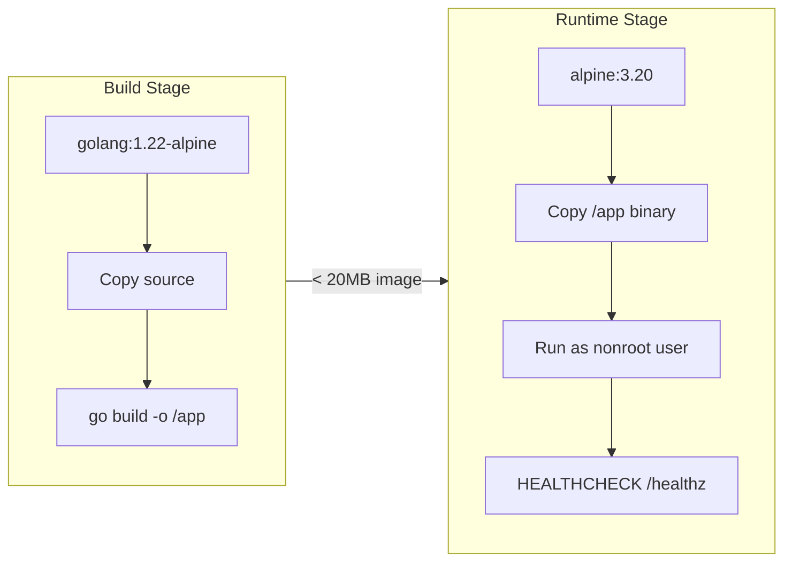
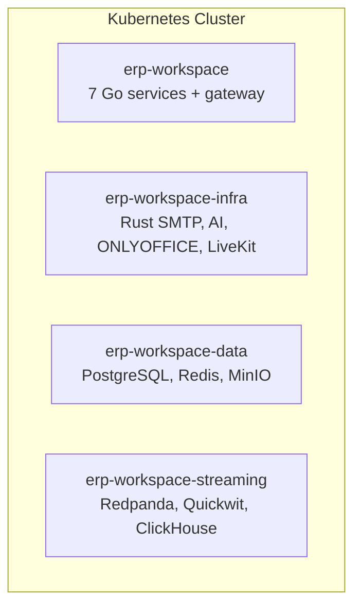
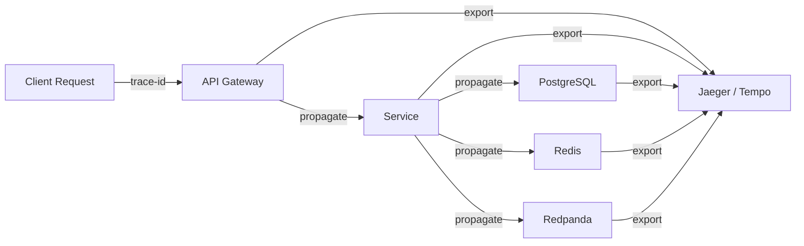

# ERP-Workspace DevOps & Infrastructure

> **Document ID:** ERP-WS-DEVOPS-018
> **Version:** 1.0.0
> **Last Updated:** 2026-02-23
> **Status:** Approved

---

## 1. Container Architecture

Each service is packaged as a multi-stage Docker image:

### Service Dockerfiles

| Service | Base Image | Binary Size | Image Size |
|---------|-----------|------------|-----------|
| email-service | alpine:3.20 | ~12MB | ~18MB |
| calendar-service | alpine:3.20 | ~10MB | ~16MB |
| meet-service | alpine:3.20 | ~11MB | ~17MB |
| chat-service | alpine:3.20 | ~11MB | ~17MB |
| docs-service | alpine:3.20 | ~10MB | ~16MB |
| drive-service | alpine:3.20 | ~10MB | ~16MB |
| contacts-service | alpine:3.20 | ~10MB | ~16MB |
| Rust SMTP/JMAP | debian:slim | ~25MB | ~50MB |
| AI Features | python:3.11-slim | N/A | ~200MB |

---

## 2. Kubernetes Deployment

### 2.1 Namespace Layout

### 2.2 Deployment Configuration

Each Go service deployment includes:
- Replicas: 2-3 (HPA managed)
- Resource limits: 1 CPU / 512MB RAM
- Liveness probe: `GET /healthz` every 10s
- Readiness probe: `GET /healthz` every 5s
- Rolling update: maxSurge=1, maxUnavailable=0
- Pod disruption budget: minAvailable=1

### 2.3 Horizontal Pod Autoscaler

| Service | Min | Max | CPU Target | Custom Metric |
|---------|-----|-----|-----------|--------------|
| email-service | 2 | 10 | 60% | smtp.queue.depth |
| calendar-service | 2 | 5 | 60% | - |
| meet-service | 2 | 8 | 60% | active.participants |
| chat-service | 2 | 10 | 60% | websocket.connections |
| docs-service | 2 | 5 | 60% | active.sessions |
| drive-service | 2 | 8 | 60% | upload.throughput |
| contacts-service | 2 | 5 | 60% | - |

---

## 3. Observability

### 3.1 Metrics (Prometheus)

| Metric | Type | Labels |
|--------|------|--------|
| `ws_http_requests_total` | Counter | service, method, path, status |
| `ws_http_request_duration_seconds` | Histogram | service, method, path |
| `ws_email_sent_total` | Counter | tenant_id, provider, status |
| `ws_chat_messages_total` | Counter | tenant_id, conversation_type |
| `ws_meet_participants_active` | Gauge | tenant_id, room_id |
| `ws_drive_uploads_total` | Counter | tenant_id, content_type |
| `ws_search_queries_total` | Counter | tenant_id, query_type |

### 3.2 Logging

- Format: Structured JSON
- Fields: timestamp, level, service, trace_id, span_id, tenant_id, message, error
- Output: stdout (collected by Fluentd/Vector)
- Retention: 30 days in Elasticsearch/Loki

### 3.3 Tracing (OpenTelemetry)

---

## 4. CI/CD Pipeline

```mermaid
flowchart LR
    push["Git Push"] --> lint["Lint<br/>golangci-lint<br/>clippy<br/>ruff"]
    lint --> test["Test<br/>Unit + Integration"]
    test --> security["Security<br/>Semgrep + Trivy"]
    security --> build["Build<br/>Docker multi-stage"]
    build --> push_img["Push Image<br/>Container Registry"]
    push_img --> deploy_staging["Deploy Staging<br/>Helm upgrade"]
    deploy_staging --> e2e["E2E Tests<br/>Playwright"]
    e2e --> approve["Manual Approval"]
    approve --> deploy_prod["Deploy Production<br/>Rolling update"]
    deploy_prod --> monitor["Monitor<br/>Error rate < 0.1%"]
```

---

## 5. Disaster Recovery

| Component | RPO | RTO | Strategy |
|-----------|-----|-----|----------|
| PostgreSQL | 1 hour | 15 min | Streaming replication + WAL archiving |
| MinIO | 4 hours | 30 min | Erasure coding + cross-site replication |
| Redis | N/A (cache) | 5 min | Cluster auto-failover |
| Redpanda | 0 (replicated) | 5 min | 3-node cluster with replication factor 3 |
| Configuration | 0 (GitOps) | 10 min | Helm charts in version control |

---

*For deployment procedures, see [25-Deployment-Pipeline.md](./25-Deployment-Pipeline.md). For runbooks, see [27-Runbooks.md](./27-Runbooks.md).*
