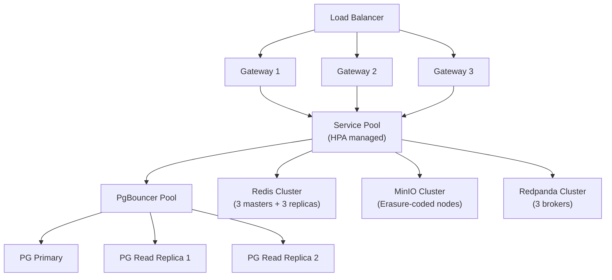
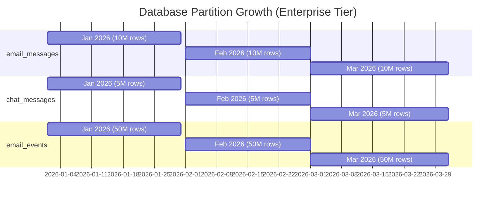
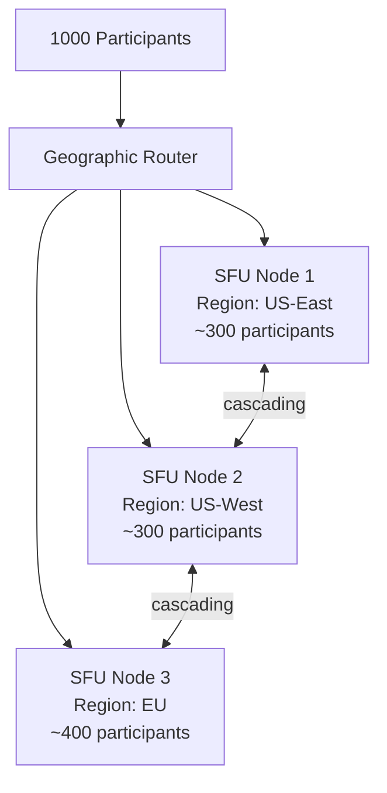

# ERP-Workspace Scalability Plan

> **Document ID:** ERP-WS-SP-019
> **Version:** 1.0.0
> **Last Updated:** 2026-02-23
> **Status:** Approved

---

## 1. Scalability Targets

| Tier | Users | Emails/day | Meetings/day | Chat msgs/day | Files stored |
|------|-------|-----------|-------------|--------------|-------------|
| Small | 100 | 10K | 50 | 5K | 100K |
| Medium | 1,000 | 100K | 500 | 50K | 1M |
| Large | 10,000 | 1M | 5K | 500K | 10M |
| Enterprise | 100,000 | 10M | 50K | 5M | 100M |

---

## 2. Horizontal Scaling Architecture



---

## 3. Database Scaling Strategy

### 3.1 Read Scaling

| Approach | Use Case | Implementation |
|----------|---------|---------------|
| Read replicas | Email listing, search, calendar queries | Streaming replication, read routing via PgBouncer |
| Connection pooling | All services | PgBouncer in transaction mode, 5000 client connections |
| Query caching | Repeated queries (entitlements, config) | Redis with 60-second TTL |
| Materialized views | Analytics dashboards | Refresh every 5 minutes |

### 3.2 Write Scaling

| Approach | Use Case | Implementation |
|----------|---------|---------------|
| Table partitioning | email_messages, chat_messages, email_events | Range partition by (tenant_id, month) |
| Batch inserts | Email events, analytics, audit logs | Batch 100 rows per INSERT |
| Async writes | Search indexing, analytics | Write to Redpanda, consume asynchronously |
| CQRS | Email listing vs. send | Separate read/write models for high-volume entities |

### 3.3 Partition Growth Model



---

## 4. Object Storage Scaling (MinIO)

| Deployment Size | Nodes | Drives/Node | Total Capacity | Erasure Set |
|----------------|-------|-------------|---------------|-------------|
| Small | 4 | 4 | 16TB | EC:4 |
| Medium | 8 | 8 | 128TB | EC:8 |
| Large | 16 | 12 | 768TB | EC:16 |
| Enterprise | 32 | 12 | 1.5PB | EC:16 x2 |

Scaling is performed by adding new server pools without downtime. Each pool operates as an independent erasure set.

---

## 5. Event Streaming Scaling (Redpanda)

| Topic | Partitions | Replication Factor | Retention |
|-------|-----------|-------------------|-----------|
| erp.workspace.email.* | 12 | 3 | 7 days |
| erp.workspace.chat.* | 12 | 3 | 3 days |
| erp.workspace.meet.* | 6 | 3 | 3 days |
| erp.workspace.docs.* | 6 | 3 | 3 days |
| erp.workspace.drive.* | 6 | 3 | 3 days |

Consumer group scaling: add consumers up to partition count for parallel processing.

---

## 6. Video Meeting Scaling (LiveKit)



- Each SFU node handles ~300-500 participants
- Cascading SFU connects nodes for cross-region meetings
- Auto-scaling based on active participant count
- Simulcast with 3 quality layers reduces bandwidth

---

## 7. Caching Scaling Strategy

| Cache Layer | Scaling Approach |
|------------|-----------------|
| Redis Cluster | Add shards for throughput, replicas for read capacity |
| Application cache | In-process LRU cache for hot config (10MB per instance) |
| CDN cache | Static assets, document previews, avatar images |
| Search cache | Quickwit internal segment caching, 8GB per node |
| JMAP state cache | Per-user sync state in Redis, sharded by user_id |

---

## 8. Capacity Planning Formula

```
Email Storage = users * emails_per_day * avg_email_size * retention_days
             = 100,000 * 100 * 50KB * 365
             = ~180 TB/year

File Storage = users * avg_files * avg_file_size
             = 100,000 * 1000 * 5MB
             = ~500 TB

Chat Storage = users * messages_per_day * avg_message_size * retention_days
             = 100,000 * 50 * 2KB * 365
             = ~3.6 TB/year

Meeting Recordings = meetings_per_day * avg_duration_min * bitrate * retention_days
                   = 50,000 * 30 * 2Mbps * 90
                   = ~20 TB
```

---

*For performance benchmarks, see [23-Performance-Benchmarks.md](./23-Performance-Benchmarks.md). For infrastructure details, see [18-DevOps-Infrastructure.md](./18-DevOps-Infrastructure.md).*
