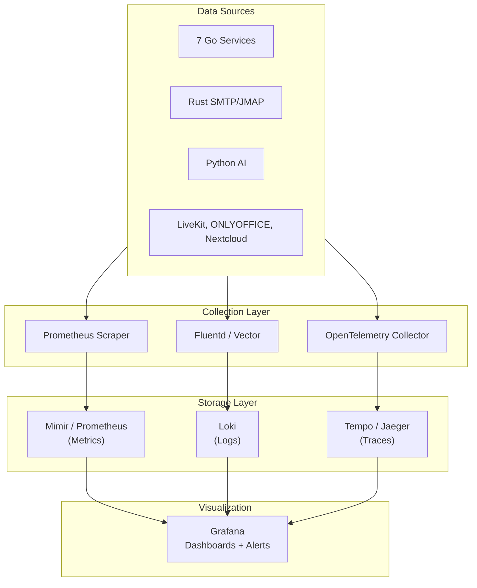
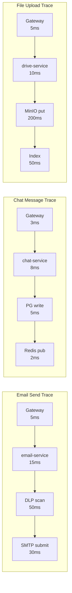

# ERP-Workspace Monitoring & Observability

> **Document ID:** ERP-WS-MON-020
> **Version:** 1.0.0
> **Last Updated:** 2026-02-23
> **Status:** Approved

---

## 1. Observability Stack



---

## 2. Key Dashboards

### 2.1 Workspace Overview Dashboard

| Panel | Metric | Visualization |
|-------|--------|--------------|
| Total Active Users | `ws_active_users_total` | Stat |
| Emails Sent (24h) | `rate(ws_email_sent_total[24h])` | Stat |
| Chat Messages (24h) | `rate(ws_chat_messages_total[24h])` | Stat |
| Active Meetings | `ws_meet_participants_active` | Gauge |
| Active Co-edit Sessions | `ws_docs_sessions_active` | Gauge |
| Storage Used | `ws_drive_storage_used_bytes` | Progress bar |
| Error Rate | `rate(ws_http_requests_total{status=~"5.."}[5m])` | Time series |
| P99 Latency | `histogram_quantile(0.99, ws_http_request_duration_seconds_bucket)` | Time series |

### 2.2 Email Health Dashboard

| Panel | Metric |
|-------|--------|
| Send Rate | `rate(ws_email_sent_total[5m])` by provider |
| Delivery Rate | `ws_email_delivered_total / ws_email_sent_total` |
| Bounce Rate | `rate(ws_email_bounced_total[1h])` |
| Spam Complaint Rate | `rate(ws_email_complained_total[1h])` |
| SMTP Queue Depth | `ws_smtp_queue_depth` |
| SPF/DKIM/DMARC Pass Rate | `ws_email_auth_pass_total` by method |

### 2.3 Meeting Quality Dashboard

| Panel | Metric |
|-------|--------|
| Active Participants | `ws_meet_participants_active` |
| Join Success Rate | `ws_meet_join_success / ws_meet_join_attempts` |
| Packet Loss | `ws_meet_packet_loss_percent` |
| Round Trip Time | `ws_meet_rtt_ms` |
| Recording Active | `ws_meet_recordings_active` |

---

## 3. Alerting Rules

### 3.1 Critical Alerts (PagerDuty)

| Alert | Condition | Severity |
|-------|-----------|----------|
| Service Down | `/healthz` returns non-200 for > 60s | Critical |
| Email Queue Overflow | `ws_smtp_queue_depth > 100,000` for > 5min | Critical |
| Database Connection Exhaustion | `pg_pool_active > 0.95 * pg_pool_max` | Critical |
| Error Rate Spike | `rate(5xx) > 1%` for > 5min | Critical |
| Disk Space Critical | `node_filesystem_avail < 10%` | Critical |

### 3.2 Warning Alerts (Slack)

| Alert | Condition | Severity |
|-------|-----------|----------|
| High Latency | `P99 > 2x target` for > 10min | Warning |
| Email Bounce Rate | `bounce_rate > 5%` for > 1h | Warning |
| Storage Quota Near Limit | `tenant_storage_used > 90%` | Warning |
| Meeting Packet Loss | `packet_loss > 3%` for > 5min | Warning |
| AI Service Degraded | `ai_request_error_rate > 10%` | Warning |
| Certificate Expiry | Certificate expires in < 30 days | Warning |

---

## 4. SLI/SLO Definitions

| Service | SLI | SLO | Error Budget (30 days) |
|---------|-----|-----|----------------------|
| Email Send | Delivery success rate | 99.5% | 0.5% (3.6 hours) |
| Email API | Request success rate | 99.9% | 0.1% (43 minutes) |
| Calendar API | Request success rate | 99.9% | 0.1% (43 minutes) |
| Chat Delivery | Message delivery rate | 99.9% | 0.1% (43 minutes) |
| Meet Join | Join success rate | 99.0% | 1.0% (7.2 hours) |
| Drive Upload | Upload success rate | 99.9% | 0.1% (43 minutes) |
| Search | Query success rate | 99.5% | 0.5% (3.6 hours) |

---

## 5. Distributed Tracing

### 5.1 Trace Propagation

All services propagate W3C Trace Context headers:
- `traceparent`: Trace ID + Span ID + Flags
- `tracestate`: Vendor-specific state

### 5.2 Critical Trace Paths



---

## 6. Health Check Endpoints

Every service exposes `/healthz` returning:

```json
{
  "status": "healthy",
  "module": "ERP-Workspace",
  "service": "email-service",
  "version": "1.0.0",
  "uptime_seconds": 86400,
  "checks": {
    "database": "ok",
    "redis": "ok",
    "event_bus": "ok"
  }
}
```

Kubernetes uses these for:
- **Liveness probe**: Restart pod if unhealthy for 30 seconds
- **Readiness probe**: Remove from service if unhealthy for 10 seconds
- **Startup probe**: Allow 60 seconds for initial startup

---

*For infrastructure details, see [18-DevOps-Infrastructure.md](./18-DevOps-Infrastructure.md). For runbooks responding to alerts, see [27-Runbooks.md](./27-Runbooks.md).*
