# ERP-Workspace Event Catalog

> **Document ID:** ERP-WS-EC-022
> **Version:** 1.0.0
> **Last Updated:** 2026-02-23
> **Status:** Approved

---

## 1. Event Architecture

```mermaid
flowchart LR
    subgraph producers["Producers"]
        email["email-service"]
        calendar["calendar-service"]
        meet["meet-service"]
        chat["chat-service"]
        docs["docs-service"]
        drive["drive-service"]
        contacts["contacts-service"]
    end

    bus["Redpanda<br/>Event Bus"]

    subgraph consumers["Consumer Groups"]
        idx["search-indexer"]
        analytics["analytics-pipeline"]
        ai_pipe["ai-pipeline"]
        notif["notification-hub"]
        audit["audit-logger"]
        sync["sync-connector"]
    end

    producers --> bus --> consumers
```

All events follow the CloudEvents v1.0 specification and are published to Redpanda topics using the naming convention `erp.workspace.<entity>.<action>`.



---

## 2. Event Catalog

### 2.1 Email Events

| Topic | Trigger | Key Payload Fields |
|-------|---------|-------------------|
| `erp.workspace.email.created` | Email sent or received | message_id, from, to, subject |
| `erp.workspace.email.read` | Email opened/read | message_id, user_id |
| `erp.workspace.email.updated` | Email labels/status changed | message_id, labels, status |
| `erp.workspace.email.deleted` | Email trashed/deleted | message_id |
| `erp.workspace.email.listed` | Email listing queried | tenant_id, query params |
| `erp.workspace.email.delivered` | SMTP delivery confirmed | message_id, recipient, provider |
| `erp.workspace.email.bounced` | Delivery bounce received | message_id, recipient, bounce_type |
| `erp.workspace.email.complained` | Spam complaint received | message_id, recipient |
| `erp.workspace.email.classified` | AI classification complete | message_id, category, sentiment |
| `erp.workspace.email.action_extracted` | AI extracted action item | email_id, action_type, title |

### 2.2 Calendar Events

| Topic | Trigger | Key Payload Fields |
|-------|---------|-------------------|
| `erp.workspace.calendar.created` | Event created | event_id, title, start_time, attendees |
| `erp.workspace.calendar.updated` | Event modified | event_id, changed_fields |
| `erp.workspace.calendar.deleted` | Event cancelled | event_id, cancellation_reason |
| `erp.workspace.calendar.read` | Event details viewed | event_id |
| `erp.workspace.calendar.listed` | Calendar events queried | calendar_id, date_range |
| `erp.workspace.calendar.rsvp` | Attendee responded | event_id, user_id, status |
| `erp.workspace.calendar.room_booked` | Room reserved | room_id, event_id, time_range |

### 2.3 Meet Events

| Topic | Trigger | Key Payload Fields |
|-------|---------|-------------------|
| `erp.workspace.meet.created` | Meeting created | meeting_id, host_id, scheduled_at |
| `erp.workspace.meet.updated` | Meeting settings changed | meeting_id, changed_fields |
| `erp.workspace.meet.deleted` | Meeting ended | meeting_id, duration, participant_count |
| `erp.workspace.meet.read` | Meeting details viewed | meeting_id |
| `erp.workspace.meet.listed` | Meetings listed | tenant_id |
| `erp.workspace.meet.joined` | Participant joined | meeting_id, user_id |
| `erp.workspace.meet.left` | Participant left | meeting_id, user_id |
| `erp.workspace.meet.recording_started` | Recording began | meeting_id, recording_id |
| `erp.workspace.meet.recording_stopped` | Recording ended | recording_id, file_id, duration |
| `erp.workspace.meet.notes_generated` | AI notes complete | meeting_id, summary_id |

### 2.4 Chat Events

| Topic | Trigger | Key Payload Fields |
|-------|---------|-------------------|
| `erp.workspace.chat.created` | Conversation/channel created | conversation_id, type, name |
| `erp.workspace.chat.updated` | Conversation settings changed | conversation_id |
| `erp.workspace.chat.deleted` | Conversation archived | conversation_id |
| `erp.workspace.chat.read` | Conversation viewed | conversation_id |
| `erp.workspace.chat.listed` | Conversations listed | tenant_id |
| `erp.workspace.chat.message_posted` | New message sent | message_id, conversation_id, sender_id |
| `erp.workspace.chat.message_edited` | Message edited | message_id, new_content |
| `erp.workspace.chat.reaction_added` | Reaction added | message_id, emoji, user_id |
| `erp.workspace.chat.member_joined` | User joined channel | conversation_id, user_id |

### 2.5 Docs Events

| Topic | Trigger | Key Payload Fields |
|-------|---------|-------------------|
| `erp.workspace.docs.created` | Document created | doc_id, title, type |
| `erp.workspace.docs.updated` | Document saved | doc_id, version, editor_id |
| `erp.workspace.docs.deleted` | Document deleted | doc_id |
| `erp.workspace.docs.read` | Document opened | doc_id, user_id |
| `erp.workspace.docs.listed` | Documents listed | tenant_id |
| `erp.workspace.docs.session_started` | Co-edit session began | session_id, doc_id, participants |
| `erp.workspace.docs.session_ended` | Co-edit session ended | session_id, operations_count |

### 2.6 Drive Events

| Topic | Trigger | Key Payload Fields |
|-------|---------|-------------------|
| `erp.workspace.drive.created` | File uploaded | file_id, name, size, owner_id |
| `erp.workspace.drive.updated` | File metadata changed | file_id, changed_fields |
| `erp.workspace.drive.deleted` | File trashed | file_id |
| `erp.workspace.drive.read` | File downloaded/previewed | file_id, user_id |
| `erp.workspace.drive.listed` | Folder contents listed | folder_id |
| `erp.workspace.drive.shared` | File shared with user | file_id, shared_with, permission |
| `erp.workspace.drive.version_created` | New file version | file_id, version_number |

### 2.7 Contacts Events

| Topic | Trigger | Key Payload Fields |
|-------|---------|-------------------|
| `erp.workspace.contacts.created` | Contact added | contact_id, display_name, email |
| `erp.workspace.contacts.updated` | Contact modified | contact_id, changed_fields |
| `erp.workspace.contacts.deleted` | Contact removed | contact_id |
| `erp.workspace.contacts.read` | Contact viewed | contact_id |
| `erp.workspace.contacts.listed` | Contacts listed | tenant_id, filter |

---

## 3. Event Envelope Schema

```json
{
  "specversion": "1.0",
  "type": "erp.workspace.email.created",
  "source": "/erp-workspace/email-service",
  "id": "550e8400-e29b-41d4-a716-446655440000",
  "time": "2026-02-23T10:30:00Z",
  "datacontenttype": "application/json",
  "subject": "/tenants/abc123/emails/xyz789",
  "data": {
    "tenant_id": "abc123",
    "message_id": "xyz789",
    "from": "alice@company.com",
    "to": ["bob@company.com"],
    "subject": "Project Update"
  }
}
```

---

## 4. Consumer Group Configuration

| Consumer Group | Topics Subscribed | Processing |
|---------------|-------------------|-----------|
| `ws-search-indexer` | All `*.created`, `*.updated`, `*.deleted` | Index in Quickwit |
| `ws-analytics-pipeline` | All events | Aggregate in ClickHouse |
| `ws-ai-pipeline` | `email.created`, `meet.recording_stopped` | AI classification, summarization |
| `ws-notification-hub` | `*.created`, `*.shared`, `chat.message_posted` | Push notifications |
| `ws-audit-logger` | All events | Append to immutable audit log |
| `ws-sync-connector` | Configurable per integration | Forward to ERP-iPaaS |

---

*For API endpoints that produce these events, see [21-API-Documentation.md](./21-API-Documentation.md).*
