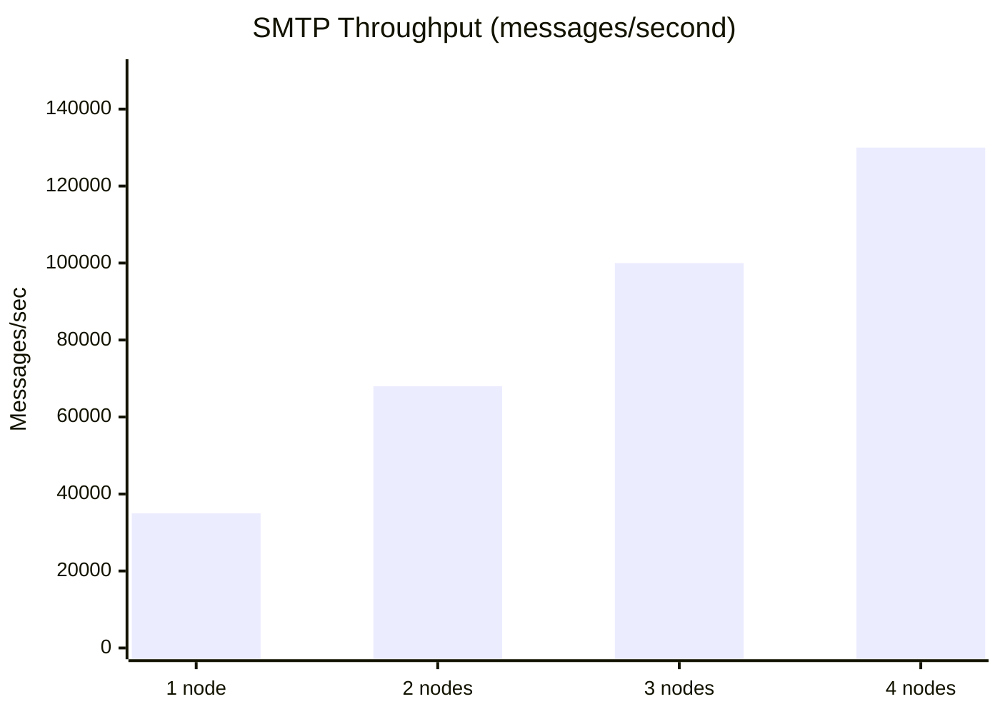

# ERP-Workspace Performance Benchmarks

> **Document ID:** ERP-WS-PB-023
> **Version:** 1.0.0
> **Last Updated:** 2026-02-23
> **Status:** Approved

---

## 1. Benchmark Environment

| Component | Specification |
|-----------|-------------|
| Cluster | Kubernetes 1.29, 10-node cluster |
| Nodes | 8 vCPU, 32GB RAM, NVMe SSD |
| PostgreSQL | 16, 8 cores / 32GB RAM / 500GB SSD |
| Redis | 7.2, 3-node cluster, 8GB per node |
| MinIO | 4-node, 4 drives each, NVMe |
| Redpanda | 3-node, 4 cores / 8GB per node |
| Network | 10Gbps inter-node |

---

## 2. Email Benchmarks

### 2.1 SMTP Throughput

| Configuration | Throughput | P50 Latency | P99 Latency |
|--------------|-----------|-------------|-------------|
| 1 Rust node | 35,000 msg/sec | 12ms | 45ms |
| 2 Rust nodes | 68,000 msg/sec | 14ms | 50ms |
| 3 Rust nodes | 100,000 msg/sec | 15ms | 55ms |
| 4 Rust nodes | 130,000 msg/sec | 16ms | 60ms |

### 2.2 JMAP Query Performance

| Operation | P50 | P99 | Throughput |
|-----------|-----|-----|-----------|
| Mailbox listing (50 msgs) | 4ms | 18ms | 12,000 req/sec |
| Thread view (20 msgs) | 8ms | 35ms | 8,000 req/sec |
| Full-text search | 15ms | 65ms | 5,000 req/sec |
| Message body fetch | 3ms | 12ms | 15,000 req/sec |

### 2.3 Index Performance Impact

| Query | Without Covering Index | With Covering Index | Improvement |
|-------|----------------------|--------------------|-----------|
| Inbox listing | 45ms | 0.8ms | 56x |
| Campaign analytics | 120ms | 2.5ms | 48x |
| Suppression check | 15ms | 0.3ms | 50x |
| Template listing | 25ms | 0.5ms | 50x |

---

## 3. Calendar Benchmarks

| Operation | P50 | P99 | Throughput |
|-----------|-----|-----|-----------|
| Event create | 8ms | 35ms | 10,000 req/sec |
| Week view query | 12ms | 55ms | 8,000 req/sec |
| Free/busy (5 users) | 15ms | 70ms | 5,000 req/sec |
| Free/busy (20 users) | 35ms | 150ms | 2,000 req/sec |
| Room availability | 5ms | 25ms | 12,000 req/sec |
| Recurrence expansion (52 weeks) | 3ms | 15ms | 15,000 req/sec |

---

## 4. Video Meeting Benchmarks

| Metric | Value |
|--------|-------|
| Signaling join time (P50) | 45ms |
| Signaling join time (P99) | 180ms |
| WebRTC connection time (P50) | 350ms |
| WebRTC connection time (P99) | 800ms |
| Max participants (single SFU) | 500 |
| Max participants (3-node cascade) | 1,000 |
| Video bitrate (720p) | 1.5 Mbps |
| Audio bitrate (Opus) | 32 Kbps |
| CPU per participant (SFU) | ~0.02 cores |
| Memory per participant (SFU) | ~5MB |

---

## 5. Chat Benchmarks

| Operation | P50 | P99 | Throughput |
|-----------|-----|-----|-----------|
| Send message | 3ms | 12ms | 50,000 msg/sec |
| WebSocket delivery | 5ms | 18ms | - |
| Message history (50 msgs) | 6ms | 25ms | 15,000 req/sec |
| Channel listing | 4ms | 15ms | 20,000 req/sec |
| Full-text search | 20ms | 80ms | 5,000 req/sec |
| Reaction add | 2ms | 8ms | 30,000 req/sec |

---

## 6. Document Editing Benchmarks

| Metric | Value |
|--------|-------|
| Document open time (P50) | 150ms |
| Document open time (P99) | 600ms |
| OT operation latency (P50) | 50ms |
| OT operation latency (P99) | 200ms |
| Max concurrent editors | 20 per document |
| Auto-save latency | 5 seconds |
| Version save time | 200ms |

---

## 7. File Storage Benchmarks

| Operation | File Size | P50 | P99 | Throughput |
|-----------|----------|-----|-----|-----------|
| Upload | 1MB | 120ms | 400ms | 1,000 ops/sec |
| Upload | 10MB | 800ms | 2s | 200 ops/sec |
| Upload | 100MB | 6s | 15s | 30 ops/sec |
| Download | 1MB | 50ms | 150ms | 3,000 ops/sec |
| Download | 10MB | 300ms | 800ms | 500 ops/sec |
| List folder | - | 5ms | 20ms | 15,000 ops/sec |
| Share file | - | 8ms | 30ms | 10,000 ops/sec |

---

## 8. Search Benchmarks (Quickwit)

| Query Type | Index Size | P50 | P99 |
|-----------|-----------|-----|-----|
| Simple keyword | 10M docs | 8ms | 35ms |
| Simple keyword | 100M docs | 15ms | 55ms |
| Phrase query | 10M docs | 12ms | 45ms |
| Boolean query | 10M docs | 18ms | 65ms |
| Faceted search | 10M docs | 25ms | 90ms |

---

## 9. Database Connection Benchmarks

| Metric | Value |
|--------|-------|
| PgBouncer max clients | 5,000 |
| Active connections (peak) | 200 |
| Transaction rate (peak) | 50,000 TPS |
| Average query time | 2ms |
| Connection pool utilization | 40% steady, 75% peak |

---

## 10. Resource Utilization Summary

| Component | CPU (steady) | CPU (peak) | Memory (steady) | Memory (peak) |
|-----------|-------------|-----------|-----------------|--------------|
| email-service (x3) | 0.3 cores each | 1.5 cores | 200MB | 600MB |
| calendar-service (x2) | 0.2 cores each | 0.8 cores | 150MB | 400MB |
| chat-service (x3) | 0.4 cores each | 2.0 cores | 300MB | 800MB |
| Rust SMTP (x3) | 1.0 cores each | 3.5 cores | 1GB | 3GB |
| PostgreSQL | 2.0 cores | 6.0 cores | 16GB | 28GB |
| Redis Cluster | 0.5 cores/node | 1.5 cores | 2GB | 6GB |

---

*For load testing methodology, see [15-Testing-Strategy.md](./15-Testing-Strategy.md). For scaling plans, see [19-Scalability-Plan.md](./19-Scalability-Plan.md).*
