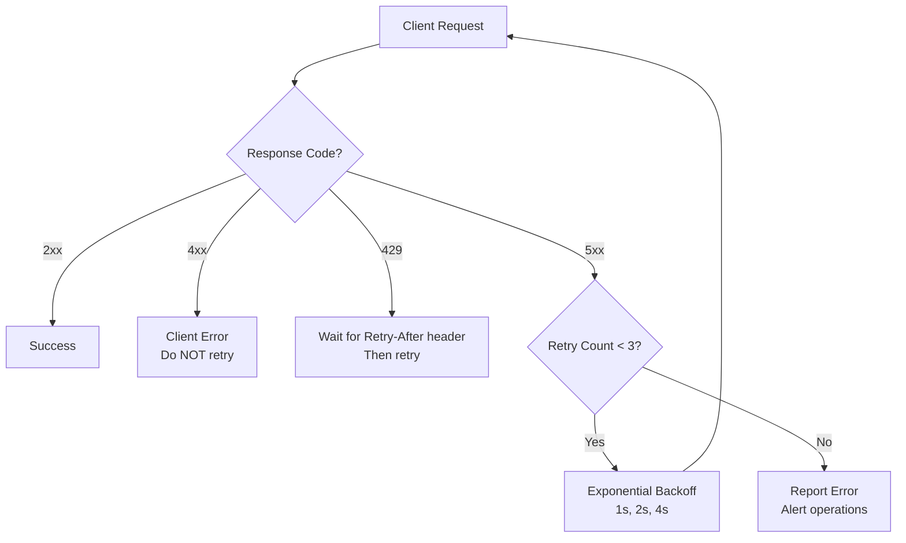
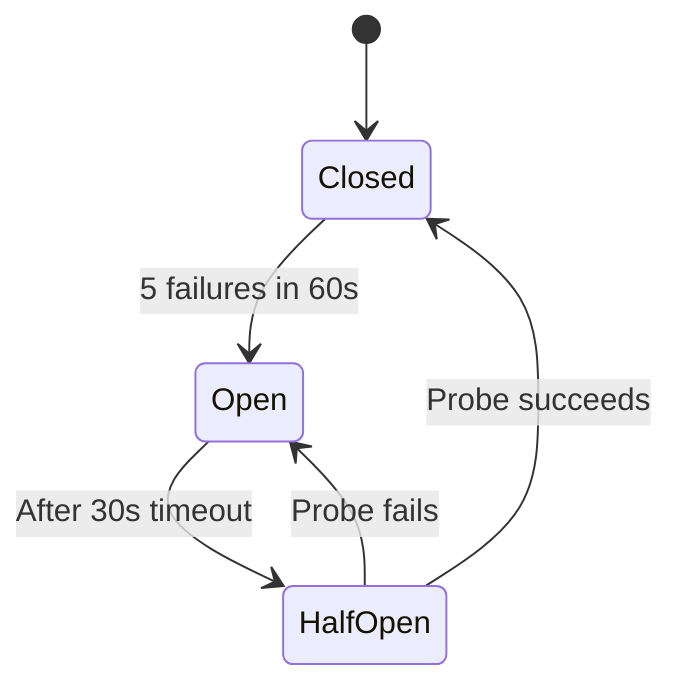

# ERP-Workspace Error Handling

> **Document ID:** ERP-WS-EH-024
> **Version:** 1.0.0
> **Last Updated:** 2026-02-23
> **Status:** Approved

---

## 1. Error Response Format

All APIs return errors in a consistent JSON format:

```json
{
  "error": {
    "code": "WORKSPACE_EMAIL_QUOTA_EXCEEDED",
    "message": "Mailbox storage quota exceeded. Current usage: 1024MB / 1024MB.",
    "details": {
      "mailbox_id": "uuid",
      "quota_mb": 1024,
      "used_mb": 1024
    },
    "request_id": "req-abc123",
    "timestamp": "2026-02-23T10:30:00Z"
  }
}
```

---

## 2. Error Code Taxonomy

### 2.1 Email Errors

| Code | HTTP Status | Description | Resolution |
|------|-----------|-------------|-----------|
| `EMAIL_QUOTA_EXCEEDED` | 413 | Mailbox storage full | Delete emails or increase quota |
| `EMAIL_SEND_FAILED` | 502 | SMTP delivery failure | Retry or check recipient |
| `EMAIL_RECIPIENT_SUPPRESSED` | 422 | Recipient on suppression list | Remove from suppression or use different address |
| `EMAIL_DLP_BLOCKED` | 403 | PII detected, policy blocks send | Remove sensitive data or request exception |
| `EMAIL_INVALID_RECIPIENT` | 400 | Invalid email address format | Correct the email address |
| `EMAIL_TEMPLATE_NOT_FOUND` | 404 | Referenced template does not exist | Verify template_id |
| `EMAIL_SMIME_CERT_MISSING` | 422 | S/MIME certificate not found for recipient | Import certificate or send unencrypted |

### 2.2 Calendar Errors

| Code | HTTP Status | Description | Resolution |
|------|-----------|-------------|-----------|
| `CALENDAR_EVENT_CONFLICT` | 409 | Time slot overlaps with existing event | Choose different time |
| `CALENDAR_ROOM_UNAVAILABLE` | 409 | Meeting room already booked | Choose different room or time |
| `CALENDAR_INVALID_RRULE` | 400 | Invalid recurrence rule | Correct recurrence specification |
| `CALENDAR_ATTENDEE_NOT_FOUND` | 404 | Attendee not in directory | Verify attendee email |

### 2.3 Meeting Errors

| Code | HTTP Status | Description | Resolution |
|------|-----------|-------------|-----------|
| `MEET_ROOM_FULL` | 403 | Maximum participants reached | Wait for someone to leave |
| `MEET_NOT_STARTED` | 403 | Meeting has not started yet | Wait for host to start |
| `MEET_RECORDING_DISABLED` | 403 | Recording not permitted for this meeting | Contact host to enable |
| `MEET_WAITING_ROOM` | 202 | Placed in waiting room | Wait for host admission |
| `MEET_TOKEN_EXPIRED` | 401 | Room token expired | Re-join the meeting |

### 2.4 Chat Errors

| Code | HTTP Status | Description | Resolution |
|------|-----------|-------------|-----------|
| `CHAT_CHANNEL_NOT_FOUND` | 404 | Channel does not exist | Verify channel ID |
| `CHAT_NOT_MEMBER` | 403 | User is not a channel member | Request invitation |
| `CHAT_MESSAGE_TOO_LONG` | 400 | Message exceeds 10,000 characters | Shorten message |
| `CHAT_FILE_TOO_LARGE` | 413 | Shared file exceeds limit | Compress or split file |

### 2.5 Drive Errors

| Code | HTTP Status | Description | Resolution |
|------|-----------|-------------|-----------|
| `DRIVE_QUOTA_EXCEEDED` | 413 | Storage quota full | Delete files or increase quota |
| `DRIVE_FILE_NOT_FOUND` | 404 | File does not exist or is trashed | Verify file ID |
| `DRIVE_PERMISSION_DENIED` | 403 | Insufficient file permissions | Request access from owner |
| `DRIVE_FILE_LOCKED` | 423 | File is locked by another user | Wait for lock release |
| `DRIVE_SHARE_LINK_EXPIRED` | 410 | Share link has expired | Request new link |

### 2.6 System Errors

| Code | HTTP Status | Description | Resolution |
|------|-----------|-------------|-----------|
| `TENANT_NOT_FOUND` | 404 | Invalid X-Tenant-ID | Verify tenant ID |
| `UNAUTHORIZED` | 401 | Invalid or expired JWT | Re-authenticate |
| `FORBIDDEN` | 403 | Insufficient role/permissions | Contact admin |
| `RATE_LIMITED` | 429 | Too many requests | Wait and retry with backoff |
| `INTERNAL_ERROR` | 500 | Unexpected server error | Retry; contact support if persistent |
| `SERVICE_UNAVAILABLE` | 503 | Service temporarily down | Retry with backoff |
| `ENTITLEMENT_MISSING` | 403 | Module not licensed | Upgrade subscription |

---

## 3. Retry Strategy



### Retry Configuration

| Error Type | Retry | Strategy | Max Attempts |
|-----------|-------|---------|-------------|
| 400 Bad Request | No | Fix client request | 0 |
| 401 Unauthorized | No | Re-authenticate | 0 |
| 403 Forbidden | No | Check permissions | 0 |
| 404 Not Found | No | Verify resource | 0 |
| 409 Conflict | Context-dependent | Refresh state and retry | 1 |
| 429 Rate Limited | Yes | Wait for `Retry-After` | 3 |
| 500 Internal Error | Yes | Exponential backoff | 3 |
| 502 Bad Gateway | Yes | Exponential backoff | 3 |
| 503 Service Unavailable | Yes | Exponential backoff | 3 |

---

## 4. Circuit Breaker Pattern

Services implement circuit breakers for external dependencies:



| Dependency | Failure Threshold | Recovery Timeout | Fallback |
|-----------|------------------|-----------------|---------|
| ERP-IAM | 5 failures / 60s | 30s | Cached JWT validation |
| ERP-Platform | 5 failures / 60s | 30s | Cached entitlements |
| ERP-AI | 3 failures / 30s | 15s | Feature disabled gracefully |
| SMTP relay | 10 failures / 60s | 60s | Queue messages for retry |
| LiveKit | 5 failures / 60s | 30s | Return "meeting unavailable" |

---

## 5. Graceful Degradation

| Feature | Dependency | Degraded Behavior |
|---------|-----------|------------------|
| AI Smart Compose | ERP-AI | Compose without AI suggestions |
| AI Email Triage | ERP-AI | Show all emails unsorted |
| AI Meeting Notes | ERP-AI | Recording available, no notes |
| Email search | Quickwit | Fallback to PostgreSQL LIKE queries |
| File preview | ONLYOFFICE | Show download link instead of preview |
| Real-time chat | Redis Pub/Sub | Poll-based message delivery |

---

*For monitoring alerts triggered by errors, see [20-Monitoring-Observability.md](./20-Monitoring-Observability.md). For runbook procedures, see [27-Runbooks.md](./27-Runbooks.md).*
