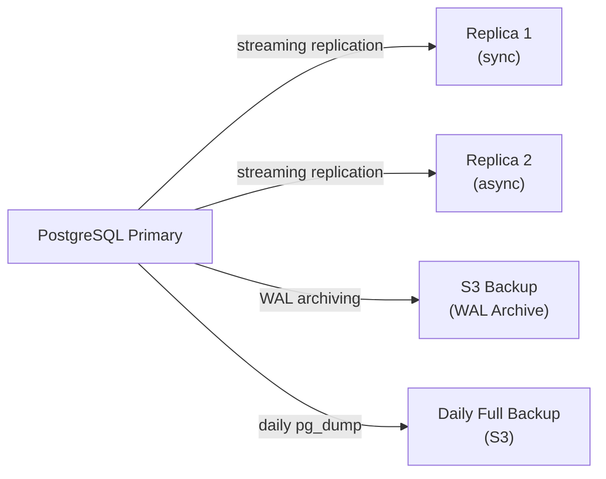
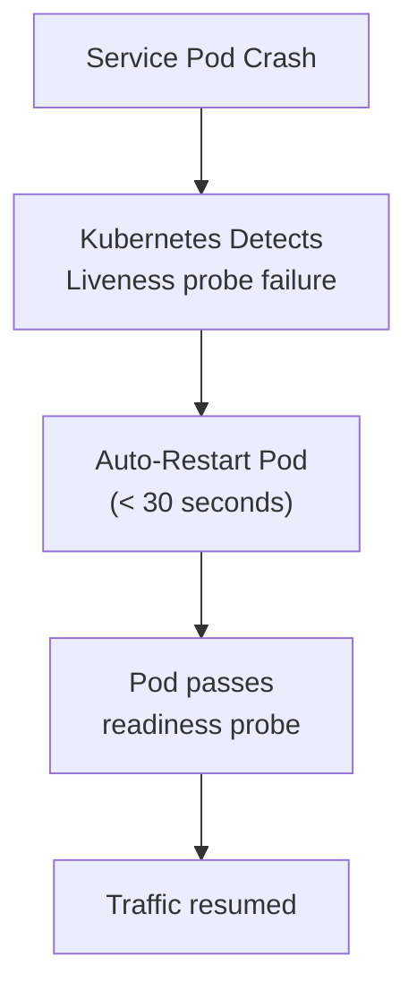
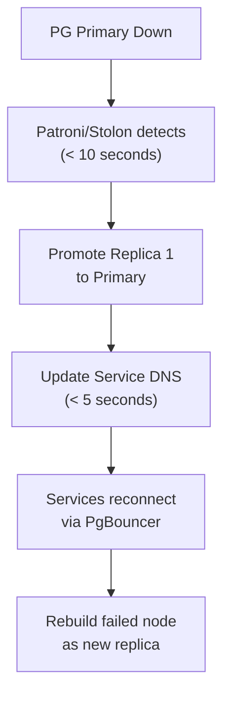
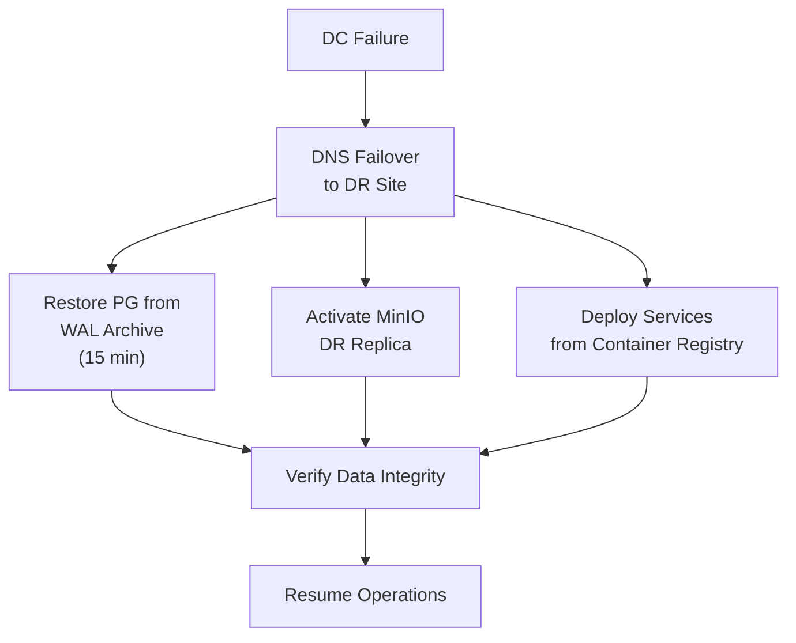

# ERP-Workspace Disaster Recovery

> **Document ID:** ERP-WS-DR-026
> **Version:** 1.0.0
> **Last Updated:** 2026-02-23
> **Status:** Approved

---

## 1. Recovery Objectives

| Component | RPO (Data Loss) | RTO (Downtime) | Tier |
|-----------|----------------|----------------|------|
| Email (messages) | 1 hour | 15 min | Tier 1 |
| Email (SMTP delivery) | 0 (queued) | 5 min | Tier 1 |
| Calendar | 1 hour | 15 min | Tier 1 |
| Chat (messages) | 1 hour | 15 min | Tier 1 |
| Video Meetings | N/A (stateless) | 5 min | Tier 2 |
| Documents | 1 hour | 30 min | Tier 2 |
| File Storage | 4 hours | 30 min | Tier 2 |
| Search Index | 24 hours (rebuildable) | 1 hour | Tier 3 |
| Analytics | 24 hours (rebuildable) | 2 hours | Tier 3 |

---

## 2. Backup Strategy

### 2.1 PostgreSQL Backup



| Backup Type | Frequency | Retention | Storage |
|------------|-----------|-----------|---------|
| Streaming replication | Continuous | N/A (live) | Replica nodes |
| WAL archiving | Continuous | 30 days | S3/MinIO |
| Full backup (pg_dump) | Daily at 02:00 UTC | 30 days | S3/MinIO |
| Weekly snapshot | Weekly (Sunday) | 90 days | S3/MinIO |

### 2.2 MinIO Backup

| Strategy | Detail |
|----------|--------|
| Erasure coding | EC:4 (tolerates 4 drive failures) |
| Site replication | Async replication to secondary site |
| Versioning | Enabled, last 10 versions retained |
| Cross-region copy | Daily rsync to DR region |

### 2.3 Redis Backup

Redis is treated as an ephemeral cache; no formal backup. Recovery involves:
1. Redis cluster auto-failover (< 30 seconds)
2. Cache repopulation from source systems (< 5 minutes)

### 2.4 Redpanda Backup

| Strategy | Detail |
|----------|--------|
| Replication | Factor 3 (all topics) |
| Tiered storage | Offload old segments to S3 |
| Topic retention | 3-7 days (configurable) |

---

## 3. Failure Scenarios

### 3.1 Single Service Failure



**Impact**: Minimal. Other replicas handle traffic during restart.

### 3.2 Database Primary Failure



**Impact**: < 30 seconds downtime. Potential loss of uncommitted transactions.

### 3.3 Complete Data Center Loss



**Impact**: RPO = 1 hour (last WAL archive). RTO = 30-60 minutes.

---

## 4. Recovery Procedures

### 4.1 PostgreSQL Point-in-Time Recovery

```bash
# 1. Stop services
# 2. Restore base backup
pg_basebackup --checkpoint=fast --wal-method=stream

# 3. Configure recovery target
# recovery_target_time = '2026-02-23 10:00:00 UTC'

# 4. Start PostgreSQL in recovery mode
# 5. Verify data integrity
# 6. Resume services
```

### 4.2 MinIO Recovery

```bash
# 1. If node failure: MinIO auto-heals from erasure coding
# 2. If site failure: Activate DR site replica
# 3. Verify bucket integrity
mc admin heal --recursive minio/workspace-files
```

---

## 5. DR Testing Schedule

| Test | Frequency | Scope |
|------|-----------|-------|
| Backup verification | Daily (automated) | Restore latest backup to test DB |
| Service failover | Monthly | Kill random service, verify auto-recovery |
| Database failover | Quarterly | Promote replica, verify zero data loss |
| Full DR drill | Semi-annually | Simulate complete DC failure |

---

*For monitoring alerts, see [20-Monitoring-Observability.md](./20-Monitoring-Observability.md). For runbook procedures, see [27-Runbooks.md](./27-Runbooks.md).*
