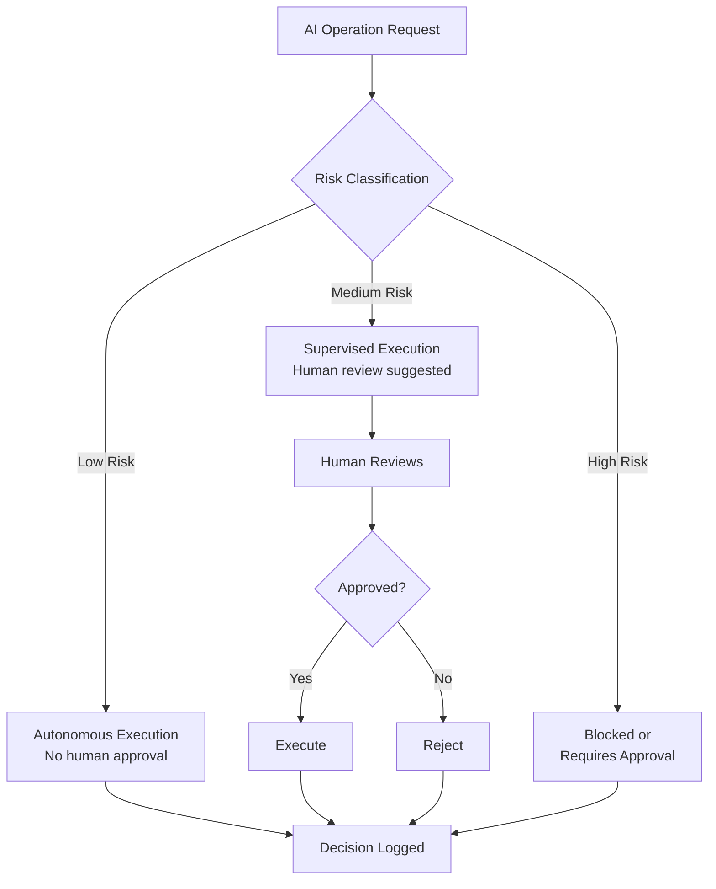
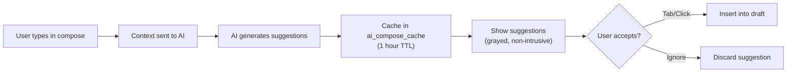

# ERP-Workspace AIDD Guardrails

> **Document ID:** ERP-WS-AIDD-028
> **Version:** 1.0.0
> **Last Updated:** 2026-02-23
> **Status:** Approved

---

## 1. AIDD Framework Overview

AI-Integrated Development Discipline (AIDD) defines the governance framework for all AI-powered features in ERP-Workspace. Every AI operation is classified by risk level and subject to appropriate controls.



---

## 2. Risk Classification Matrix

### 2.1 Autonomous Actions (Low Risk)

These actions execute without human approval:

| Feature | Action | Justification |
|---------|--------|--------------|
| AI Email Classification | Categorize email (work, personal, promotions) | Read-only, reversible, no data mutation |
| AI Sentiment Analysis | Score email sentiment | Read-only, informational |
| Smart Compose Cache | Cache AI-generated suggestions | Ephemeral, user must explicitly accept |
| Search Ranking | AI-enhanced search result ordering | Read-only, no side effects |
| Email Health Check | Scan DNS records for SPF/DKIM/DMARC | Read-only, external data |
| Knowledge Graph Update | Extract entities from processed emails | Append-only, no mutation of source |

### 2.2 Supervised Actions (Medium Risk)

These actions require human awareness or approval:

| Feature | Action | Control |
|---------|--------|---------|
| AI Email Triage | Move emails to Focus/Other | User can review and override |
| AI Smart Reply | Suggest reply options | User must click to send; never auto-sends |
| AI Meeting Notes | Generate summary from recording | Review before distribution |
| AI Email-to-Action | Extract tasks/meetings from email | User confirms before creating task/event |
| DLP Auto-Redact | Redact PII in outbound email | Warning shown; user can override or accept |
| Bulk Email Categorization | Apply labels to multiple emails | Batch preview before execution |
| AI Scheduling Assistant | Suggest meeting times | User selects from suggestions; never auto-books |

### 2.3 Prohibited Actions

These actions are never performed by AI:

| Action | Reason |
|--------|--------|
| Cross-tenant data access | Absolute security boundary |
| Irreversible delete without backup | Data loss risk |
| Privilege escalation | Security violation |
| Auto-send email without user action | Impersonation risk |
| Auto-accept meeting invitations | Calendar autonomy |
| Access email content for training | Privacy violation |
| Modify DLP/security policies | Administrative authority required |
| Export data without admin approval | Compliance requirement |

---

## 3. Guardrail Configuration

Source: `/ERP-Workspace/erp/aidd.guardrails.yaml`

```yaml
version: 1
module: ERP-Workspace
autonomous_actions:
  - read_only_queries
  - low_risk_notifications
supervised_actions:
  - data_mutations
  - workflow_automation
  - bulk_operations
prohibited_actions:
  - cross_tenant_data_access
  - irreversible_delete_without_backup
  - privilege_escalation
controls:
  require_human_in_the_loop_for_high_risk: true
  decision_logging: true
  rollback_window_hours: 24
```

---

## 4. AI Feature Guardrail Details

### 4.1 Smart Compose



**Guardrails:**
- AI never auto-inserts text; user must explicitly accept
- Context sent to AI is limited to current email thread (no cross-thread leakage)
- Suggestions are cached for 1 hour, then purged
- Tone must be explicitly selected by user (professional, casual, formal)

### 4.2 Email Triage

**Guardrails:**
- Triage model is per-user (no cross-user signal leakage)
- Focus/Other classification is always overridable
- Model retrains only on explicit user signals (star, archive, reply)
- Minimum 100 signals required before model activates
- Focus mode is opt-in (disabled by default)

### 4.3 PII Detection

**Guardrails:**
- Detection runs only on outbound email (configurable for inbound)
- Auto-redaction is disabled by default; requires admin opt-in
- PII types must be explicitly configured per tenant
- Detected PII is logged in `privacy_pii_detections` for audit
- False positive rate target: < 5%

### 4.4 Meeting Notes

**Guardrails:**
- Recording consent notification required before AI processing
- Notes are generated post-meeting, not real-time
- Notes go to meeting organizer first for review before distribution
- Action items are suggested, never auto-created
- Transcript is never stored permanently (only summary and action items)

---

## 5. Decision Logging

Every AI decision is logged to the immutable audit stream:

```json
{
  "event_type": "aidd.decision",
  "module": "ERP-Workspace",
  "feature": "email_classification",
  "action": "classify",
  "risk_level": "low",
  "decision": "autonomous",
  "input_hash": "sha256:...",
  "output": {
    "category": "work",
    "sentiment": "neutral",
    "confidence": 0.92
  },
  "tenant_id": "uuid",
  "user_id": "uuid",
  "timestamp": "2026-02-23T10:30:00Z",
  "model_version": "v1.2.0"
}
```

---

## 6. Rollback Capabilities

All AI-driven changes are reversible within the 24-hour rollback window:

| Feature | Rollback Method |
|---------|----------------|
| Email Classification | Reset to unclassified; re-run with updated model |
| Email Triage (Focus/Other) | Move emails back to original location |
| PII Redaction | Restore original content from pre-redaction snapshot |
| Meeting Notes | Delete generated summary; regenerate from recording |
| Email-to-Action | Delete created tasks/events |
| Knowledge Graph | Delete extracted nodes/edges for time period |

---

## 7. Compliance Reporting

Monthly AIDD compliance reports include:
- Total AI operations by risk level
- Human override rate (how often users reject AI suggestions)
- False positive rate for PII detection
- Model accuracy metrics per feature
- Any prohibited action attempt logs
- Rollback frequency and reasons

---

*For security controls, see [16-Security-Architecture.md](./16-Security-Architecture.md). For AI feature specifications, see [14-Technical-Specifications.md](./14-Technical-Specifications.md).*
