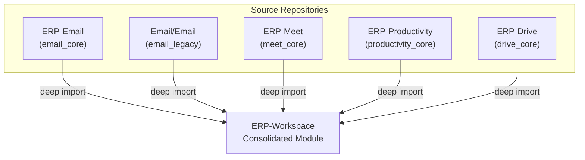
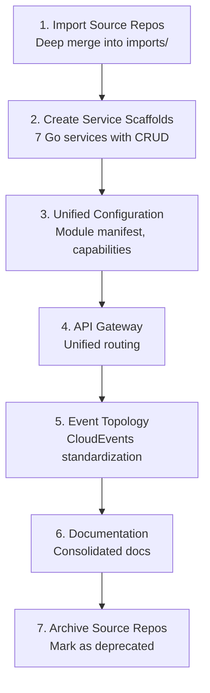

# ERP-Workspace Consolidation Lineage

> **Document ID:** ERP-WS-CL-029
> **Version:** 1.0.0
> **Last Updated:** 2026-02-23
> **Status:** Approved

---

## 1. Consolidation Overview

ERP-Workspace was formed through the deep merge of five previously independent repositories into a single cohesive module. This document traces the lineage of every component.



---

## 2. Import Manifest

Source: `merge/MERGE_MANIFEST.yaml`

```yaml
version: 2026-02-23
target_repo: ERP-Workspace
module_name: Communication and Collaboration
summary: Workspace stack with mail, meet, productivity, and drive
merge_sources:
  - ERP-Email
  - Email/Email
  - ERP-Meet
  - ERP-Productivity
  - ERP-Drive
integration_mode: standalone_plus_suite
aidd_enforced: true
```

---

## 3. Detailed Import Map

### 3.1 ERP-Email (email_core)

| Imported Path | Destination | Content |
|--------------|-------------|---------|
| `backend/` | `imports/email_core/backend/` | Python email service, providers, migrations |
| `frontend/` | `imports/email_core/frontend/` | React admin portal, ops portal, tenant management |
| `services/` | `imports/email_core/services/` | Node.js admin API, schema |
| `web/` | (referenced) | Web client components |
| `docs/` | (referenced) | Original documentation |

Key artifacts imported:
- 12 SQL migration files (0001-0012) defining 85+ tables
- 7 email provider integrations (SendGrid, AWS SES, Postmark, Mailgun, MailerSend, Brevo)
- Python backend services (provisioning, messaging, rate limiter, circuit breaker, cache)
- React admin portal (TenantOverview, TenantList, TenantForm, CampaignStatus)
- React ops portal (OverviewCards, TenantTable, TenantForm)

### 3.2 Email/Email (email_legacy)

| Imported Path | Destination | Content |
|--------------|-------------|---------|
| `backend/` | `imports/email_legacy/backend/` | Identical structure to email_core (fork lineage) |
| `frontend/` | `imports/email_legacy/frontend/` | Identical structure to email_core |
| `services/` | `imports/email_legacy/services/` | Admin API with schema |

Note: email_legacy is a fork of email_core from an earlier codebase split. Both are preserved for reference. The canonical implementation is email_core.

### 3.3 ERP-Meet (meet_core)

| Imported Path | Destination | Content |
|--------------|-------------|---------|
| `docs/` | `imports/meet_core/docs/` | Meeting architecture documentation |
| `configs/` | `imports/meet_core/configs/` | LiveKit configuration |
| `web/` | `imports/meet_core/web/` | Meeting web client |
| `docker-compose.yml` | `imports/meet_core/` | LiveKit + meeting service composition |

### 3.4 ERP-Productivity (productivity_core)

| Imported Path | Destination | Content |
|--------------|-------------|---------|
| `services/` | `imports/productivity_core/services/` | ONLYOFFICE integration services |
| `product_suite_docs/` | `imports/productivity_core/product_suite_docs/` | Product documentation |
| `docs/` | `imports/productivity_core/docs/` | Technical docs |
| `docker-compose.yml` | `imports/productivity_core/` | ONLYOFFICE DS composition |

### 3.5 ERP-Drive (drive_core)

| Imported Path | Destination | Content |
|--------------|-------------|---------|
| `docs/` | `imports/drive_core/docs/` | Storage architecture documentation |
| `policies/` | `imports/drive_core/policies/` | Sharing and access policies |
| `docker-compose.yml` | `imports/drive_core/` | Nextcloud + MinIO composition |

---

## 4. New Components (Post-Consolidation)

These components were created during the consolidation and do not come from any source repository:

| Component | Path | Purpose |
|-----------|------|---------|
| API Gateway | `cmd/` | Unified routing for all services |
| Module Manifest | `erp/module.manifest.yaml` | ERP Platform integration config |
| AIDD Guardrails | `erp/aidd.guardrails.yaml` | AI governance rules |
| Capabilities Config | `configs/capabilities.json` | Feature flag registry |
| 7 Go Services | `services/*/main.go` | Consolidated CRUD services |
| 7 Dockerfiles | `services/*/Dockerfile` | Container build definitions |
| Architecture Docs | `docs/ARCHITECTURE.md` | Consolidated architecture |
| API Docs | `docs/API.md` | Unified API reference |
| Event Docs | `docs/EVENTS.md` | CloudEvents topology |
| ADR Docs | `docs/ADR/` | Architecture decision records |

---

## 5. Migration Path



---

## 6. Source Repository Status

| Repository | Status | Action |
|-----------|--------|--------|
| ERP-Email | Archived | Redirect to ERP-Workspace |
| Email/Email | Archived | Redirect to ERP-Workspace |
| ERP-Meet | Archived | Redirect to ERP-Workspace |
| ERP-Productivity | Archived | Redirect to ERP-Workspace |
| ERP-Drive | Archived | Redirect to ERP-Workspace |

---

*For the current architecture, see [04-Software-Architecture.md](./04-Software-Architecture.md). For the module integration map, see [17-Integration-Patterns.md](./17-Integration-Patterns.md).*
