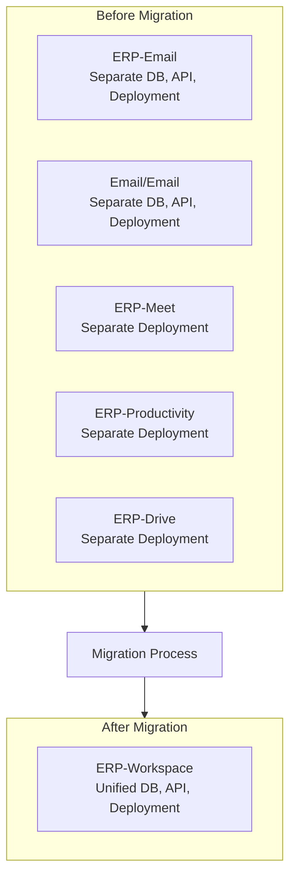
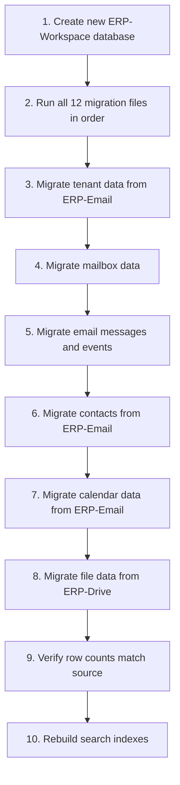

# ERP-Workspace Migration Guide

> **Document ID:** ERP-WS-MG-031
> **Version:** 1.0.0
> **Last Updated:** 2026-02-23
> **Status:** Approved

---

## 1. Migration Overview

This guide covers migrating from the five independent modules (ERP-Email, Email/Email, ERP-Meet, ERP-Productivity, ERP-Drive) to the consolidated ERP-Workspace module.



---

## 2. Pre-Migration Checklist

| Step | Action | Status |
|------|--------|--------|
| 1 | Inventory all tenant data across source modules | Required |
| 2 | Backup all databases from source modules | Required |
| 3 | Backup all MinIO/S3 file storage | Required |
| 4 | Document all custom API integrations | Required |
| 5 | Record current event topic subscriptions | Required |
| 6 | Verify ERP-Workspace deployment is ready | Required |
| 7 | Schedule maintenance window (4-8 hours) | Required |
| 8 | Notify all users of planned downtime | Required |

---

## 3. API Endpoint Migration

### 3.1 Email API Changes

| Old Endpoint (ERP-Email) | New Endpoint (ERP-Workspace) | Notes |
|--------------------------|------------------------------|-------|
| `GET /v1/mail/messages` | `GET /v1/email` | Path changed |
| `POST /v1/mail/send` | `POST /v1/email` | Unified CRUD |
| `GET /v1/mail/messages/{id}` | `GET /v1/email/{id}` | Path changed |
| `PUT /v1/mail/messages/{id}` | `PUT /v1/email/{id}` | Path changed |
| `DELETE /v1/mail/messages/{id}` | `DELETE /v1/email/{id}` | Path changed |

### 3.2 New Unified Endpoints

| Endpoint | Description |
|----------|-------------|
| `GET /v1/calendar` | Calendar CRUD (new unified path) |
| `GET /v1/meet` | Meeting management (new unified path) |
| `GET /v1/chat` | Chat messaging (new unified path) |
| `GET /v1/docs` | Document management (new unified path) |
| `GET /v1/drive` | File storage (new unified path) |
| `GET /v1/contacts` | Contact directory (new unified path) |
| `GET /v1/capabilities` | Feature flag discovery (new) |

### 3.3 Header Changes

| Old Header | New Header | Notes |
|-----------|-----------|-------|
| `X-Tenant-ID` | `X-Tenant-ID` | No change |
| `Authorization: Bearer` | `Authorization: Bearer` | No change; JWT claims may add workspace roles |

---

## 4. Database Migration

### 4.1 Schema Migration Steps



### 4.2 Data Migration SQL Templates

```sql
-- Migrate tenants
INSERT INTO erp_workspace.tenants (tenant_id, name, primary_domain, plan_tier, status, created_at)
SELECT tenant_id, name, primary_domain, plan_tier, status, created_at
FROM erp_email.tenants;

-- Migrate mailboxes
INSERT INTO erp_workspace.mailboxes (mailbox_id, tenant_id, user_principal, quota_mb, active, created_at)
SELECT mailbox_id, tenant_id, user_principal, quota_mb, active, created_at
FROM erp_email.mailboxes;

-- Migrate email messages (batched for large tables)
INSERT INTO erp_workspace.email_messages
SELECT * FROM erp_email.email_messages
WHERE sent_at >= '2025-01-01'
ORDER BY sent_at;
```

---

## 5. Event Topic Migration

### 5.1 Topic Mapping

| Old Topic (ERP-Email) | New Topic (ERP-Workspace) |
|----------------------|---------------------------|
| `erp.email.message.sent` | `erp.workspace.email.created` |
| `erp.email.message.received` | `erp.workspace.email.created` |
| `erp.email.message.read` | `erp.workspace.email.read` |
| `erp.email.message.deleted` | `erp.workspace.email.deleted` |

### 5.2 Consumer Migration

1. Update all consumer group configurations to subscribe to new topics
2. Run parallel consumers on both old and new topics during transition
3. After cutover, decommission old topic consumers
4. Verify no messages are lost by comparing event counts

---

## 6. File Storage Migration

### 6.1 MinIO Bucket Migration

| Old Bucket | New Bucket Pattern |
|-----------|-------------------|
| `erp-email-attachments` | `ws-{tenant_id}/email/` |
| `erp-drive-files` | `ws-{tenant_id}/files/` |
| `erp-meet-recordings` | `ws-{tenant_id}/recordings/` |

### 6.2 Migration Process

```bash
# Copy email attachments
mc mirror erp-email-attachments/ ws-tenant-bucket/email/

# Copy drive files
mc mirror erp-drive-files/ ws-tenant-bucket/files/

# Copy meeting recordings
mc mirror erp-meet-recordings/ ws-tenant-bucket/recordings/

# Verify integrity
mc diff erp-email-attachments/ ws-tenant-bucket/email/
```

---

## 7. Post-Migration Validation

| Check | Command | Expected Result |
|-------|---------|----------------|
| Tenant count | `SELECT count(*) FROM tenants;` | Matches source |
| Mailbox count | `SELECT count(*) FROM mailboxes;` | Matches source |
| Email count | `SELECT count(*) FROM email_messages;` | Matches source |
| Contact count | `SELECT count(*) FROM contacts;` | Matches source |
| File count | `SELECT count(*) FROM file_items;` | Matches source |
| Health check | `curl /healthz` for all 7 services | All healthy |
| API smoke test | Send test email, create event, upload file | All succeed |
| Search test | Search for known content | Results returned |

---

## 8. Rollback Plan

If migration fails:
1. Stop ERP-Workspace services
2. Restore source databases from pre-migration backups
3. Restart source module services
4. Update DNS/routing to point back to source modules
5. Notify users of rollback
6. Investigate failure and plan retry

**Rollback SLA:** 30 minutes to restore full service on source modules.

---

## 9. Post-Migration Cleanup

| Task | Timeline | Notes |
|------|----------|-------|
| Archive source repositories | 1 week after validation | Mark as read-only |
| Decommission source databases | 2 weeks after validation | Keep backup for 90 days |
| Remove old MinIO buckets | 2 weeks after validation | After file integrity verification |
| Update CI/CD pipelines | 1 week after migration | Point to ERP-Workspace |
| Update documentation links | 1 week after migration | Redirect old docs |
| Update monitoring dashboards | Day of migration | Point to new metrics |

---

*For deployment procedures, see [25-Deployment-Pipeline.md](./25-Deployment-Pipeline.md). For configuration reference, see [30-Configuration-Reference.md](./30-Configuration-Reference.md).*
