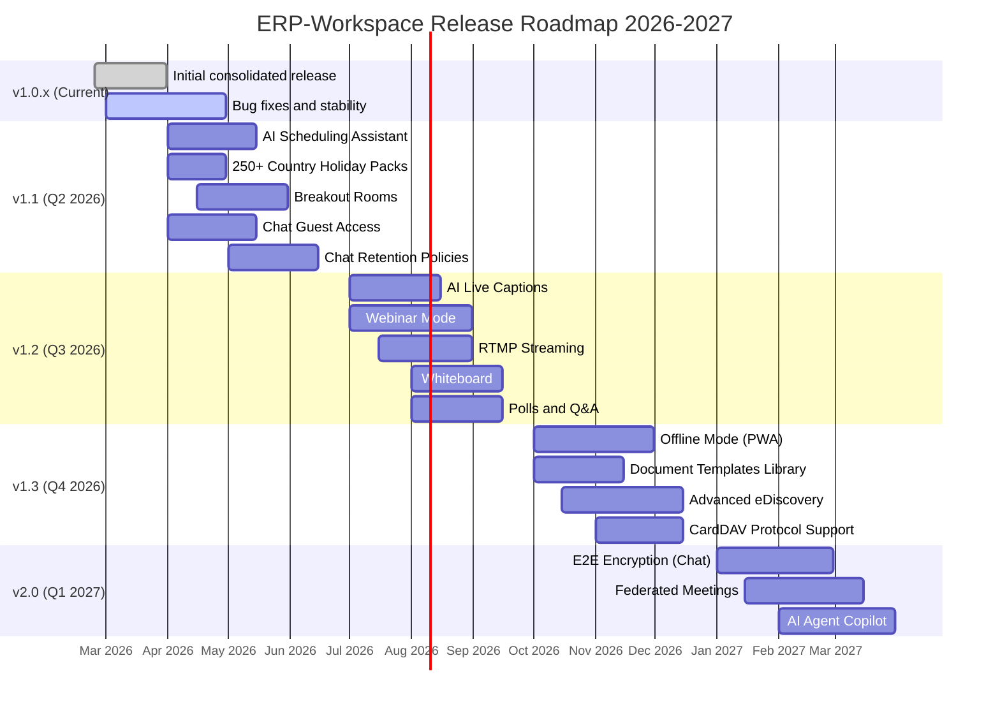
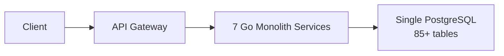
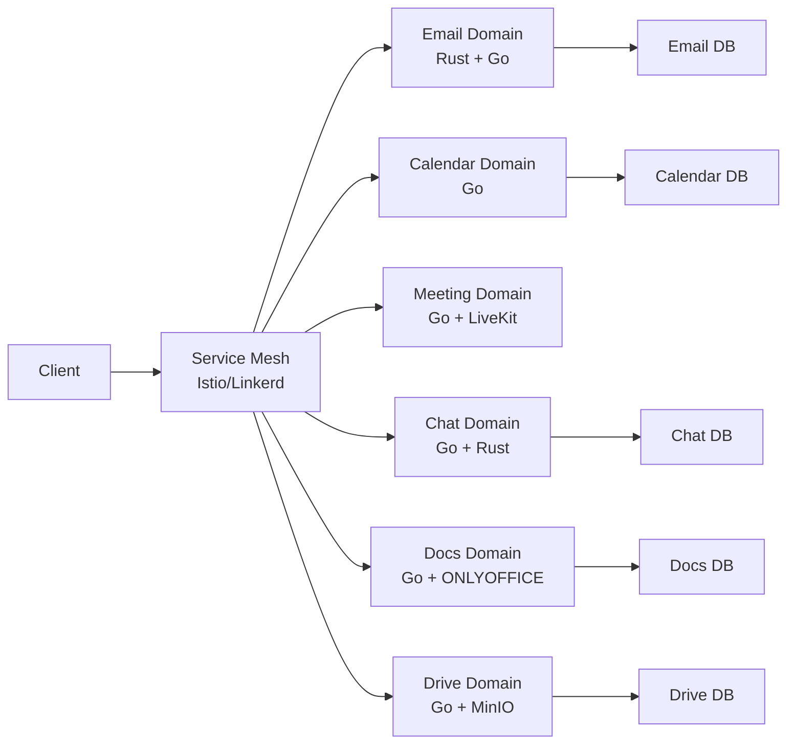

# ERP-Workspace Roadmap & Future Architecture

> **Document ID:** ERP-WS-RF-032
> **Version:** 1.0.0
> **Last Updated:** 2026-02-23
> **Status:** Approved

---

## 1. Release Roadmap

---

## 2. Version 1.1 Details (Q2 2026)

### AI Scheduling Assistant
- Analyze attendee free/busy schedules, preferred hours, and timezone differences
- Machine learning model trained on historical meeting patterns
- Suggest top 3 optimal time slots with confidence scores
- Integration with room booking for end-to-end scheduling

### 250+ Country Holiday Packs
- Pre-loaded holiday calendars for 250+ countries
- Automatic overlay on calendar views
- Awareness in scheduling assistant (avoid booking on holidays)
- Admin can customize which packs are active per tenant

### Breakout Rooms
- Create 2-50 breakout rooms per meeting
- Automatic assignment (random, by department) or manual drag-and-drop
- Broadcast messages from host to all rooms
- Timer for automatic room closure
- Room-level recording option

---

## 3. Version 1.2 Details (Q3 2026)

### AI Live Captions
- Real-time speech-to-text using Whisper or equivalent
- Multi-language support (initial: English, Spanish, French, German, Mandarin)
- Translated captions (speak in English, read in Spanish)
- Caption customization (font size, position, background)

### Webinar Mode
- Distinct presenter/attendee roles
- Registration pages with custom branding
- Attendee capacity up to 10,000 (view-only)
- Q&A queue managed by moderators
- Automated recording and post-event analytics

---

## 4. Version 2.0 Vision (Q1 2027)

### End-to-End Encryption for Chat
- Signal Protocol-based E2E encryption for DMs
- Device key management and rotation
- Encrypted search via homomorphic encryption or blind indexing
- Compliance key escrow option for regulated industries

### Federated Meetings
- Cross-organization meetings without guest accounts
- Matrix protocol-based federation
- Identity verification via OIDC cross-trust
- Federated screen sharing and recording consent

### AI Agent Copilot
- Natural language workspace assistant
- "Schedule a meeting with Alice and Bob next week about the Q2 budget"
- "Summarize all emails from Acme Corp this month"
- "Create a presentation from the Q1 sales data spreadsheet"
- AIDD guardrails enforce approval for all actions

---

## 5. Architecture Evolution

### 5.1 Current Architecture (v1.0)

### 5.2 Target Architecture (v2.0+)

Key evolution points:
- **Database per bounded context**: Each domain gets its own PostgreSQL database for independent scaling and deployment
- **Service mesh**: mTLS, traffic management, and observability at the infrastructure level
- **Rust for hot paths**: Chat message delivery and search ranking ported to Rust for performance
- **GraphQL federation**: Unified query layer across all domains via Apollo Federation

---

## 6. Technology Investments

| Technology | Current | Future | Timeline |
|-----------|---------|--------|----------|
| API Protocol | REST/JSON | REST + GraphQL Federation | v1.3 |
| Service Communication | HTTP/gRPC | Service Mesh (Istio) | v2.0 |
| Database | Single PostgreSQL | DB per bounded context | v2.0 |
| Search | Quickwit | Quickwit + Vector Search (Qdrant) | v1.2 |
| AI | ERP-AI (external) | Embedded inference + ERP-AI | v1.3 |
| Mobile | Flutter | Flutter + offline-first (Drift) | v1.3 |
| Desktop | Electron | Tauri (Rust-based, lighter) | v2.0 |

---

## 7. Competitive Response Plan

| Competitor Move | Our Response | Timeline |
|----------------|-------------|----------|
| Microsoft Copilot expansion | AI Agent Copilot with full workspace context | v2.0 |
| Google Gemini in Workspace | AI features across all domains with AIDD guardrails | v1.1-1.3 |
| Zoom AI Companion | AI meeting notes + live captions + action items | v1.1-1.2 |
| Slack AI recap | AI channel summaries + search | v1.2 |
| Apple Intelligence | On-device AI for mobile (Flutter + CoreML) | v2.0 |

---

## 8. Success Metrics for Future Releases

| Release | Metric | Target |
|---------|--------|--------|
| v1.1 | AI scheduling assistant adoption | 30% of meetings use AI scheduling |
| v1.2 | Live captions usage | 50% of meetings enable captions |
| v1.2 | Webinar events hosted | 100+ per month |
| v1.3 | Offline edit sessions | 20% of doc edits use offline mode |
| v2.0 | E2E encrypted chat adoption | 25% of conversations |
| v2.0 | AI Copilot daily active users | 40% of workspace users |

---

*For current feature specifications, see [02-Product-Requirements-Document.md](./02-Product-Requirements-Document.md). For technical architecture, see [04-Software-Architecture.md](./04-Software-Architecture.md).*
